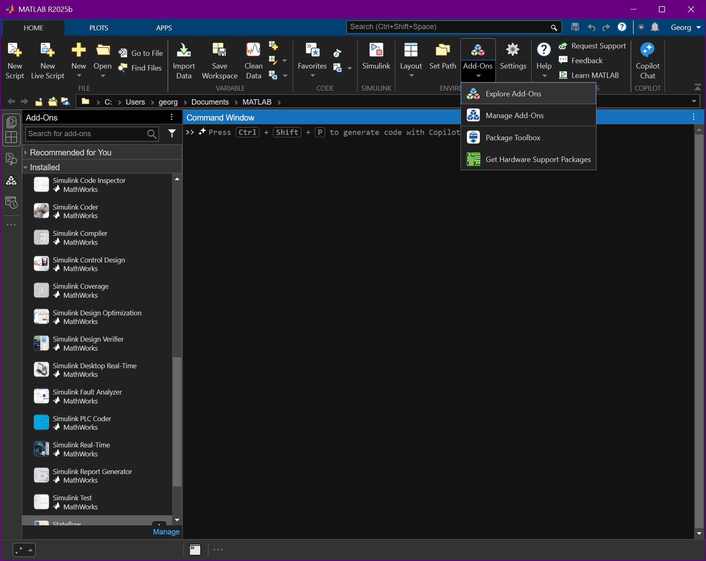

# Prolog

Dieser erste Foliensatz umfasst die folgenden Abschnitte:

1. Voraussetzungen
1. Lernziele
1. Kursinhalte
1. Notenrichtlinie
1. Lektorenprofil
1. Kurze MATLAB-Einführung

---


## Voraussetzungen

Folgendes Vorwissen ist für diesen Kurs notwendig:

- **Mathematik** (lineare Algebra, Differenzialgleichungen, ...)
- **Mechanik** (insb. mechanische Modellbildung)
- **Elektrik** (insb. elektrische Modellbildung)
- **Informatik** (Rechnerarchitektur, Programmiersprachen)

---


## Lernziele

Teilnehmer*innen können nach erfolgreichem bestehen dieses Kurses ...

- **Anforderungen** mit der *MATLAB Requirements Toolbox* erfassen
- **Architekturen** mit dem *MATLAB System Composer* definieren
- **Verhalten** mit *MATLAB Simulink* und *Stateflow* beschreiben
- **Animationen** mit *MATLAB Simulink 3D Animation* erstellen
- **Verifikationen** mit *MATLAB Simulink Test* und *Coverage* durchführen
- **Fehlverhalten** mit *MATLAB Simulink Fault Analyzer* analysieren
- **Optimierungen** mit *MATLAB Simulink Design Optimizer* vornehmen

---


## Kursinhalte

Dieser Kurs umfasst die folgenden sieben Kapitel:

1. **Anforderungen** (Welche Funktionen soll das System erfüllen?)
1. **Architekturen** (Wie soll das System aufgebaut sein?)
1. **Verhalten** (Wie soll sich das System verhalten?)
1. **Animationen** (Wie soll das System aussehen?)
1. **Verifikationen** (Wie gut funktioniert das System?)
1. **Fehlverhalten** (Wie reagiert das System in Sonderfällen?)
1. **Optimierungen** (Wie kann das System optimiert werden?)

---


## Notenrichtlinie

Die Noten für diesen Kurs werden wie folgt gebildet:

- Ausarbeitung des Fallbeispiels **3D-Drucker**
- Dokumentation der Ergebnisse  in einem Projektbericht
- Einzelarbeit oder Gruppenarbeit im 2er-Team
- Bewertung der Quantität und der Qualität der Abgabe

---


## Lektorenprofil

**Dr. Georg Hackenberg**, *Professor für Informatik und Industriesysteme*

Fakultät für Technik und angewandte Naturwissenschaften, Fachhochschule Oberösterreich, Campus Wels

Büro: A | O2 - 030
E-Mail: georg.hackenberg@fh-wels.at

---

<div class="columns">
<div>

## Kurze MATLAB-Einführung

Diese kurze MATLAB-Einführung umfasst die folgenden Punkte:

1. MATLAB Webseite
1. MATLAB Online
1. MATLAB Download
1. MATLAB Skript
1. MATLAB Live-Skript
1. MATLAB Add-On Manager
1. MATLAB Add-On Explorer

</div>
<div>


</div>
</div>

---

<div class="columns">
<div>

### [MATLAB Webseite](https://de.mathworks.com/products/matlab.html)

- Offizielle Webseite für das Produkt
- Betrieben von der Firma MathWorks
- Eintiegspunkt für weitere Aktivitäten
- Anmelden mit Studenten-Account

</div>
<div>


</div>
</div>

---

<div class="columns">
<div>

### [MATLAB Online](https://matlab.mathworks.com/)

MATLAB kann mittlerweile **online** im Web Browser betrieben oder **lokal** auf dem Rechner als Standalone-Anwendung installiert werden.

Die Online-Variante bietet grundsätzlich **alle Funktionalitäten** der Offline-Variante, ist jedoch meiner Erfahrung nach etwas **weniger stabil**.

</div>
<div>


</div>
</div>

---

<div class="columns">
<div>

### [MATLAB Online](https://matlab.mathworks.com/) (Gestartet)

Und so sieht die **Online-Variante** aus, wenn sie gestartet wurde. Man beachte die Steuerelemente des **Web Browsers** oben im Screenshot.

Die **Benutzerschnittstelle** von MATLAB ist in der Online-Variante **identisch** zu der Benutzerschnittstelle der Offline-Variante (mehr dazu später).

</div>
<div>


</div>
</div>

---

<div class="columns">
<div>

### [MATLAB Download](https://www.mathworks.com/downloads/matlab)

Wenn man MATLAB **offline** betreiben möchte, muss man die **Version** und das **Betriebssystem** wählen und die Software herunterladen.

Wir empfehlen diesen Betriebsmodus für die Software, da er unserer Erfahrung nach **stabiler** läuft und weniger Probleme verursacht.

</div>
<div>


</div>
</div>

---

<div class="columns">
<div>

### MATLAB Skript

Im Kern bietet MATLAB eine eigene **Skriptsprache** mit den zugehörigen Werkzeugen wie Editor, Interpreter, Degugger, und Profiler.

*Hier ist ein einfaches Programmier-beispiel mit einer Variablenzuweisung und einer Konsolenausgabe:*

```matlab
x = 0

disp("Hello world")
```


</div>
<div>


</div>
</div>

---

<div class="columns">
<div>

### MATLAB Live-Skript

Seit einiger Zeit bietet MATLAB auch **Live-Skripte**, welche den **Jupyter Notebooks** in der **Python-Welt** ähneln.

Live-Skripte bieten somit die Möglichkeit, **Rich-Text** für die **Dokumentation** mit **Quelltext** für die **Implementierung** zu mischen.

*Diese Art der Skripte wird gerne von Datenanalysten verwendet.*

</div>
<div>


</div>
</div>

---

<div class="columns">
<div>

### MATLAB Live-Skript (Technisch)

Technisch betrachtet sind Live-Skripte nichts anderes als **reguläre Skripte** mit **speziellen Kommentaren**.

Die Kommentare enthalten sowohl den **Rich-Text** im **Markdown-Format** als auch die **Berechnungsergebnisse** des **letzten Durchlaufs**.

*Damit sind Live-Skripte auch gut für Versionsverwaltung geeinet!*

</div>
<div>


</div>
</div>

---

<div class="columns">
<div>

### MATLAB Add-Ons

Mit MATLAB Add-Ons kann der **Funktionsumfang** der MATLAB Entwick-lungsumgebung schließlich **beliebig erweitert** werden.

**MathWorks** bietet selber eine Reihe von Add-Ons an, **andere Hersteller** können jedoch auch eigene Add-Ons entwickeln und vertreiben.

*Wir arbeiten in diesem Kurs mit Add-Ons von MathWorks!*

</div>
<div>



</div>
</div>

---

<div class="columns">
<div>

### MATLAB Add-On Manager

Der Add-On Manager beitet eine **Übersicht** über die bereits **installierten Add-Ons** sowie **verfügbare Updates**.

Des Weiteren kann für **jedes Add-On** die **Dokumentation** aufgerufen werden, und das Add-On auf Wunsch wieder **deinstalliert** werden.

*Achten Sie darauf, dass Sie alle notwen-digen Add-Ons installiert haben!*

</div>
<div>


</div>
</div>

---

<div class="columns">
<div>

### MATLAB Add-On Explorer

Der Add-On Explorer bietet hingegen Zugriff auf die Welt **aller verfügbaren Add-Ons** im **MATLAB-Universum**.

Es stehen Add-Ons für **verschiedenste Anwendungsgebiete** von **Modellierung** und **Simulation** bis **Datenanalyse** und **maschinelles Lernen** zur Auswahl.

*Wir arbeiten mit Add-Ons für die modell-basierte Systementwicklung!*

</div>
<div>


</div>
</div>

---

<div class="columns">
<div>

### MATLAB Add-On **Suche**

Über die **Suchfunktion** kann man nach bestimmten **Schlüsselwörtern** suchen und die Liste der **Add-Ons filtern**.

Im Beispiel auf der rechten Seite wird nach dem Begriff `simulink` gesucht und die **besten Treffer** vorgeschlagen.

Für jeden Treffer wird der **Name** des Add-Ons und eine **kurze Beschreibung** angezeigt.

</div>
<div>


</div>
</div>

---

<div class="columns">
<div>

### MATLAB Add-On **Übersicht**

**Einzelne Add-Ons** können schließlich über deren **Detailseite installiert** und verwaltet werden.

Des Weiteren beitet die Detailseite **weitere Informationen** rund um das Add-On aufgeteilt auf **mehrere Reiter**.

Der **erste Reiter** bietet eine **Übersicht** über das Add-On in Form einer **längeren Beschreibung** der Inhalte des Add-Ons.

</div>
<div>


</div>
</div>

---

<div class="columns">
<div>

### MATLAB Add-On **Funktionen**

Add-Ons können auch **neue Funktionen** bereitstellen, die in MATLAB-Skripten und von anderen Add-Ons verwendet werden können.

Sofern ein Add-On neue Funktionen definiert, bietet der **zweite Reiter** eine Übersicht über diese in Form einer **API-Dokumentation**.

*Mit diesen Funktionen werden wir nicht direkt in Kontakt kommen!*

</div>
<div>


</div>
</div>

---

<div class="columns">
<div>

### MATLAB Add-On **Blöcke**

Zusätzlich können Add-Ons neue **Blöcke** definieren, welche zur **Modellierung** von Systemen genutzt werden können.

Blöcke selbst sind **kein Konzept der Skriptsprache** von MATLAB, sondern **ein Konzept des Simulink Add-Ons**.

*Somit muss ein Add-On auf dem Simulink Add-On aufbauen, um neue Blöcke definieren zu können!*

</div>
<div>


</div>
</div>

---

<div class="columns">
<div>

### MATLAB Add-On **Anwendungen**

Dann können Add-Ons **Anwendungen** registrieren, welche dem Nutzer zur Verfügung stehen sollen.

Anwendungen (sogenannte *Apps*) sind **Erweiterungen der Benutzerschnittstelle** von MATLAB.

*Somit können neben den reinen Skript-Editoren z.B. auch grafische Editoren bereitgestellt werden!*

</div>
<div>


</div>
</div>

---

<div class="columns">
<div>

### MATLAB Add-On **Beispiele**

Schließlich bieten Add-Ons auch **Beispiele** an, welche zur Erklärung der Funktionen des Add-Ons gedacht sind.

Die Beispiele umfassen eine **Erklärung** sowie den eigentlichen **Quelltext** oder das eigentliche **Simulationsmodell**. 

*Die Beispiele sind in der Regel ein guter Startpunkt, um sich mit einem neuen Add-On vertraut zu machen!*

</div>
<div>


</div>
</div>

---

<div class="columns">
<div>

### MATLAB Add-On **Voraussetzungen**

MathWorks bietet für jedes Add-On eine Webseite, auf dem die **Abhängigkeiten** zu anderen Add-Ons und Systemfunk-tionen beschrieben werden.

Das **Simulink 3D Animation** Add-On basiert beispielsweise auf dem MATLAB Kern und dem  **Simulink** Add-On.

*Optional basiert Simulink 3D Animation auf der Unreal Engine, wenn MATLAB auf Windows betrieben wird!*

</div>
<div>


</div>
</div>