# Kapitel 1: Anforderungen und Architekturen

Dieses Kapitel umfasst die folgenden drei Abschnitte:

1. Anforderungen sammeln
1. Architekturen festlegen
1. Profile anwenden

---

## 1. Anforderungen sammeln

In diesem ersten Abschnitt lernen wir die folgenden Dinge:

1. **Architekturmodelle erstellen** (System Composer)
1. **Anforderungslisten erstellen** (Requirement Manager)
1. **Anforderungen erstellen** (3 Requirement-Typen)
1. **Verknüpfungen erstellen** (6 Link-Typen)

---

### 1.1. Architekturmodelle

Ein Architekturmodell ist eine vereinfachte, abstrakte Darstellung eines Systems.

Es beschreibt die Struktur des Systems, seine Komponenten und deren Beziehungen zueinander.

Architekturmodelle helfen dabei, komplexe Systeme zu verstehen, zu analysieren und zu dokumentieren.

---

#### Der Start-Bildschirm

Zuerst starten wir Simulink und erstellen eine neues Architekturmodell für den System Composer.

Der System Composer stellt als Vorlage ein Architekturmodell, ein Software-Architekturmodell, und ein Aktivitäts-diagramm bereit.

*Wir erwenden das einfache Architektur-modell an dieser Stelle!*

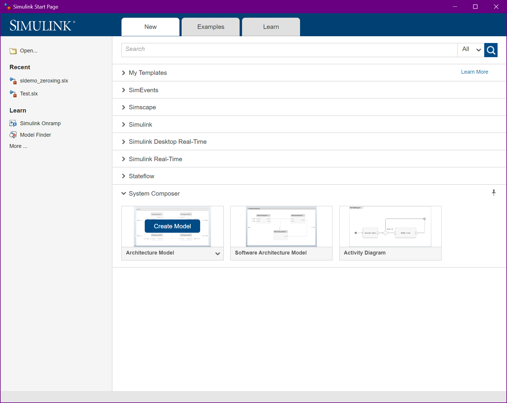

---

#### Die Architektur-Ansicht

Nachdem das neue Architekturmodell erstellt wurde, wechselt MATLAB in die Modellierungsansicht.

In der Modellierungsansicht können die Komponenten der Architektur definiert und miteinander verknüpft werden.

*Im initialen Zustand ist die Architektur leer, das heißt die Architektur beinhaltet keine Komponenten.*

---

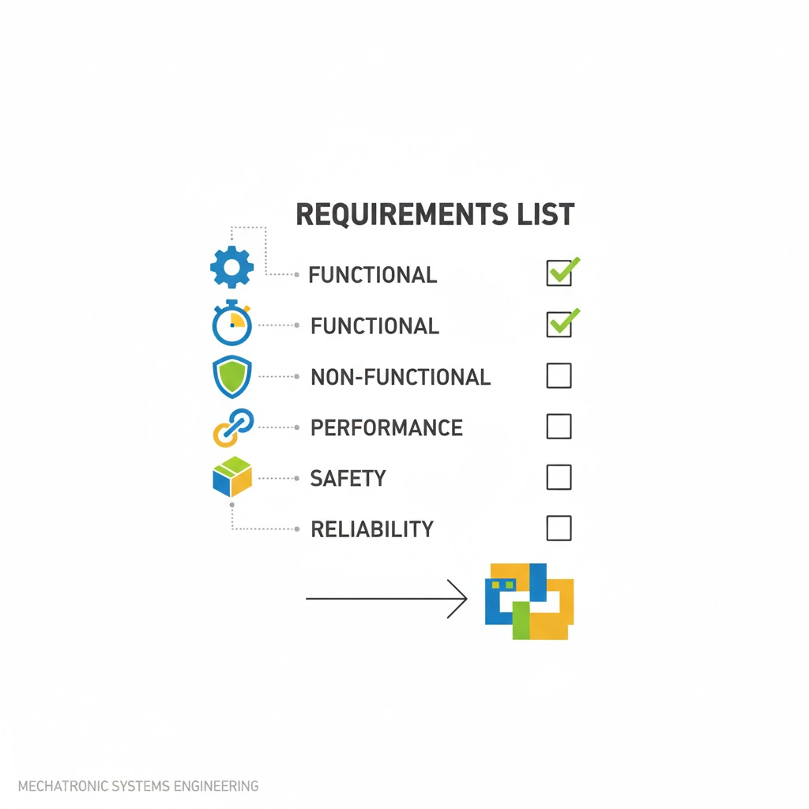

### 1.2. Anforderungsliste (*Requirement Sets*)

Eine Anforderung ist eine dokumentierte, nachprüfbare Aussage über eine Eigenschaft oder Funktion eines Systems.

Anforderungen werden erfasst, um sicherzustellen, dass das entwickelte System die Bedürfnisse der Stakeholder erfüllt.

Die Erfassung im Modell ermöglicht die Nachverfolgbarkeit von der Anforderung bis zur Implementierung und zum Test.

---

#### Der Apps-Reiter

Komponenten modellieren wir auch erst später; jetzt laden wir zunächst Mal die Requirements Manager Ansicht.

Denn im ersten Schritt wollen wir die Anforderungen an das System beschreiben.

*Um die Umsetzung der Anforderungen und die Verifikation der Umsetzung kümmern wir uns später!*

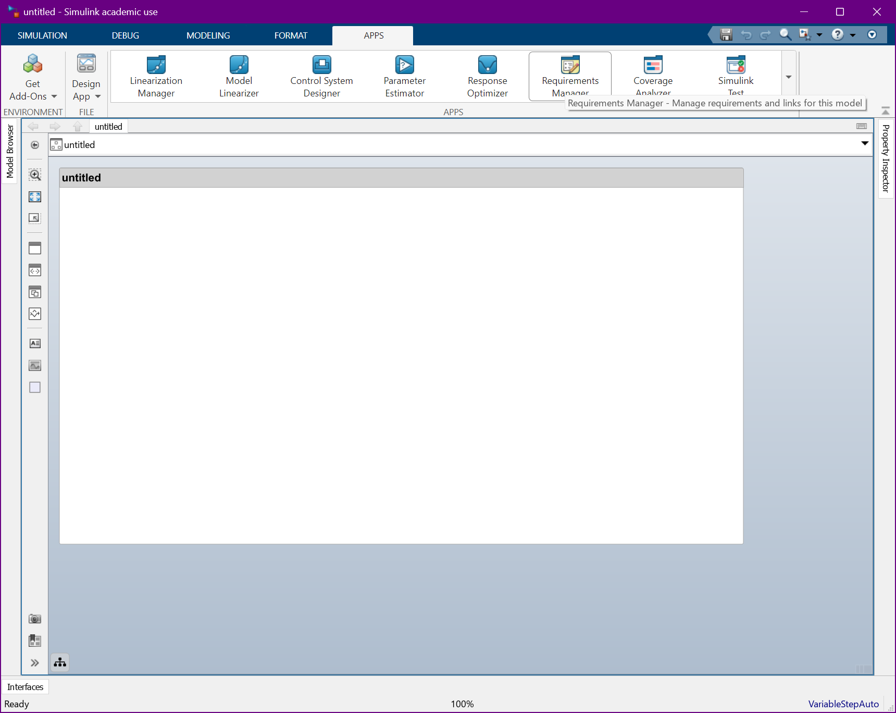

---

#### Requirement Set hinzufügen

In der Requirements Manager Ansicht definieren wir zunächst ein sogenanntes Requirement Set.

In einem Requirement Set können wir mehrere Anforderungen sammeln und gemeinsam verwalten.

*Requirement Sets werden in einer eigenen Datei gespeichert und können auch wiederverwendet werden!*

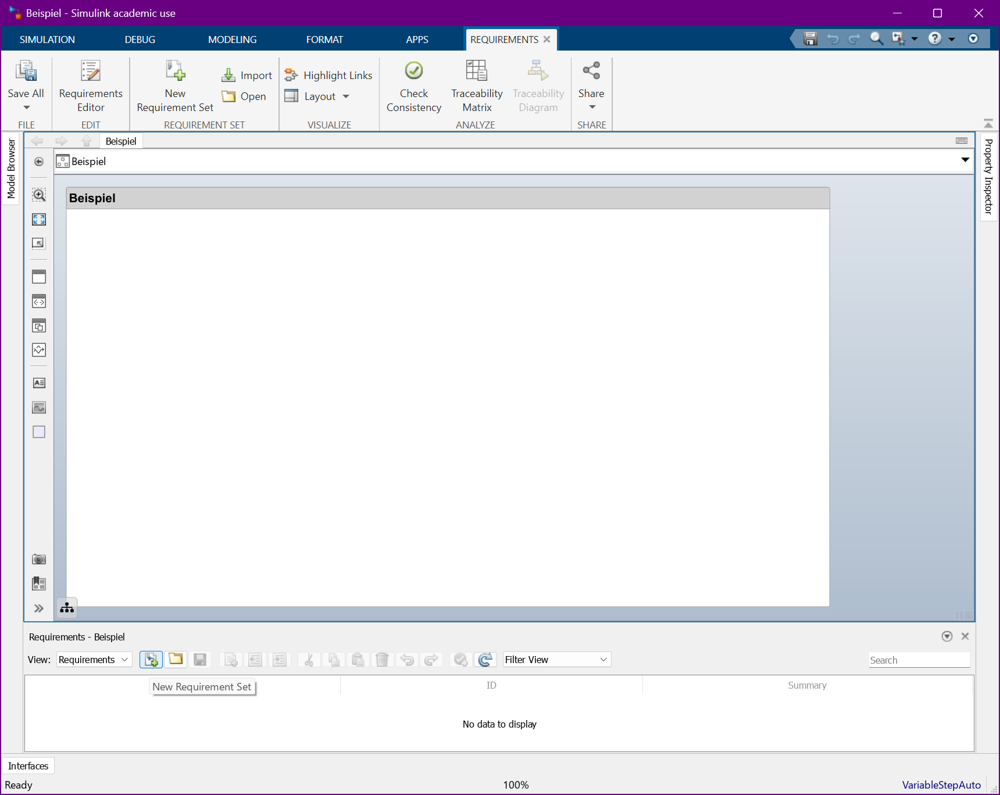

---

### 1.3. Anforderungen (*Requirements*)

Eine Anforderung beschreibt, was ein System tun soll oder welche Eigenschaften es haben muss.

Sie werden im Modell erfasst, um eine klare, nachvollziehbare Grundlage für Design, Implementierung und Test zu schaffen.

Dies stellt sicher, dass das Endprodukt die Erwartungen erfüllt.

---

#### Requirement hinzufügen

Im nächsten Schritt fügen wir einzelne Requirements dem zuvor erstellten Requirement Set hinzu.

Die Requirements repräsentieren die Anforderungen an das System und können hierarchisch strukturiert werden.

*Identifikation und Sammlung von Anforderungen erfolgt durch unterstützende Kreativtechniken!*

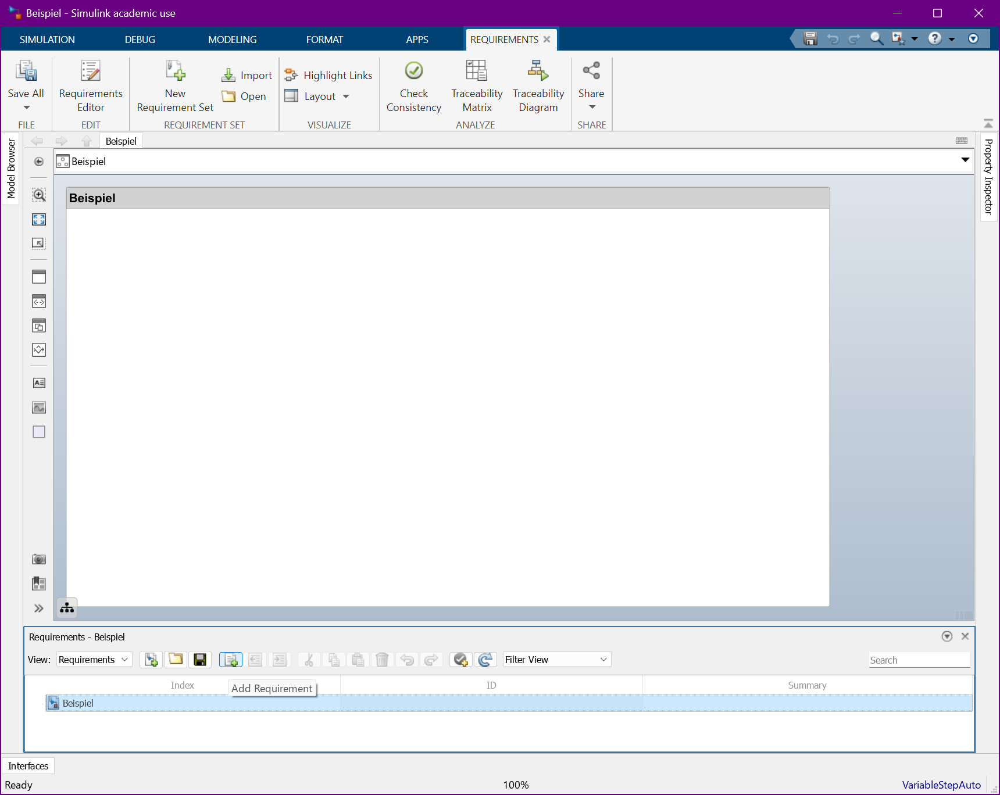

---

#### Eigenschaften eines Requirement

Die Eigenschaften der einzelnen Requirements können in der Property Inspector Ansicht verwaltet werden.

Die Eigenschaften umfassen einen Typ, eine Zusammenfassung, und eine detaillierte Beschreibung.

*Die Requirements Toolbox erzwingt keine spezielle Art der Beschreibung (z.B. definierte Satzmuster)!*

---

#### Die Requirement-Typen

Wir unterscheiden diese Typen:

- **Container** - Gruppierung von Anforderungen (z.B. nach Ingenieursdisziplin)
- **Functional** - Klassische Funktionale Anforderungen (z.B. Wandlung von Energie)
- **Informational** - Klassische nicht-funktionale Anforderungen (z.B. Performance oder Sicherheit)

---

##### Requirement-Typ **Container**

**Zweck:** Diese dienen primär der Strukturierung und Hierarchisierung der Anforderungen. Sie fungieren als Ordner oder Überschriften, um logische Gruppen zu bilden.

**Beispiel:** Eine Anforderung mit dem Typ Container könnte "System-Sicherheit" oder "Benutzerverwaltung" lauten und darunter eine Reihe spezifischer Funktionaler Anforderungen enthalten.

**Status:** Container-Anforderungen selbst tragen nicht zum Implementierungs- oder Verifizierungsstatus bei. Der Status wird jedoch durch die funktionalen Anforderungen innerhalb des Containers bestimmt und auf der Containerebene aggregiert.

---

##### Requirement-Typ **Functional**

**Zweck:** Diese Anforderungen sind das Kernstück der Spezifikation. Sie beschreiben direkt die erforderlichen Fähigkeiten und das Verhalten des zu entwickelnden Systems oder Produkts.

**Beispiel:** "Das System muss die Eingabedaten innerhalb von 50 Millisekunden verarbeiten." oder "Die Benutzeroberfläche muss einen 'Speichern'-Button enthalten."

**Status:** Die Toolbox berechnet den Implementierungs- und Verifizierungsstatus basierend auf den Links zu Designelementen (Implementierung) und Tests (Verifizierung). Sie tragen direkt zum Fortschritt bei.

---

##### Requirement-Typ **Informational**

**Zweck:** Dient der Erfassung von Anforderungen oder Informationen, die kein direktes funktionales Verhalten darstellen oder die das System nicht direkt implementieren muss, wie nicht-funktionale Anforderungen und zusätzliche Erklärungen.

**Beispiel:** "Die Verwendung der Bibliothek X ist aus Gründen der Kompatibilität erforderlich." oder "Alle Passwörter müssen eine Mindestlänge von 8 Zeichen haben (Sicherheitsanforderung)."

**Status:** Informational-Anforderungen tragen nicht zum Implementierungs- oder Verifizierungsstatus bei. Sie dienen rein dokumentarischen oder ergänzenden Zwecken im Kontext der Anforderungssammlung.

---

#### Der Requirements Editor

Neben dem Requirements Manager bietet die Requirements Toolbox auch den sogenannten Requirements Editor.

Der Requirements Editor kann über den Reiter **Requirements** im oberen Menü-band geöffnet werden.

*Der Requirements Editor kann insbesondere für die Verknüpfung von Anforderungen verwenden wertden!*

---

##### Die Tabellen-Ansicht

Der Requirements Editor bietet zunächst die gewohnte tabellarische Ansicht der Anforderungen.

Die Details der einzelnen Anforderungen wiederum auch im Property Inspector dargestellt.

*Neben der tabellarischen Darstellung bietet der Requirements Editor auch eine Dokumentendarstellung.*

---

##### Die Dokumenten-Ansicht

Die Dokumentendarstellung zeigt neben der Zusammenfassung auch die Beschrei-bung der einzelnen Anforderungen.

Diese Darstellung beim Durchlesen der Anforderungsspezifikation aufgrund des höheren Detaillierungsgrades.

*Eine Bearbeitung der Inhalte ist in der Dokumentenansicht direkt jedoch nicht möglich!*

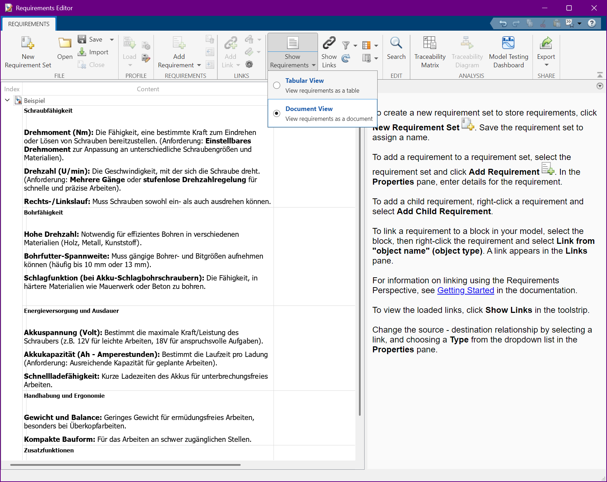

---

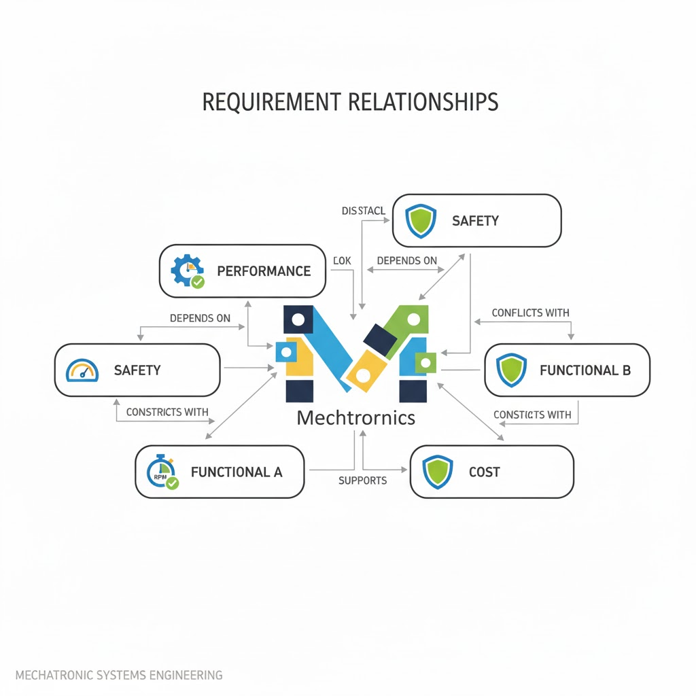

### 1.4. Verknüpfungen (*Links*)

Ein Link ist eine Verbindung zwischen zwei Modellelementen, zum Beispiel zwischen zwei Anforderungen.

Links werden erstellt, um Beziehungen wie Ableitung, Verfeinerung oder Abhängigkeit darzustellen.

Sie sind die Grundlage für die Nachverfolgbarkeit (*Traceability*) und helfen bei der Analyse der Auswirkungen von Änderungen.

---

#### Link erstellen (1 / 2)

Ein mächtiges Werkzeug in der System-entwicklung ist die Nachverfolgung von Anforderungen (*Tracing*).

Vor die Nachverfolgung bietet die Requirements Toolbox die Möglichkeit, sogenannte **Links** einzufügen.

*Im Requirements Editor kann dazu zunächst die zu vernüpfende Anforder-ung ausgewählt werden!*

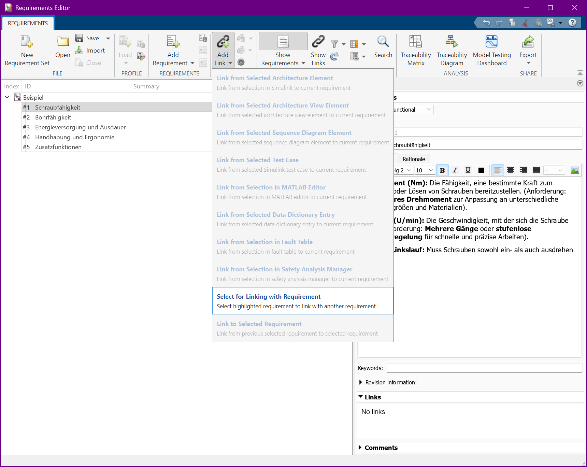

---

#### Link erstellen (2 / 2)

Danach muss eine weitere Anforderung ausgewählt werden, die mit der vorigen verknüpft werden soll.

Schließlich kann die Erstellung des Links bestätigt werden und so ein neue Ver-küpfung geschaffen werden.

*Beachte, das Anforderungen auch mit Komponenten und anderen Modell-elementen verknüpft werden können!*

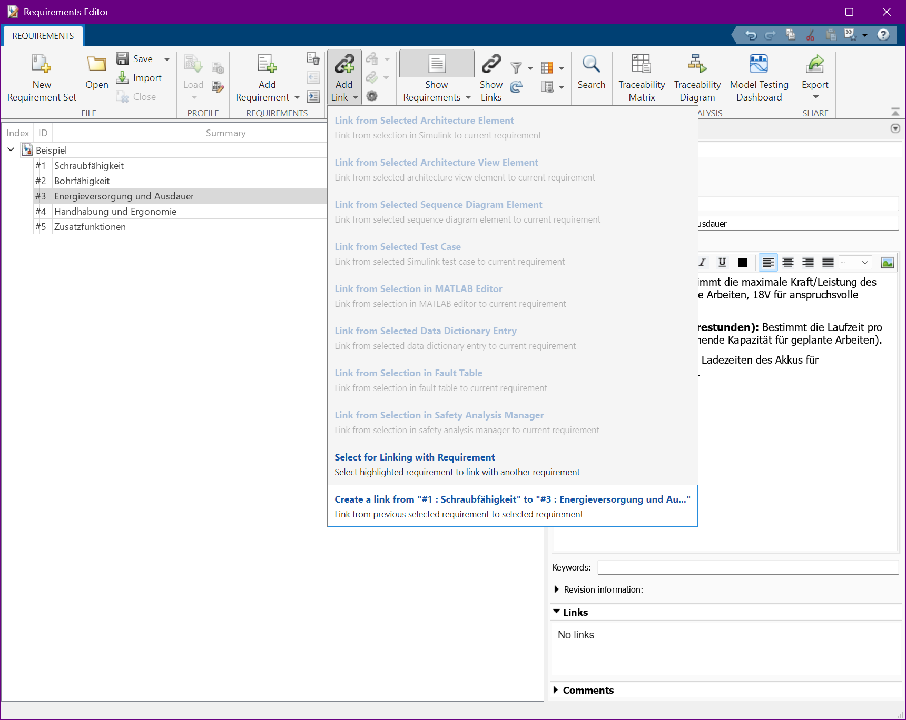

---

#### Der Link-Abschnitt

Nach Erstellen einer neuer Verknüpfung ist der Link im Property Inspector rechts unten zu sehen.

Die Ansicht zeigt für die gewählte Anforderung alle damit verknüpften Modellelemente.

*Somit kann bei Änderung der Anforderung schnell untersucht werden, welche Folgen die Änderung hat!*

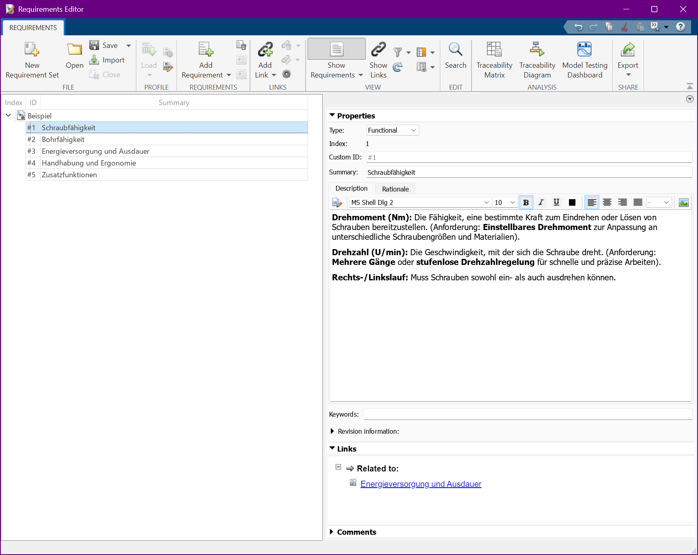

---

#### Die Links-Ansicht

Zudem gibt es eine eigene Links-Ansicht, welche eine Übersicht über alle Verknüpfungen im Modell gibt.

Die Ansicht zeigt auch Vernüpfungen zu anderen Modellen (d.h. anderen Modell-dateien).

*In dieser Ansicht können einzelne Links ausgewählt und deren Eigenschaften im Property Inspector bearbeitet werden!*

---

#### Die Link-Typen

Schließlich unterscheidet die MATLAB Requirements Toolbox standardmäßig sechs Link-Typen:

**Confirmed by**, **Derives**, **Implements**, **Refines**, **Related to**, und **Verifies**.

*Im Folgenden betrachten wir die einzelnen Typen, deren Bedeutung, und typische Anwendungsfälle.*

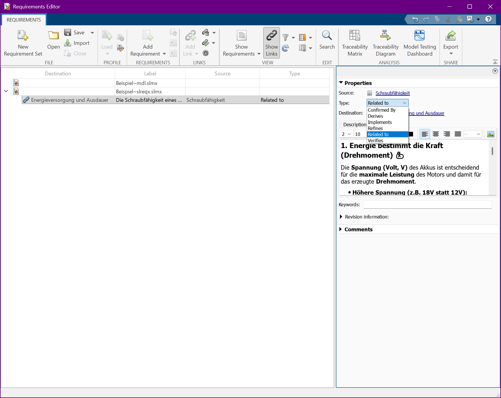

---

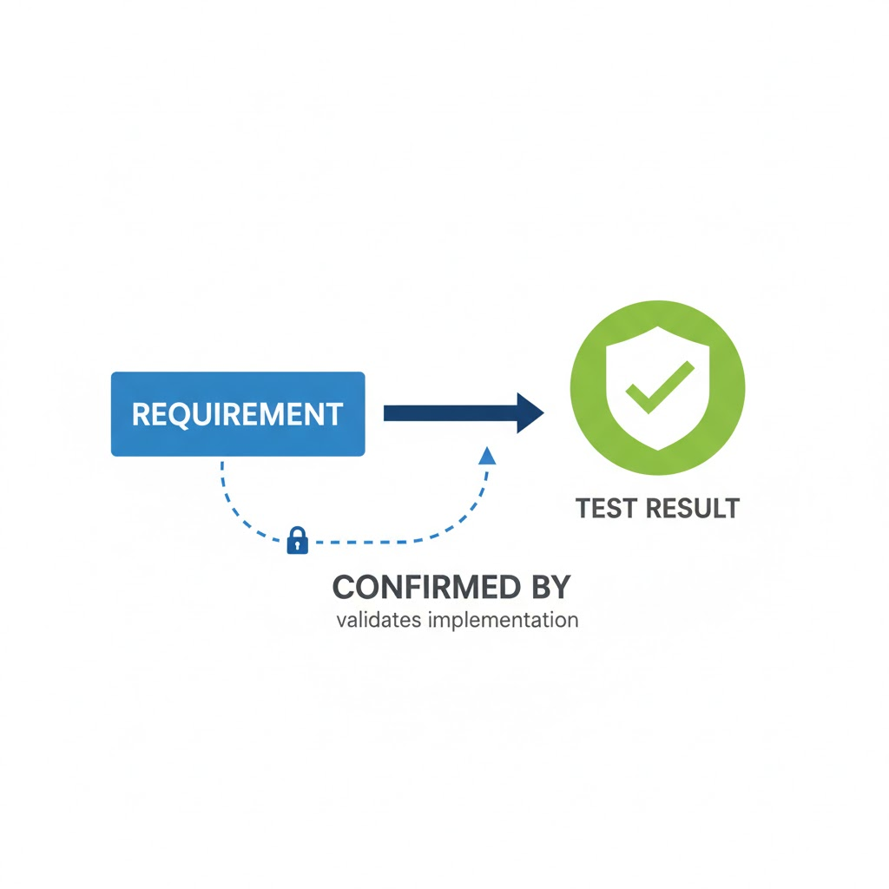

##### Link-Typ **Confirmed by** (*Bestätigt durch*)

*Dieser Link-Typ wird verwendet, um eine Anforderung mit einem Testfall oder Testergebnis zu verknüpfen.*

**Bedeutung:** Das verknüpfte Element (z. B. ein Test) zeigt, dass die Anforderung erfüllt ist und ordnungsgemäß funktioniert.

**Beispiel:** Eine Anforderung "Das System muss Daten in weniger als 500 ms laden" wird durch einen Leistungstest bestätigt.

---

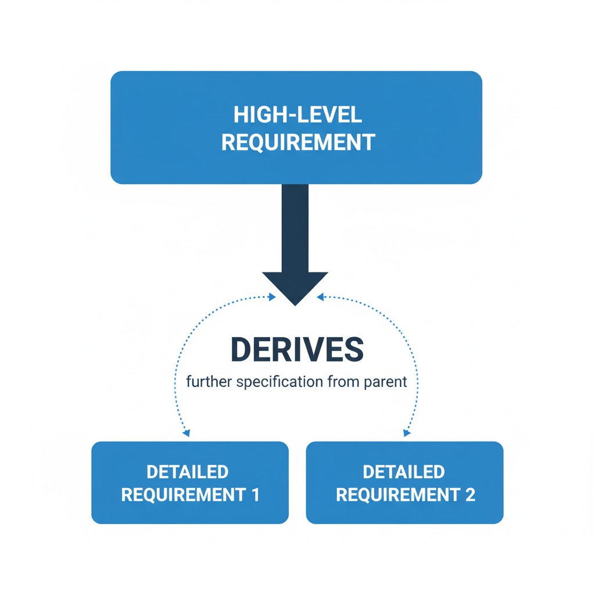

##### Link-Typ **Derives** (*Leitet ab*)

*Dieser Typ stellt eine Hierarchie oder einen Abstammungsverlauf zwischen Anforderungen her.*

**Bedeutung:** Eine Anforderung wird aus einer höherstufigen oder Eltern-Anforderung abgeleitet. Die abgeleitete Anforderung ist eine spezifischere Ausformulierung der übergeordneten.

**Beispiel:** Die hochstufige Anforderung "Das Benutzerkonto muss sicher sein" leitet die spezifischere Anforderung ab: "Das Passwort muss mindestens 8 Zeichen lang sein."

---

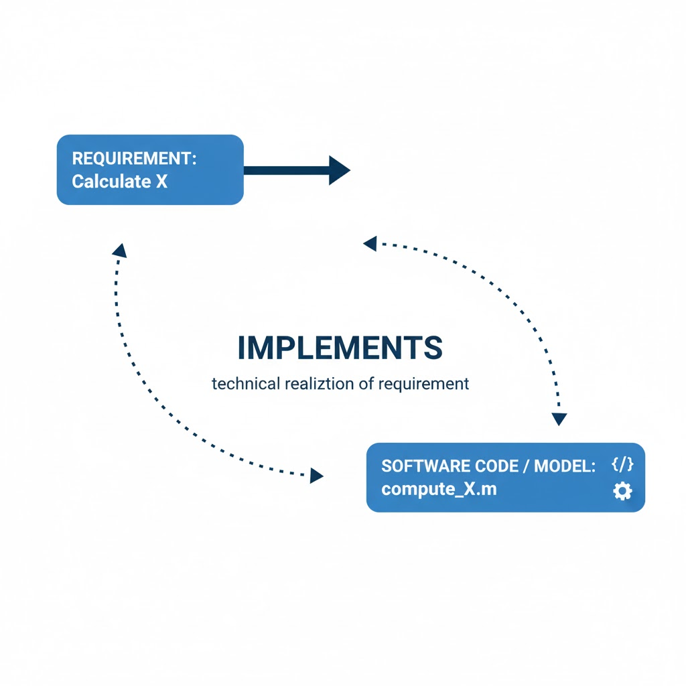

##### Link-Typ **Implements** (*Implementiert*)

*Dieser Link-Typ verbindet eine Anforderung mit dem Code oder Design-Modell, das sie erfüllt.*

**Bedeutung:** Das verknüpfte Element (Code-Funktion, Simulink-Block usw.) setzt die Anforderung technisch um. Dies ist ein kritischer Link für die Rückverfolgbarkeit von der Anforderung zur Implementierung.

**Beispiel:** Die Anforderung "Berechne den Steigungswinkel der Achse" implementiert eine spezifische MATLAB-Funktion (calculate_slope.m).

---

##### Link-Typ **Refines** (*Verfeinert*)

*Dieser Typ wird ähnlich wie "Derives" zur Spezifizierung verwendet, liegt aber oft auf derselben Ebene oder dient dazu, eine Anforderung detaillierter oder präziser zu machen, ohne eine strenge Eltern-Kind-Beziehung zu implizieren.*

**Bedeutung:** Die eine Anforderung fügt Details hinzu oder stellt klar, was eine andere Anforderung bedeutet. Es ist eine Verfeinerung des Umfangs oder der Spezifikation.

**Beispiel:** Eine Anforderung "Die Benutzeroberfläche muss intuitiv sein" wird verfeinert durch "Die Navigationsleiste muss stets sichtbar sein."

---

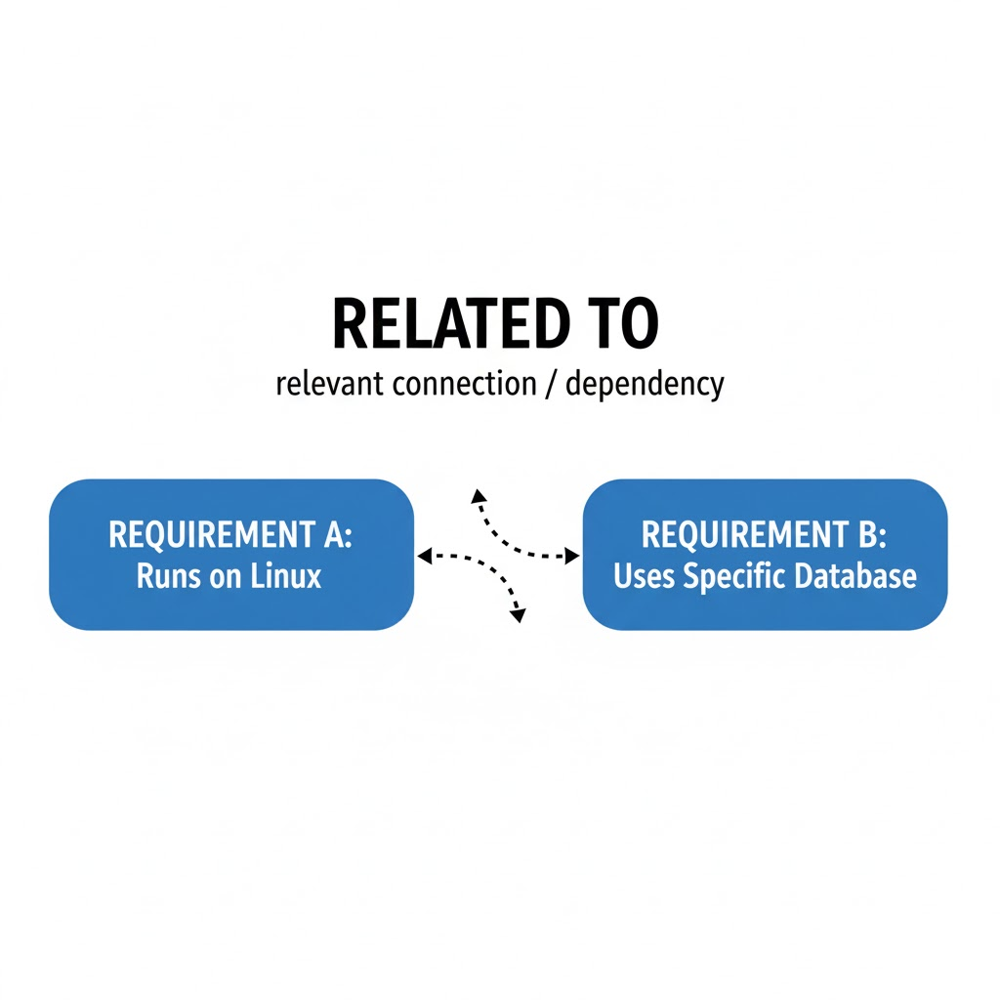

##### Link-Typ **Related to** (*Bezogen auf*)

*Dies ist der generischste Link-Typ und wird für alle Verbindungen verwendet, die nicht in die spezifischeren Kategorien fallen.*

**Bedeutung:** Die verknüpften Elemente haben eine relevante Verbindung oder gegenseitige Abhängigkeit, aber keine formelle Beziehung (wie Implementierung oder Ableitung).

**Beispiel:** Die Anforderung "Das System muss unter Linux laufen" ist bezogen auf die Anforderung "Das System muss eine bestimmte Datenbank verwenden," da beide die Umgebung betreffen.

---

##### Link-Typ **Verifies** (*Überprüft*)

*Dieser Link-Typ stellt eine Verbindung zwischen einem Test und der Anforderung her, die er validieren soll. Es ist oft die umgekehrte Richtung von "Confirmed by".*

**Bedeutung:** Das verknüpfte Element (in der Regel ein Test oder ein Test-Artefakt) dient dazu, zu beweisen, dass die Anforderung erfüllt ist. Es zeigt die Testabdeckung der Anforderung.

**Beispiel:** Ein Unittest überprüft die Anforderung "Die Bremsfunktion muss bei <10 km/h aktiviert werden."

---

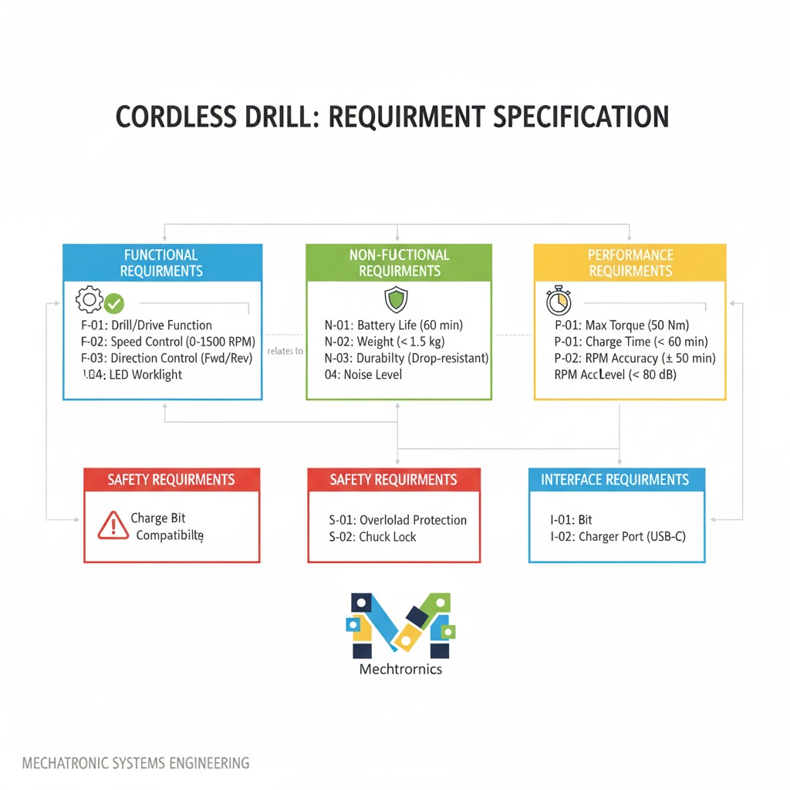

### 1.5. Fallbeispiel

In diesem Fallbeispiel betrachten wir die Anforderungen an einen Akku-Schrauber.

Wir werden funktionale und nicht-funktionale Anforderungen definieren.

Anschließend werden wir diese Anforderungen strukturieren und miteinander verknüpfen.

---

#### **Container**-Requirements

Mögliche Container für den Akku-Schrauber könnten sein:
- **Allgemeine Anforderungen**
- **Mechanische Anforderungen**
- **Elektrische Anforderungen**
- **Software-Anforderungen**
- **Sicherheitsanforderungen**

---

#### **Functional**-Requirements

Beispiele für funktionale Anforderungen sind:
- Der Akku-Schrauber muss Schrauben eindrehen können.
- Der Akku-Schrauber muss Schrauben ausdrehen können.
- Die Drehzahl muss einstellbar sein.
- Das Drehmoment muss begrenzbar sein.
- Der Ladezustand des Akkus muss angezeigt werden.

---

#### **Informational**-Requirements

Beispiele für nicht-funktionale (informationale) Anforderungen sind:
- Das Gerät muss ergonomisch gestaltet sein.
- Das Gewicht des Geräts darf 1.5 kg nicht überschreiten.
- Der Akku muss für mindestens 500 Ladezyklen ausgelegt sein.
- Das Gehäuse muss aus recycelbarem Kunststoff bestehen.

----

#### Requirement-**Beschreibung** und **Begründung**

**Requirement:** Die Drehzahl muss einstellbar sein.

**Description:** Der Benutzer muss die Möglichkeit haben, die maximale Drehzahl des Motors stufenlos oder in vordefinierten Stufen zu regulieren.

**Rationale:** Unterschiedliche Materialien und Schraubengrößen erfordern unterschiedliche Drehzahlen, um ein optimales Arbeitsergebnis zu erzielen und Materialschäden zu vermeiden.

---

#### **Derives**-Links

Eine allgemeine Anforderung wie "Der Akku-Schrauber muss sicher sein" kann spezifischere Anforderungen ableiten:
- Die Anforderung "Das Gerät muss über einen Überlastschutz verfügen" **leitet sich ab von** "Der Akku-Schrauber muss sicher sein".
- Die Anforderung "Die Elektronik muss gegen Kurzschluss geschützt sein" **leitet sich ab von** "Das Gerät muss über einen Überlastschutz verfügen".

---

#### **Refines**-Links

Eine Anforderung kann eine andere verfeinern:
- Die Anforderung "Die Drehzahl muss in 3 Stufen einstellbar sein" **verfeinert** die Anforderung "Die Drehzahl muss einstellbar sein".
- Die Anforderung "Die Drehmomentbegrenzung muss in 5 Stufen von 5 Nm bis 25 Nm einstellbar sein" **verfeinert** die Anforderung "Das Drehmoment muss begrenzbar sein".

---

#### **Related To**-Links

Manche Anforderungen stehen in einem losen Zusammenhang:
- Die Anforderung "Das Gewicht des Geräts darf 1.5 kg nicht überschreiten" **steht in Beziehung zu** "Der Akku muss eine Kapazität von mindestens 2Ah haben".
- Ein größerer Akku erhöht das Gewicht, daher müssen diese beiden Anforderungen gegeneinander abgewogen werden.

---

#### Link-**Beschreibung** und **Begründung**

**Link:** `[Gewicht < 1.5kg]` **Related to** `[Akku-Kapazität > 2Ah]`

**Description:** Verknüpft die Anforderung an das maximale Gewicht mit der Anforderung an die minimale Akkukapazität.

**Rationale:** Diese Anforderungen sind konkurrierend. Ein Akku mit höherer Kapazität wiegt in der Regel mehr. Der Link dokumentiert diese Abhängigkeit, um bei der Komponentenauswahl einen bewussten Kompromiss zu finden.

---

### 1.6. Übungsaufgabe

Sammle Anforderungen an den 3D-Drucker und dokumentiere die Anforderungen mithilfe der MATLAB Requirements Toolbox.

*Achte auf sinnvolle Container-Hierarchien, Zusammenfassungen, Beschreibungen, und Begründungen!*

---

## 2. Architekturen festlegen

In diesem zweiten Abschnitt lernen wir die folgenden Dinge:

1. **Komponenten erstellen** (Reference, Variant, Adapter)
1. **Anschlüsse erstellen** (Input, Output, Physical)
1. **Schnittstellen erstellen** (Value, Composite  Data, Physical)
1. **Anforderungen verknüpfen** (Tracability Matrix)

---

### 2.1. Komponenten

Komponenten sind die Bausteine eines Systems.

Sie kapseln eine bestimmte Funktionalität und interagieren miteinander über definierte Schnittstellen.

Wir modellieren Systeme als Komponenten, um die Komplexität zu reduzieren, die Wiederverwendbarkeit zu fördern und die Arbeit im Team zu erleichtern.

---

#### Haupt-Komponenten hinzufügen

Im nächsten Schritt fügen wir dem Architekturmodell Komponenten hinzu, um die oberste Ebene der Systemstruktur darzustellen.

Diese Komponenten repräsentieren die Haupt-Teilsysteme, aus denen das Gesamtsystem besteht.

*Die Komponenten können später weiter detailliert werden, indem Unter-Komponenten hinzugefügt werden!*

---

#### Unter-Komponenten hinzufügen

Komponenten können hierarchisch strukturiert werden, um eine detailliertere Systemarchitektur zu schaffen.

Durch das Hinzufügen von Unter-Komponenten kann die Komplexität des Systems besser verwaltet werden.

*Jede Komponente kann eine eigene, in sich geschlossene Architektur von Unter-Komponenten enthalten!*

---

#### Wann hört man mit der Zerlegung auf?

Hier sind ein paar Kriterien, die dabei helfen zu entscheiden, ob die Zerlegung weit genug fortschritten ist oder weiter Schritte notwendig sind:

- **Verständlichkeit:** Die Komponenten sollten so granular sein, dass sie von einem einzelnen Entwicklerteam verstanden und implementiert werden können.
- **Testbarkeit:** Einzelne Komponenten sollten unabhängig voneinander getestet werden können.
- **Anforderungen:** Die Zerlegung sollte so weit gehen, dass alle Anforderungen eindeutig einer oder mehreren Komponenten zugeordnet werden können.

*Es gibt aber keine allgemeingültige Regel, wann die Zerlegung abgeschlossen ist; dies ist oft eine iterative Entscheidung, die im Laufe des Entwicklungsprozesses getroffen wird!*

---

#### Referenz-Komponenten

Referenz-Komponenten ermöglichen die Wiederverwendung von Teilarchitekturen in verschiedenen Modellen und Projekten.

Änderungen an der Referenz-Komponente werden automatisch an allen Verwendungsstellen übernommen.

*Die Wiederverwendung von Komponenten reduziert den Entwicklungsaufwand und erhöht die Konsistenz!*

---

#### Separate Dateien für Speicherung von Referenz-Komponenten

Beim Erstellen einer Referenz-Kompo-nente wird eine separate Architektur-modell-Datei angelegt.

Diese Datei kann dann unabhängig verwaltet und in anderen Projekten wiederverwendet werden.

*Die Auswahl des Speicherorts ist entscheidend für die Organisation und Auffindbarkeit!*

---

#### Umwandlung von Komponenten in Referenz-Komponenten

Eine bestehende Komponente kann außerdem mit wenigen Klicks in eine wiederverwendbare Referenz-Komponente umgewandelt werden.

Dies ermöglicht eine nachträgliche Modularisierung und Wiederverwendung von bereits modellierten Komponenten.

*Der Refactoring-Prozess ist einfach und unterstützt die Evolution der Architektur!*

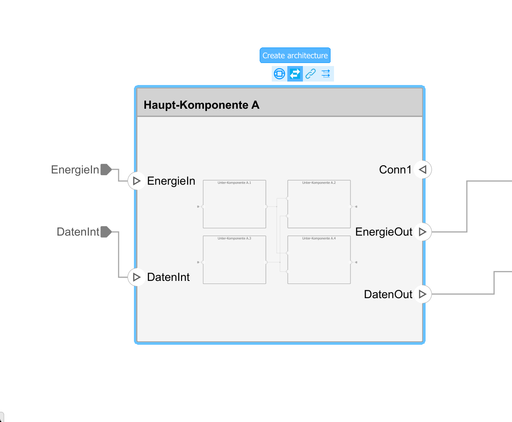

---

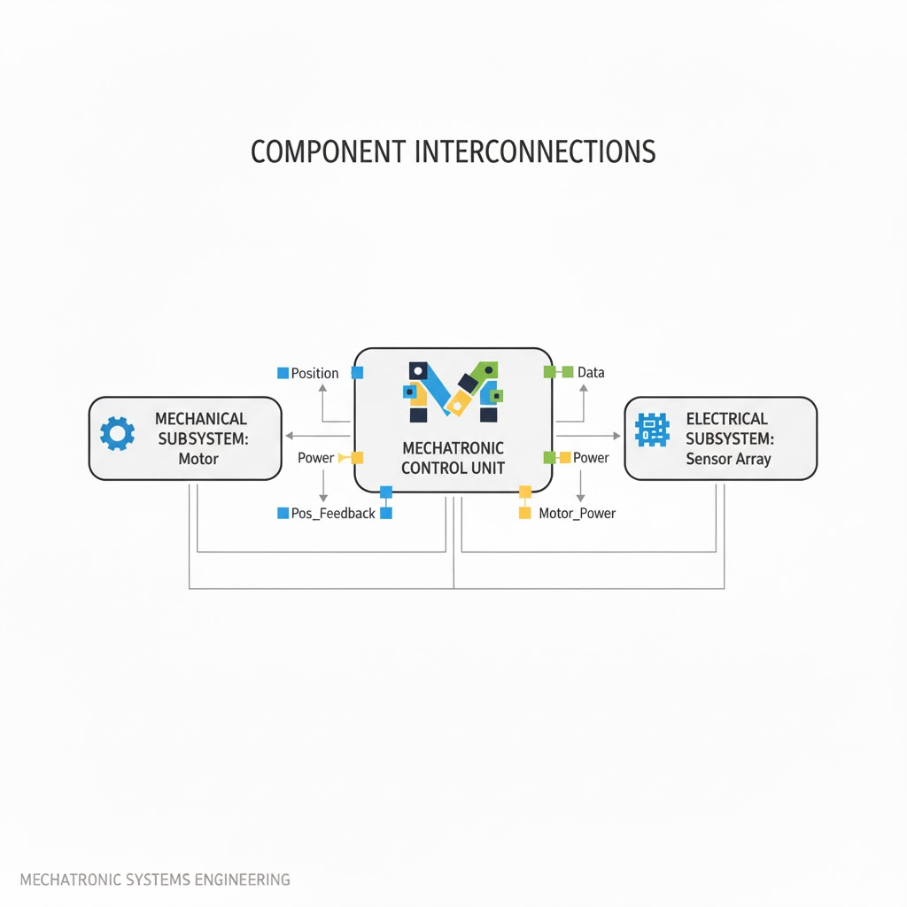

### 2.2. Anschlüsse und Konnektoren (*Ports* und *Connectors*)

Ports sind die Interaktionspunkte einer Komponente, über die sie mit anderen Komponenten kommuniziert.

Konnektoren sind die Verbindungen zwischen den Ports.

Wir modellieren sie, um die Schnittstellen und die Kommunikationspfade im System explizit zu machen.

Dies hilft, die Systemstruktur klar zu definieren und Abhängigkeiten zu verstehen.

---

#### Port-Typen

Sytem Composer unterscheidet die folgende drei Port-Typen:

- **Input** - Empfängt Daten oder Signale.
- **Output** - Sendet Daten oder Signale.
- **Physical** - Modelliert physikalische Verbindungen (z.B. mechanisch, elektrisch).

---

##### Port-Typ **Input**

Ein Input-Port empfängt Informationen von anderen Komponenten oder von außerhalb des Systems.

Er definiert einen Eingangspunkt für Daten oder Steuersignale.

**Beispiel:** Ein Port an einer Motorkomponente, der ein Geschwindigkeitssignal als Sollwert empfängt.

---

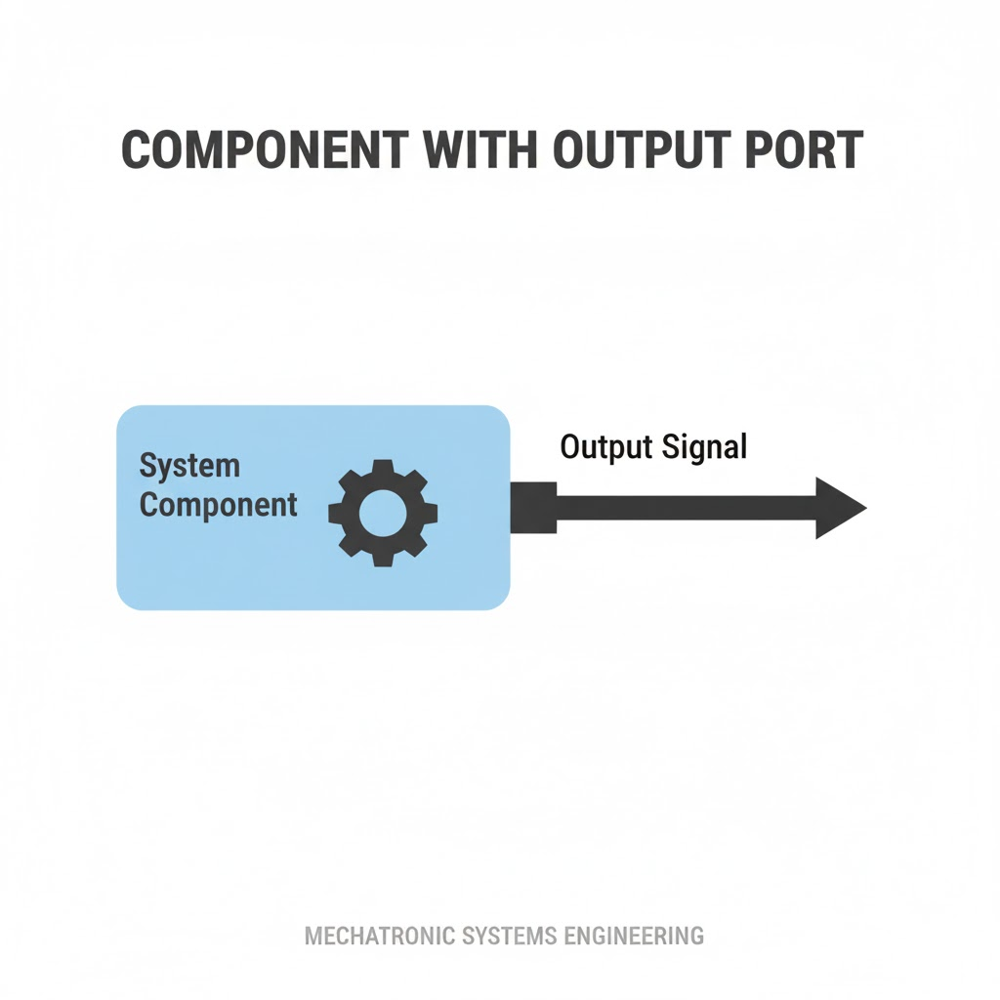

##### Port-Typ **Output**

Ein Output-Port sendet Informationen an andere Komponenten oder nach außerhalb des Systems.

Er definiert einen Ausgangspunkt für Daten oder Statusmeldungen.

**Beispiel:** Ein Port an einem Sensor, der den gemessenen Temperaturwert ausgibt.

---

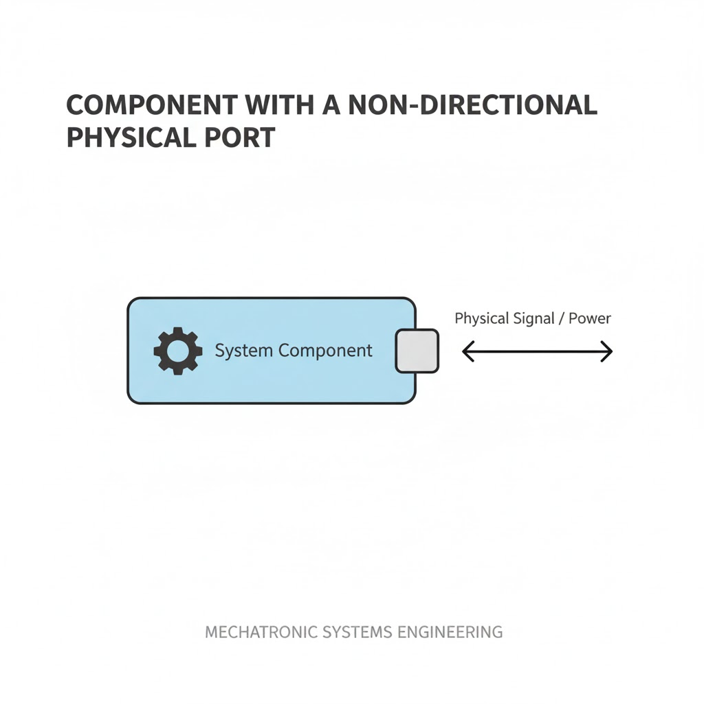

##### Port-Typ **Physical**

Ein Physical-Port repräsentiert eine physikalische Verbindung, über die Energie oder Materie ausgetauscht wird.

Im Gegensatz zu Input/Output-Ports ist die Richtung des Flusses nicht immer festgelegt.

**Beispiel:** Ein Port, der eine mechanische Welle repräsentiert, über die Drehmoment und Drehzahl übertragen werden.

---

#### System-Ports definieren

System-Ports definieren die Schnittstelle des Gesamtsystems und ermöglichen die Kommunikation mit der Systemumge-bung.

Ports können allgemein an den Grenzen von Komponenten platziert werden, um deren Schnittstellen klar zu definieren.

*Input Ports werden häufig auf der linken seite platziert, Output Ports dagen auf der rechten, um die Lesbarkeit zu erleichtern!*

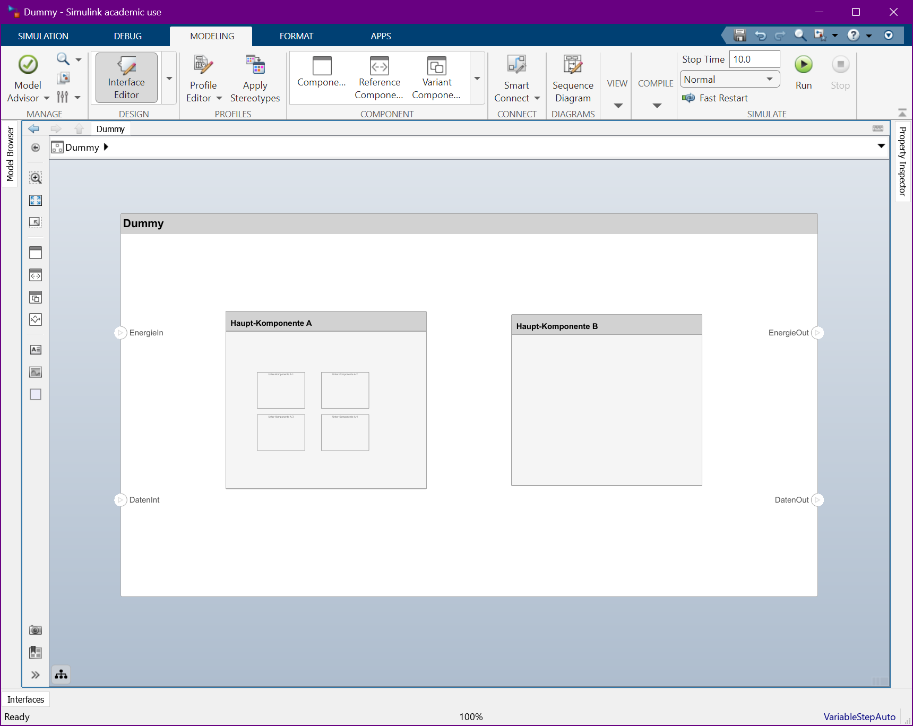

---

#### System-Ports auf Haupt-Kompontenten weiterleiten

System-Ports werden auf per Drag und Drop die Ports der Haupt-Komponenten weitergeleitet.

Diese Weiterleitung stellt sicher, dass externe Signale die richtigen Teilsysteme erreichen.

*Durch die Weiterleitung obliegt die Verarbeitung oder Generierung des Signals der Haupt-Komponente!*

---

#### Haupt-Komponenten untereinander verknüpfen

Die Haupt-Komponenten werden unter-einander verknüpft, um die Interaktion und den Datenaustausch zwischen den Teilsystemen zu modellieren.

Diese Verknüpfungen stellen die internen Kommunikationswege des Systems dar.

*Wenn die Signale nicht nach außen weitergeleitet werden, entstehen so rein interne Signale und Interaktionen!*

---

#### Ports von Haupt-Komponenten auf Unter-Komponenten weiterleiten

Die Ports der Haupt- werden auf die Ports der Unter-Komponenten weiter-geleitet, um die Funktionalität der Teilsysteme zu realisieren.

Diese hierarchische Port-Weiterleitung ermöglicht eine detaillierte und modulare Systemgestaltung.

*So kann die Implementierung eines Teilsystems gekapselt werden!*

---

#### Unter-Komponenten untereinander verknüpfen

Die Unter-Komponenten werden unter-einander verknüpft, um die Interaktion und den Datenaustausch zu modellieren.

Auf dieser Ebene wird die Funktionsweise eines Teilsystems durch das Zusammen-spiel seiner Module beschrieben.

*Die interne Verdrahtung der Module bleibt dabei wieder für andere Teile der Architek-tur verborgen!*

---

### 2.3. Schnittstellen (*Interfaces*)

Schnittstellen (Interfaces) im System Composer definieren die Art der Daten, die über einen Port ausgetauscht werden.

Sie legen die "Sprache" fest, die Komponenten für die Kommunikation verwenden.

Sie werden verwendet, um die Kompatibilität zwischen Ports sicherzustellen und die Datenstruktur explizit zu machen.

---

#### Der *Interface Editor*

Der Interface Editor ist das Werkzeug zur Definition und Verwaltung von Schnittstellen.

Hier können neue Schnittstellen angelegt und bestehende bearbeitet werden.

Man kann den Datentyp, die Einheiten, Dimensionen und andere Eigenschaften der ausgetauschten Daten festlegen.

---

#### Schnittstellen-Typen

Es werden die folgenden Typen von Schnittstellen unterschieden:

- **Value Type** - Für einfache, atomare Datenwerte.
- **Composite Data Interface** - Für strukturierte Daten, die aus mehreren Elementen bestehen.
- **Physical Interface** - Für physikalische Domänen und deren Variablen.

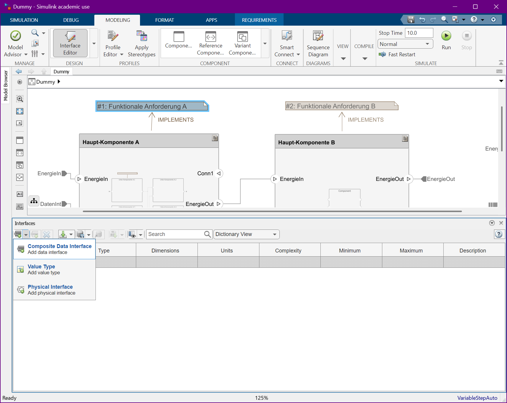

---

##### Schnittstellen-Typ **Value Type**

Ein Value Type Interface beschreibt einen einzelnen, einfachen Datenwert.

Dies kann eine Zahl, ein Wahrheitswert oder eine Aufzählung sein.

**Beispiel:** Eine Schnittstelle `Temperatur`, die einen Fließkommawert mit der Einheit "Grad Celsius" definiert.

---

##### **Value Type** Konfiguration

Bei der Konfiguration eines Value Type kann man den genauen Datentyp festlegen:
- **Wahrheitswert (boolean):** Für logische Signale (true/false).
- **Ganzzahl (integer):** Für Zähler oder diskrete Werte.
- **Fließkommazahl (double/single):** Für kontinuierliche, physikalische Größen.

---

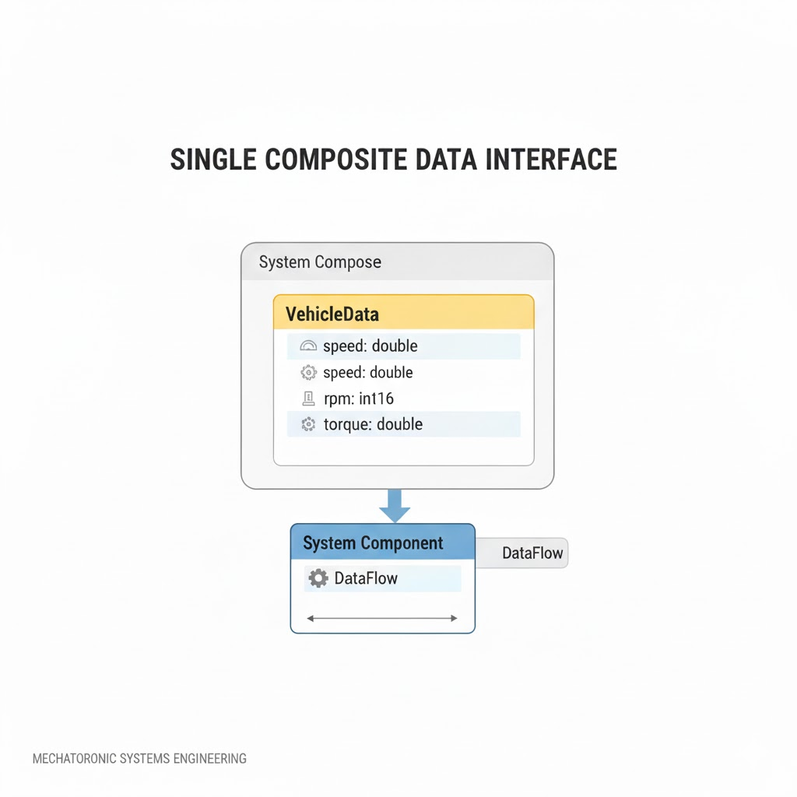

##### Schnittstellen-Typ **Composite Data Interface**

Ein Composite Data Interface (auch Bus genannt) bündelt mehrere unterschiedliche Datenelemente zu einer einzigen Schnittstelle.

Dies ist nützlich, um zusammengehörige Daten gemeinsam zu übertragen.

**Beispiel:** Eine Schnittstelle `GPS_Signal`, die die Elemente `Latitude`, `Longitude` und `Altitude` enthält.

---

##### **Composite Data Interface** Konfiguration

Innerhalb eines Composite Data Interface definiert man einzelne Elemente.

Jedes Element hat einen Namen und einen eigenen Datentyp (z.B. `double`, `int32`).

Man kann auch andere Interfaces (Value Types oder andere Composite Interfaces) als Elemente verschachteln, um komplexe Datenstrukturen zu erstellen.

---

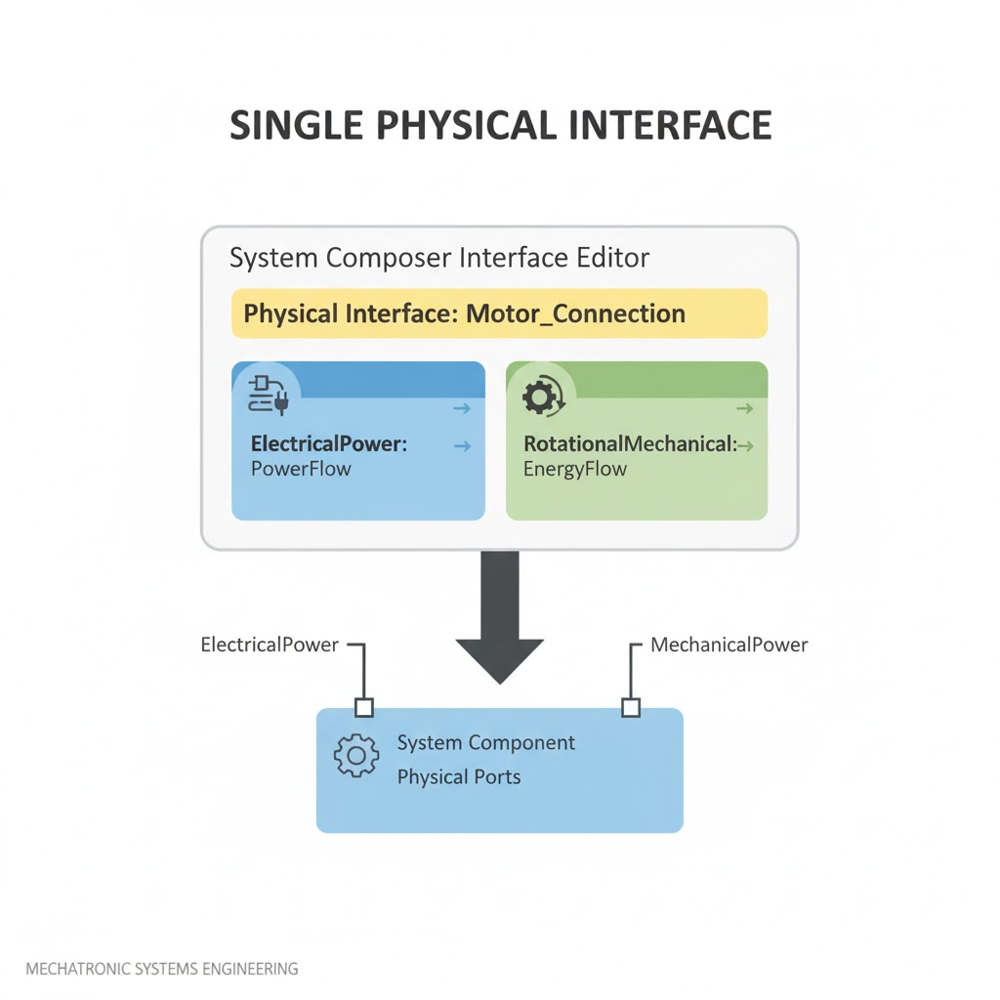

##### Schnittstellen-Typ **Physical Interface**

Ein Physical Interface definiert die Eigenschaften einer physikalischen Domäne.

Es wird an Physical Ports verwendet, um den Austausch von Energie oder Materie zu modellieren.

**Beispiel:** Eine Schnittstelle `Elektrisch`, die die Variablen `Spannung` und `Strom` definiert.

---

##### **Physical Interface** Konfiguration

Ein Physical Interface besteht aus "Through"- und "Across"-Variablen.

"Across"-Variablen beschreiben eine Potenzialdifferenz (z.B. Spannung, Druckdifferenz).

"Through"-Variablen beschreiben einen Fluss (z.B. Strom, Volumenstrom).

Diese Elemente werden nicht mit klassischen Datentypen, sondern mit physikalischen Domänen verknüpft.

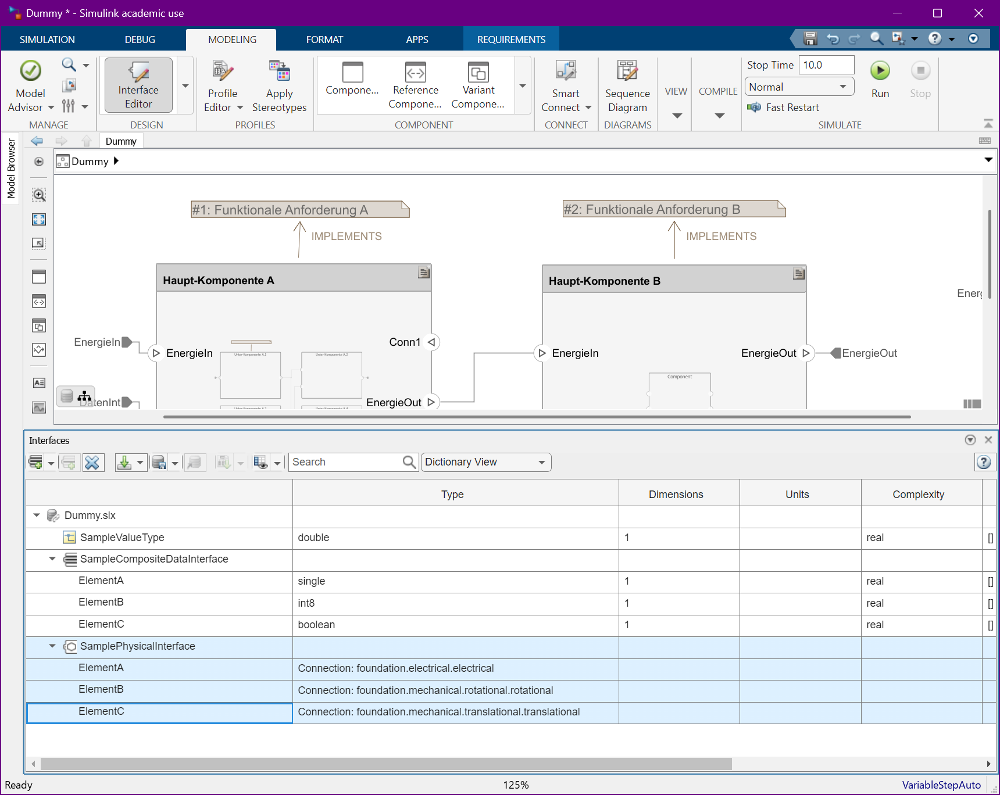

---

#### Schnittstellen zuweisen

Um eine Schnittstelle zuzuweisen, wählt man einen Port im Architekturmodell aus.

Im Property Inspector kann man dann aus der Liste der im Interface Editor definierten Schnittstellen die passende auswählen.

Die Zuweisung stellt sicher, dass der Port nur kompatible Daten sendet oder empfängt.

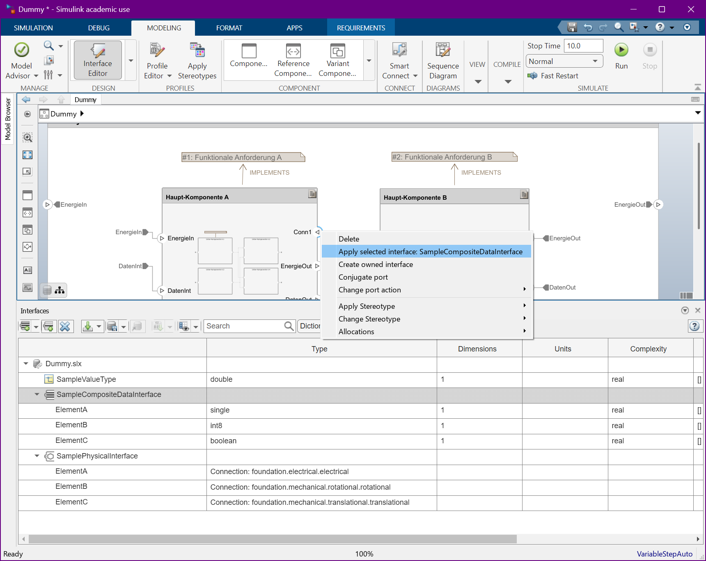

---

#### Kompatibilität von Schnittstellen

Damit zwei Ports miteinander verbunden werden können, müssen ihre Schnittstellen kompatibel sein.

Das bedeutet, sie müssen entweder die exakt gleiche Schnittstelle verwenden oder die Datentypen müssen implizit konvertierbar sein.

System Composer prüft diese Kompatibilität automatisch.

---

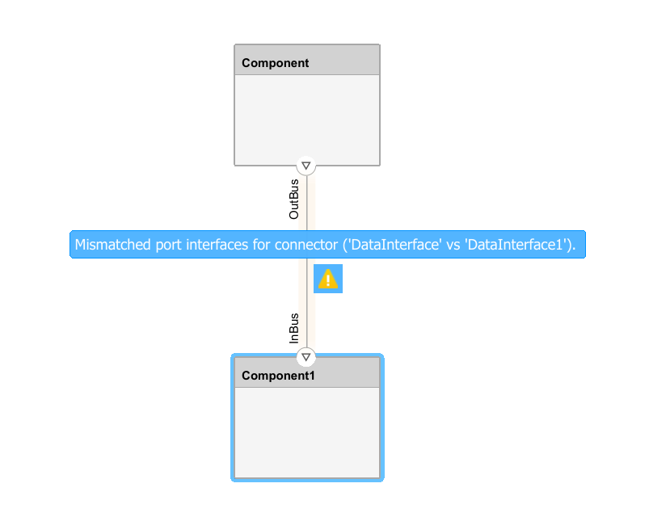

#### Warnung bei Inkompatibilitäten

Wenn zwei verbundene Ports inkompatible Schnittstellen haben, zeigt System Composer eine Warnung an.

Die Verbindungslinie wird typischerweise rot oder gestrichelt dargestellt.

Zusätzlich erscheint eine Fehlermeldung im Diagnostic Viewer, die das Problem genau beschreibt.

---

#### Behebung der Inkompatibilitäten durch Adapter-Komponenten

Ein Adapter ist eine spezielle Komponente, die zwischen zwei inkompatiblen Schnittstellen vermittelt.

Man fügt eine Komponente zwischen die beiden Ports ein und implementiert darin die Logik zur Konvertierung der Daten.

*Beispiel: Mapping der Datenelemente!*

---

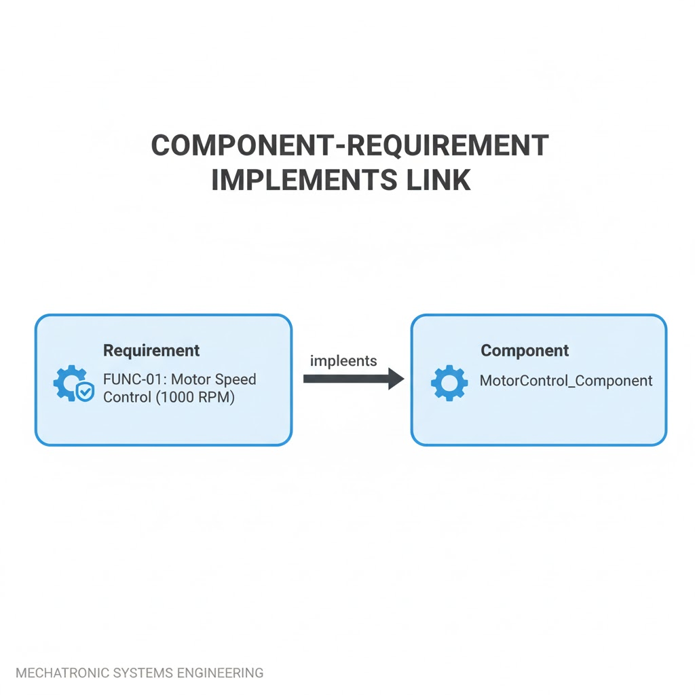

### 2.4. Verknüpfungen (*Links*)

Links können nicht nur Anforderungen untereinander, sondern auch Anforderungen mit Architekturelementen wie Komponenten oder Ports verbinden.

Diese Verknüpfung ist entscheidend für die Nachverfolgbarkeit.

Sie zeigt, welche Komponente eine bestimmte Anforderung umsetzt (*Implementierung*) und ermöglicht die Analyse der Auswirkungen von Anforderungsänderungen auf die Architektur.

---

#### Link anlegen

Einen Link zwischen einer Anforderung und einer Komponente erstellt man am einfachsten per Drag & Drop.

Man zieht die gewünschte Anforderung aus dem Requirements Manager Fenster direkt auf die Ziel-Komponente im Architekturmodell.

System Composer erstellt dann automatisch einen Link vom Typ `Implements`.

---

#### Links pro Requirement anzeigen

Wenn man eine Anforderung im Requirements Manager auswählt, zeigt der Property Inspector im Bereich "Links" alle verknüpften Elemente an.

Dort sieht man, mit welchen Komponenten, Ports oder anderen Anforderungen diese Anforderung verlinkt ist.

Dies ermöglicht eine schnelle Navigation zwischen den Artefakten.

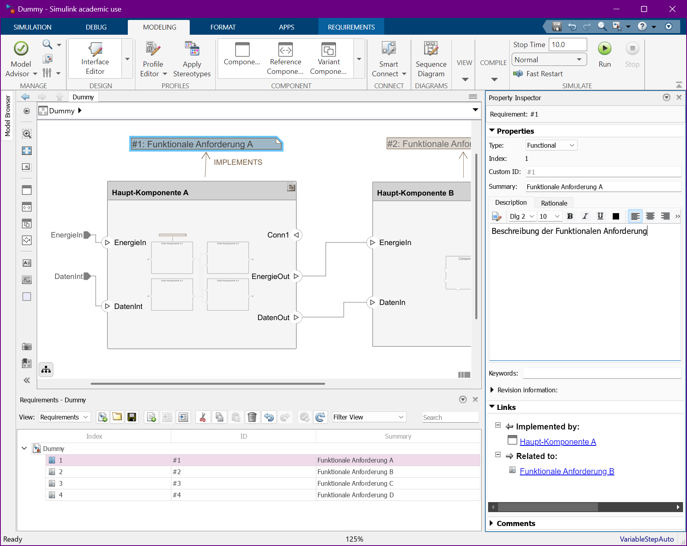

---

#### Alle Links anzeigen

Der Link Editor bietet eine globale Übersicht über alle Verknüpfungen im Projekt.

Man kann die Ansicht "Show Links" im Requirements-Reiter verwenden, um alle Links für das aktuell geöffnete Modell grafisch hervorzuheben.

Dies hilft, die Vollständigkeit der Verknüpfungen zu überprüfen.

---

#### Die *Tracability Matrix*

Die Nachverfolgbarkeitsmatrix (Traceability Matrix) ist eine tabellarische Darstellung, die die Beziehungen zwischen zwei Arten von Artefakten zeigt.

Typischerweise werden Anforderungen in den Zeilen und Architekturelemente (Komponenten, etc.) in den Spalten dargestellt.

Eine Markierung in einer Zelle zeigt an, dass eine Verknüpfung zwischen dem Zeilen- und Spaltenelement besteht.

| | C1 | C2 | C3 |
|-|-|-|-|
| R1 | ✅ | | ✅ |
| R2 | ✅ | | |
| R3 | | ✅ | |

---

#### Erstellung der Matrix

Die Matrix kann über den "Traceability Matrix"-Button im Requirements-Reiter generiert werden.

Die Erstellung erfolgt dynamisch auf Basis der aktuell im Projekt vorhandenen Links.

Es handelt sich um eine temporäre Ansicht, die nicht als separate Datei gespeichert, sondern bei Bedarf immer wieder neu generiert wird.

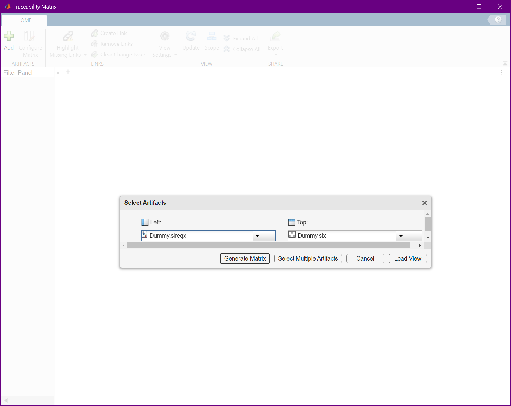

---

#### Initiale Form der Matrix

In ihrer initialen Form zeigt die Matrix alle Anforderungen aus den geladenen Requirement Sets in den Zeilen.

In den Spalten werden alle Elemente des Architekturmodells aufgelistet, einschließlich Komponenten, Ports und Konnektoren.

Die Matrix kann dadurch anfangs sehr groß und unübersichtlich sein.

---

#### Einstellungen der Matrix

Um die Übersichtlichkeit zu verbessern, bietet die Matrix umfangreiche Filteroptionen.

Man kann die angezeigten Zeilen nach Anforderungstyp (z.B. nur funktionale Anforderungen) filtern.

Ebenso können die Spalten gefiltert werden, um beispielsweise nur Komponenten oder nur Ports anzuzeigen.

---

### 2.5. Fallbeispiel

Wir modellieren nun die Architektur für unser Akku-Schrauber-Beispiel.

Basierend auf den zuvor definierten Anforderungen zerlegen wir das Gesamtsystem in logische Hauptkomponenten.

Anschließend verfeinern wir die Struktur durch die Definition von Unter-Komponenten.

---

#### Gesamtsystem **Akku-Schauber**

- **Energieversorgung** - liefert elektrische Energie
- **Antriebssystem** - generiert mechanische Energie
- **Steuerung & Betätigung** - Schnittstelle zum Benutzer
- **Werkzeugaufnahme** - hält das Werkzeug (Bit, Bohrer)
- **Gehäuse & Ergonomie** - Schutz und Schnittstelle zum Benutzer

---

#### Komponente **Energieversorgung**

Bei der Energieversorgung können wir zum Beispiel einen Akku und ein Ladegerät identifizieren:

- **Akku** - Speicherung und Bereit-stellung elektrischer Energie, Temp-eraturmessung, Leistungsregelung
- **Lagegerät** - Bereitstellung elektrischer Energie für die Speicherung im Akku

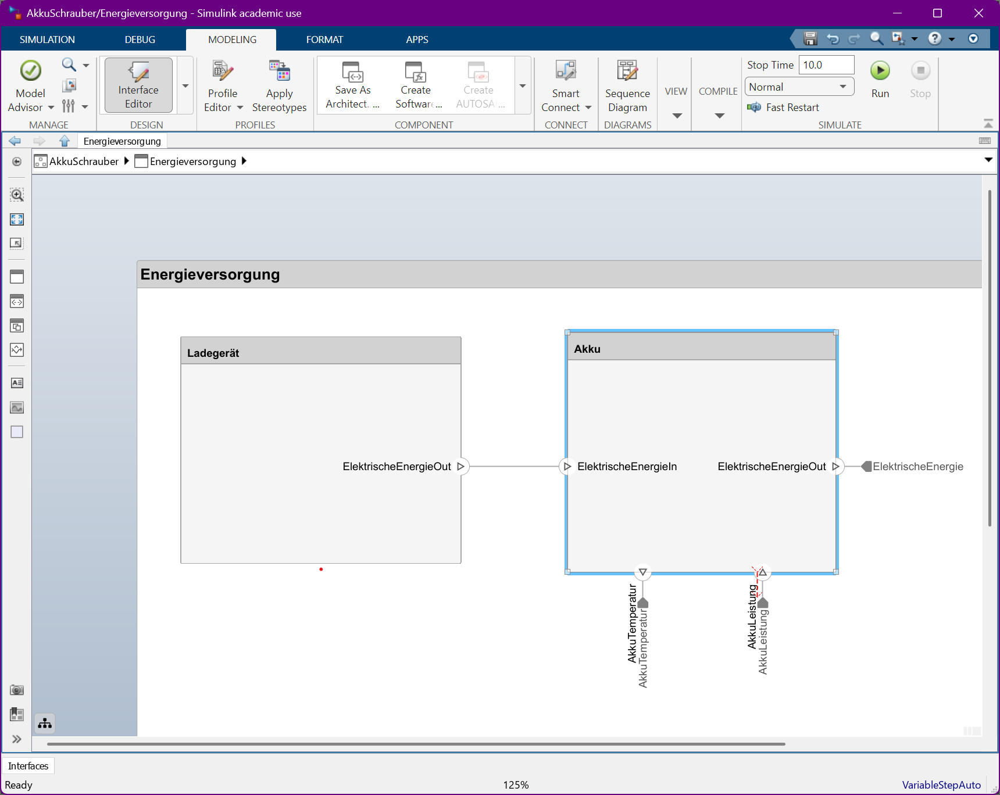

---

#### Komponente **Antriebssystem**

Beim Antriebssystem können wir zum Beispiel einen Motor und ein Getriebe identifizieren:

- **Motor** - Wandlung von elektrischer Energie aus der Energieversorgung in mechanische Energie
- **Getriebe** - Reduktion der Drehzahl des Motors und Steigerung des Drehmoments

---

### 2.6. Übungsaufgabe

Erstelle eine Architektur für den 3D-Drucker und dokumentiere die Architektur mithilfe des MATLAB System Composers. Verknüpfe anschließend die Anforderungen mit den Architektur-Elementen.

---

## 3. Profile anwenden

In diesem dritten Abschnitt lernen wir die folgenden Dinge:

1. **Profil erstellen / anwenden** (Stereotype, Property)
1. **Views erstellen / nutzen** (Component Filter, Port Filter)

---

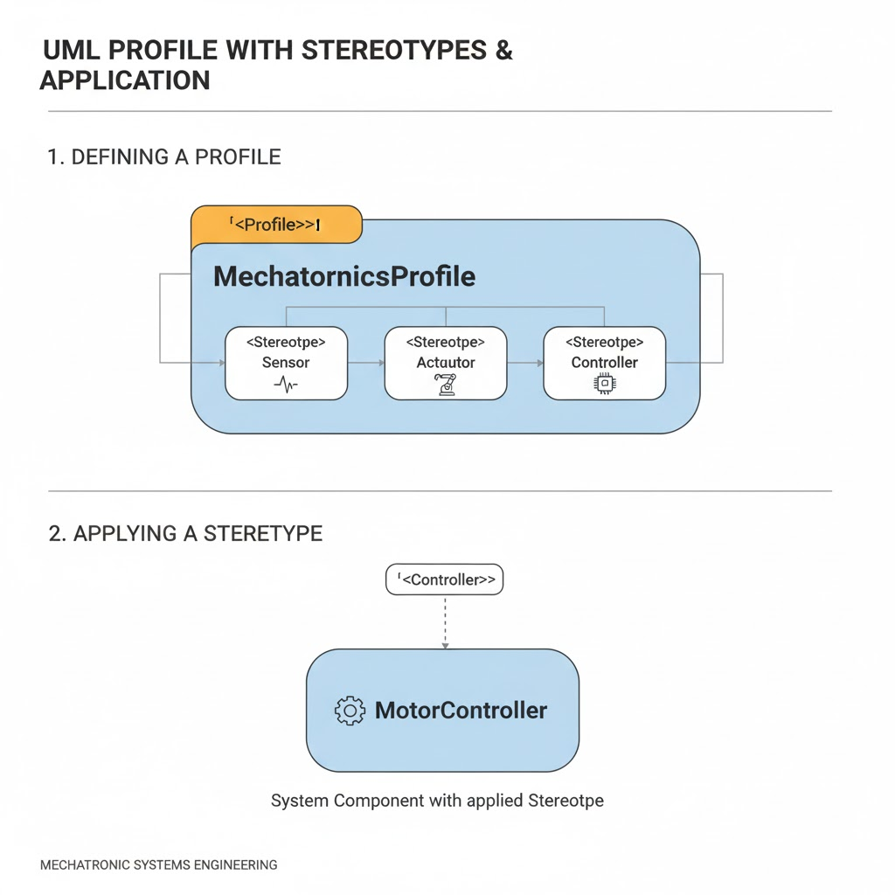

### 3.1. Profile

Profile ermöglichen es, die Modellelemente mit benutzerdefinierten Metadaten anzureichern.

Ein Profil enthält eine Sammlung von Stereotypen.

Ein Stereotyp ist wie eine "Schablone", die zusätzliche Eigenschaften (Properties) zu Komponenten, Ports oder anderen Elementen hinzufügt.

*Wir brauchen sie, um domänenspezifische Informationen zu modellieren, z.B. Gewicht!*

---

#### Der **Profile Editor**

Der Profile Editor ist das Werkzeug zum Erstellen und Bearbeiten von Profilen und deren Stereotypen.

Er bietet eine grafische Oberfläche, um neue Stereotypen zu definieren, ihnen Eigenschaften (Properties) hinzuzufügen und festzulegen, auf welche Modellelemente sie anwendbar sind.

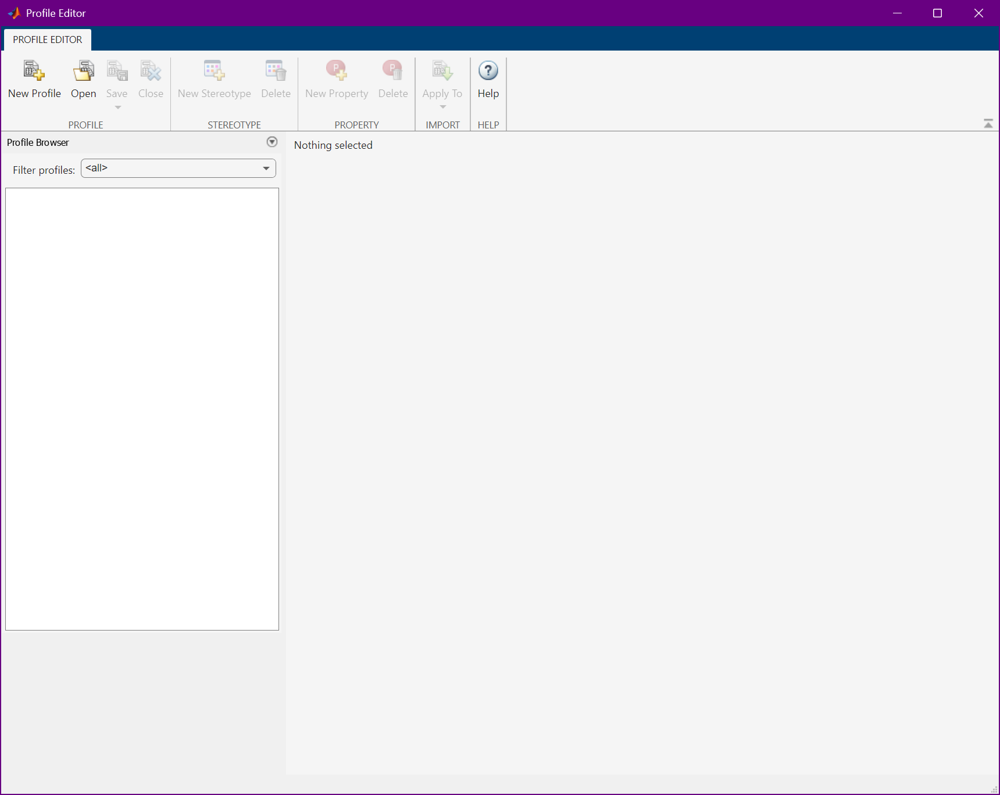

---

#### Profil anlegen

Der erste Schritt ist das Anlegen eines neuen Profils.

Ein Profil wird als separate XML-Datei (`.xml`) gespeichert.

Dadurch kann es versioniert und in verschiedenen Projekten wiederverwendet werden, um konsistente Metadaten sicherzustellen.

---

#### Stereotypen anlegen

Nachdem das Profil erstellt ist, können innerhalb des Profils Stereotypen angelegt werden.

Jeder Stereotyp erhält einen eindeutigen Namen.

Beispiele für Stereotypen könnten `MechanischeKomponente`, `SoftwareModul` oder `ExternZugekauft` sein.

---

#### Anwendung von Stereotypen auf Modellelemente einschränken

Für jeden Stereotyp kann man festlegen, für welche Arten von Modellelementen er gültig ist.

Man kann die Anwendung beispielsweise auf `Component`, `Port`, `Connector` oder `Interface` beschränken.

So wird sichergestellt, dass Stereotypen nur dort verwendet werden, wo sie semantisch sinnvoll sind.

---

#### Vererbungsbeziehung zwischen Stereotypen definieren

Stereotypen können in einer Vererbungshierarchie organisiert werden.

Ein untergeordneter Stereotyp erbt alle Eigenschaften seines übergeordneten Stereotyps.

Beispiel: `ElektrischerSensor` könnte von `Sensor` erben und zusätzliche elektrische Eigenschaften hinzufügen.

---

#### Eigenschaften der einzelnen Stereotypen festlegen

Jedem Stereotyp können wir beliebig viele Eigenschaften hinzugefügen.

Für jede Eigenschaft legt man einen Namen, einen Datentyp (z.B. `string`, `double`, `enum`) und optional einen Standardwert fest.

Eigenschaften, die in einem Basis-Stereotyp definiert sind, werden an alle abgeleiteten Stereotypen vererbt.

---

#### Profil auf Architekturmodell anwenden

Damit die definierten Stereotypen in einem Architekturmodell verwendet werden können, muss das Profil zunächst auf dieses Modell angewendet werden.

Dies geschieht über die Modelleigenschaften.

Nach der Anwendung stehen die Stereotypen im Property Inspector zur Auswahl bereit.

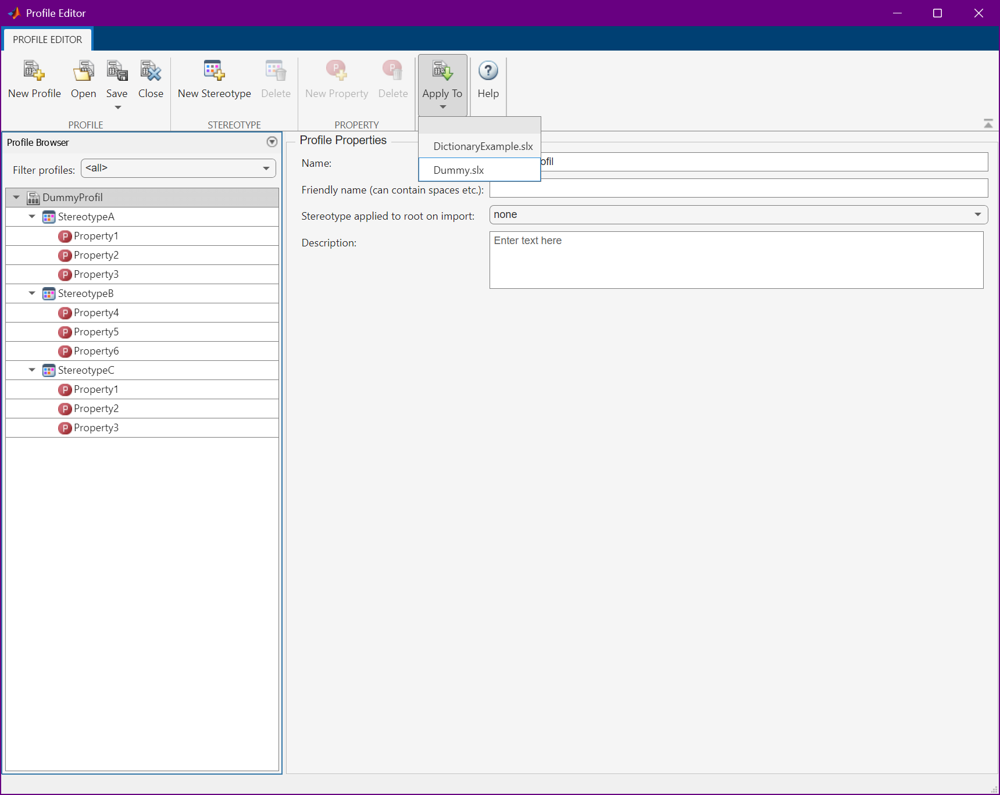

---

#### Stereotypen auf Komponenten anwenden

Um einen Stereotyp anzuwenden, wählt man ein Modellelement (z.B. eine Komponente) aus.

Im Property Inspector kann man dann den gewünschten Stereotyp aus der Liste der verfügbaren Stereotypen auswählen.

Einem Element können auch mehrere Stereotypen zugewiesen werden.

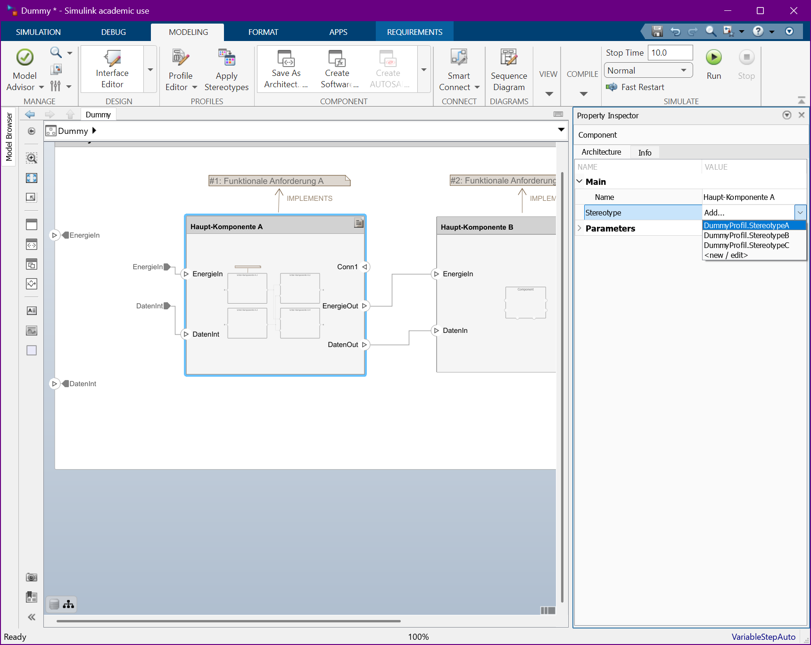

---

#### Eigenschaften des Stereotypen für Komponente festlegen

Sobald einer Komponente ein Stereotyp zugewiesen ist, erscheinen dessen Eigenschaften im Property Inspector.

Hier können nun die spezifischen Werte für die Komponente eingetragen werden.

Zum Beispiel kann man für eine Komponente mit dem Stereotyp `Hardware` den Wert für die Eigenschaft `Kosten` auf `15.50` setzen.

---

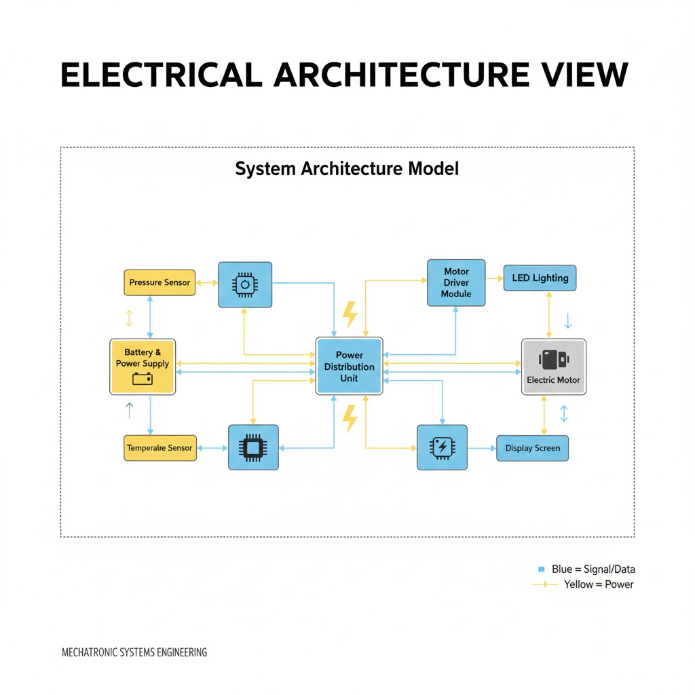

### 3.2. Sichten (*Views*)

Architektursichten (Views) sind gefilterte Darstellungen des Gesamtmodells.

Sie reduzieren die Komplexität, indem sie nur die Teile der Architektur zeigen, die für eine bestimmte Fragestellung oder einen bestimmten Stakeholder relevant sind.

Wir brauchen sie, um verschiedene Aspekte des Systems isoliert zu betrachten, z.B. die mechanische Struktur, die Software-Kommunikation oder die Energieflüsse.

---

#### Der **Architecture Views Editor**

Der Architecture Views Editor ist das Werkzeug zur Erstellung und Verwaltung von Sichten.

Er wird über den Reiter "Views" geöffnet.

Eine neue Sicht wird durch Klick auf "New View" angelegt. Jede Sicht besteht aus einer Reihe von Filtern, die festlegen, was angezeigt wird.

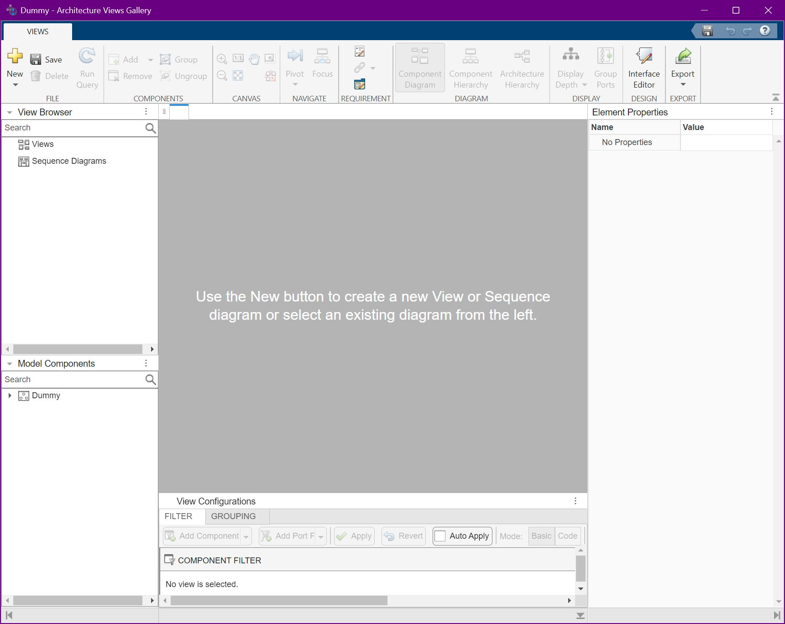

---

#### Sicht anlegen

Das Anlegen einer neuen Sicht erfolgt im Architecture Views Editor.

Man gibt der Sicht einen aussage-kräftigen Namen, z.B. "Mechanische Sicht" oder "Software-Sicht".

Initial ist die Sicht leer; sie wird durch das Hinzufügen von Filtern und Abfragen definiert.

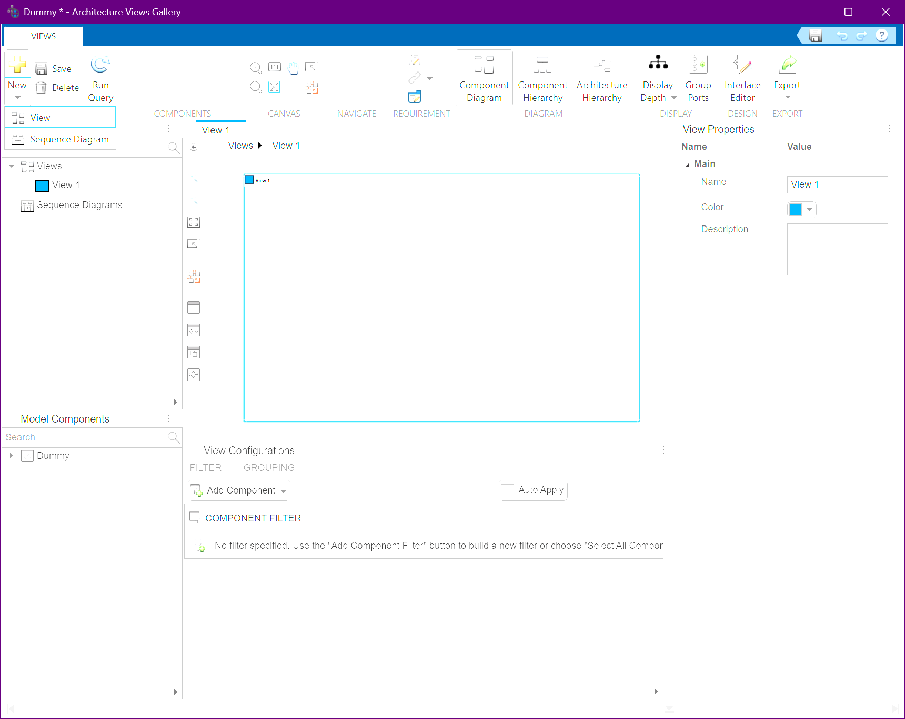

---

#### **Component**-Filter anlegen

Ein Component-Filter dient dazu, gezielt Komponenten basierend auf ihren Eigenschaften auszuwählen oder auszublenden.

Man kann Komponenten nach ihrem Namen, ihrem Pfad oder den ihnen zugewiesenen Stereotypen filtern.

Dies ist die primäre Methode, um zu steuern, welche Teile der Architektur in der Sicht sichtbar sind.

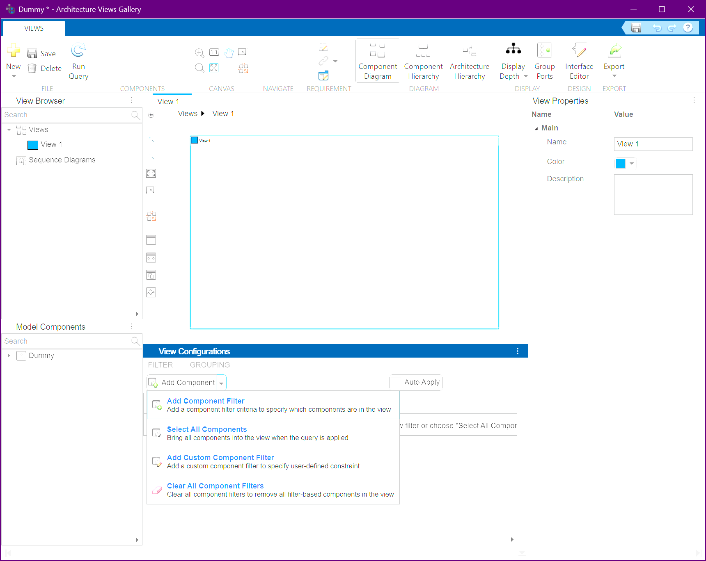

---

#### **Component**-Filter konfigurieren

Bei der Konfiguration eines Component-Filters gibt man die Kriterien an.

Man kann beispielsweise festlegen: "Zeige alle Komponenten, denen der Stereotyp 'Mechanisch' zugewiesen ist".

Oder man filtert nach einem Namensmuster, z.B. "Zeige alle Komponenten, deren Name mit 'Sensor_' beginnt".

---

#### **Port**-Filter anlegen

Ein Port-Filter steuert die Sichtbarkeit von Ports und den damit verbundenen Konnektoren.

Auch wenn eine Komponente sichtbar ist, können ihre Ports durch einen Port-Filter ausgeblendet werden.

Dies ist nützlich, um nur bestimmte Arten von Verbindungen anzuzeigen, z.B. nur elektrische Signale.

---

#### **Port**-Filter konfigurieren

Die Konfiguration eines Port-Filters funktioniert analog zum Component-Filter.

Man kann Ports nach ihrem Namen, dem Stereotyp des Ports oder dem Stereotyp der zugehörigen Schnittstelle filtern.

Beispiel: "Blende alle Ports aus, deren Name 'debug' enthält".

---

#### Filter anwenden

Nachdem die Filter für eine Sicht konfiguriert sind, wendet man sie mit dem "Apply"-Button an.

System Composer analysiert daraufhin das gesamte Modell und blendet alle Elemente aus, die nicht den Filterkriterien entsprechen.

Das Ergebnis ist eine vereinfachte, fokussierte Darstellung der Architektur.

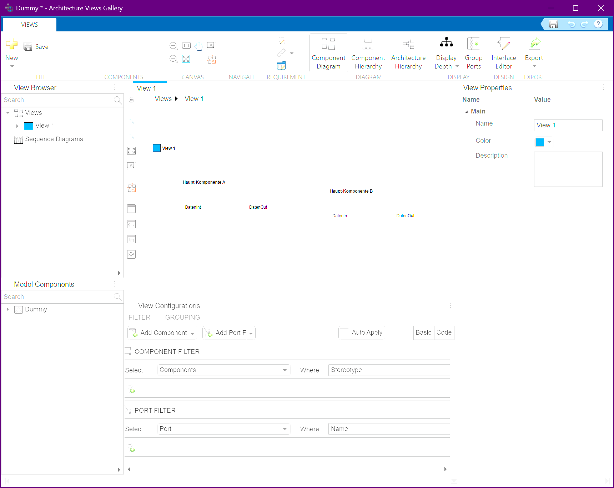

---

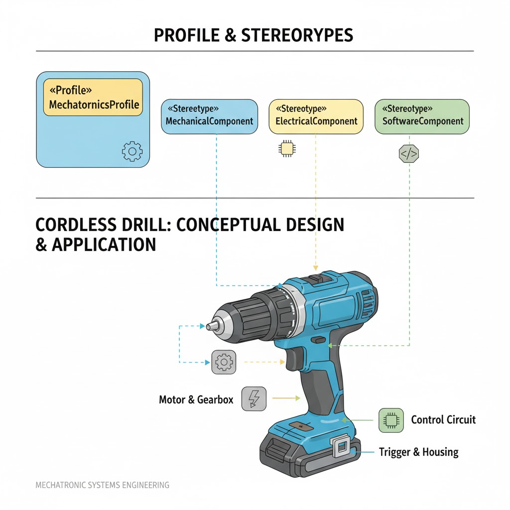

### 3.3. Fallbeispiel

Für unser Akku-Schrauber-Beispiel definieren wir nun ein Profil, um die Komponenten zu klassifizieren.

Anschließend erstellen wir eine Sicht, die nur die mechanischen Komponenten und deren Verbindungen anzeigt.

Dies hilft uns, die mechanische Funktionsweise des Geräts isoliert zu analysieren.

---

#### Die Stereotypen unseren Profils

Für unser Fallbeispiel arbeiten wir mit den folgenden vier Stereotypen:

- **Mechatronische Komponente** - Kombiniert Mechanik, Elektronik und Software (z.B. die Motorsteuerung).
- **Mechanische Komponente** - Rein mechanisches Bauteil (z.B. das Getriebe, Gehäuse).
- **Elektrische Komponente** - Rein elektrisches/elektronisches Bauteil (z.B. der Akku, Schalter).
- **Softwaretechnische Komponenten** - Reine Software-Logik (z.B. ein Algorithmus zur Drehmomentregelung).

---

#### Zuweisung der Sterotypen zu Komponenten

- **Motor:** Mechatronische Komponente, da er elektrische Energie in mechanische umwandelt und eine Ansteuerungselektronik besitzt.
- **Getriebe:** Mechanische Komponente, da es rein mechanisch die Drehzahl und das Drehmoment wandelt.
- **Akku:** Elektrische Komponente, da er elektrische Energie speichert und liefert.
- **Steuerung:** Softwaretechnische Komponente, da hier die Logik für Drehzahl und Drehmoment implementiert ist.

---

#### Nutzer von Architektursichten

Eine Sicht, die nur elektrische Komponenten zeigt, würde den Energiefluss im System visualisieren.

Wir würden den **Akku**, das **Ladegerät** und die Verbindungen zum **Motor** und zur **Steuerungselektronik** sehen.

Mechanische Komponenten wie das **Getriebe** oder das **Gehäuse** wären ausgeblendet.

Dies hilft Elektroingenieuren, sich auf die für sie relevanten Teile des Systems zu konzentrieren.

---

### 3.4. Übungsaufgabe

Erstelle ein Profil für den 3D-Drucker und weise den Komponenten Stereotypen zu. Erstelle anschließend eine View, die nur die mechanischen Komponenten anzeigt.
