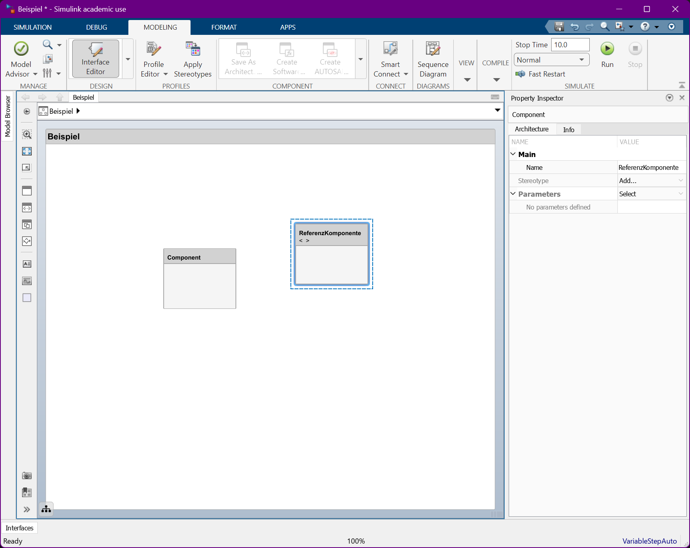
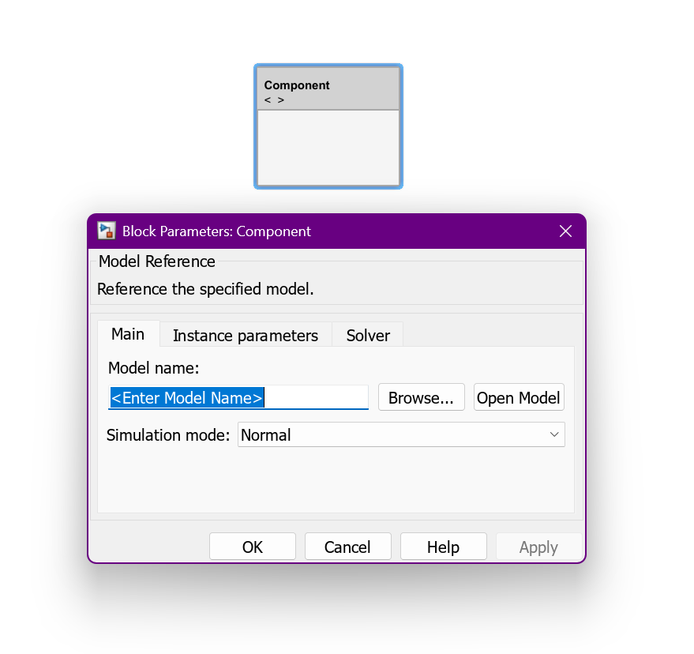
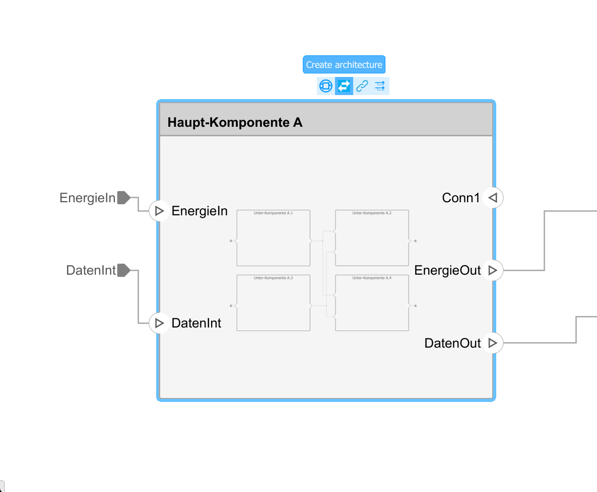

# Kapitel 1: Anforderungen und Architekturen

Dieses Kapitel umfasst die folgenden drei Abschnitte:

1. Anforderungen sammeln
1. Architekturen festlegen
1. Profile anwenden

---

## 1. Anforderungen sammeln

In diesem ersten Abschnitt lernen wir die folgenden Dinge:

1. **Architekturmodelle erstellen** (System Composer)
1. **Anforderungslisten erstellen** (Requirement Manager)
1. **Anforderungen erstellen** (3 Requirement-Typen)
1. **Verknüpfungen erstellen** (6 Link-Typen)

---

### 1.1. Architekturmodelle

TODO: Kurze Einführung - was ist ein Architekturmodell und warum wird es erstellt?

---

#### Der Start-Bildschirm

Zuerst starten wir Simulink und erstellen eine neues Architekturmodell für den System Composer.

Der System Composer stellt als Vorlage ein Architekturmodell, ein Software-Architekturmodell, und ein Aktivitäts-diagramm bereit.

*Wir erwenden das einfache Architektur-modell an dieser Stelle!*

---

#### Die Architektur-Ansicht

Nachdem das neue Architekturmodell erstellt wurde, wechselt MATLAB in die Modellierungsansicht.

In der Modellierungsansicht können die Komponenten der Architektur definiert und miteinander verknüpft werden.

*Im initialen Zustand ist die Architektur leer, das heißt die Architektur beinhaltet keine Komponenten.*

---

### 1.2. Anforderungsliste (*Requirement Sets*)

TODO: Kurze Einführung - was ist eine Anforderung und warum wird sie im Modell erfasst?

---

#### Der Apps-Reiter

Komponenten modellieren wir auch erst später; jetzt laden wir zunächst Mal die Requirements Manager Ansicht.

Denn im ersten Schritt wollen wir die Anforderungen an das System beschreiben.

*Um die Umsetzung der Anforderungen und die Verifikation der Umsetzung kümmern wir uns später!*

---

#### Requirement Set hinzufügen

In der Requirements Manager Ansicht definieren wir zunächst ein sogenanntes Requirement Set.

In einem Requirement Set können wir mehrere Anforderungen sammeln und gemeinsam verwalten.

*Requirement Sets werden in einer eigenen Datei gespeichert und können auch wiederverwendet werden!*

---

### 1.3. Anforderungen (*Requirements*)

TODO: Kurze Einführung - was ist eine Anforderung und warum wird sie im Modell erfasst?

---

#### Requirement hinzufügen

Im nächsten Schritt fügen wir einzelne Requirements dem zuvor erstellten Requirement Set hinzu.

Die Requirements repräsentieren die Anforderungen an das System und können hierarchisch strukturiert werden.

*Identifikation und Sammlung von Anforderungen erfolgt durch unterstützende Kreativtechniken!*

---

#### Eigenschaften eines Requirement

Die Eigenschaften der einzelnen Requirements können in der Property Inspector Ansicht verwaltet werden.

Die Eigenschaften umfassen einen Typ, eine Zusammenfassung, und eine detaillierte Beschreibung.

*Die Requirements Toolbox erzwingt keine spezielle Art der Beschreibung (z.B. definierte Satzmuster)!*

---

#### Die Requirement-Typen

Wir unterscheiden diese Typen:

- **Container** - Gruppierung von Anforderungen (z.B. nach Ingenieursdisziplin)
- **Functional** - Klassische Funktionale Anforderungen (z.B. Wandlung von Energie)
- **Informational** - Klassische nicht-funktionale Anforderungen (z.B. Performance oder Sicherheit)

---

##### Requirement-Typ **Container**

**Zweck:** Diese dienen primär der Strukturierung und Hierarchisierung der Anforderungen. Sie fungieren als Ordner oder Überschriften, um logische Gruppen zu bilden.

**Beispiel:** Eine Anforderung mit dem Typ Container könnte "System-Sicherheit" oder "Benutzerverwaltung" lauten und darunter eine Reihe spezifischer Funktionaler Anforderungen enthalten.

**Status:** Container-Anforderungen selbst tragen nicht zum Implementierungs- oder Verifizierungsstatus bei. Der Status wird jedoch durch die funktionalen Anforderungen innerhalb des Containers bestimmt und auf der Containerebene aggregiert.

---

##### Requirement-Typ **Functional**

**Zweck:** Diese Anforderungen sind das Kernstück der Spezifikation. Sie beschreiben direkt die erforderlichen Fähigkeiten und das Verhalten des zu entwickelnden Systems oder Produkts.

**Beispiel:** "Das System muss die Eingabedaten innerhalb von 50 Millisekunden verarbeiten." oder "Die Benutzeroberfläche muss einen 'Speichern'-Button enthalten."

**Status:** Die Toolbox berechnet den Implementierungs- und Verifizierungsstatus basierend auf den Links zu Designelementen (Implementierung) und Tests (Verifizierung). Sie tragen direkt zum Fortschritt bei.

---

##### Requirement-Typ **Informational**

**Zweck:** Dient der Erfassung von Anforderungen oder Informationen, die kein direktes funktionales Verhalten darstellen oder die das System nicht direkt implementieren muss, wie nicht-funktionale Anforderungen und zusätzliche Erklärungen.

**Beispiel:** "Die Verwendung der Bibliothek X ist aus Gründen der Kompatibilität erforderlich." oder "Alle Passwörter müssen eine Mindestlänge von 8 Zeichen haben (Sicherheitsanforderung)."

**Status:** Informational-Anforderungen tragen nicht zum Implementierungs- oder Verifizierungsstatus bei. Sie dienen rein dokumentarischen oder ergänzenden Zwecken im Kontext der Anforderungssammlung.

---

#### Der Requirements Editor

Neben dem Requirements Manager bietet die Requirements Toolbox auch den sogenannten Requirements Editor.

Der Requirements Editor kann über den Reiter **Requirements** im oberen Menü-band geöffnet werden.

*Der Requirements Editor kann insbesondere für die Verknüpfung von Anforderungen verwenden wertden!*

---

##### Die Tabellen-Ansicht

Der Requirements Editor bietet zunächst die gewohnte tabellarische Ansicht der Anforderungen.

Die Details der einzelnen Anforderungen wiederum auch im Property Inspector dargestellt.

*Neben der tabellarischen Darstellung bietet der Requirements Editor auch eine Dokumentendarstellung.*

---

##### Die Dokumenten-Ansicht

Die Dokumentendarstellung zeigt neben der Zusammenfassung auch die Beschrei-bung der einzelnen Anforderungen.

Diese Darstellung beim Durchlesen der Anforderungsspezifikation aufgrund des höheren Detaillierungsgrades.

*Eine Bearbeitung der Inhalte ist in der Dokumentenansicht direkt jedoch nicht möglich!*

---

### 1.4. Verknüpfungen (*Links*)

TODO: Kurse Einführung - Was ist ein Link zwischen Anforderungen und warum wird er im Modell hinterlegt?

---

#### Link erstellen (1 / 2)

Ein mächtiges Werkzeug in der System-entwicklung ist die Nachverfolgung von Anforderungen (*Tracing*).

Vor die Nachverfolgung bietet die Requirements Toolbox die Möglichkeit, sogenannte **Links** einzufügen.

*Im Requirements Editor kann dazu zunächst die zu vernüpfende Anforder-ung ausgewählt werden!*

---

#### Link erstellen (2 / 2)

Danach muss eine weitere Anforderung ausgewählt werden, die mit der vorigen verknüpft werden soll.

Schließlich kann die Erstellung des Links bestätigt werden und so ein neue Ver-küpfung geschaffen werden.

*Beachte, das Anforderungen auch mit Komponenten und anderen Modell-elementen verknüpft werden können!*

---

#### Der Link-Abschnitt

Nach Erstellen einer neuer Verknüpfung ist der Link im Property Inspector rechts unten zu sehen.

Die Ansicht zeigt für die gewählte Anforderung alle damit verknüpften Modellelemente.

*Somit kann bei Änderung der Anforderung schnell untersucht werden, welche Folgen die Änderung hat!*

---

#### Die Links-Ansicht

Zudem gibt es eine eigene Links-Ansicht, welche eine Übersicht über alle Verknüpfungen im Modell gibt.

Die Ansicht zeigt auch Vernüpfungen zu anderen Modellen (d.h. anderen Modell-dateien).

*In dieser Ansicht können einzelne Links ausgewählt und deren Eigenschaften im Property Inspector bearbeitet werden!*

---

#### Die Link-Typen

Schließlich unterscheidet die MATLAB Requirements Toolbox standardmäßig sechs Link-Typen:

**Confirmed by**, **Derives**, **Implements**, **Refines**, **Related to**, und **Verifies**.

*Im Folgenden betrachten wir die einzelnen Typen, deren Bedeutung, und typische Anwendungsfälle.*

---

##### Link-Typ **Confirmed by** (*Bestätigt durch*)

*Dieser Link-Typ wird verwendet, um eine Anforderung mit einem Testfall oder Testergebnis zu verknüpfen.*

**Bedeutung:** Das verknüpfte Element (z. B. ein Test) zeigt, dass die Anforderung erfüllt ist und ordnungsgemäß funktioniert.

**Beispiel:** Eine Anforderung "Das System muss Daten in weniger als 500 ms laden" wird durch einen Leistungstest bestätigt.

---

##### Link-Typ **Derives** (*Leitet ab*)

*Dieser Typ stellt eine Hierarchie oder einen Abstammungsverlauf zwischen Anforderungen her.*

**Bedeutung:** Eine Anforderung wird aus einer höherstufigen oder Eltern-Anforderung abgeleitet. Die abgeleitete Anforderung ist eine spezifischere Ausformulierung der übergeordneten.

**Beispiel:** Die hochstufige Anforderung "Das Benutzerkonto muss sicher sein" leitet die spezifischere Anforderung ab: "Das Passwort muss mindestens 8 Zeichen lang sein."

---

##### Link-Typ **Implements** (*Implementiert*)

*Dieser Link-Typ verbindet eine Anforderung mit dem Code oder Design-Modell, das sie erfüllt.*

**Bedeutung:** Das verknüpfte Element (Code-Funktion, Simulink-Block usw.) setzt die Anforderung technisch um. Dies ist ein kritischer Link für die Rückverfolgbarkeit von der Anforderung zur Implementierung.

**Beispiel:** Die Anforderung "Berechne den Steigungswinkel der Achse" implementiert eine spezifische MATLAB-Funktion (calculate_slope.m).

---

##### Link-Typ **Refines** (*Verfeinert*)

*Dieser Typ wird ähnlich wie "Derives" zur Spezifizierung verwendet, liegt aber oft auf derselben Ebene oder dient dazu, eine Anforderung detaillierter oder präziser zu machen, ohne eine strenge Eltern-Kind-Beziehung zu implizieren.*

**Bedeutung:** Die eine Anforderung fügt Details hinzu oder stellt klar, was eine andere Anforderung bedeutet. Es ist eine Verfeinerung des Umfangs oder der Spezifikation.

**Beispiel:** Eine Anforderung "Die Benutzeroberfläche muss intuitiv sein" wird verfeinert durch "Die Navigationsleiste muss stets sichtbar sein."

---

##### Link-Typ **Related to** (*Bezogen auf*)

*Dies ist der generischste Link-Typ und wird für alle Verbindungen verwendet, die nicht in die spezifischeren Kategorien fallen.*

**Bedeutung:** Die verknüpften Elemente haben eine relevante Verbindung oder gegenseitige Abhängigkeit, aber keine formelle Beziehung (wie Implementierung oder Ableitung).

**Beispiel:** Die Anforderung "Das System muss unter Linux laufen" ist bezogen auf die Anforderung "Das System muss eine bestimmte Datenbank verwenden," da beide die Umgebung betreffen.

---

##### Link-Typ **Verifies** (*Überprüft*)

*Dieser Link-Typ stellt eine Verbindung zwischen einem Test und der Anforderung her, die er validieren soll. Es ist oft die umgekehrte Richtung von "Confirmed by".*

**Bedeutung:** Das verknüpfte Element (in der Regel ein Test oder ein Test-Artefakt) dient dazu, zu beweisen, dass die Anforderung erfüllt ist. Es zeigt die Testabdeckung der Anforderung.

**Beispiel:** Ein Unittest überprüft die Anforderung "Die Bremsfunktion muss bei <10 km/h aktiviert werden."

---

### 1.5. Fallbeispiel

TODO: Kurze Beschreibung des Fallbeispiels

---

#### **Container**-Requirements

TODO: Liste von möglichen Container-Requirements

---

#### **Functional**-Requirements

TODO: Liste von möglichen funktionalen Anforderungen

---

#### **Informational**-Requirements

TODO: Liste von möglichen nicht-funktionalen Anforderungen

----

#### Requirement-**Beschreibung** und **Begründung**

TODO: Bespiel einer Description und eines Rationales für ein Requirement

---

#### **Derives**-Links

TODO: Liste möglicher Drives Verknüpfungen

---

#### **Refines**-Links

TODO: Liste möglicher Refines Verknüpfungen

---

#### **Related To**-Links

TODO: Liste möglicher Related To Verknüpfungen zwischen den Anforderungen

---

#### Link-**Beschreibung** und **Begründung**

TODO: Beispiel einer Description und eines Rationales für einen Link

---

### 1.6. Übungsaufgabe

Sammle Anforderungen an den 3D-Drucker und dokumentiere die Anforderungen mithilfe der MATLAB Requirements Toolbox.

*Achte auf sinnvolle Container-Hierarchien, Zusammenfassungen, Beschreibungen, und Begründungen!*

---

## 2. Architekturen festlegen

In diesem zweiten Abschnitt lernen wir die folgenden Dinge:

1. **Komponenten erstellen** (Reference, Variant, Adapter)
1. **Anschlüsse erstellen** (Input, Output, Physical)
1. **Schnittstellen erstellen** (Value, Composite  Data, Physical)
1. **Anforderungen verknüpfen** (Tracability Matrix)

---

### 2.1. Komponenten

TODO: Kurze Einführung, was Komponenten sind und warum wir Systeme in Form von Komponenten modellieren.

---

#### Haupt-Komponenten hinzufügen

Im nächsten Schritt fügen wir dem Architekturmodell Komponenten hinzu, um die oberste Ebene der Systemstruktur darzustellen.

Diese Komponenten repräsentieren die Haupt-Teilsysteme, aus denen das Gesamtsystem besteht.

*Die Komponenten können später weiter detailliert werden, indem Unter-Komponenten hinzugefügt werden!*

---

#### Unter-Komponenten hinzufügen

Komponenten können hierarchisch strukturiert werden, um eine detailliertere Systemarchitektur zu schaffen.

Durch das Hinzufügen von Unter-Komponenten kann die Komplexität des Systems besser verwaltet werden.

*Jede Komponente kann eine eigene, in sich geschlossene Architektur von Unter-Komponenten enthalten!*

---

#### Wann hört man mit der Zerlegung auf?

Hier sind ein paar Kriterien, die dabei helfen zu entscheiden, ob die Zerlegung weit genug fortschritten ist oder weiter Schritte notwendig sind:

- **Verständlichkeit:** Die Komponenten sollten so granular sein, dass sie von einem einzelnen Entwicklerteam verstanden und implementiert werden können.
- **Testbarkeit:** Einzelne Komponenten sollten unabhängig voneinander getestet werden können.
- **Anforderungen:** Die Zerlegung sollte so weit gehen, dass alle Anforderungen eindeutig einer oder mehreren Komponenten zugeordnet werden können.

*Es gibt aber keine allgemeingültige Regel, wann die Zerlegung abgeschlossen ist; dies ist oft eine iterative Entscheidung, die im Laufe des Entwicklungsprozesses getroffen wird!*

---

#### Referenz-Komponenten

Referenz-Komponenten ermöglichen die Wiederverwendung von Teilarchitekturen in verschiedenen Modellen und Projekten.

Änderungen an der Referenz-Komponente werden automatisch an allen Verwendungsstellen übernommen.

*Die Wiederverwendung von Komponenten reduziert den Entwicklungsaufwand und erhöht die Konsistenz!*

---

#### Separate Dateien für Speicherung von Referenz-Komponenten

Beim Erstellen einer Referenz-Kompo-nente wird eine separate Architektur-modell-Datei angelegt.

Diese Datei kann dann unabhängig verwaltet und in anderen Projekten wiederverwendet werden.

*Die Auswahl des Speicherorts ist entscheidend für die Organisation und Auffindbarkeit!*

---

#### Umwandlung von Komponenten in Referenz-Komponenten

Eine bestehende Komponente kann außerdem mit wenigen Klicks in eine wiederverwendbare Referenz-Komponente umgewandelt werden.

Dies ermöglicht eine nachträgliche Modularisierung und Wiederverwendung von bereits modellierten Komponenten.

*Der Refactoring-Prozess ist einfach und unterstützt die Evolution der Architektur!*

---

### 2.2. Anschlüsse und Konnektoren (*Ports* und *Connectors*)

TODO: Was sind Ports und Konnektoren und warum modellieren wir sie?

---

#### Port-Typen

Sytem Composer unterscheidet die folgende drei Port-Typen:

- **Input** - TODO
- **Output** - TODO
- **Physical** - TODO

---

##### Port-Typ **Input**

TODO: Kurze Beschreibung von Input Ports und ein Anwendungsbeispiel

---

##### Port-Typ **Output**

TODO: Kurze Beschreibung von Output Ports und ein Anwendungsbeispiel

---

##### Port-Typ **Physical**

TODO: Kurze Beschreibung von Physical Ports und ein Anwendungsbeispiel

---

#### System-Ports definieren

System-Ports definieren die Schnittstelle des Gesamtsystems und ermöglichen die Kommunikation mit der Systemumge-bung.

Ports können allgemein an den Grenzen von Komponenten platziert werden, um deren Schnittstellen klar zu definieren.

*Input Ports werden häufig auf der linken seite platziert, Output Ports dagen auf der rechten, um die Lesbarkeit zu erleichtern!*

---

#### System-Ports auf Haupt-Kompontenten weiterleiten

System-Ports werden auf per Drag und Drop die Ports der Haupt-Komponenten weitergeleitet.

Diese Weiterleitung stellt sicher, dass externe Signale die richtigen Teilsysteme erreichen.

*Durch die Weiterleitung obliegt die Verarbeitung oder Generierung des Signals der Haupt-Komponente!*

---

#### Haupt-Komponenten untereinander verknüpfen

Die Haupt-Komponenten werden unter-einander verknüpft, um die Interaktion und den Datenaustausch zwischen den Teilsystemen zu modellieren.

Diese Verknüpfungen stellen die internen Kommunikationswege des Systems dar.

*Wenn die Signale nicht nach außen weitergeleitet werden, entstehen so rein interne Signale und Interaktionen!*

---

#### Ports von Haupt-Komponenten auf Unter-Komponenten weiterleiten

Die Ports der Haupt- werden auf die Ports der Unter-Komponenten weiter-geleitet, um die Funktionalität der Teilsysteme zu realisieren.

Diese hierarchische Port-Weiterleitung ermöglicht eine detaillierte und modulare Systemgestaltung.

*So kann die Implementierung eines Teilsystems gekapselt werden!*

---

#### Unter-Komponenten untereinander verknüpfen

Die Unter-Komponenten werden unter-einander verknüpft, um die Interaktion und den Datenaustausch zu modellieren.

Auf dieser Ebene wird die Funktionsweise eines Teilsystems durch das Zusammen-spiel seiner Module beschrieben.

*Die interne Verdrahtung der Module bleibt dabei wieder für andere Teile der Architek-tur verborgen!*

---

### 1.3. Schnittstellen (*Interfaces*)

TODO: Kurze Einführung - was sind und interfaces in Matlab System Composer und wafür werden sie verwendet?

---

#### Der *Interface Editor*

TODO: Anlegen und Bearbeiten von Schnittstellenspezifikationen

---

#### Schnittstellen-Typen

Es werden die folgenden Typen von Schnittstellen unterschieden:

- **Value Type** - TODO
- **Composite Data Interface** - TODO
- **Physical Interface** -TODO

---

##### Schnittstellen-Typ **Value Type**

TODO: Kurze Erklärung und Anwendungsbeispiel

---

##### Schnittstellen-Typ **Composite Data Interface**

TODO: Kurze Erklärung und Anwendungsbeispiel

---

##### **Composite Data Interface** Elemente

TODO: Kurze Beschreibung von Elementen eines Composite Data Interface und ihrer Datentypen

---

##### Schnittstellen-Typ **Physical Interface**

TODO: Kurze Erklärung und Anwendungsbeispiel

---

##### **Physical Interface** Elemente

TODO: Kurze Beschreibung von Elementen eines Physical Interface und ihrer "Datentypen"

---

#### Schnittstellen zuweisen

TODO: Auswahl der Schnittstelle im Interface Editor. Rechtsklick auf die Komponente und Schnittstelle zuweisen.

---

#### Kompatibilität von Schnittstellen

TODO: Schnittstellen von verbundenen Ports müssen zusammenpassen!

---

#### Warnung bei Inkompatibilitäten

TODO: Kurze Beschreibung der Warnmechanismen in System Composer

---

#### Behebung der Inkompatibilitäten durch Adapter-Komponenten

TODO: Text

---

### 1.4. Verknüpfungen (*Links*)

TODO: Kurze Einführung - was sind Links zwischen Komponenten oder anderen Architekturmodellelementen und Anforderungen und warum werden sie modelliert?

---

#### Link anlegen

TODO: Drag und Drop der Anforderung aus dem Requirement Manager auf die Komponente

---

#### Links pro Requirement anzeigen

TODO: Darstellung der Links im Property Inspektor

---

#### Alle Links anzeigen

TODO: Darstellung der Links im Link Editor und *Show Links*

---

#### Die *Tracability Matrix*

TODO: Konzept der Tracability Matrix beschreiben

| | C1 | C2 | C3 |
|-|-|-|-|
| R1 | ✅ | | ✅ |
| R2 | ✅ | | |
| R3 | | ✅ | |

---

#### Erstellung der Matrix

TODO: Button im Reiter Requirements. Matrix wird immer neu erstellt. Keine Speicherung möglich.

---

#### Initiale Form der Matrix

TODO: Alle Anforderungen und Elemente der Systemarchitektur (Komponenten, Ports, ...) sichtbar.

---

#### Einstellungen der Matrix

TODO: Filterung z.B. nach Requirement-Typ (Funktional, Nicht-Funktional) oder Architekturelement (z.B. Komponent, Port, ...).

---

### 1.5. Fallbeispiel

TODO: Kurze einführung des Akku-Schrauber-Beispiels.

---

#### Gesamtsystem **Akku-Schauber**

- **Energieversorgung** - liefert elektrische Energie
- **Antriebssystem** - generiert mechanische Energie
- **Steuerung & Betätigung** - Schnittstelle zum Benutzer
- **Werkzeugaufnahme** - hält das Werkzeug (Bit, Bohrer)
- **Gehäuse & Ergonomie** - Schutz und Schnittstelle zum Benutzer

---

#### Komponente **Energieversorgung**

Bei der Energieversorgung können wir zum Beispiel einen Akku und ein Ladegerät identifizieren:

- **Akku** - Speicherung und Bereit-stellung elektrischer Energie, Temp-eraturmessung, Leistungsregelung
- **Lagegerät** - Bereitstellung elektrischer Energie für die Speicherung im Akku

---

#### Komponente **Antriebssystem**

Beim Antriebssystem können wir zum Beispiel einen Motor und ein Getriebe identifizieren:

- **Motor** - Wandlung von elektrischer Energie aus der Energieversorgung in mechanische Energie
- **Getriebe** - Reduktion der Drehzahl des Motors und Steigerung des Drehmoments

---

### 2.6. Übungsaufgabe

Erstelle eine Architektur für den 3D-Drucker und dokumentiere die Architektur mithilfe des MATLAB System Composers. Verknüpfe anschließend die Anforderungen mit den Architektur-Elementen.

---

## 3. Profile anwenden

In diesem dritten Abschnitt lernen wir die folgenden Dinge:

1. **Profil erstellen / anwenden** (Stereotype, Property)
1. **Views erstellen / nutzen** (Component Filter, Port Filter)

---

### 3.1. Profile

TODO: Kurz - was sind Profile (und deren Stereotypen) und wofür brauchen wir sie?

---

### 3.2. Sichten (*Views*)

TODO: Kurz - was sind Architektursichten und warum brauchen wir sie?

---

#### Der **Architecture Views Editor**

TODO: Wie öffnet man den Architecture Views Editor?

---

#### Sicht anlegen

TODO: Wie ist der Architecture Views Editor aufgebaut und wie legt man eine neue Sicht an?

---

#### Filter konfigurieren

TODO: Was sind Filter und wie funktionieren sie?

---

##### **Component**-Filter

TODO: Was ist ein Component-Filter und welche Arten von Filtern gibt es?

---

##### **Port**-Filter

TODO: Was ist ein Port-Filter und welche Arten von Filtern gibt es?

---

#### Filter anwenden

TODO: Klick auf Button *Apply*. Verbergen von Komponenten, die nicht sichtbar sein sollen.

---

### 3.3. Fallbeispiel

TODO: Nun wenden wir Profile und Sichten auf unseren Akku-Schauber an.

---

#### Die Stereotypen unseren Profils

Für unser Fallbeispiel arbeiten wir mit den folgenden vier Stereotypen:

- **Mechatronische Komponente** - TODO
- **Mechanische Komponente** - TODO
- **Elektrische Komponente** - TODO
- **Softwaretechnische Komponenten** - TODO

---

#### Zuweisung der Sterotypen zu Komponenten

TODO: Kurze Auswahl von Komponenten und deren Stereotypen plus Begründung

---

#### Nutzer von Architektursichten

TODO: Was sehen wir in einer Architektursicht, welche nur die elektrischen Komponenten zeigt?

---

### 3.4. Übungsaufgabe

Erstelle ein Profil für den 3D-Drucker und weise den Komponenten Stereotypen zu. Erstelle anschließend eine View, die nur die mechanischen Komponenten anzeigt.