# Kapitel 2: Verhalten und Animationen

Dieses Kapitel umfasst die folgenden vier Abschnitte:

1. **Simulink Signalmodelle**
2. **Simscape Physikmodelle**
3. **Stateflow Logikmodelle**
4. **Simulink 3D Animation**

---

#### Das richtige Werkzeug für jede Aufgabe

Mechatronische Systeme sind oft *hybride* Systeme, die unterschiedliche Arten von Verhalten kombinieren. MATLAB & Simulink bieten spezialisierte Werkzeuge für jede dieser Aufgaben, die oft im selben Modell kombiniert werden.

<div class="columns top">
<div>

##### Simulink: Signalfluss

Kausale Modellierung

*(Blöcke berechnen Ausgangsignale aus Eingangssignalen)*

`y(t) = f(t, u)`

</div>
<div>

##### Simscape: Physik

Akausale Modellierung

*(Blöcke definieren ein Gleichungssystem, das gelöst werden muss)*

`F(t, u, y) = 0`

</div>
<div>

##### Stateflow: Logik

Zustandsautomaten

*(Diskerete Zustände und Zustandsübergänge zu definierten Ereignissen)*

`On <-[Guard]-> Off`

</div>
</div>

---

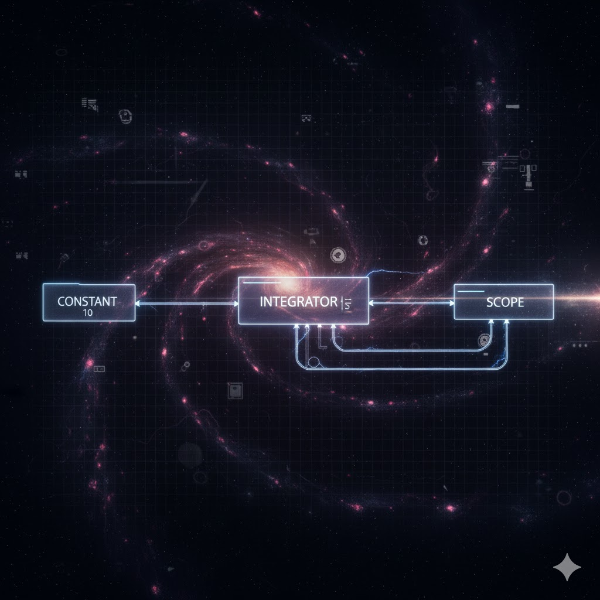

## 2.1 Simulink **Signalmodelle**

In diesem ersten Abschnitt lernen wir die folgenden Dinge:

1. **Signale** (Zeitverläufe)
2. **Blöcke** (Funktionsvorschriften)
3. **Kompositionen** (Verknüpfungen)
4. **Abtastzeiten** (Diskretisierungen)
5. **Solver** (Berechnungen)

---


### Simulink-Verhalten erstellen

Für jede atomare Komponente im System Composer kann ein  Verhalten in Simulink modelliert werden.

1.  **Rechtsklick** auf die Komponente.
2.  Wählen Sie im Kontextmenü `Create Behavior > Simulink Behavior`.
3.  System Composer erstellt ein neues, verknüpf-tes Simulink-Modell (`.slx`-Datei) und öffnet es.
4.  Die Ports der Komponente werden automatisch als In- und Out-Ports im Simulink-Modell angelegt.

---

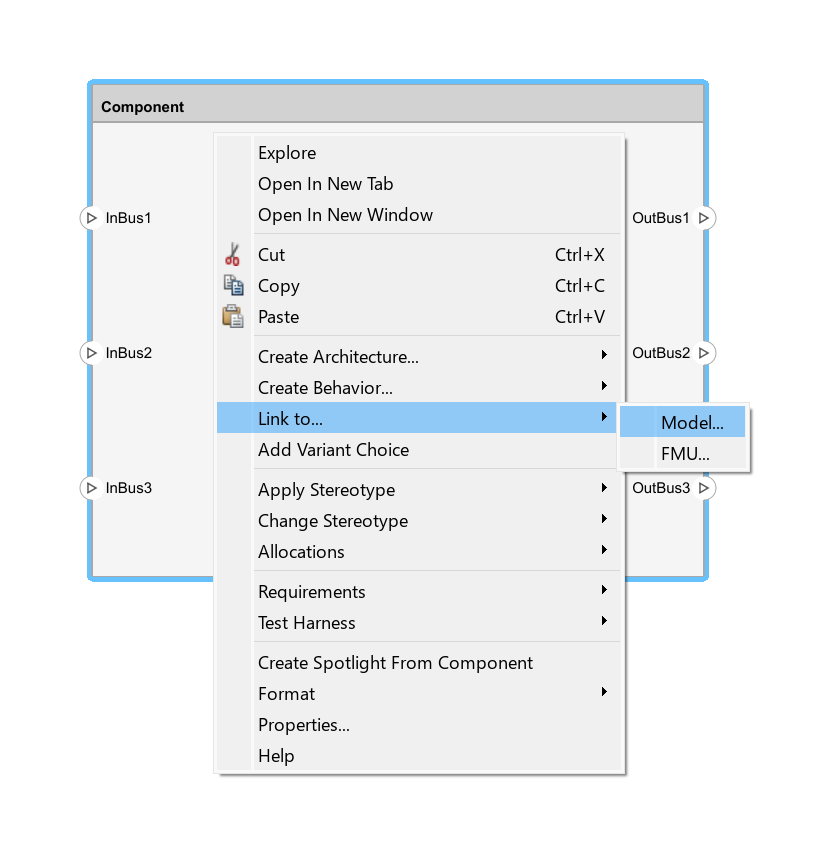

### Bestehendes Verhalten verknüpfen

Bestehende Simulink-Modelle können wiederver-wendet werden, indem sie mit einer Komponente verknüpft werden.

1.  **Rechtsklick** auf die Komponente.
2.  Wählen Sie im Kontextmenü `Link to > Model`.
3.  Navigieren Sie zur gewünschten `.slx`-Datei und wählen Sie sie aus.

Dies ist ideal für die Wiederverwendung von Bibliothekskomponenten oder  existierenden Verhaltensmodellen.

---


### Vorschau des Verhaltens

Sobald einer Komponente ein Simulink-Verhalten zugewiesen ist, zeigt System Composer eine Miniatur-Vorschau des Simulink-Modells direkt im Komponentenblock an.

-   **Visuelle Referenz:** Gibt einen schnellen Überblick über die interne Logik.
-   **Navigation:** Ein **Doppelklick** auf die Komponente öffnet das verknüpfte Simulink-Modell zur Bearbeitung des Verhaltens.

---

<div class="columns">
<div class="three">

### Was ist Simulink?

Simulink ist eine grafische Programmierumgebung für die Modellierung, Simulation und Analyse von dynamischen Systemen.

Es basiert auf dem Prinzip des **signalbasierten Designs**, bei dem Blöcke durch Linien verbunden werden, die den Signalfluss repräsentieren. Jede Linie transportiert ein Signal, z.B. einen Messwert oder einen Sollwert, von einem Block zum nächsten.

Simulink-Modelle werden über die Zeit simuliert, um das Verhalten eines Systems zu verstehen.

</div>
<div>


</div>
</div>

---

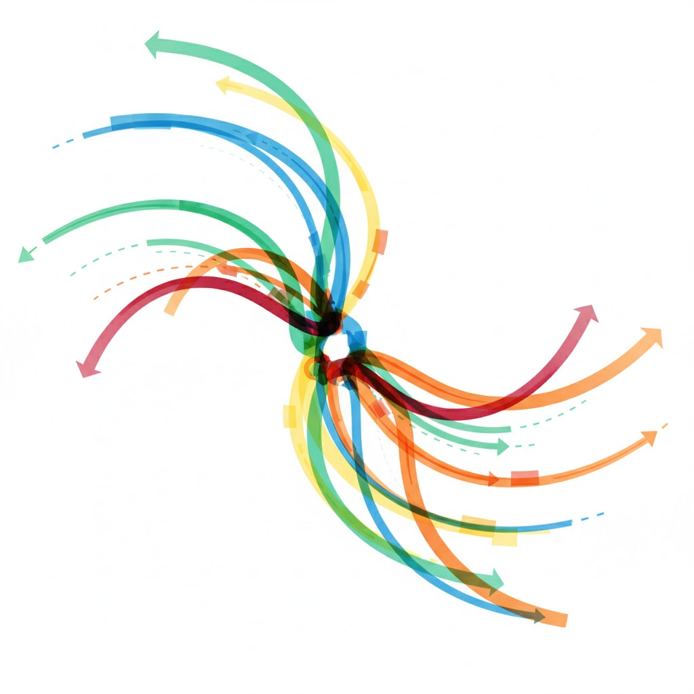

### 2.1.1. Signale

Signale und deren mathematische Eigenschaften:

- Signale als Zeitverlaufs-funktionen
- Stetigkeit und Nicht-Stetigkeit von Signalen
- Differenzierbarkeit von Signalen
- Abschnittsweise Differenzierbarkeit von Signalen
- Eingangs- und Ausgangssignale

---

<div class="columns">
<div class="two">

#### Was ist ein Signal?

Ein **Signal** ist eine Funktion, die eine physikalische Größe über die Zeit beschreibt. Es repräsentiert den zeitlichen Verlauf von Informationen in einem System.

Mathematisch wird ein Signal als Funktion $s(t)$ ausgedrückt, wobei $t$ die Zeit ist. Der Wert des Signals zu einem Zeitpunkt $t$ kann sein:

- **Skalar:** Ein einzelner Wert (z.B. Temperatur).
- **Vektor:** Mehrere Werte (z.B. 3D-Position).
- **Matrix:** Eine Tabelle von Werten (z.B. Bilddaten).

</div>
<div>

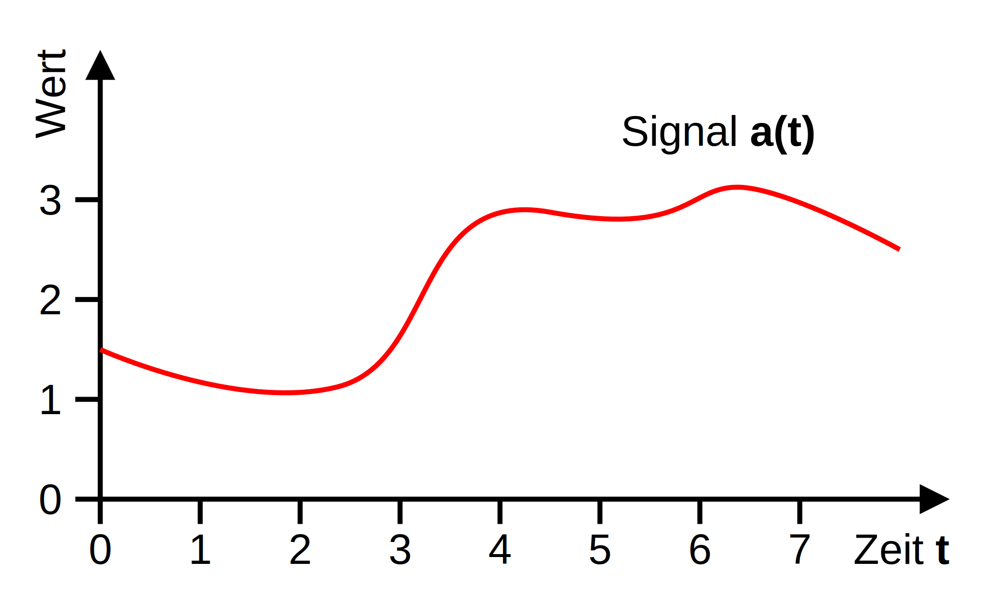

</div>
</div>

---

<div class="columns">
<div class="two">

#### **Stetigkeit** von Signalen

Eine erste wichtige mathematische Eigenschaften der Signalfunktionen ist deren **Stetigkeit**:

- **Stetige Signale:** Ein Signal ist stetig, wenn sein Verlauf keine Sprünge aufweist. Viele physika-lische Größen wie die Geschwindigkeit und Position eines Körpers werden so modelliert.

- **Nicht-stetige Signale:** Diese Signale weisen Sprungstellen auf, wie z.B. das Signal eines `Step`-Blocks. Sie sind entscheidend für die Model-lierung von Schaltvorgängen und Ereignissen.

</div>
<div>

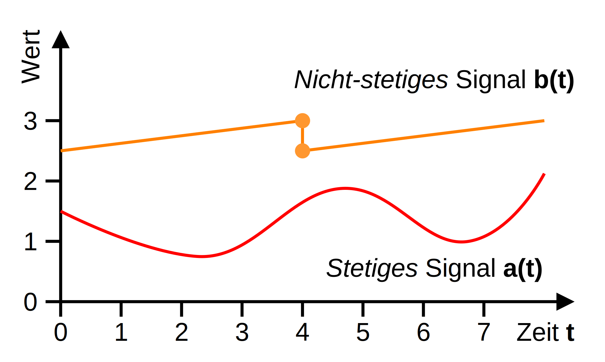

</div>
</div>

---

<div class="columns">
<div class="two">

#### **Differenzierbarkeit** von Signalen

Eine zweite wichtige mathematische Eigenschaft ist deren **Differenzierbarkeit**:

- **Differenzierbare Signale:** Sind "glatt" und stetig, d.h. sie besitzen an jedem Punkt eine eindeutige Ableitung. Dies ist ideal für die Modellierung von Systemen durch Differentialgleichungen.

- **Nicht-differenzierbare Signale:** Haben "Knick"-Stellen oder Sprünge, an denen keine eindeutige Ableitung existiert. Beispiele sind Rechtecksignale oder Signale mit abrupten Änderungen.

</div>
<div>

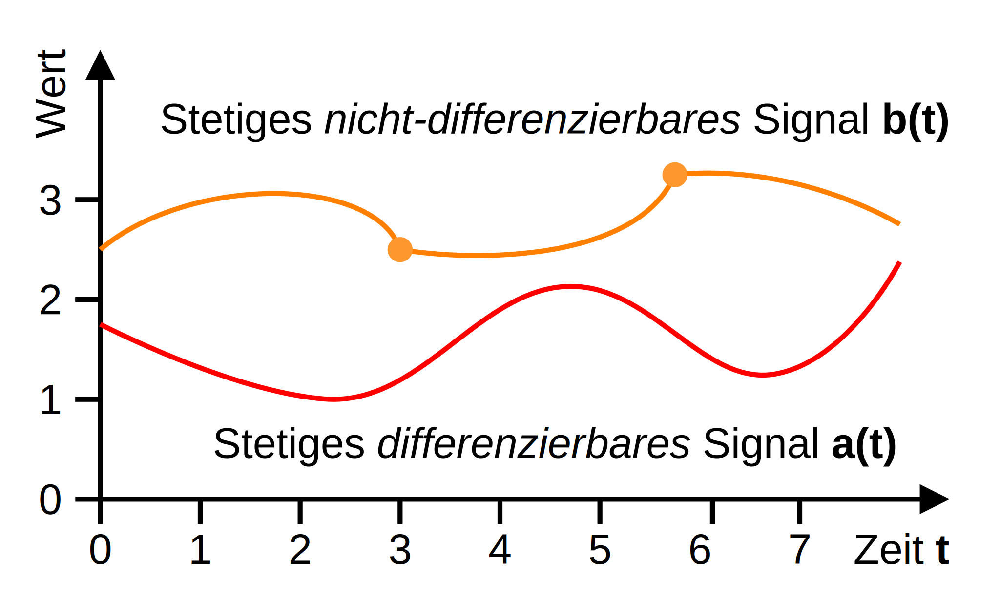

</div>
</div>

---

<div class="columns">
<div class="two">

#### ***Abschnittsweise* Differenzierbarkeit** von Signalen

- Viele technische Signale sind nicht über ihren gesamten Verlauf differenzierbar, aber in einzelnen Abschnitten ("stückweise") schon.

- An den Übergangsstellen zwischen diesen Abschnitten (z.B. bei Sprüngen oder Knicken) ist das Signal nicht differenzierbar.

- Simulink-Solver sind darauf ausgelegt, solche abschnittsweise differenzierbaren Signale zu verarbeiten, indem sie die Integrationsschritte an den Unstetigkeitsstellen anpassen.

</div>
<div>


</div>
</div>

---

<div class="columns">
<div class="two">

#### Eingangs- und Ausgangssignale

Simulink-Blöcke verarbeiten Signale. Dabei wird zwischen Ein- und Ausgangssignalen unterschieden:

- **Eingangssignale (Inputs):** Signale, die in einen Block hineinfließen. Sie sind die "Ursache" oder die Information, die der Block zur Druchführung seiner Berechnung benötigt.

- **Ausgangssignale (Outputs):** Signale, die von einem Block erzeugt und ausgegeben werden. Sie sind die "Wirkung" oder das Ergebnis der blockinternen Berechnung.

</div>
<div>


</div>
</div>

---


### 2.1.2. Blöcke

Blockarten und -funktionsweisen und die Simulink-Bibliothek:

1. Einfache zustandslose Blöcke
2. Allgemeine zustandslose Blöcke
3. Blöcke mit kontinuierlichen Zuständen
4. Blöcke mit diskreten Zuständen
5. Blöcke mit hybriden Zuständen
6. Die Simulink-Bibliothek

---

<div class="columns">
<div>

### Was ist ein Block?

Ein **Block** ist das grundlegende Element eines Simulink-Modells.

Er repräsentiert eine mathematische Funktion oder ein logisches Konstrukt, das **Eingangssignale** verarbeitet, um **Ausgangssignale** zu erzeugen.

Neben den Signalen umfassen Blöcke noch **Zustände** (eine Art *Gedächtnis*) und **Parameter** zur Konfiguration des Block-verhaltens.

</div>
<div>



</div>
</div>

---

<div class="columns">
<div class="four">

#### ***Einfache* zustandslose** Blöcke

Im einfachsten Fall ist das Ausgabesignal $y$ zum Zeitpunkt $t$ ausschließlich abhängig vom Eingabessignal $u$ zum Zeitpunkt $t$.

Allgemein ergibt sich daraus folgender **mathematischer Zusammenhang** zwischen den beiden Signalfunktionen:

$y(t) = f(u(t))$

Das Beispiel auf der rechten Seite zeigt eine konkrete Formulierung für die Funktion $f$ für einen `Gain`-Block.

</div>
<div>


</div>
</div>

---

<div class="columns">
<div class="four">


</div>
<div>


</div>
</div>

---

<div class="columns">
<div class="four">

#### ***Allgemeine* zustandslose** Blöcke

Im etwas allgemeineren Fall ist das Ausgabesignal $y$ weiterhin ausschließlich abhängig von Eingangssignal $u$.

Jedoch kann der Zusammenhang hier z.B. auch **zeitversetzt** sein, woraus sich folgende Formulierung ergibt:

$y(t) = f(t, u)$

Das Beispiel auf der rechten Seite zeigt wieder eine konkrete Formulierung der Funktion $f$ für einen `Delay`-Block.

</div>
<div>


</div>
</div>

---

<div class="columns">
<div class="four">

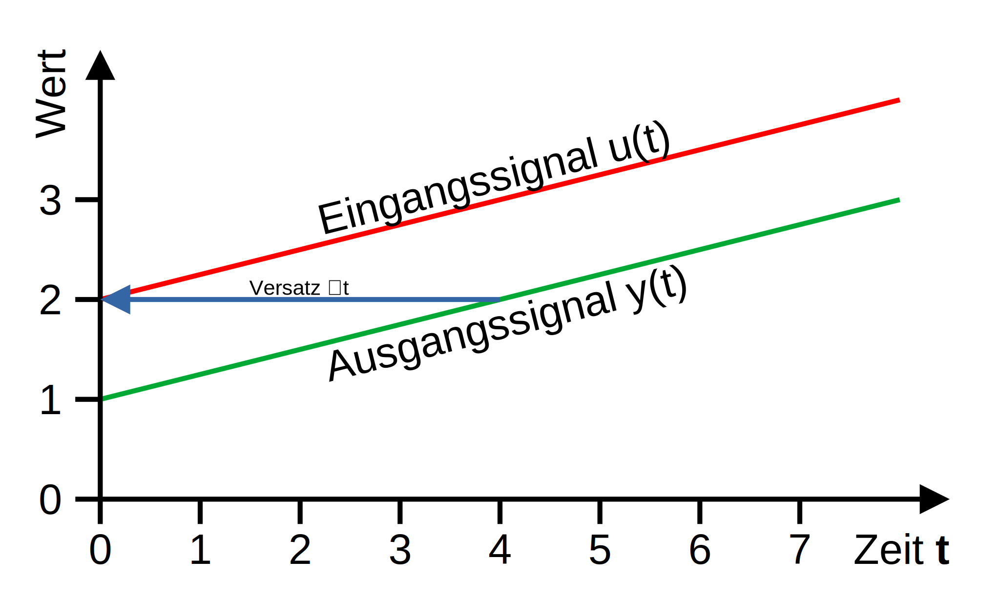

</div>
<div>


</div>
</div>

---

<div class="columns">
<div class="four">

#### Blöcke mit ***kontinuierlichen* Zuständen**

**Zustandsfunktion** beschreibt den Zustand des Blocks über die Zeit kontinuierlich und lückenlos

$x_c(t) = \int\dot{x}_c(t)dt$

**Ableitungsfunktion** beschreibt die Änderung des Zustands über die Zeit ebenfalls kontinierlich und lückenlos

$\dot{x}_c(t) = f_d(t, x_c, u)$

**Ausgabefunktion** beschreibt die Ausgabesignale des Systems unter Berücksichtigung der Eingabesignale und des Zustands

$y(t) = f_o(t, x_c, u)$

</div>
<div>



</div>
</div>

---

<div class="columns">
<div class="four">


</div>
<div>


</div>
</div>

----

<div class="columns">
<div class="four">

#### Blöcke mit ***diskreten* Zuständen**

**Zustandssequenz** repräsentiert den Zustands des Blocks ausschließlich zu bestimmten *Zeitpunkten*

$x_d = x_{d_0}, x_{d_1}, x_{d_2}, ...$ mit Zeitpunkten $t_0,t_1,t_2,...

**Aktualisierungsfunktion** beschreibt die Berechnung der jeweiligen *Folgezustände* aus den *Vorgängerzuständen*

$x_{d_{k+1}} = f_u(t_{k+1}, x_c, x_{d_k}, u)$

**Ausgabefunktion** (mit $t_k \leq t < t_{k+1}$) beschreibt die Ausgabe *abschnittsweise* zwischen den Zustanssprüngen

$y(t) = f_o(t, x_{d_k}, u)$

</div>
<div>



</div>
</div>

---

<div class="columns">
<div class="four">


</div>
<div>


</div>
</div>

---

<div class="columns">
<div class="three">

#### Blöcke mit ***hybriden* Zuständen**

**Zustandsfunktion** und **-sequenz** kombiniert in einem Tupel

$x = (x_c,x_d)$

**Aktualisierungsfunktion** für diskrete Zustandssprünge

$x_{d_{k+1}} = f_u(t_{k+1},x_c,x_{d_k},u)$

**Ableitungfunktion** (mit $t_k \leq t < t_{k+1}$) nun abschnittsweise

$\dot{x}_c(t) = f_d(t,x_c,x_{d_k},u)$

**Ausgabefunktion** (mit $t_k \leq t < t_{k+1}$) auch abschnittsweise

$y(t) = f_o(t,x_c,x_{d_k},u)$

</div>
<div>


</div>
</div>

---

<div class="columns">
<div class="three">


</div>
<div>


</div>
</div>

---


#### Die Simulink-Bibliothek

Die Simulink-Bibliothek biete eine Vielzahl von vordefinierten Blöcken:

- **Sources + Sinks:** Signale erzeugen und visualisieren
- **Math Operations:** Einfache mathematische Operationen
- **Continuous + Discrete:** Glatte und sprunghafte Funktionen
- **Ports & Subsystems:** Kapselung und Wiederverwendung

---

##### Wichtige Blöcke: **Sources**

Quellen sind der Ausgangspunkt für Signale in einem Simulink-Modell.

<div class="columns top">
<div>

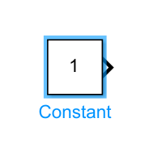

*Erzeugt einen konstanten Wert.*

</div>
<div>


*Erzeugt eine Sprungfunk-tion zu einer bestimmten Zeit.*

</div>
<div>


*Erzeugt ein sinusförmiges Signal mit einstellbarer Amplitude, Frequenz und Phase.*

</div>
</div>

---

##### Wichtige Blöcke: **Sinks**

Senken dienen zur Analyse und Anzeige von Signalen während und nach der Simulation.

<div class="columns top">
<div>


*Zeigt den numerischen Wert eines Signals am Ende der Simulation an.*

</div>
<div>

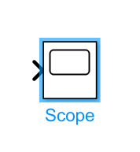

*Zeigt Signale in einem Oszilloskop-ähnlichen Diagramm an.*

</div>
<div>

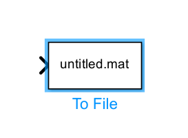

*Schreibt Signaldaten in eine MAT-Datei zur späteren Analyse.*

</div>
</div>

---

##### Wichtige Blöcke: **Math Operations**

Diese Blöcke führen grundlegende mathematische Operationen mit Signalen durch.

<div class="columns top">
<div>

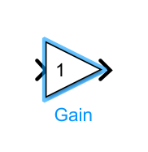

*Multipliziert ein Signal mit einem konstanten Faktor (Verstärkung).*

</div>
<div>

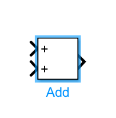

*Addiert oder subtrahiert zwei oder mehr Signale elementweise.*

</div>
<div>


*Berechnet einen Polynomwert für das Eingangssignal.*

</div>
</div>

---

##### Wichtige Blöcke: **Continuous**

Diese Blöcke sind das Herzstück für die Modellierung von physikalischen Systemen, die durch Differentialgleichungen beschrieben werden.

<div class="columns">
<div>


*Verzögert das Eingangssignal um eine bestimmte Zeit.*

</div>
<div>


*Führt eine kontinuierliche Integration des Eingangssignals durch.*

</div>
<div>


*Führt eine doppelte kontinuierliche Integration des Eingangssignals durch.*

</div>
</div>

---

##### Wichtige Blöcke: **Discrete**

Diese Blöcke modellieren diskrete Systeme oder diskrete Anteile in hybriden Systemen.

<div class="columns top">
<div>


*Speichert den Wert des Eingangssignals vom vorherigen Zeitschritt.*

</div>
<div>


*Führt eine diskrete Integration des Eingangssignals durch.*

</div>
<div>

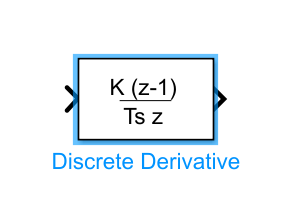

*Berechnet die diskrete Ableitung des Eingangssignals.*

</div>
</div>

---

##### Wichtige Blöcke: **Ports & Subsystems**

Diese Blöcke sind essenziell für die hierarchische Gliederung und Wiederverwendung von Modellen.

<div class="columns top">
<div>


*Definiert einen Eingang für ein Subsystem oder Modell.*

</div>
<div>


*Definiert einen Ausgang für ein Subsystem oder Modell.*

</div>
<div>

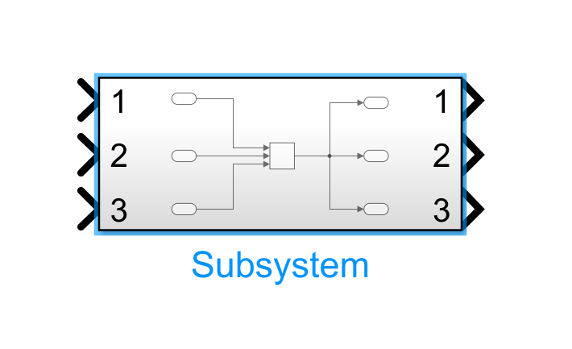

*Gruppiert Blöcke, um ein hierarchisches Subsystem zu erstellen.*

</div>
</div>

---

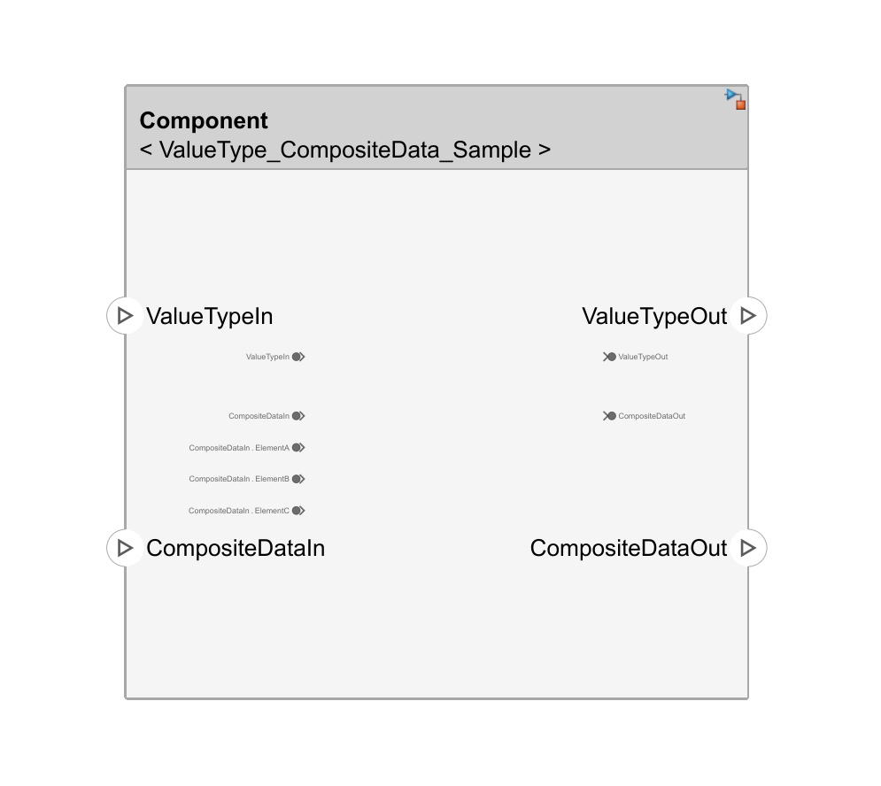

### Port-Zuordnung

Die Ports einer System Composer Komponente werden direkt auf die `Inport`- und `Outport`-Blöcke im Simulink-Modell abgebildet.

-   **Eindeutige Namen:** Der Name eines Ports im Architekturmodell muss mit dem Namen des entsprechenden Port-Blocks im Simulink-Modell übereinstimmen.
-   **Konsistente Schnittstellen:** Die auf den Ports definierten Schnittstellen (Datentyp, Dimension, etc.) müssen mit den Simulink-Signaleigenschaften kompatibel sein.

---

### Komponente vs. Subsystem

Obwohl beide zur Gliederung von Modellen dienen, haben sie unterschiedliche Zwecke.

<div class="columns top">
<div>

#### System Composer **Komponente**

-   **Was?** Ein Baustein der Systemarchitektur.
-   **Wo?** Wird in `.slx`-Dateien für Architekturmodelle verwendet.
-   **Zweck:** Definiert die Struktur und die Schnittstellen eines Systems (`Wer?`).
-   **Ports:** Formale Ports, die auf Schnittstellen basieren.

</div>
<div>

#### Simulink **Subsystem**

-   **Was?** Eine Gruppierung von Blöcken.
-   **Wo?** Wird in `.slx`-Dateien für Verhaltensmodelle verwendet.
-   **Zweck:** Kapselt eine detaillierte Funktion oder Logik innerhalb eines Verhaltensmodells (`Wie?`).
-   **Ports:** Einfache In- und Outports ohne formale Definition.

</div>
</div>

---


### 2.1.3. Kompositionen

Themen in diesem Unterabschnitt:

1. **Gewöhnliche Differential-gleichungen** (Zeitliche Veränderung des Zustands)
2. **Steife gewöhnliche Differen-tialgelichungen** (schnelle und langsame Änderungen)
3. **Differential-algebraische Gleichungen** (algeraische Randbedingungen)

---

#### Was sind Kompositionen?

Der Begriff **Komposition** beschreibt die Zusammensetzung und Verschaltung von einzelnen Simulink-Blöcken zu einem größeren Ganzen:

- Ausgangssignale von Blöcken werden weitergeleitet an Eingangssignale von anderen Blöcken
- Ein Ausgangssignal kann dabei nur an ein, oder aber mehrere Eingangssignale weitergeleitet werden
- Ein Ausgangssignal eines Blocks kann auch direkt als Eingangssignal desselben Blocks verwendet werden
- Die Weiterleitung von Signalen erfolgt in Simulink mithilfe von sogenannten *Linien* (d.h. scharze Linien)

---


#### Linie in Simulink erstellen (Ausgangssignal auf Eingangssignal weiterleiten)

In Simulink können Weiterleitungen zwischen Ausgangs- und Eingangssignalen einfach per Drag & Drop erstellt werden.

- Die Signale selbst erste als Ports auf den zugehörigen Blöcken dargestellt
- Die Drag & Drop Operation kann beim Ausgangssignal starten
- Alternativ kann die Operation auch beim Eingangssignal starten

---

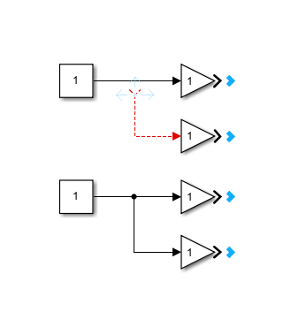

#### Ein Ausgangssignal auf **mehere** Eingangs-signale weiterleiten

Ein Ausgangssignal kann auch an mehrere Eingangssignale von unterschiedlichen Blöcken weitergeleitet werden.

- Ein Eingangssignal kann jedeoch nur mit einem Ausgangssignal verknüpft werden, sonst wäre es nicht Eindeutig
- Die Drag & Drop Operaton startet dieses mal beim Eingangsignal und endet auf einer bestehenden Linie

---

#### Mathematische Beschreibung einer Komposition

Gegeben seien zwei Blöcke $f_1,f_2$ mit den Eingängen $u_1,u_2$ und Ausgänge $y_1,y_2$:

$y_1(t) = f_1(t, u_1)$ und $y_2(t) = f_2(t, u_2)$

Durch die Komposition erwingen wir die Gleichheit von $y_1$ und $u_2$:

$u_1 = y_2 \Rightarrow f_2(t, u_2) = f_2(t, y_1)$

Grafische Darstellung der Komposition:


---

#### Komposition mit **Schleifen**

Eine Schleife entsteht, wenn wir zusätzlich Gleichheit von $y_2$ und $u_1$ erzwingen:

$u_2 = y_1 \Rightarrow f_1(t, u_1) = f_1(t, y_2)$

Grafische Darstellung der erweiterten Komposition:



Ist kein Problem, solange $f_1$ oder $f_2$ Zusstände haben oder zeitverzögert reagieren.

---

#### Komposition mit **algebraischen** Schleifen

Ein Sonderfall entsteht, wenn die Blöcke $f_1,f_2$ Signale direkt durchleiten:

$y_1(t) = f_1(u_1(t))$ und $y_2(t) = f_2(u_2(t)) \Rightarrow f_1(f_2(u_2(t))) = f_2(u_2(t))$

Grafische Drastellung dieses Sonderfalls mit direkter Signaldurchleitung:



Dieser Fall muss bei der Simulationsrechnung gesondert berücksichtigt werden.

---

#### Mathematische Eigenschaften einer Komposition

Eine Komposition ohne algebraische Schleife ergibt eine gewöhnliche Differential-gleichung, andernfalls erhält man eine differential-algebraische Gleichung:

<div class="columns">
<div>

##### **Gewöhnliche** Differentialgleichung

*Reine Zeitintegration (z.B. vertikaler Wurf eines Balls)*


</div>
<div>

##### Differential-**algebraische** Gleichung

*Zeitintegration mit Randbedingungen (z.B. Pendelbewegung)*


</div>
</div>

---

#### Gewöhnliche Differentialgleichungen (ODEs)

Viele physikalische Systeme werden durch **gewöhnliche Differentialgleichungen (ODEs)** beschrieben. Eine ODE ist eine mathematische Gleichung, die die zeitliche Änderung eines Systemzustands beschreibt.

Die allgemeine Form einer ODE erster Ordnung lautet:

$\dot{x} = f(t, x)$

- $x$ ist der **Zustandsvektor** des Systems (z.B. Position und Geschwindigkeit).
- $\dot{x}$ ist die erste Ableitung von $x$ nach der Zeit $t$.
- $f$ ist eine Funktion, die die Dynamik des Systems beschreibt.

Simulink-Solver sind darauf ausgelegt, solche Gleichungssysteme numerisch zu lösen, um den Verlauf von $x(t)$ zu finden.

---

#### Beispiel: Vertikaler Wurf eines Balls

Wir betrachten den vertikalen Wurf eines Balls in einem Gravitationsfeld ohne Berücksichtigung des Luftwiderstands. Die Bewegung des Balls kann durch eine gewöhnliche Differentialgleichung beschrieben werden.

Die Beschleunigung in y-Richtung ist:

$\ddot{y} = -g$ (wobei $g$ die Erdbeschleunigung ist)

Um dies in ein System von ODEs erster Ordnung umzuwandeln, definieren wir die Zustandsgrößen als Position ($y$) und Geschwindigkeit ($v$):

$\dot{y} = v$
$\dot{v} = -g$

---

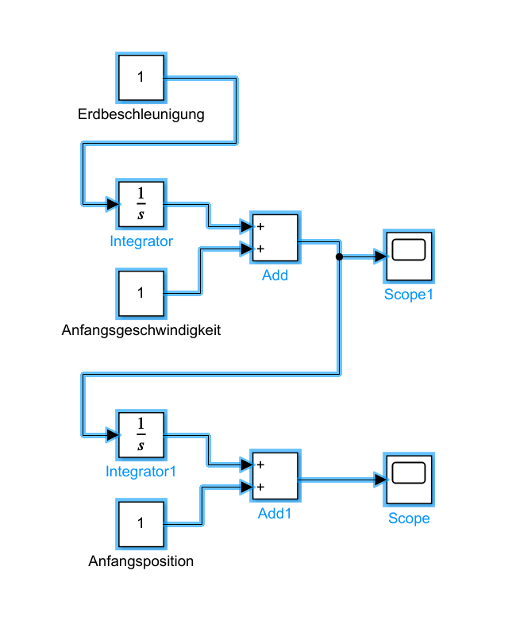

#### Umsetzung als Simulink-Modell

Im Simulink-Modell würde man:
1.  Drei `Constant`-Blöcke verwenden, um $-g$, $v_0$ und $y_0$ zu definieren.
2.  Zwei `Integrator`-Blöcke verwenden, um $-g$ zu $v$ und $v$ zu $y$ zu integrieren.
3.  Zwei `Scope`-Blöcke verwenden, um $v$ und $y$ zu visualisieren.

---

#### Steifigkeit von ODEs ("Stiff" Systems)

Ein Differentialgleichungssystem wird als **steif** bezeichnet, wenn es Zeitkonstanten enthält, die sich über mehrere Größenordnungen erstrecken.

Das bedeutet, das System hat Komponenten, die sich **sehr schnell** ändern, und andere, die sich **sehr langsam** ändern.

**Problem:** Explizite (nicht-steife) Solver wie `ode45` müssen extrem kleine Zeitschritte verwenden, um die schnellen Änderungen stabil zu erfassen. Dies macht die Simulation ineffizient, besonders wenn die schnelle Dynamik bereits abgeklungen ist.

**Lösung:** Implizite (steife) Solver wie `ode15s` sind für solche Probleme konzipiert. Sie sind pro Schritt rechenintensiver, können aber deutlich größere Zeitschritte stabil bewältigen, was die Gesamtsimulationszeit drastisch reduziert.

---
### Beispiel : RC-Schaltung mit unterschiedlich schnellen Gliedern

Ein klassisches Beispiel für ein steifes System ist eine elektrische Schaltung, die Komponenten mit sehr unterschiedlichen Zeitkonstanten enthält. Betrachten wir zwei RC-Glieder in Reihe:

- **Schnelles RC-Glied:** Hat eine sehr kleine Zeitkonstante ($\tau_1 = R_1 C_1$). Es reagiert sehr schnell auf Änderungen der Eingangsspannung.
- **Langsames RC-Glied:** Hat eine große Zeitkonstante ($\tau_2 = R_2 C_2$). Es reagiert langsam auf Änderungen.

Wenn $\tau_1 \ll \tau_2$ ist, ist das System steif. Ein expliziter Solver müsste die gesamte Simulation über sehr kleine Zeitschritte verwenden, um die schnelle Dynamik des ersten RC-Glieds korrekt zu erfassen, selbst wenn diese Dynamik längst abgeklungen ist.

---

<div class="columns">
<div class="two">

#### Mathematisches Modell der RC-Schaltung

**Differentialgleichungen:**

$\dot{V}_1 = \frac{1}{R_1 C_1}(V_{in} - V_1)$
$\dot{V}_2 = \frac{1}{R_2 C_2}(V_1 - V_2)$

**Verhalten:**
Bei einer Sprungfunktion als $V_{in}$ steigt $V_1$ sehr schnell an und erreicht fast sofort den Endwert. $V_2$ folgt $V_1$ jedoch viel langsamer.

Ein steifer Solver kann die schnelle Anfangsphase mit kleinen Schritten und die langsame Folgephase mit großen Schritten effizient simulieren.

</div>
<div>

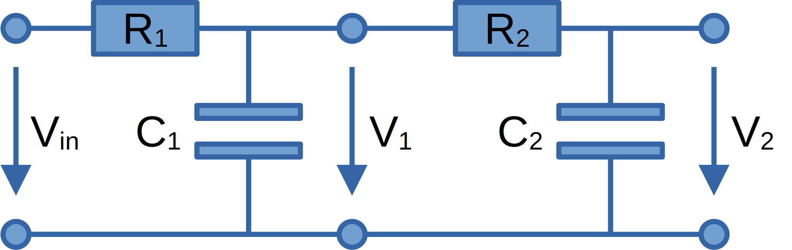

</div>
</div>

---

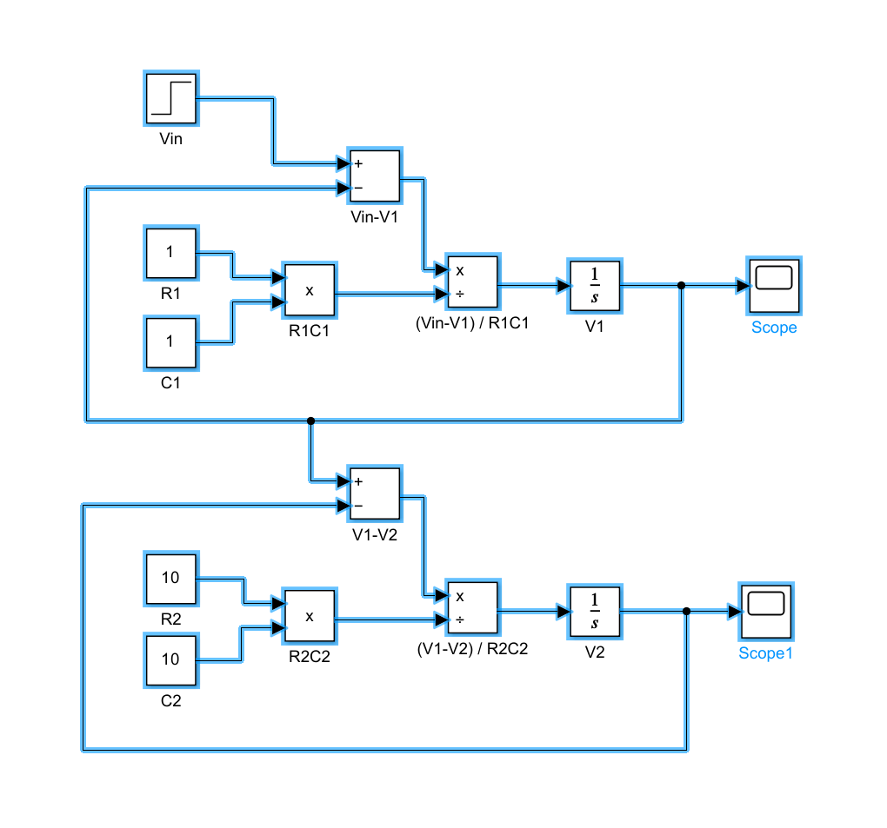

#### Umsetzung des Modells in Simulink

1.  **Sources:** Ein `Step`-Block liefert die Eingangsspannung $V_{in}$, `Constant`-Blöcke definieren die  Wiederstände $(R_1, R_2)$ und Kapazitäten $(C_1, C_2)$.
3.  **Math Operations:** `Subtract`-, `Product`- und `Divide`-Blöcke werden verwendet, um die Terme $\frac{1}{R_1 C_1}(V_{in} - V_1)$ und $\frac{1}{R_2 C_2}(V_1 - V_2)$ zu bilden.
2.  **Continuous:** Für jede Spannung ($V_1, V_2$) wird ein `Integrator`-Block verwendet.

---

#### Differential-Algebraische Gleichungen (DAEs)

**Differential-Algebraische Gleichungen (DAEs)** sind Systeme von Gleichungen, die sowohl Differentialgleichungen als auch algebraische Gleichungen enthalten. Im Gegensatz zu gewöhnlichen Differentialgleichungen (ODEs) können DAEs nicht immer in eine explizite Form $\dot{x} = f(t, x)$ umgewandelt werden.

Die allgemeine Form einer DAE ist:
$F(t, x, \dot{x}) = 0$

- $x$ ist der Vektor der abhängigen Variablen.
- $\dot{x}$ ist der Vektor der Ableitungen.
- $F$ ist eine Funktion, die sowohl Differential- als auch algebraische Beziehungen ausdrückt.

---

#### Beispiel: Integration zweier Variablen mit Randbedingung

Betrachten wir ein einfaches System, das sowohl eine Differentialgleichung als auch eine algebraische Gleichung enthält:

**Gleichungssystem:**
$\dot{x} = -x + y$
$0 = x - y^2$

Hier ist $x$ eine Differentialvariable, deren Ableitung $\dot{x}$ in der ersten Gleichung vorkommt. $y$ ist eine algebraische Variable, die durch die zweite Gleichung an $x$ gekoppelt ist.

Dieses System kann nicht direkt in die Form $\dot{z} = f(t, z)$ gebracht werden, ohne die algebraische Gleichung explizit nach $y$ aufzulösen (was hier $y = \pm\sqrt{x}$ wäre).

---


#### Umsetzung des einfachen DAE in Simulink

1. **Differentialgleichung:** Ein `Integrator`-Block wird für $x$ verwendet. Sein Eingang ist $-x + y$. Dies erfordert einen `Difference`-Block mit Eingängen $y$ und $x$.
2. **Algebraische Gleichung:** Man kann einen `Algebraic Constraint`-Block verwenden, der die Gleichung $x - y^2 = 0$ löst, um $y$ zu finden. Der Eingang des Blocks ist $x-y^2$ und der Ausgang ist $y$.

---

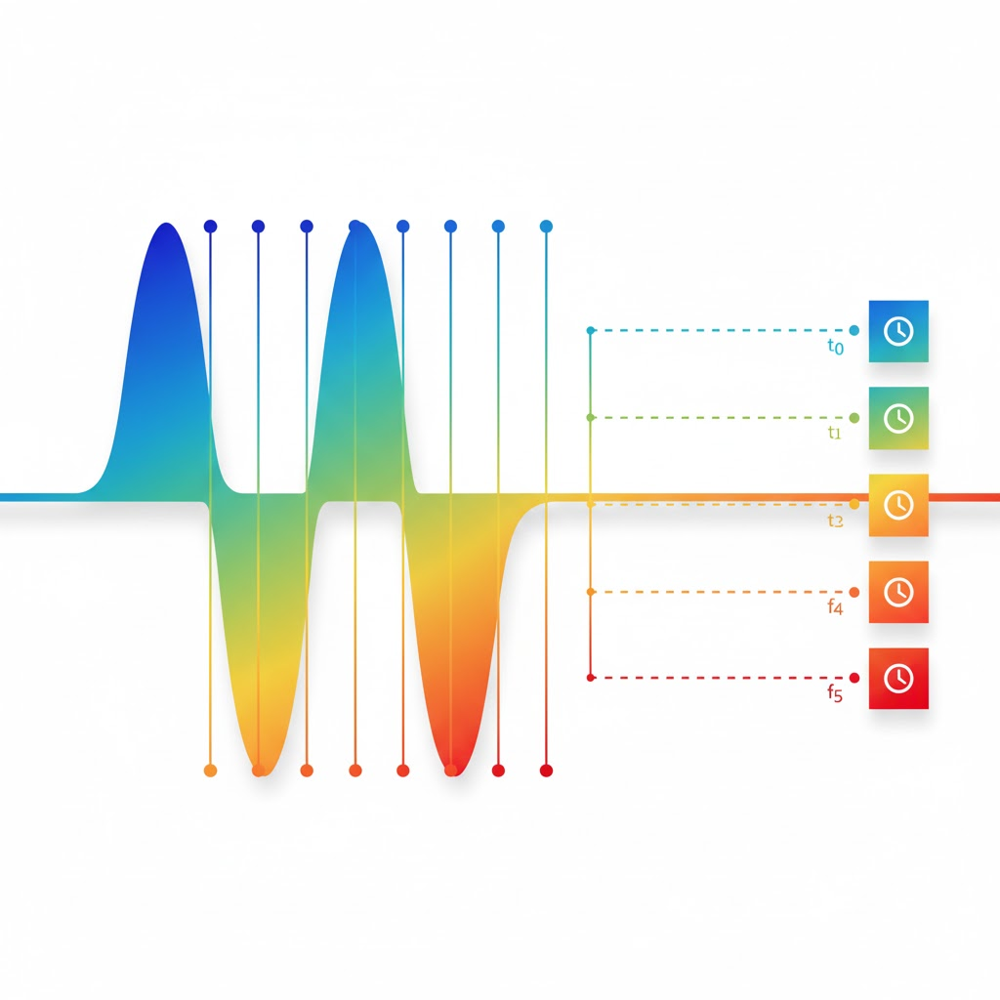

### 2.1.4. Abtastzeiten

In diesem Unterabschnitt betrachten wir die folgenden Arten von Abtast-zeiten für Simulink-Blöcke:

1. **Konstante Abtastzeiten**
2. **Variable Abtastzeiten**
3. **Diskrete Abtastzeiten**
4. **Mehrratige Abtastzeiten**
5. **Kontinuierliche Abtastzeiten**
6. **Vererbte Abtastzeiten**

---

### Was sind Abtastzeiten?

Die **Abtastzeit** (`Sample Time`) eines Blocks legt fest, zu welchen Zeitpunkten er ausge-führt wird, d.h. wann seine Ausgänge und sein interner Zustand aktualisiert werden.

- **Effizienz:** Eine korrekte Konfiguration der Abtastzeiten ist entscheidend für die Geschwindigkeit der Simulation.
- **Genauigkeit**: Die Konfiguration hat außerdem eine Auswirkung auf die Genaugkeit der Simualtionsergebnisse.
- **Definition:** Die Abtastzeit wird typischerweise als zweidimensionaler Vektor `[Periode, Offset]` definiert.
- **Typen**: Konstant, variabel, diskret, mehrratig, kontinuierlich, kontinuierlich mit festem kleinen Zeitschritt, und vererbt

---

<div class="columns">
<div class="three">

#### **Konstante** Abtastzeiten `[inf, 0]`

Blöcke mit konstanter Abtastzeit werden nur **einmal zu Beginn** der Simulation (`t=0`) ausgewertet.

- Ihr Ausgangswert bleibt während der gesamten Simulationsdauer unverändert.
- Dies ist nützlich für Parameter oder Sollwerte, die sich nicht ändern.

**Beispiel:** Ein `Constant`-Block, der den Wert der Erdbeschleunigung (`9.81`) für eine Simulation bereitstellt.

</div>
<div class="two">

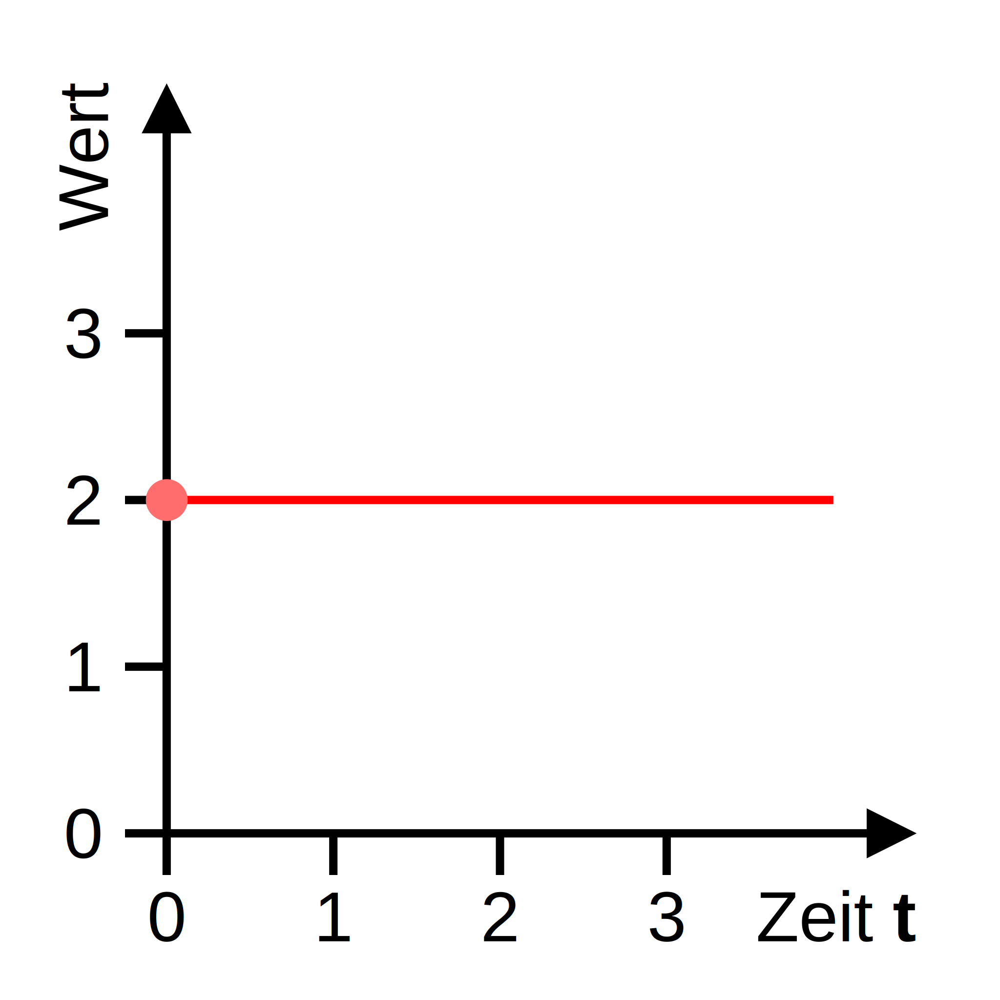

</div>
</div>

---

<div class="columns">
<div class="three">

#### **Variable** Abtastzeiten `[-2, Tvo]`

Blöcke mit **variabler Abtastzeiten** werden zu beliebigen diskreten Zeiten abgetastet. Simulink unterstützt zwei Mechanismen, um variable Abtastzeiten zu realisieren:

- **Manuelle Bestimmung** der Abtastzeiten mittels `NextTimeHit`-Eigenschaft (z.B. `Pulse Generator` Block).
- **Atomatische Bestimmung** der Abtastzeiten mittels `ZeroCrossing`-Vektor (z.B. `Crossing Hit` Block).

</div>
<div class="two">


</div>
</div>

---

<div class="columns">
<div class="three">

#### **Nulldurchgänge** (Zero Crossings)

Die **automatische Bestimmung** mittels Nulldurchgängen wird verwendet, um den exakten Zeitpunkt von Ereignissen zu bestimmen (z.B. Kollision zweier Körper).

- Die exakte Bestimmung des Zeitpunktes ist oft wichtig für die Genauigkeit der Simulationsrechnung
- Blöcke können kontinuierliche Signale für die automatische Bestimmung von Nulldurchgängen übergeben

</div>
<div class="two">


</div>
</div>

---

<div class="columns">
<div class="three">

#### **Diskrete** Abtastzeiten `[Ts, To]`

Der Block wird in regelmäßigen Intervallen ausgeführt (z.B. digitale Signalverarbeitung).

- **`Ts` (Sample Time):** Der zeitliche Abstand zwischen zwei Ausführungen.
- **`To` (Offset):** Eine anfängliche Zeitverzögerung.
- Die Ausführungszeitpunkte sind also `To, To + Ts, To + 2*Ts, ...`.

**Beispiel:** Ein `Discrete-Time Integrator`-Block mit `[0.1, 0]` wird alle 0,1 Sekunden ausgeführt.

</div>
<div class="two">

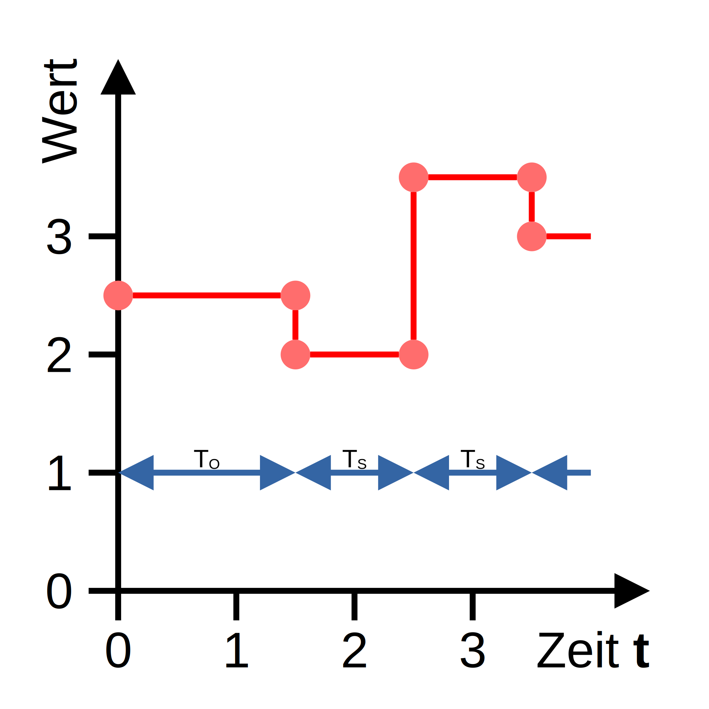

</div>
</div>

---

<div class="columns">
<div class="three">

#### **Mehrratige** Abtastzeiten

Ein Modell ist mehrratig, wenn es Blöcke mit **unterschiedlichen Abtastzeiten** enthält.

-  Erfordert Synchronisation zwischen den verschiedenen "Zeitdomänen", um Daten-verlust oder Inkonsistenzen zu vermeiden.

**Beispiel:** Ein *schneller* digitaler Regler (`Ts = 0.01s`) interagiert mit einem *langsameren* physikalischen Streckenmodell (`Ts = 0.1s`). Zwischen den beiden Teilen ist ein `Rate Transition`-Block notwendig.

</div>
<div class="two">

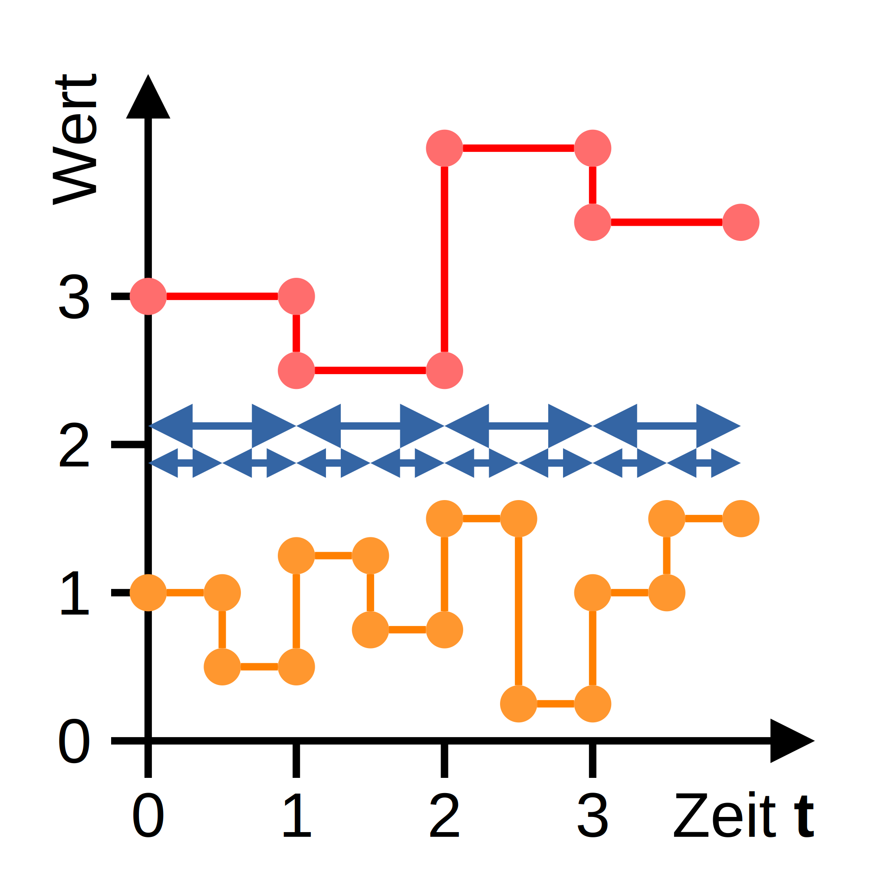

</div>
</div>

---

#### **Kontinuierliche** Abtastzeiten `[0, 0]`

Blöcke mit dieser Abtastzeit werden in jedem Simulationszeitschritt ausgeführt.

- **Anwendung:** Wird für Blöcke verwendet, die kontinuierliche Zustände haben (z.B. `Integrator`) und deren Verhalten durch Differentialgleichungen beschrieben wird.
- **Festlegung:** Erfordert einen Solver für kontinuierliche Systeme (z.B. `ode45`), der die Schrittweite dynamisch anpasst, um die Genauigkeit zu gewährleisten.
- **Aufteilung:** Solver arbeiten mit *großen* Zeitschritten zur Signalaufzeichnung sowie mit *kleinen* Zeitschritten, um die Genauigkeit zu verbessern.

**Beispiel:** Ein `Integrator`-Block, der die *Geschwindigkeit* eines Fahrzeugs integriert, um dessen *Position* zu berechnen. Da die Bewegung ein kontinuierlicher physikalischer Prozess ist, muss der Block kontinuierlich arbeiten, um eine Positionskurve zu erhalten.

---

#### Kontinuierliche Abtastzeiten **mit festem kleinen Zeitschritt** `[0, 1]`

Diese spezielle Einstellung signalisiert, dass der Block zwar kontinuierlich ist, aber der Solver einen festen, sehr kleinen Zeitschritt verwenden soll, um das Verhalten anzunähern.

- Wird seltener verwendet und ist für spezielle Anwendungsfälle gedacht, bei denen eine Annäherung an ein kontinuierliches Verhalten mit fester Schrittweite erforderlich ist.

**Beispiel:** In einem Modell, das für die *Echtzeit-Hardware-in-the-Loop (HIL)-Simulation* vorgesehen ist, muss der Solver mit einer festen Schrittweite laufen, die der Abtastrate der Hardware entspricht. Ein kontinuierlicher Block in diesem Modell könnte `[0, 1]` verwenden, um anzuzeigen, dass er sich an diese feste Schrittweite anpasst.

---

#### **Vererbte** Abtastzeiten `[-1, 0]`

Dies ist die Standardeinstellung für viele Blöcke. Der Block **erbt** seine Abtastzeit von dem Block, der mit seinem Eingang verbunden ist.

- **Vorteil:** Sorgt für Konsistenz der Abtastzeiten entlang des Signalflusses und reduziert den Konfigurationsaufwand.
- **Konsistenz:** Ausgangssignale werden mit exakt derselben Abtastzeit neu berechnet wie Eingangssignale eines Blocks.

**Beispiel:** Ein `Gain`-Block, der mit dem Ausgang eines `Sine Wave`-Blocks verbunden ist, der mit einer Abtastzeit von 0.01s konfiguriert ist. Der `Gain`-Block erbt automatisch die Abtastzeit von 0.01s und wird somit mit der gleichen Frequenz wie die Sinuswelle aktualisiert.

---


### Abtastzeit **konfigurieren**

Die Abtastzeit eines Blocks kann in dessen **Blockparametern** eingestellt werden.

- **Doppelklick** auf einen Block öffnet den Parameterdialog.
- Unter dem Reiter `Main` (oder `Block Properties`) findet sich oft das Feld `Sample time`.
- Hier kann der gewünschte Wert (z.B. `0.1` für eine diskrete Abtastzeit von 100ms oder `-1` für vererbt) eingetragen werden.

---

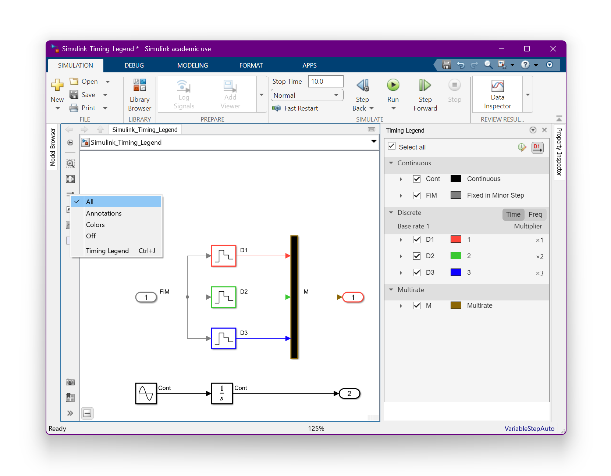

### Abtastzeiten **visualisieren**

Simulink kann die verschiedenen Abtastzeiten im Modell farblich hervorheben, um die Analyse zu erleichtern.

- Gehen Sie im Menü auf `Debug > Information Overlays > Sample Time > Colors`.
- Jeder Abtastzeit wird eine eindeutige Farbe zugewiesen.
- Die **Sample Time Legend** (erreichbar über dasselbe Menü) zeigt die Zuordnung von Farben zu Abtastzeiten an.

---


### 2.1.5. Solver

In diesem Abschnitt betrachten wir die folgenden Themen:

- **Simulationsphasen** (die große Klammer um die jeweilige Simulationsrechnung)
- **Solver-Arten** (die Logik zur Bestimmung der Zeitschritte und Berechnung von Werten)
- **Nulldurchgangserkennung** (eine wichtige Methode für eine hohe Genauigkeit)

---

#### Was sind Solver?

Solver sind für die Berechnung der Zustände und Signalverläufe während eines Simulationsdurchlaufs zuständig.

- Dabei muss entschieden werden, zu welchen Zeitpunkten die Ableitungen, Zustände und Signale des Modells berechnet werden
- Die Zeitpunkte hängen grundsätzlich von den konfigurierten Abtastzeiten der Blöcke und den Solver-Einstellungen ab.
- Eine wichtige Aufgabe der Solver ist die Bestimmung der Abtastzeiten von kontinuierlichen Singalverläufen.
- Für diskrete Signalverläufe ist die Bestimmung der Abtastzeiten einfacher, da sie exakt vorgegebn sind.

---

<div class="columns">
<div class="three">

#### Simulationsphasen

Eine Simulink-Simulation durchläuft typischerweise zwei Hauptphasen:

1.  **Initialisierungsphase:** Simulink wertet Blockparameter aus, berechnet Anfangszustände und bestimmt die Abtastzeiten.
2.  **Simulationsschleife (Ausführungsphase):** Der Solver bestimmt die größe der Zeitschritte und berechnet die Ausgänge, Zustände und Ableitungen des Modells. Diese Phase wiederholt sich, bis die Simulationszeit endet oder ein Abbruchkriterium erfüllt ist.

</div>
<div>


</div>
</div>

---

<div class="columns">
<div>

#### Solver-Auswahl

Die Grafik auf der rechten Seite zeigt den Entscheidungsbaum für die Auswahl:

- Zunächst ist zu klären, ob mit einem **festen Schritt** (*diskret* oder *Echtzeit-anforderung*) oder mit **variablen Schritten** gerechnet werden soll.
- Danach hängt die Entscheidung noch davon ab, ob das Modell **kontinuierliche Zustände** beinhaltet oder nicht.

</div>
<div>


</div>
</div>

---

<div class="columns">
<div>

#### **Automatische** Solver-Auswahl

Simulink bietet auch die Möglichkeit, den Solver automatisch auszuwählen:

- Die Auswahl hängt zudem noch davon ab, ob das Modell eine **gewöhnliche Differentialgleichung** oder eine **differential-algebraische Gleichung** ist.
- Zudem hängt die Auswahl bei ge-wöhnlichen Differentialgleichungen von deren **Steifigkeit** ab.

</div>
<div>


</div>
</div>

---

#### Fixed-Step Discrete Solver

**Fixed-Step Discrete Solver** führen die Simulation in festen, vordefinierten Zeitschritten durch. Die Ausführungspunkte sind gleichmäßig über die Simulationszeit verteilt.

**Anwendungsbereiche:**
-   **Echtzeitsysteme:** Da die Ausführungszeitpunkte fest sind, eignen sie sich hervorragend für die Codegenerierung und den Einsatz in Echtzeitumgebungen (z.B. Hardware-in-the-Loop-Simulationen).
-   **Diskrete Systeme:** Für Modelle, die ausschließlich diskrete Blöcke enthalten.

**Vorteile:**
-   Vorhersehbares Verhalten und Ausführungszeit.
-   Einfache Implementierung in eingebetteten Systemen.

---

#### Fixed-Step Discrete Solver **Funktionsweise**

Zu jedem festen Zeitschritt (`step_size`) werden die Ausgänge der diskreten Blöcke berechnet und deren interne Zustände aktualisiert. Die Berechnung basiert auf den aktuellen Eingängen und den Zuständen des vorherigen Zeitschritts.

**Pseudocode:**
```
// Initialisiere die Zeit
t = t_start
while t < t_end:
  // Berechne Ausgänge basierend auf aktuellen Eingängen und Zuständen
  outputs = calculate_outputs(t, states, inputs)
  // Aktualisiere Zustände für den nächsten Zeitschritt
  states = update_states(t, states, inputs, step_size)
  // Aktualliesere die Zeit
  t = t + step_size
```


---

#### Variable-Step Discrete Solver

**Variable-Step Discrete Solver** passen ihre Schrittweite an die Ereignisse im Modell an. Sie springen von einem Ereignis zum nächsten, anstatt feste Zeitschritte zu verwenden.

**Anwendungsbereiche:**
-   **Ereignisgesteuerte Systeme:** Effizient für Modelle mit unregelmäßigen diskreten Ereignissen oder wenn die genaue Zeitsteuerung von Ereignissen wichtig ist.
-   **Hybride Systeme:** Kann in Kombination mit kontinuierlichen Solvern verwendet werden, um diskrete Anteile in hybriden Systemen zu lösen.

**Vorteile:**
-   Effizienter für Modelle mit wenigen, aber unregelmäßigen diskreten Ereignissen.
-   Genauere Erfassung von Ereigniszeitpunkten.

---

#### Variable-Step Discrete Solver **Funktionsweise**

Der Solver identifiziert den Zeitpunkt des nächsten diskreten Ereignisses (z.B. die nächste Abtastzeit eines Blocks, ein Trigger-Ereignis) und springt direkt zu diesem Zeitpunkt. Die Zustände werden nur an diesen Ereignispunkten aktualisiert.

**Pseudocode:**
```
t = t_start
while t < t_end:
  // Finde den Zeitpunkt des nächsten diskreten Ereignisses
  next_event_time = find_next_event(t, states, inputs)
  step_size = next_event_time - t
  // Berechne Ausgänge und aktualisiere Zustände am Ereigniszeitpunkt
  outputs = calculate_outputs(t, states, inputs)
  states = update_states(t, states, inputs, step_size)
  t = next_event_time
```

---

#### Fixed-Step Continuous Solver

**Fixed-Step Continuous Solver** verwenden eine konstante Schrittweite, um die kontinuierlichen Zustände eines Systems zu integrieren.

**Anwendungsbereiche:**
-   **Echtzeitsysteme:** Ideal für die Codegenerierung und den Einsatz in Echtzeitumgebungen, da die Rechenlast pro Zeitschritt konstant ist.
-   **Systeme mit bekannter Dynamik:** Wenn die Dynamik des Systems gut verstanden wird und eine feste Schrittweite ausreicht, um die Genauigkeit zu gewährleisten.

**Vorteile:**
-   Vorhersehbares Verhalten und Rechenzeit.
-   Einfache Implementierung.

---

#### Fixed-Step Continuous Solver **Funktionsweise**

Zu jedem festen Zeitschritt (`step_size`) berechnet der Solver die Ableitungen der kontinuierlichen Zustände. Anschließend wird eine numerische Integrationsmethode (z.B. Euler, Runge-Kutta 4. Ordnung) angewendet, um die Zustände am Ende des Zeitschritts zu schätzen.

**Pseudocode (allgemein):**
```
t = t_start
while t < t_end:
  // Berechne Ableitungen der Zustände
  derivatives = calculate_derivatives(t, states, inputs)
  // Integriere Zustände zum nächsten Zeitschritt
  states = integrate(states, derivatives, step_size)
  t = t + step_size
```

---

#### Variable-Step Continuous Solver

**Variable-Step Continuous Solver** passen ihre Schrittweite dynamisch während der Simulation an, um eine vorgegebene Fehlertoleranz einzuhalten.

**Anwendungsbereiche:**
-   **Allgemeine Simulationen:** Die Standardwahl für die meisten kontinuierlichen Systeme, da sie eine gute Balance zwischen Genauigkeit und Rechenzeit bieten.
-   **Systeme mit variabler Dynamik:** Zum Beispiel anwendbar für Systeme mit schnellen Einschwingvorgänge gefolgt von langsamen Driftphasen.

**Vorteile:**
-   Optimale Balance zwischen Genauigkeit und Simulationsgeschwindigkeit.
-   Effiziente Handhabung von Systemen mit unterschiedlichen Zeitkonstanten.

---

#### Variable-Step Continuous Solver **Funktionsweise**

Der Solver schätzt bei jedem Zeitschritt den lokalen Fehler der Integration. Ist der Fehler zu groß, wird die Schrittweite reduziert und der Schritt wiederholt. Ist der Fehler klein, wird die Schrittweite für den nächsten Schritt erhöht, um die Effizienz zu steigern.

**Pseudocode (allgemein):**
```
t = t_start
while t < t_end:
  // Bestimme optimale Schrittweite basierend auf Fehlertoleranz
  step_size = determine_optimal_step_size(t, states, inputs, error_tolerance)
  // Berechne Ableitungen der Zustände
  derivatives = calculate_derivatives(t, states, inputs)
  // Integriere Zustände zum nächsten Zeitschritt
  states = integrate(states, derivatives, step_size)
  t = t + step_size
```

---

#### **Algebraische Schleifen** in Solvern

**Beschreibung:**
Eine **algebraische Schleife** entsteht, wenn der Ausgang eines Blocks direkt oder indirekt als einer seiner Eingänge verwendet wird, ohne dass ein Zustand oder eine Zeitverzögerung dazwischenliegt. Dies führt zu einer zirkulären Abhängigkeit, die nicht durch einfache Vorwärtsberechnung gelöst werden kann.

**Problemstellung:**
Simulink kann die Ausgänge der Blöcke in einer algebraischen Schleife nicht direkt berechnen, da die Werte voneinander abhängen. Dies erfordert eine spezielle Behandlung durch den Solver.

---

#### Lösen von **algebraischen Schleifen** in Simulink

**Verfahren:**
1.  **Erkennung:** Simulink erkennt algebraische Schleifen während der Kompilierung des Modells.
2.  **Iterative Lösung:** Für kontinuierliche algebraische Schleifen verwendet Simulink bei jedem Zeitschritt einen iterativen numerischen Ansatz (z.B. Newton-Raphson-Verfahren), um die Werte zu finden, die die algebraische Gleichung erfüllen.

**Auswirkungen:**
-   Die iterative Lösung von algebraischen Schleifen kann die Simulations-geschwindigkeit erheblich reduzieren.
-   Die Genauigkeit der Lösung hängt von der Konvergenz des Verfahrens ab.

---

#### Newton-Raphson-Verfahren

Das **Newton-Raphson-Verfahren** ist ein effizientes iteratives Verfahren zur numerischen Bestimmung von Nullstellen einer reellwertigen Funktion $f(x)$. In Simulink wird es häufig zur Lösung von algebraischen Schleifen eingesetzt, indem es iterativ die Werte findet, die die algebraischen Gleichungen erfüllen.

**Mathematische Formulierung:**
Die Iterationsvorschrift lautet:
$x_{n+1} = x_n - \frac{f(x_n)}{f'(x_n)}$

- $x_n$: Die aktuelle Näherung der Nullstelle.
- $f(x_n)$: Der Funktionswert an der Stelle $x_n$.
- $f'(x_n)$: Die erste Ableitung der Funktion an der Stelle $x_n$.

---

<div class="columns">
<div>

#### **Funktionsweise** des Newton-Raphson-Verfahrens

- Man beginnt mit einem Startwert $x_0$.
- In jedem Schritt wird eine Tangente an die Funktion $f(x)$ im Punkt $(x_n, f(x_n))$ gelegt.
- Der Schnittpunkt dieser Tangente mit der x-Achse liefert die nächste, verbesserte Näherung $x_{n+1}$.
- Iteration endet, wenn Fehlerschwelle unterschritten wurde.

</div>
<div>


</div>
</div>

---

#### **Pseudocode** für das Newton-Raphson-Verfahren

Und so könnte eine Implementierung des Verfahren in MATLAB (oder eine anderen Programmiersprache) aussehen:

```
function newton_raphson(f, f_prime, x0, tolerance, max_iterations):
  x = x0
  for i from 1 to max_iterations:
    fx = f(x)
    if abs(fx) < tolerance:
      return x
    f_prime_x = f_prime(x)
    if f_prime_x == 0:
      error "Division by zero"
    x = x - fx / f_prime_x
  return x // Konvergenz nicht erreicht
```


---

#### **Zero Crossings** in Solvern

**Beschreibung:**
Ein **Zero Crossing** (Nulldurchgang) ist ein Ereignis, bei dem ein kontinuierliches Signal einen Schwellenwert (oft Null) überschreitet. Solche Ereignisse können diskrete Änderungen im Systemverhalten auslösen, z.B. das Umschalten eines Schalters, das Erreichen einer Begrenzung oder das Auslösen eines Triggers.

**Problemstellung:**
Kontinuierliche Solver könnten solche Ereignisse überspringen, wenn ihre Schrittweite zu groß ist, was zu ungenauen Ergebnissen oder verpassten Zustandsänderungen führen würde.

---

#### *Verfahren* zur Bestimmung von Nulldurchgängen in Simulink

1. **Erkennung:** Simulink-Solver (insbesondere *Variable-Step Continuous Solver*) verfügen über integrierte Mechanismen zur Erkennung von Zero Crossings.
2. **Ereignis-Lokalisierung:** Wenn ein potenzieller Nulldurchgang erkannt wird, reduziert der Solver seine Schrittweite, um den genauen Zeitpunkt des Ereignisses präzise zu lokalisieren.
3. **Zustandsanpassung:** Am exakten Zeitpunkt des Nulldurchgangs wird die Integration angehalten, die diskreten Zustände des Modells werden aktualisiert (falls das Ereignis eine diskrete Änderung auslöst), und die Integration wird von diesem neuen Punkt aus fortgesetzt.

---

<div class="columns">
<div class="four">

#### **Funktionsweise** der Lokalisierung von Nulldurchgängen

1.  **Intervall-Identifikation:** Der Solver identifiziert ein Zeitintervall $[t_a, t_b]$, in dem ein Signal sein Vorzeichen wechselt (d.h., $sign(f(t_a)) \neq sign(f(t_b))$).
2.  **Intervall-Halbierung:** Das Intervall wird dann in der Mitte geteilt ($t_m = (t_a + t_b) / 2$).
3.  **Vorzeichenprüfung:** Das Vorzeichen von $f(t_m)$ wird überprüft. Das neue Intervall wird auf die Hälfte reduziert, in der der Vorzeichenwechsel weiterhin stattfindet.
4.  **Iteration:** Dieser Prozess wird wiederholt, bis die Länge des Intervalls eine vorgegebene Toleranz unterschreitet.

</div>
<div>


</div>
</div>

---

#### **Pseudocode** für die Lokalisierung von Nulldurchgängen

Und so könnte die Implementierung des Verfahren in MATLAB aussehen:

```
function bisection(f, a, b, tolerance, max_iterations):
  if sign(f(a)) == sign(f(b)):
    error "No sign change in interval"

  for i from 1 to max_iterations:
    m = (a + b) / 2
    fm = f(m)
    if abs(fm) < tolerance:
      return m
    if sign(fm) == sign(f(a)):
      a = m
    else:
      b = m
  return m // Konvergenz nicht erreicht
```


---

#### Bedeutung und Beispiele

**Bedeutung:**
Die präzise Handhabung von Zero Crossings ist entscheidend für die Genauigkeit und Stabilität von Simulationen, insbesondere in hybriden Systemen, die sowohl kontinuierliche als auch diskrete Dynamiken aufweisen.

**Beispiele für Blöcke, die Zero Crossings erzeugen:**
-   `Switch`-Block: Schaltet, wenn das Steuersignal einen Schwellenwert überschreitet.
-   `Relay`-Block: Schaltet bei bestimmten Ein- und Ausschaltpunkten.
-   `Saturation`-Block: Erreicht eine obere oder untere Begrenzung.
-   `Hit Crossing`-Block: Erkennt, wenn ein Signal einen bestimmten Wert erreicht.

---

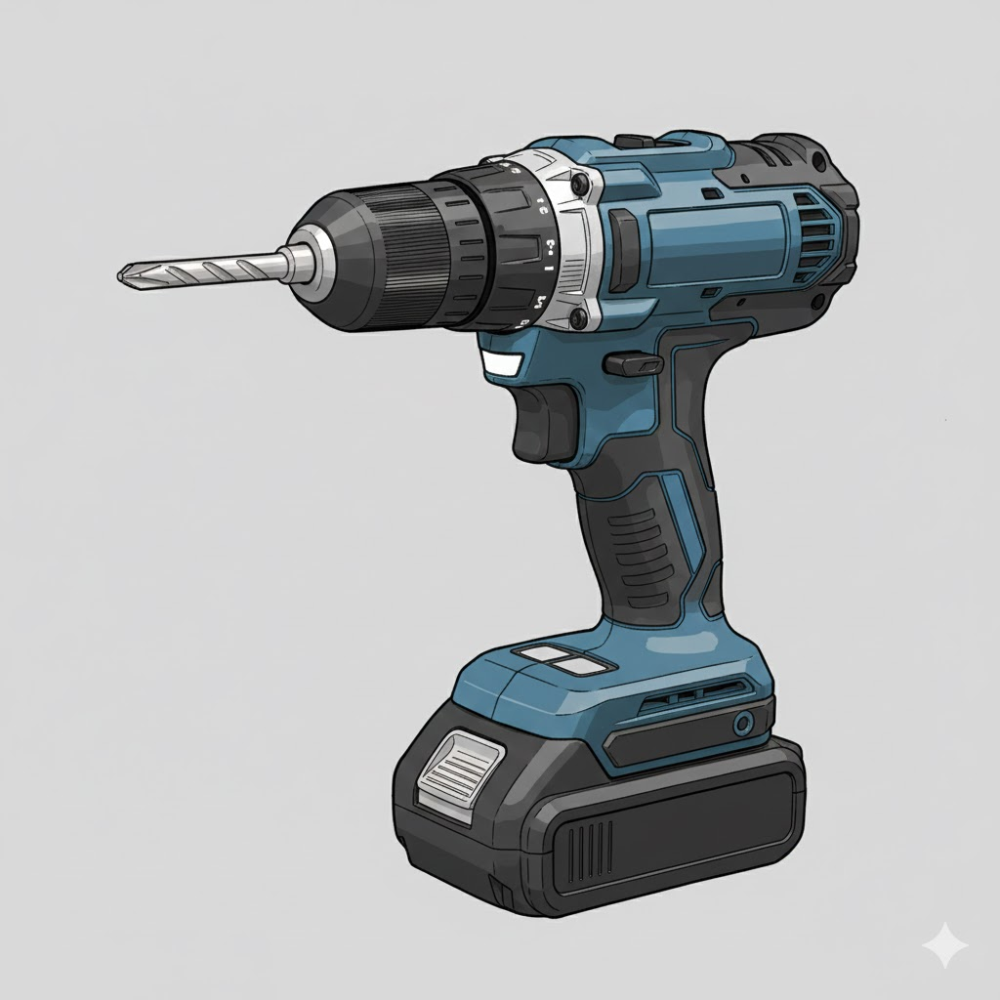

### 2.1.6. Fallbeispiel: Akku-Schrauber

Im Rahmen dieses Kapitels wenden wir die gelernten Konzepte der Simulink Signalmodelle auf das durchgängige Fallbeispiel eines Akku-Schraubers an.

Ziel ist es, das vereinfachte Verhalten des Motors zu modellieren.

---

### Simulink-Modell der **Energieversorgung**

**Akku-Modellierung:**
-   Ein `Constant`-Block kann die Nennspannung des Akkus repräsentieren.
-   Für eine detailliertere Modellierung könnte eine `Lookup Table` verwendet werden, um die Spannungsabnahme in Abhängigkeit vom Ladezustand oder der Stromabgabe abzubilden.

**Ladegerät-Modellierung:**
-   Ein `Step`-Block kann den Zeitpunkt des Anschließens des Ladegeräts simulieren.
-   Ein `Constant`-Block oder ein `Pulse Generator` kann die Ladespannung oder den Ladestrom darstellen.

---

### Simulink-Modell des **Antriebssystems**

**Motor-Modellierung:**
-   Ein `Gain`-Block kann die Umwandlung der angelegten Spannung in eine proportionale Motordrehzahl darstellen (z.B. U/min pro Volt).
-   Ein `Subtract`-Block kann das Lastmoment simulieren, das die Drehzahl reduziert. Das Lastmoment könnte von einem anderen Block (z.B. `Constant` oder `Step`) kommen.

**Getriebe-Modellierung:**
-   Ein weiterer `Gain`-Block kann das Getriebe repräsentieren, das die Motordrehzahl in die Abtriebsdrehzahl des Bohrfutters übersetzt (z.B. ein Untersetzungsverhältnis).

---


### 2.1.7. Übungsaufgabe

Modellieren Sie das Verhalten der atomaren physikalischen Kompo-nenten des 3D-Druckers (z.B. Antriebe) mithilfe von Simulink Signalmodellen.

*Das Verhalten von Software-Komponenten werden wir hingegen später mithilfe von Stateflow Logikmodelle beschreiben.*

---


## 2.2 Simscape **Physikmodelle**

In diesem zweiten Abschnitt lernen wir die folgenden Dinge:

1. **Physikalische Netzwerke** (akausale Modellierung)
2. **Domänen und Bibliotheken** (mechanisch, elektrisch, etc.)
3. **Erhaltungs- vs. Signal-Ports** (ungerichtet versus gerichtet)
4. **Solver für physikalische Netze** (DAE-Solver)

---

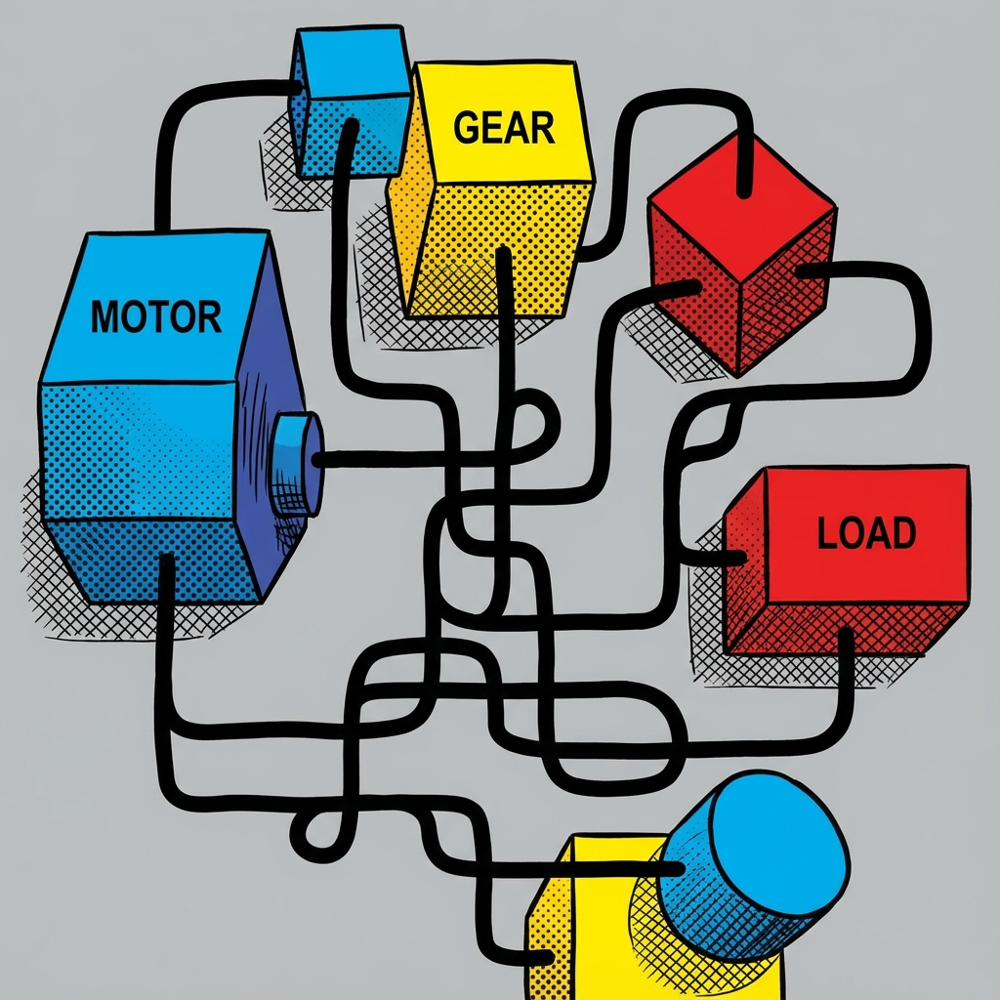

### 2.2.1 Physikalische Netzwerke

Dieser Unterabschnitt behandelt die Grundlagen akausaler physikalischer Netzwerke in Simscape:

1. Was ist akausale Modellierung?
2. Aufbau eines physikalischen Netzwerks
3. Through- und Across-Variablen
4. Referenzknoten (Reference node)

---

<div class="columns">
<div class="three">

#### Was ist akausale Modellierung?

Bei der **kausalen** Modellierung (wie in Simulink) berechnet jeder Block seine Ausgänge direkt aus seinen Eingängen. Die Berechnungsrichtung ist klar vorgegeben (`y = f(u)`).

Bei der **akausalen** Modellierung (wie in Simscape) definieren Blöcke physikalische Gesetze als Gleichungen, ohne eine feste Ein- oder Ausgangsrichtung vorzugeben. Das gesamte verbundene Netzwerk bildet ein Gleichungssystem, das der Solver simultan löst (`F(x, y, z) = 0`).

Dies entspricht eher der Denkweise von Physikern und Ingenieuren, die ein System als Ganzes betrachten.

</div>
<div>


</div>
</div>

---

#### Through- und Across-Variablen

Jede physikalische Verbindung in Simscape wird durch zwei Arten von Variablen beschrieben:

-   **Across-Variablen:** Eine Größe, die über zwei Punkte gemessen wird (z.B. Spannung, Geschwindigkeitsdifferenz, Druckdifferenz).
-   **Through-Variablen:** Eine Größe, die durch ein Element fließt (z.B. Strom, Kraft, Massenstrom).

Das Produkt dieser beiden Variablen ist in der Regel die Leistung, die durch die Verbindung fließt. An jedem Verbindungspunkt gilt das Kirchhoffsche Gesetz: Die Summe aller Through-Variablen ist Null.

---

#### Variablen-Paare in jeder Domäne

Jede physikalische Domäne in Simscape wird durch ein charakteristisches Paar von Through- und Across-Variablen definiert. Die folgende Tabelle zeigt die gängigsten Beispiele.

| Domäne | Across-Variable | Through-Variable |
| :--- | :--- | :--- |
| Elektrisch | Spannung (`V`) | Strom (`A`) |
| Mechanisch (Translation) | Geschwindigkeit (`m/s`) | Kraft (`N`) |
| Mechanisch (Rotation) | Winkelgeschwindigkeit (`rad/s`) | Drehmoment (`Nm`) |
| Thermisch | Temperatur (`K`) | Wärmestrom (`W`) |
| Hydraulisch | Druck (`Pa`) | Volumenstrom (`m³/s`) |

---


### Simscape Language

Die **Simscape Language** ist eine textbasierte Modellierungssprache, die es ermöglicht, eigene physikalische Komponenten und Domänen zu definieren.

-   **Benutzerdefinierte Komponenten:** Wenn die Standardbibliothek nicht ausreicht.
-   **Textbasierte Beschreibung:** Definition von Domänen und Komponenten in einer MATLAB-ähnlichen Syntax (`.ssc` Dateien).
-   **Kompilierung:** Simscape übersetzt diese Beschreibungen in C-Code für die Simulation.

---

<div class="columns">
<div class="two">

#### Definition von **Domänen**

Eine Domänendefinition in Simscape legt die grundlegenden physikalischen Grö-ßen für eine bestimmte Energieform fest.

-   **Across-Variablen:** Werden im ersten `variables`-Block definiert (z.B. Spannung).
-   **Through-Variablen:** Werden im `variables (Balancing = true)`-Block definiert (z.B. Strom).
-   **Parameter:** Konstanten, die das Verhalten von Komponenten konfigurieren (z.B. Federkonstante)

</div>
<div>

```matlab
domain [name]

  variables
    ... % Across-Variablen
  end

  variables(Balancing = true)
    ... % Through-Variablen
  end

  parameters
    ... % Parameter
  end

end
```

</div>
</div>

---

<div class="columns">
<div>

#### Domäne **Electrical**

Die elektrische Domäne definiert Spannung und Strom.

-   **Across-Variable:** Spannung `v` in Volt (`V`).
-   **Through-Variable:** Strom `i` in Ampere (`A`).

</div>
<div>

```matlab
domain electrical

  variables
    v = { 0, 'V' }; 
  end

  variables(Balancing = true)
    i = { 0, 'A' };
  end

end
```

</div>
</div>

---

<div class="columns">
<div>

#### Domäne **Mechanical Translational**

Die mechanisch-translatorische Domäne definiert Geschwindigkeit und Kraft.

-   **Across-Variable:** Geschwindigkeit `v` in Meter pro Sekunde (`m/s`).
-   **Through-Variable:** Kraft `f` in Newton (`N`).

</div>
<div>

```matlab
domain translational

  variables
    v = { 0, 'm/s' };
  end

  variables(Balancing = true)
    f = { 0, 'N' };
  end

end
```

</div>
</div>

---

<div class="columns">
<div>

#### Domäne **Thermal**

Die thermische Domäne definiert Temperatur und Wärmestrom.

-   **Across-Variable:** Temperatur `T` in Kelvin (`K`).
-   **Through-Variable:** Wärmestrom `q` in Watt (`W`).

</div>
<div>

```matlab
domain thermal

  variables
    T = { 0, 'K' };
  end

  variables(Balancing = true)
    q = { 0, 'W' };
  end

end
```

</div>
</div>

---

<div class="columns">
<div>

#### Definition **atomarer Komponenten**

Das ist in einer Definition enthalten:

-   **Nodes/Inputs/Outputs**: Anschlüsse für physikalische Netzwerke, Ein-gangssignale und Ausgangssignale.
-   **Parameters/Variables:** Konstanten und interne Zustände oder Größen der Komponente.
-   **Branches/Equations:** Durchfluss von Through-Variablen und physikalische Verhalten der Komponente.

</div>
<div>

```matlab
component [name]
  nodes
    ... % Anschlüsse definieren
  end
  inputs
    ... % TODO Kommentar
  end
  outputs
    ... % TODO Kommentar
  end
  parameters
    ... % Parameter definieren
  end
  variables
    ... % Variablen definieren
  end
  branches
    ... % Durchflussrichtungen
  end
  equations
    ... % Gleichungssystem
  end
end
```

</div>
</div>

---

<div class="columns">
<div>

#### Beispiel: **Elektrischer Widerstand**

Ein idealer Widerstand wird durch das Ohmsche Gesetz beschrieben.

-   **Nodes:** Zwei elektrische Anschlüsse `p` und `n`.
-   **Parameter:** Der Widerstandswert `R` in Ohm-Einheiten.
-   **Gleichung:** $v = i \cdot R$.

</div>
<div>

```matlab
component Resistor
  nodes
    p : electrical   % Positiver Anschluss
    n : electrical   % Negativer Anschluss
  end
  parameters
    R = { 1, 'Ohm' } % Widerstand
  end
  variables
    v = { 0, 'V' };   % Spannung
    i = { 0, 'A' };   % Strom
  end
  branches
    i : p.i -> n.i;  % Stromfluss von p nach n
  end
  equations
    v == p.v - n.v;  % Spannungsdifferenz
    v == i * R;      % Ohmsches Gesetz
  end
end
```

</div>
</div>

---

<div class="columns">
<div>

#### Beispiel: **Ideale Spannungsquelle**

Eine ideale Spannungsquelle prägt eine feste Spannung zwischen ihren Anschlüssen ein, unabhängig vom fließenden Strom.

-   **Nodes:** Zwei elektrische Anschlüsse `p` und `n`.
-   **Parameter:** Der Spannungswert `V` in Volt.
-   **Gleichung:** $v = V_{source}$

</div>
<div>

```matlab
component IdealVoltageSource
  nodes
    p : electrical; % Positiver Anschluss
    n : electrical; % Negativer Anschluss
  end
  parameters
    V = { 1, 'V' }; % Quellenspannung
  end
  variables
    v = { 0, 'V' }; % Spannung am Bauteil
  end
  equations
    v == p.v - n.v; % Spannungsdifferenz
    v == V;         % Spannung wird eingeprägt
  end
end
```

</div>
</div>

---

<div class="columns">
<div>

#### Definition **zusammengesetzter Komponenten**

Zusammengesetzte Komponenten erlauben die hierarchische Strukturierung von Modellen. Sie kapseln ein internes Netzwerk von Sub-Komponenten und definieren über `nodes` die externen Anschlüsse. Das interne Verhalten wird in den Abschnitten `components` (Instanziierung) und `connections` (Verschaltung) beschrieben.

</div>
<div>

```matlab
component CompositeComponent
  nodes
    p : electrical; % Externer Anschluss 1
    n : electrical; % Externer Anschluss 2
  end
  components
    % Deklaration der Sub-Komponenten
    compA = ComponentA();
    compB = ComponentB();
  end
  connections
    % Verschaltung der Komponenten
    connect(p, compA.p);
    connect(compA.n, compB.p);
    connect(compB.n, n);
  end
end
```

</div>
</div>

---

<div class="columns">
<div>

#### Beispiel: **Reale Spannungsquelle**

Als Beispiel für eine zusammengesetzte Komponente modellieren wir eine **reale Spannungsquelle**. Diese besteht aus einer idealen Spannungsquelle (`IdealVoltageSource`) und einem in Serie geschalteten Innenwiderstand (`Resistor`). Die Komponente hat zwei externe Anschlüsse `p` und `n`.

</div>
<div>

```matlab
component RealSource
  nodes
    p : electrical; % Positiver Anschluss
    n : electrical; % Negativer Anschluss
  end
  parameters
    V = { 12, 'V' };   % Nennspannung
    R = { 1, 'Ohm' }; % Innenwiderstand
  end
  components
    source   = IdealVoltageSource(V=V);
    resistor = Resistor(R=R);
  end
  connections
    connect(p, source.p);
    connect(source.n, resistor.p);
    connect(resistor.n, n);
  end
end
```

</div>
</div>

---

#### Gleichungssystem der Komposition

Wenn Komponenten in Simscape verbunden werden, stellt der Simscape-Solver automatisch das gesamte Gleichungssystem auf.

1.  **Gleichungen der Komponenten:** Jeder Block trägt seine eigenen physikalischen Gleichungen bei (z.B. `v == i*R` für den Widerstand).
2.  **Verbindungsgleichungen:** An jedem Verbindungsknoten werden zwei Arten von Gleichungen hinzugefügt:
    -   **Across-Variablen sind gleich:** Alle verbundenen Anschlüsse haben denselben Wert für die Across-Variable (z.B. `source.n.v == resistor.p.v`).
    -   **Summe der Through-Variablen ist Null:** Die Summe aller Through-Variablen, die in einen Knoten fließen, ist Null (Kirchhoffsches Knotengesetz, z.B. `source.n.i + resistor.p.i == 0`).

---

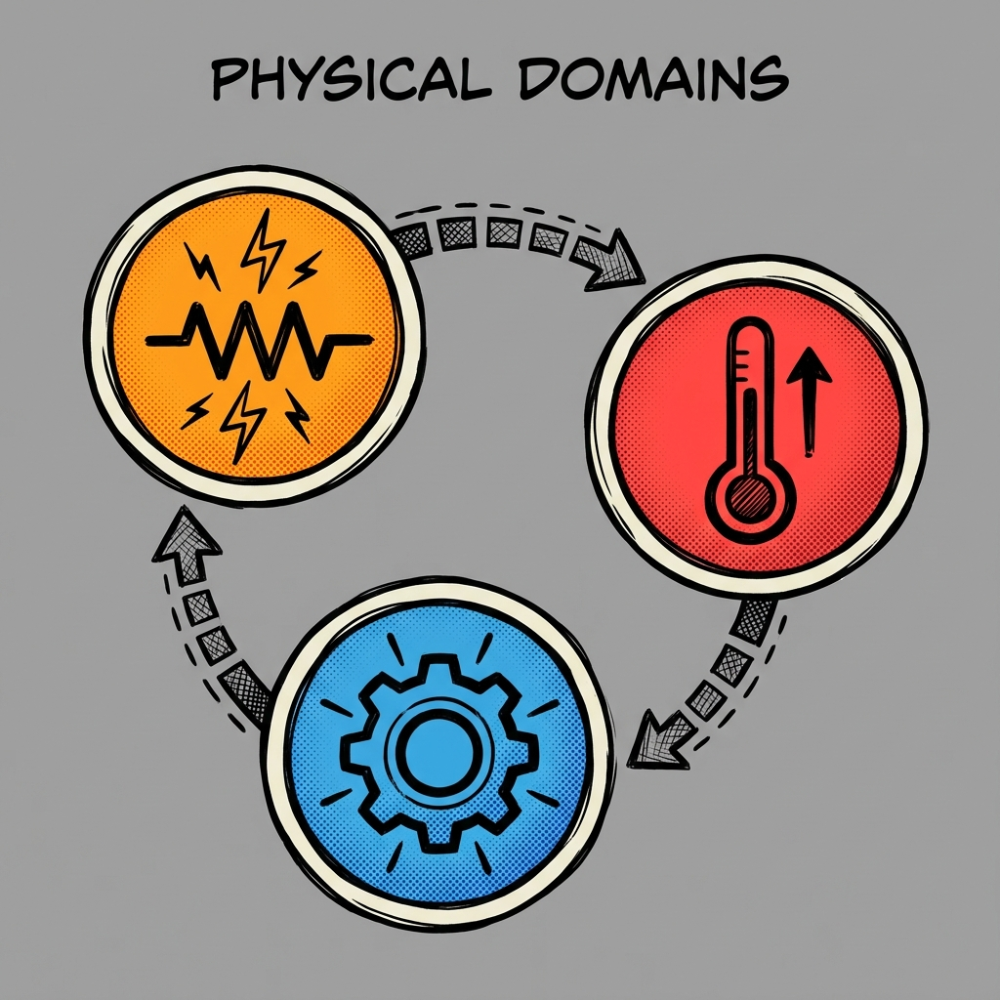

### 2.2.2 Domänen und Bibliotheken

Hier lernen wir die verschiedenen physikalischen Domänen und ihre zugehörigen Blockbibliotheken kennen:

1. Elektrische Domänen
2. Mechanische Domänen (1D Translation/Rotation)
3. Thermische Domäne
4. Weitere Domänen (z.B. Hydraulik, Gas)

---

#### Multiphysikalische Bibliotheken

Simscape bietet eine breite Palette an Bibliotheken für verschiedene physikalische Domänen, die es ermöglichen, multidisziplinäre Systeme zu modellieren.

<div class="columns top">
<div>

##### Elektrisch

Modellierung von analogen und leistungselektronischen Schaltungen.

**Blöcke:** Widerstand, Kondensator, Diode, ...

</div>
<div>

##### Mechanisch (1D)

Modellierung von translatorischen und rotatorischen mechanischen Systemen.

**Blöcke:** Masse, Feder, Dämpfer, Getriebe, ...

</div>
<div>

##### Thermisch

Modellierung von Wärmeerzeugung und -übertragung.

**Blöcke:** Wärmeleitender Widerstand, thermische Masse, ...

</div>
</div>

---

<div class="columns">
<div class="two">

```matlab
component Resistor
  nodes
    p = foundation.electrical.electrical; % Positiv
    n = foundation.electrical.electrical; % Negativ
  end
  parameters
    R = { 1, 'Ohm' }; % Widerstand
  end
  variables
    i = { 0, 'A' }; % Stromstärke
    v = { 0, 'V' }; % Spannung
  end
  branches
    i : p.i -> n.i; % Stromfluss
  end
  equations
    v == p.v - n.v; % Spannungsdifferenz
    v == R * i;     % Ohm'sches Gesetz
  end
end
```

</div>
<div>

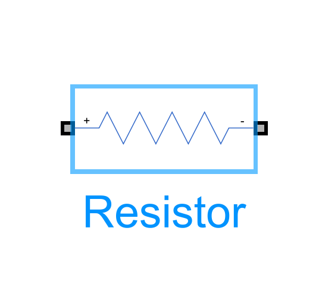

</div>
</div>

---

<div class="columns">
<div class="two">

```matlab
component Mass
  nodes
    M = foundation.mechanical.translational.translational;
  end
  parameters
    m = { 1, 'kg' }; % Masse
  end
  variables
    v = { 0, 'm/s' }; % Geschwindigkeit
    f = { 0, 'N' };   % Kraft
  end
  branches
    f : M.f -> *; % Kraft wird nicht weitergeleitet!
  end
  equations
    v == M.v;       % Nur eine Geschwindigkeit!
    f == m * v.der; % Newton'sches Gesetz
  end
end
```

</div>
<div>

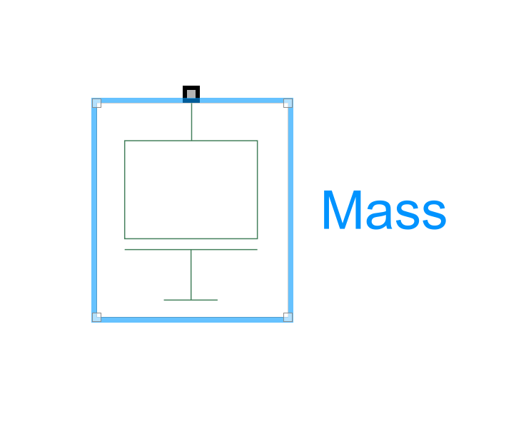

</div>
</div>

---

<div class="columns">
<div class="two">

```matlab
component TranslationalSpring
  nodes
      R = foundation.mechanical.translational.translational;
      C = foundation.mechanical.translational.translational;
  end
  parameters
    r = { 1000, 'N/m' }; % Federkonstante
  end
  variables
    v = { 0, 'm/s' }; % Geschindigkeit
    f = { 0, 'N' };   % Kraft
    x = { 0, 'm'};    % Weg
  end
  branches
    f : R.f -> C.f; % Kraftweiterleitung
  end
  equations
    v == R.v - C.v; % Differenzgeschwindigkeit
    v == x.der;     % Geschwindigkeit als Ableitung des Weges
    f == r * x;     % Hookesches Gesetz
  end
end
```

</div>
<div>

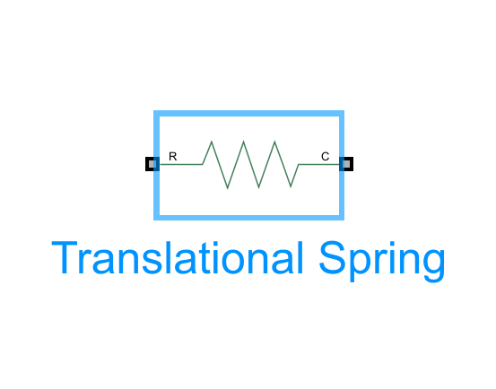

</div>
</div>

---

<div class="columns">
<div class="two">

```matlab
component ThermalResistance
 nodes
    A = foundation.thermal.thermal; % Links
    B = foundation.thermal.thermal; % Rechts
  end
  parameters
    R = {1, 'K/W'}; % Widerstand
  end
  variables
    T = {0, 'K'}; % Temperatur
    Q = {0, 'W'}; % Wärmestrom
  end
  branches
    Q : A.Q -> B.Q; % Wärmestromfluss
  end
  equations
    T == A.T - B.T; % Temperaturdifferenz
    T == R * Q;     % Ohmsches Gesetz für thermischen Widerstand
  end
end
```

</div>
<div>

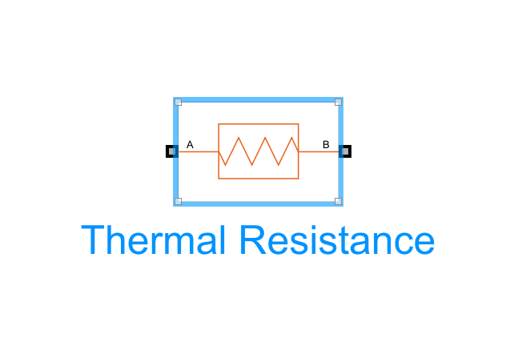

</div>
</div>

---

#### Referenzknoten (Reference Node)

Jedes physikalische Netzwerk in Simscape benötigt mindestens einen **Referenzknoten**. Dieser Block definiert den absoluten Nullpunkt für die Across-Variablen der jeweiligen Domäne.

-   **Elektrisch:** `Electrical Reference` (Masse, 0V)
-   **Mechanisch:** `Mechanical Translation/Rotational Reference` (fester Rahmen, unbewegliche Umgebung)
-   **Thermisch:** `Thermal Reference` (absolute Temperatur von 0K, obwohl oft eine Quelle mit konstanter Temperatur verwendet wird)

Ohne Referenz ist das Gleichungssystem unbestimmt, da alle Across-Variablen nur relativ zueinander wären.

---

#### Beispiele für Referenzknoten

Jede Domäne hat ihren eigenen Referenzblock, um den Nullpunkt zu definieren.

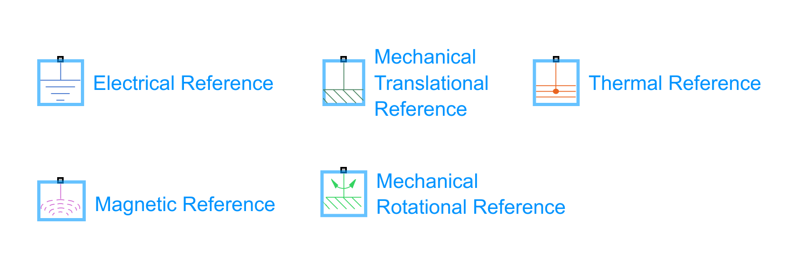

---

<div class="columns">
<div class="two">

#### Elektrische Referenz

Und so sieht die Implementierung des Simscape-Bausteins `Electrical Reference` aus:

```matlab
component ElectricalReference
  nodes
    V = foundation.electrical.electrical;
  end
  equations
    V.v == { 0, 'V' };
  end
end
```

Der Baustein setzt die elektrische *Referenzspannung* auf den Nullwert.

</div>
<div>

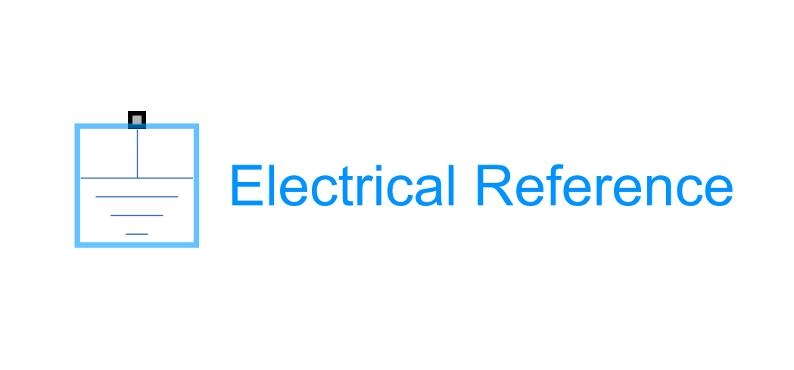

</div>
</div>

---

<div class="columns">
<div class="two">

#### Mechanische translationale Referenz

Und so sieht die Implementierung des Simscape-Bausteins `Mechanical Translational Reference` aus:

```matlab
component MechanicalTranslationalReference
  nodes
    M = foundation.mechanical.translational.translational;
  end
  equations
    M.v == { 0, 'm/s' };
  end
end
```

Der Baustein setzt die mechanische translationale *Referenzgeschwindigkeit* auf den Nullwert.

</div>
<div>

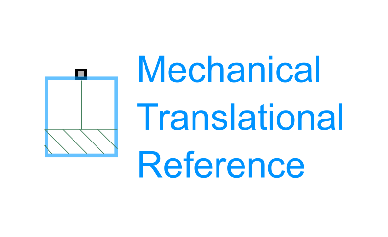

</div>
</div>

---

<div class="columns">
<div class="two">

#### Thermische Referenz

Und so sieht die Implementierung des Simscape-Bausteins `Thermal Reference` aus:

```matlab
component ThermalReference
  nodes
    H = foundation.thermal.thermal;
  end
  equations
    H.T == { 0, 'K' };
  end
end
```

Der Baustein setzt die thermische *Referenztemperatur* auf den Nullwert.

</div>
<div>


</div>
</div>

---

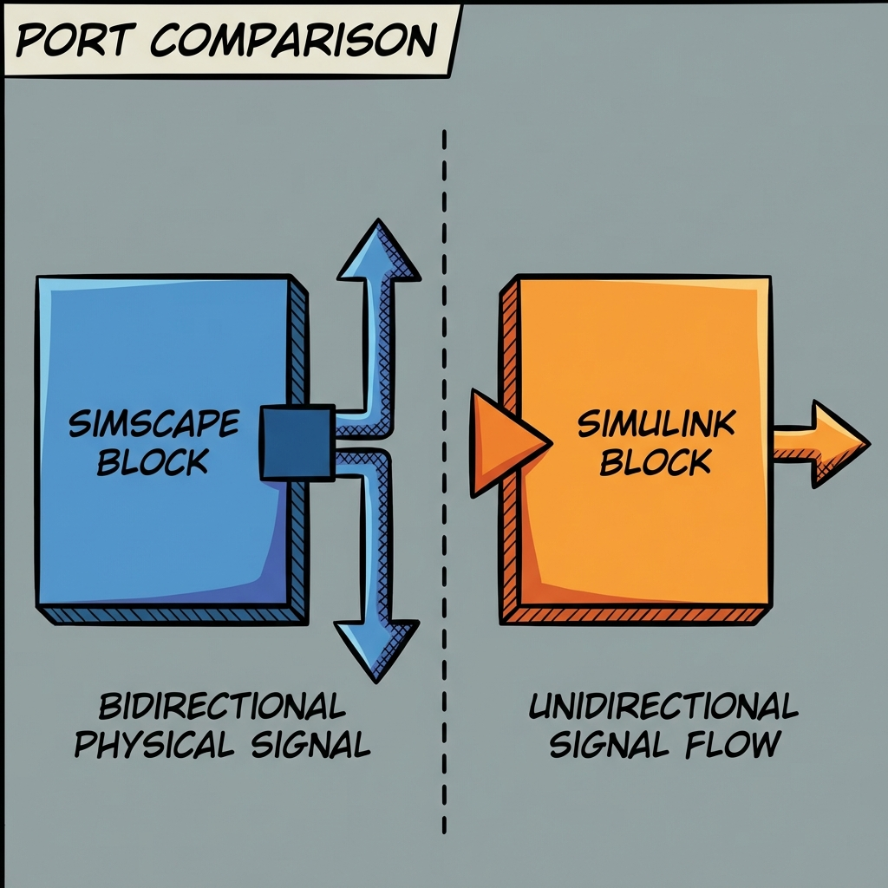

### 2.2.3 Erhaltungs- vs. Signal-Ports

Unterschied zwischen Simscape- und Simulink-Verbindungen:

1. **Simulink Signal-Ports:** Kausale, unidirektionale Signalübertragung
2. **Simscape Erhaltungs-Ports:** Akausale, bidirektionale Energie-/Materieflüsse
3. **Konvertierung** zwischen den beiden Welten (Simulink-PS & PS-Simulink Converter)

---

#### Der fundamentale Unterschied

Der Hauptunterschied liegt in der Art der Verbindung und der Information, die sie transportiert.

<div class="columns top">
<div>

***Simulink* Signal-Ports:**
-   Pfeilförmige Ports (`>`, `<`)
-   Übertragen unidirektionale Signale (Information)
-   Linien haben eine klare Richtung (Quelle zu Senke)
-   Kausale Logik

</div>
<div>

***Simscape* Erhaltungs-Ports:**
-   Quadratische Ports (verschiedene Farben je Domäne)
-   Stellen eine physikalische Verbindung dar
-   Bidirektionaler Austausch von Energie/Materie
-   Linien haben keine Richtung
-   Akausale Gleichungen

</div>
</div>

---

#### Darstellung von Signal- und Erhaltungs-Ports

<div class="columns">
<div>

**Simulink Signal-Ports:**


</div>
<div>

**Simscape Erhaltungs-Ports:**


</div>
</div>

---

#### Die Brücke zwischen den Welten

Um Simulink-Signale zur Steuerung von Simscape-Netzwerken zu verwenden oder physikalische Größen aus Simscape in Simulink zu messen, sind spezielle Konverterblöcke notwendig.

<div class="columns top">
<div>

##### `Simulink-PS Converter`

Wandelt ein Simulink-Signal in eine physikalische Größe um. Man konfiguriert den Block, um festzulegen, ob das Eingangssignal z.B. eine Kraft, eine Spannung oder eine Geschwindigkeit repräsentiert.

</div>
<div>

##### `PS-Simulink Converter`

Wandelt eine physikalische Größe (eine Across- oder Through-Variable) aus dem Simscape-Netzwerk in ein Simulink-Signal um, das dann weiterverarbeitet oder angezeigt werden kann.

</div>
</div>

---

<div class="columns">
<div class="three">

#### **Simulink-PS** Converter

Verbindet ein Simulink-Signal mit einem physikalischen Simscape-Netzwerk.

-   **Eingang:** Dimensionsloses Simulink-Signal oder Signal mit Simulink-Einheit.
-   **Ausgang:** Physikalische Größe mit Einheit (z.B. Spannung, Kraft).
-   **Anwendung:** Sollwertvorgaben (z.B. Soll-Drehmoment), gesteuerte Quellen.
-   **Ableitungen:** Kann bei Bedarf die zeitliche Ableitung des Eingangssignals filtern.

</div>
<div>

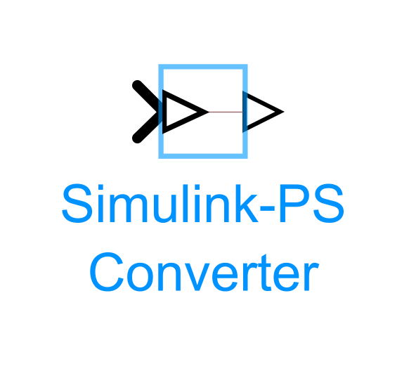

</div>
</div>

---

<div class="columns">
<div>

#### **Simulink-PS** Converter (Beispiel)

Das Beispiel zeigt, wie ein Simulink `Constant`-Block über einen `Simulink-PS Converter` eine physikalische `Controlled Voltage Source` in Simscape steuert.

Der Konverter übersetzt das dimensions-lose Simulink-Signal in eine Spannungs-einheit.

</div>
<div>

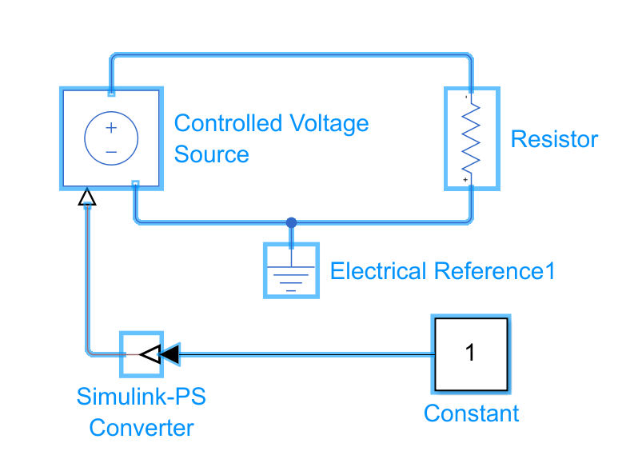

</div>
</div>

---

<div class="columns">
<div class="two">

```matlab
component ControlledVoltageSource
  inputs
    vT = { 0, 'V' }; % Eingabespannungswert
  end
  nodes
    p = foundation.electrical.electrical; % Positive
    n = foundation.electrical.electrical; % Negative
  end
  variables
    v = { 0, 'V' }; % Spannung
    i = { 0, 'A' }; % Stromstärke
  end
  branches
    i : p.i -> n.i;
  end
  equations
    v == p.v - n.v;
    v == vT;
  end
end
```

</div>
<div>

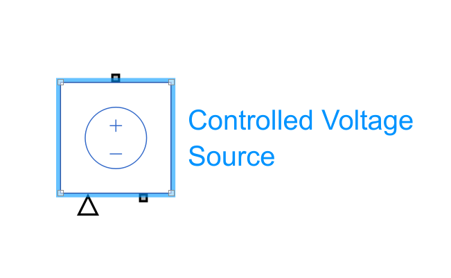

</div>
</div>

---

<div class="columns">
<div class="two">

```matlab
component IdealForceSource
  inputs
    S = { 0, 'N' }; % Eingabekraft
  end
  nodes
    C = foundation.mechanical.translational.translational;
    R = foundation.mechanical.translational.translational;
  end
  variables
    v = { 0, 'm/s' }; % Geschwindigkeit
    f = { 0, 'N' };   % Kraft
  end
  branches
    f : R.f -> C.f;
  end
  equations
    v == C.v - R.v;
    f == -S;
  end
end
```

</div>
<div>

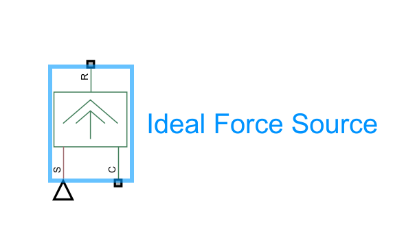

</div>
</div>

---

<div class="columns">
<div class="three">

#### **PS-Simulink** Converter

Verbindet ein physikalisches Simscape-Netzwerk mit einem Simulink-Signal.

-   **Eingang:** Physikalische Größe (Across- oder Through-Variable).
-   **Ausgang:** Das entsprechende Simulink-Signal (optional mit Einheit).
-   **Anwendung:** Messung von Größen zur Anzeige (Scope) oder Regelung.
-   **Konfiguration:** Auswahl der Ausgabeeinheit (z.B. Umrechnung von $m/s$ in $km/h$).

</div>
<div>

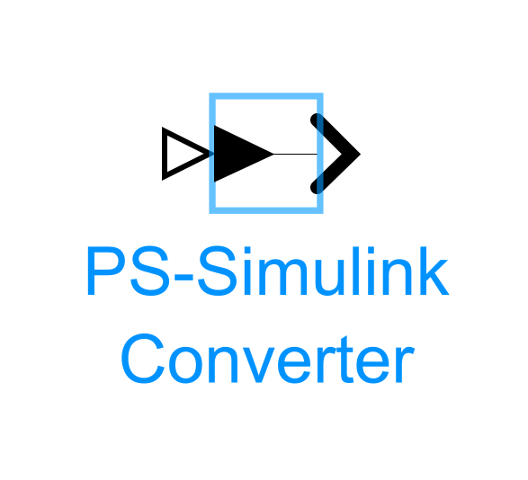

</div>
</div>

---

<div class="columns">
<div>

#### **PS-Simulink** Converter (Beispiel)

Dieses Beispiel demonstriert die Messung einer Spannung in einem Simscape-Netzwerk.

Ein `Voltage Sensor` misst die physikalische Spannung, die dann über einen `PS-Simulink Converter` in ein Simulink-Signal umgewandelt und in einem `Scope` visualisiert wird.

</div>
<div>

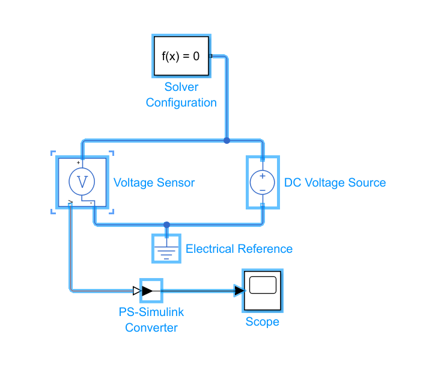

</div>
</div>

---

<div class="columns">
<div class="two">

```matlab
component VoltageSensor

  outputs
    V = { 0.0, 'V' }; % Ausgabespannung
  end

  nodes
    p = foundation.electrical.electrical; % Positive
    n = foundation.electrical.electrical; % Negative
  end

  equations
    V == p.v - n.v;
  end

end
```

</div>
<div>

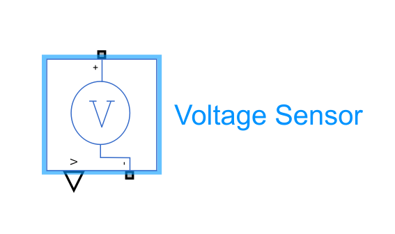

</div>
</div>

---

<div class="columns">
<div class="two">

```matlab
component IdealForceSensor
  nodes
    R = foundation.mechanical.translational.translational;
    C = foundation.mechanical.translational.translational;
  end
  outputs
    F = { 0, 'N' }; % Ausgabekraft
  end
  variables
    f = { 0, 'N' }; % Kraft
  end
  branches
    f : R.f -> C.f;
  end
  equations
    C.v == R.v;
    f == F;
  end
end
```

</div>
<div>

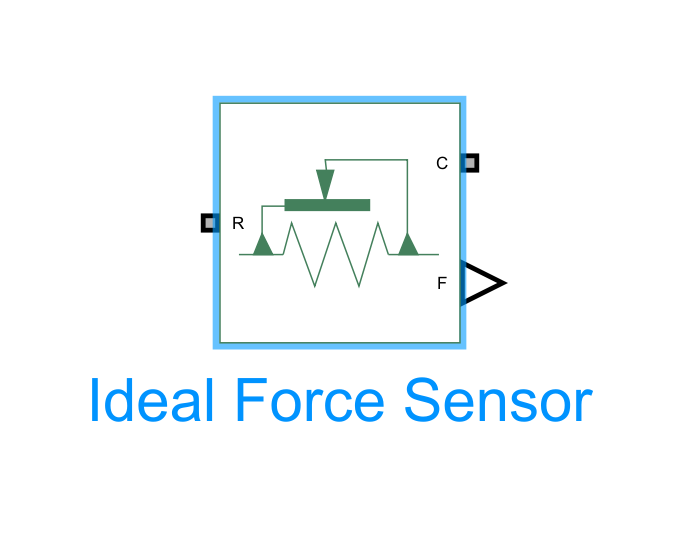

</div>
</div>

---

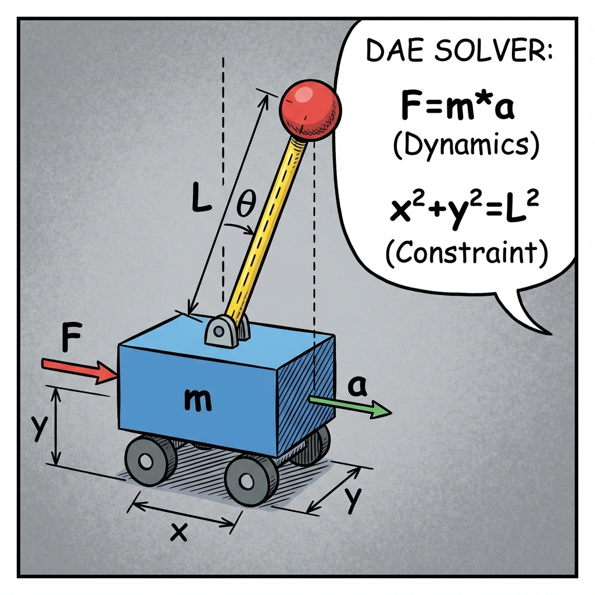

### 2.2.4 Solver für physikalische Netze

Simscape-Modelle erfordern spezielle Solver-Einstellungen. Wir behandeln:

1. Warum Simscape-Modelle DAEs sind
2. Der "Solver Configuration" Block
3. Auswahl des richtigen Solvers (z.B. `ode23t`, `ode15s`)
4. Lokale Solver für einzelne Netzwerke

---

#### DAEs in Simscape

Da Simscape-Modelle auf akausalen Gleichungen basieren, die physikalische Verbindungen und Erhaltungsgesetze beschreiben, führen sie fast immer zu **Differential-Algebraischen Gleichungen (DAEs)**.

-   Die **Differentialgleichungen** beschreiben die Dynamik von Elementen, die Energie speichern können (z.B. Massen, Kondensatoren).
-   Die **algebraischen Gleichungen** beschreiben die Randbedingungen und Verbindungen, die zu jedem Zeitpunkt gelten müssen (z.B. Kirchhoffsche Gesetze, Kräftegleichgewicht).

Aus diesem Grund sind spezielle DAE-Solver für die Simulation von Simscape-Modellen erforderlich.

---

<div class="columns">
<div>

#### Vom Modell zum Gleichungssystem

Simscape übersetzt das physikalische Netzwerk intern in ein System aus Gleichungen.

Die dynamischen Elemente (z.B. Masse) liefern Differentialgleichungen, während die Verbindungen und statischen Elemente (z.B. Feder) algebraische Nebenbedingungen aufstellen.

</div>
<div>

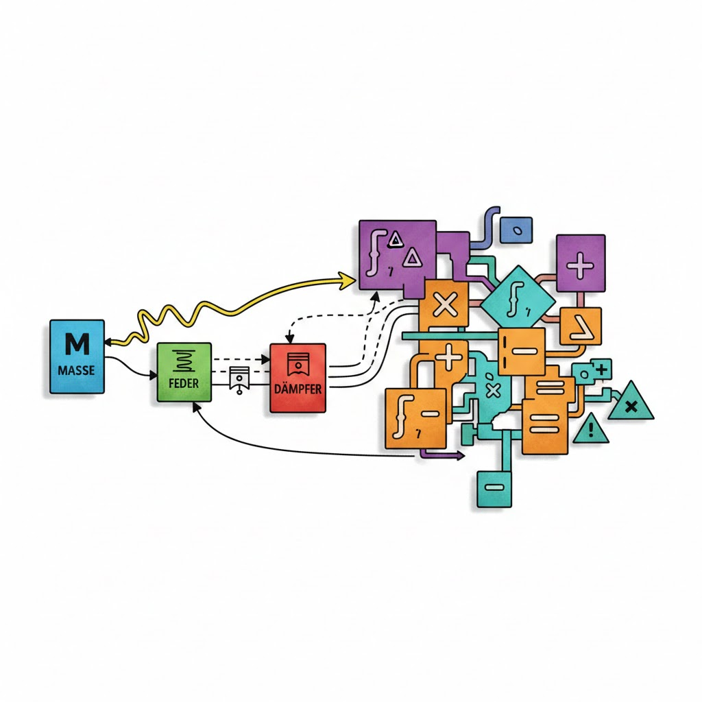

</div>
</div>

---

<div class="columns">
<div class="two">

#### Beispiel: Masse-Feder-Dämpfer

Ein klassisches mechanisches System, um die DAE-Formulierung in Simscape zu verstehen. Es besteht aus:
- **Masse ($m$):** Speichert kinetische Energie.
- **Feder ($k$):** Speichert potentielle Energie.
- **Dämpfer ($d$):** Dissipiert Energie.

Das System wird durch eine externe Kraft $F_{ext}$ angeregt und bewegt sich mit der Geschwindigkeit $v$. Die Bauteile sind zwischen der Masse und einem festen Referenzpunkt (Wand) eingespannt.

</div>
<div>

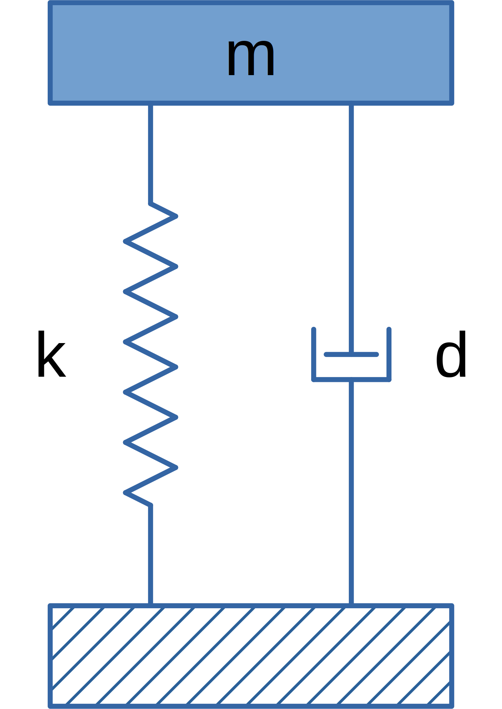

</div>
</div>

---

#### Gleichungen der Simscape-Komponenten

<div class="columns top">
<div>

##### Masse
*2. Newtonsches Gesetz*

Die Summe der Kräfte $F_m$ an der Masse verursacht eine Beschleunigung $\dot{v}$.

$F_m = m \cdot \dot{v}$

**(Differential-Term)**

</div>
<div>

##### Feder
*Hookesches Gesetz*

Die Federkraft $F_f$ ist proportional zur Auslenkung $x$, dem Integral der Geschwindigkeit.

$F_f = k \cdot x = k \int v \,dt$

**(Differential-Term)**

</div>
<div>

##### Dämpfer
*Reibungsgesetz*

Die Dämpferkraft $F_d$ ist proportional zur Geschwindigkeit $v$.

$F_d = d \cdot v$

**(Algebraischer-Term)**

</div>
</div>

---

#### Das zusammengesetzte DAE-System

**1. Algebraische Zwangsbedingungen (Knotengesetze):**
Die Verbindungen definieren algebraische Gleichungen. Hier gilt das Kräftegleichgewicht an der Masse: Die externe Kraft muss die Summe der internen Kräfte (Trägheit, Feder, Dämpfer) aufheben.

$F_{ext}(t) - F_m(t) - F_f(t) - F_d(t) = 0$

**2. Das DAE-System:**
Setzt man die Komponentengleichungen ein, entsteht eine einzige Gleichung, die differentielle und algebraische Terme enthält. Simscape löst dieses System für alle unbekannten Variablen simultan.

$F_{ext} - (m \cdot \dot{v}) - (k \cdot \int v dt) - (d \cdot v) = 0$

---

#### Simscape-Modell eines Masse-Feder-Dämpfer-Systems

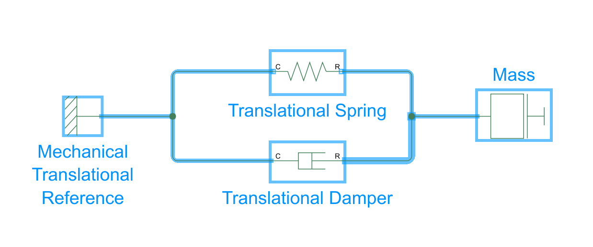

---

#### Der `Solver Configuration` Block

Jedes physikalisch getrennte Netzwerk in einem Simulink-Modell **muss genau einen** `Solver Configuration` Block enthalten.

Dieser Block ist entscheidend und hat zwei Hauptaufgaben:
1.  Er deklariert das Modell als physikalisches Netzwerk für den Simulink-Solver.
2.  Er bietet die Möglichkeit, die Solver-Einstellungen spezifisch für dieses Netzwerk zu konfigurieren.

Er wird direkt mit einem Referenzblock (z.B. `Electrical Reference`) im Netzwerk verbunden.

---

#### Konfiguration des Solvers

Der `Solver Configuration` Block muss mit dem physikalischen Netzwerk verbunden sein. Er stellt die Verbindung zur Solver-Engine von Simulink her und ermöglicht netzwerkspezifische Einstellungen.

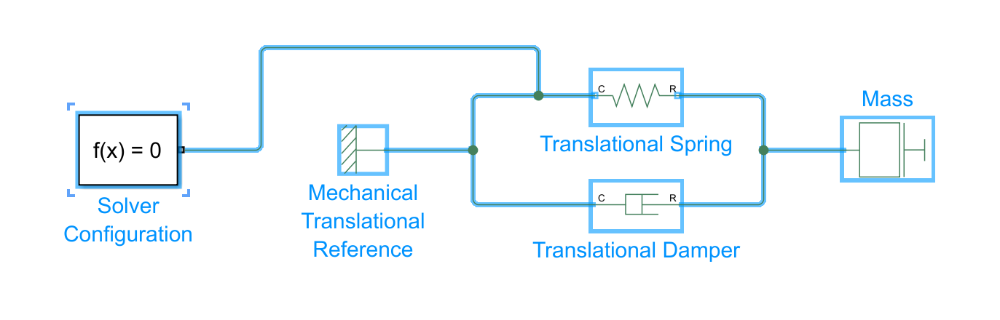


---

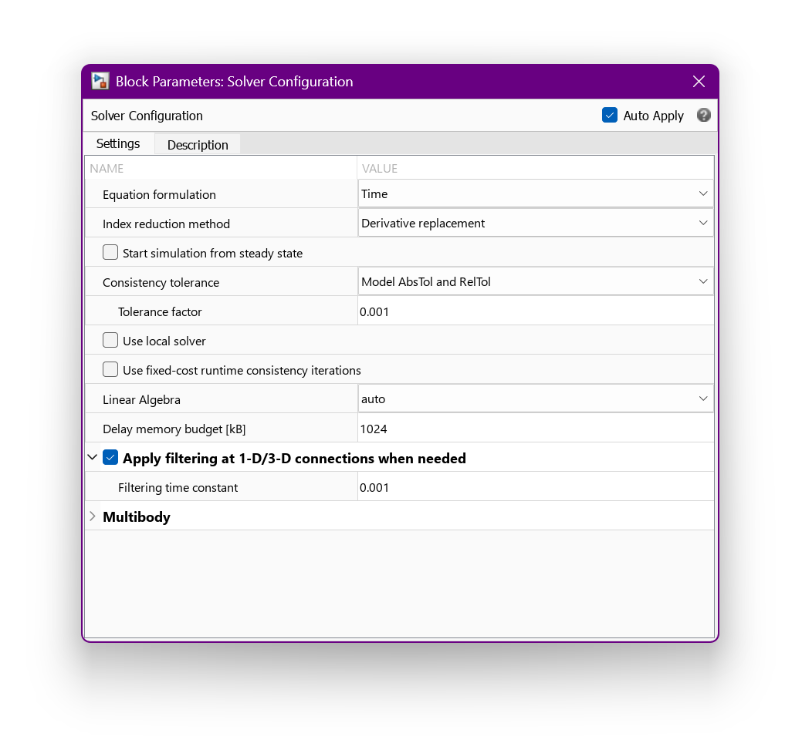

#### Parameter des `Solver Configuration` Blocks

Simscape-Modelle können mit einem lokalen (netzspefischen) Solver gelöst werden, oder mit dem globalen Simulink-Solver.

Außerdem kann für die Lösung der algebraischen Schleifen eingestellt werden, welche Genauigkeit gewünscht ist.

*Mehr dazu auf der nächsten Folie.*

---

#### Parameter des `Solver Configuration` Blocks (Cont'd)

-   **`Use local solver`:** Wenn aktiviert, wird für dieses spezifische physikalische Netzwerk ein separater Solver verwendet, was bei unabhängigen Netzwerken die Simulation beschleunigen kann.
-   **`Solver type`:** Auswahl zwischen `Global` (Simulink-Solver) und `Local` (spezieller Simscape-Solver).
-   **`Sample time`:** Nur bei lokalem Solver relevant, definiert die Abtastzeit des lokalen Solvers.
-   **`Consistency tolerance`:** Toleranz, mit der die algebraischen Gleichungen des Netzwerks gelöst werden müssen.
-   **`Number of iterations`:** Maximale Anzahl von Iterationen, die der Solver zur Lösung der algebraischen Schleifen durchführen darf.

---

#### Auswahl des richtigen Solvers

Für DAEs, die in Simscape entstehen, sind variable Zeitschritt-Solver, die für steife Systeme optimiert sind, oft die beste Wahl.

-   **`ode23t` (Trapezoidal Rule):** Ein guter Allrounder für moderat steife Systeme. Er ist oft schneller als `ode15s`, aber weniger robust bei sehr steifen Problemen.
-   **`ode15s` (Variable-order, NDF):** Der robusteste Solver für steife Systeme und DAEs. Er ist die empfohlene Wahl, wenn andere Solver versagen oder sehr langsam werden.

Die Solver-Auswahl erfolgt in den allgemeinen Modelleinstellungen von Simulink (`Model Settings > Solver`).

---

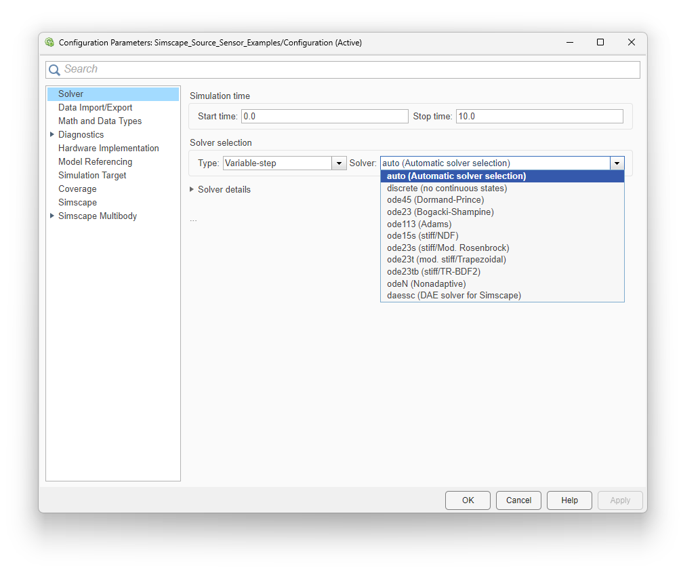

#### Globale Solver-Auswahl für DAEs

Die Auswahl des Solvers erfolgt in den globalen Modelleinstellungen. Für Simscape-Modelle (DAEs) sind steife Solver wie `ode23t` oder `ode15s` in der Regel die beste Wahl.

---

#### Lokale Solver

Wenn ein Modell mehrere, voneinander unabhängige physikalische Netzwerke enthält, kann die Verwendung lokaler Solver die Leistung verbessern.

1.  **Aktivierung:** Im `Solver Configuration` Block kann die Option `Use local solver` aktiviert werden.
2.  **Vorteil:** Jedes Netzwerk wird mit seinem eigenen, separaten Solver simuliert. Dies kann die Berechnung parallelisieren und beschleunigen, insbesondere auf Mehrkern-Prozessoren.
3.  **Nachteil:** Die Genauigkeit kann geringfügig abnehmen, da die Solver nicht mehr global synchronisiert sind.

Dies ist eine fortgeschrittene Option, die bei komplexen, modularen Modellen nützlich sein kann.

---


### 2.2.5. Fallbeispiel: Akku-Schrauber

In diesem Abschnitt wenden wir die gelernten Konzepte der Simscape Physikmodelle auf das durchgängige Fallbeispiel eines Akku-Schraubers an.

Ziel ist es, das physikalische Verhalten des Motors sowie des Antriebsstrangs detaillierter zu modellieren.

---

### Simscape-Modell der **elektrischen Energieversorgung** (1 / 2)

<div class="columns">
<div class="two">

**Akku-Modellierung:**
-   Ein `Battery`-Block aus der `Simscape / Electrical / Sources`-Bibliothek kann verwendet werden, um die reale Entladecharakteristik und den Innenwiderstand des Akkus abzubilden.
-   Ein `Controlled Voltage Source` und ein `Resistor` könnten eine einfachere Akkumodellierung darstellen.
-   Ein `Electrical Reference`-Block ist notwendig, um den Nullpunkt der elektrischen Spannung zu definieren.

</div>
<div>

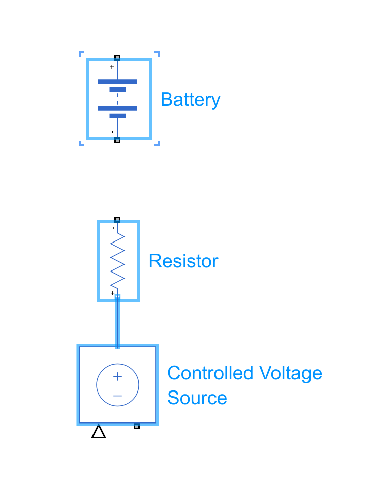

</div>
</div>

---

### Simscape-Modell der **elektrischen Energieversorgung** (2 / 2)

<div class="columns">
<div>

**Motor-Modellierung (elektrischer Teil):**
-   Der elektrische Teil des Motors kann durch einen `Resistor` (Wicklungswiderstand) und einen `Inductor` (Wicklungsinduktivität) in Reihe modelliert werden.
-   Ein `DC Motor`-Block aus der `Simscape / Electrical / Electromechanical`-Bibliothek integriert den elektrischen und mechanischen Teil.

</div>
<div>

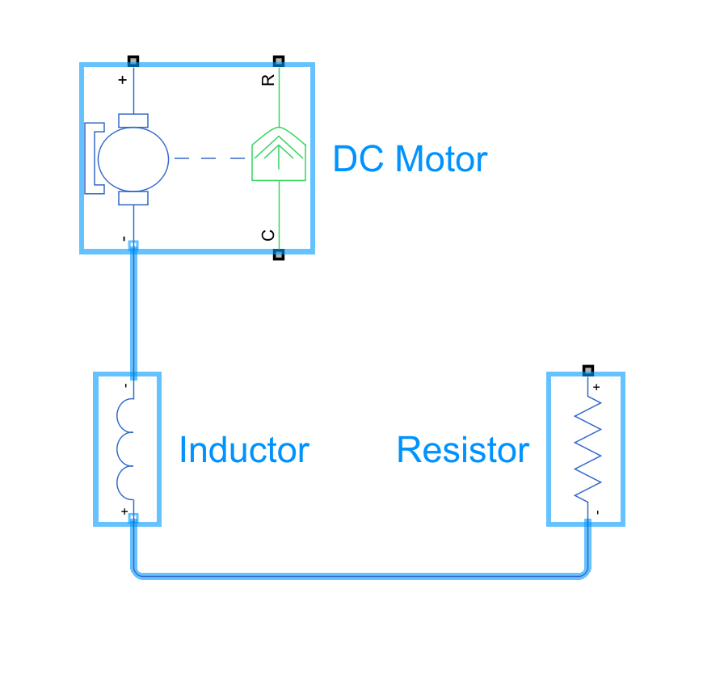

</div>
</div>

---

### Simscape-Modell des **Antriebssystems** (1 / 3)

<div class="columns">
<div class="three">

**Motor-Modellierung (mechanischer Teil):**
-   Der `DC Motor`-Block bietet auch mechanische Anschlüsse.
-   Ein `Inertia`-Block kann die Massenträgheit der Motorwelle und des Rotors abbilden.
-   Ein `Ideal Rotational Motion Sensor` kann verwendet werden, um die Winkelgeschwindigkeit des Motors zu messen und als Simulink-Signal auszugeben (`PS-Simulink Converter`).

</div>
<div class="two">

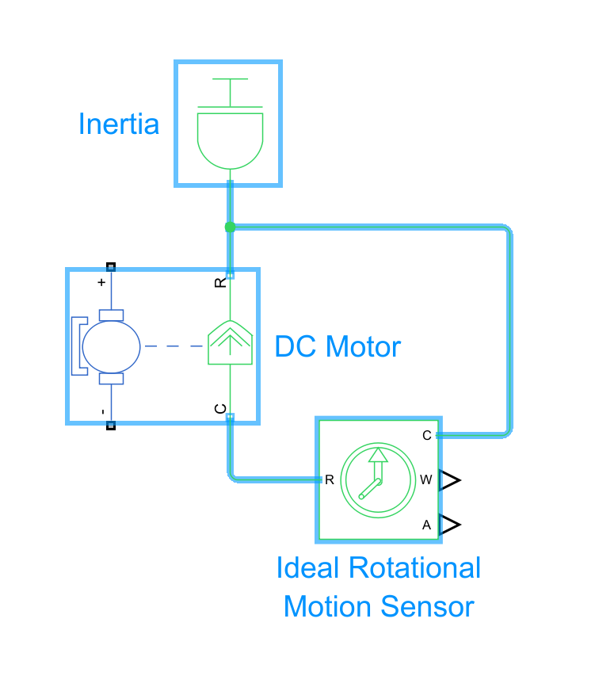

</div>
</div>

---

### Simscape-Modell des **Antriebssystems** (2 / 3)

<div class="columns">
<div>

**Getriebe-Modellierung:**
-   Ein `Simple Gear`-Block aus der `Simscape / Driveline / Gears and Clutches`-Bibliothek kann das Untersetzungsverhältnis und die Effizienz des Getriebes modellieren.
-   Ein weiterer `Inertia`-Block kann die Massenträgheit des Bohrfutters und der angelegten Last repräsentieren.

</div>
<div>

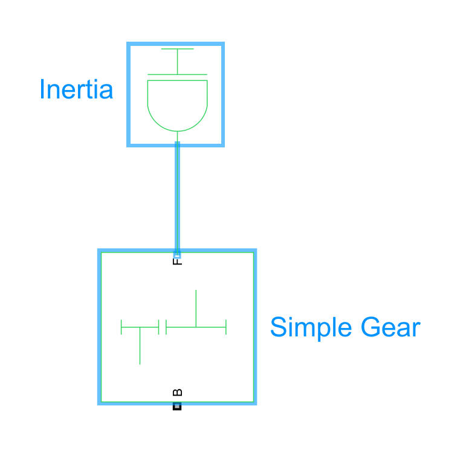

</div>
</div>

---

### Simscape-Modell des **Antriebssystems** (3 / 3)

<div class="columns">
<div>

**Last-Modellierung:**
-   Die Last am Bohrfutter kann durch einen `Ideal Angular Velocity Source` (für eine konstante Drehzahl) oder einen `Controlled Torque Source` (für ein definiertes Lastmoment) simuliert werden.
-   Ein `Rotational Mechanical Reference`-Block ist notwendig, um den mechanischen Nullpunkt (fester Bezug) zu definieren.

</div>
<div>


</div>
</div>

---


### 2.2.6. Übungsaufgabe

Modellieren Sie das Verhalten der atomaren physikalischen Kompo-nenten des 3D-Druckers (z.B. die Extruder-Heizung, die Bewegungsachsen) mithilfe von Simscape Physikmodellen.

*Berücksichtigen Sie dabei die jeweiligen physikalischen Domänen (elektrisch, thermisch, mechanisch) und die Notwendigkeit von Referenzblöcken.*

---


## 2.3 Stateflow **Logikmodelle**

1. **Zustände und Übergänge** (Grundelemente)
2. **Aktionen und Bedingungen** (Logik)
3. **Hierarchische Zustands-automaten** (Struktur)
4. **Parallele Zustandsautomaten** (gleichzeitige Ausführung)
5. **Ereignisse und Daten** (Schnittstelle zu Simulink)

---

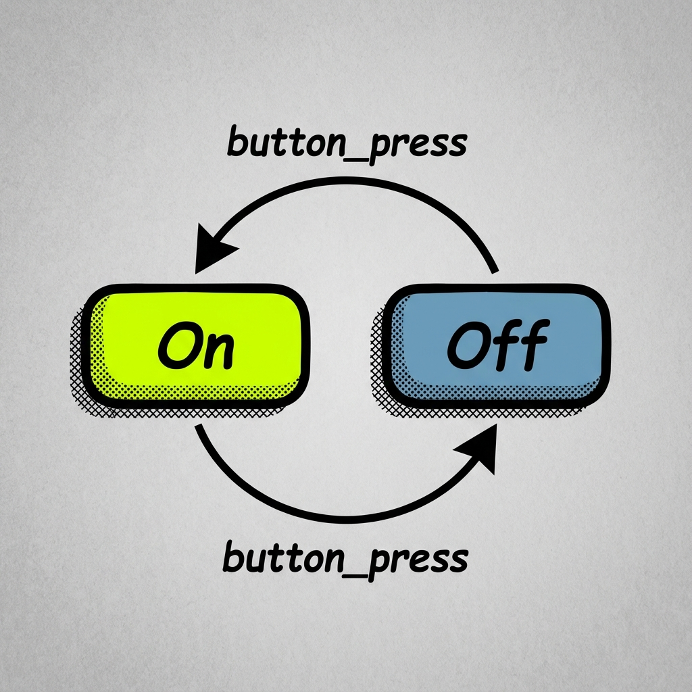

### 2.3.1 Zustände und Übergänge

Die Grundbausteine eines jeden Stateflow-Charts:

1. **Zustände:** Repräsentieren einen Modus des Systems.
2. **Übergänge:** Definieren den Wechsel zwischen Zuständen.
3. **Start- und Endzustände:** Der Standard-Übergangspfad.
4. **Graphische Darstellung** und Syntax.

---

<div class="columns">
<div class="four">

#### Zustände und Übergänge

- **Zustand (State):** Ein abgerundetes Rechteck, das einen Betriebszustand darstellt (z.B. "An", "Aus", "Standby"). Das System ist immer in genau einem aktiven Zustand (in nicht-parallelen Automaten).

- **Übergang (Transition):** Ein Pfeil von einem Zustand zum anderen. Er repräsentiert die Möglichkeit, den Zustand zu wechseln.

- **Standardübergang:** Ein Pfeil, der von einem kleinen gefüllten Kreis ausgeht. Er legt fest, welcher Zustand beim ersten Aktivieren des Automaten eingenommen wird.

</div>
<div>



</div>
</div>

---

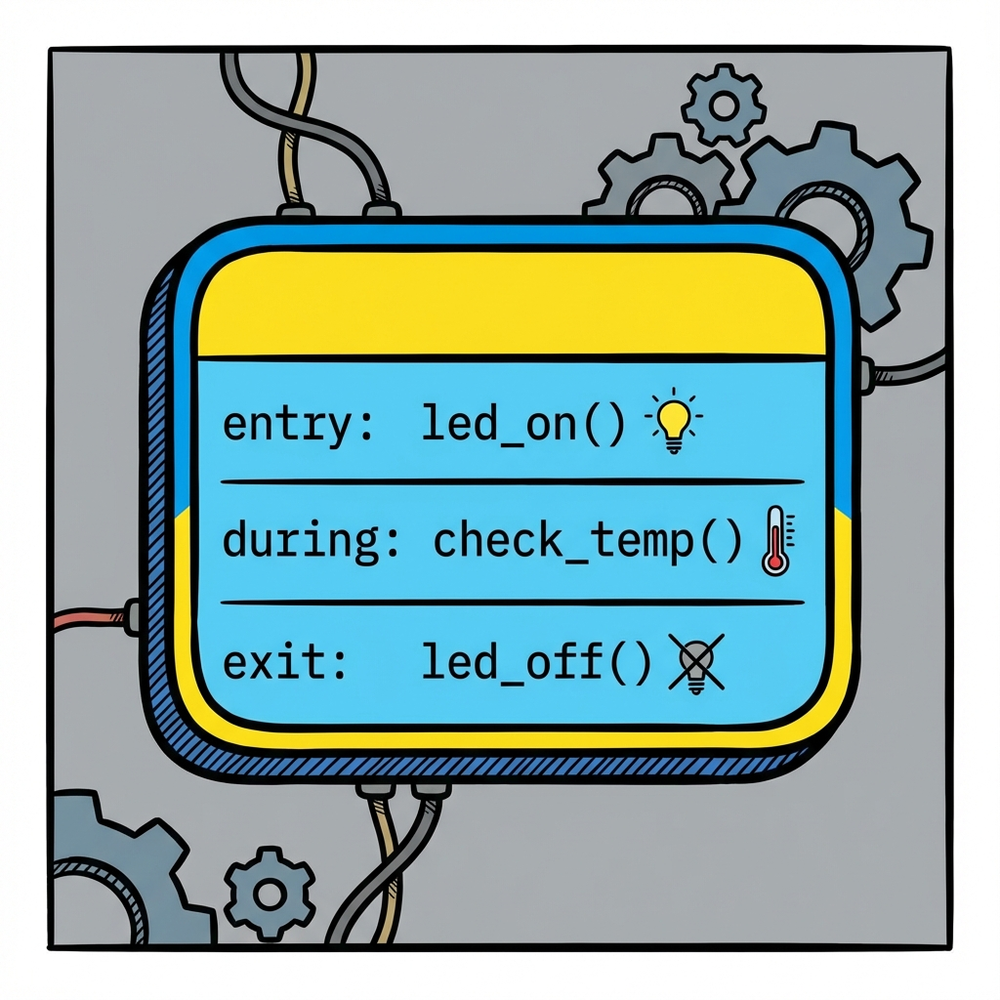

### 2.3.2 Aktionen und Bedingungen

Hier definieren wir, was passiert und wann es passiert:

1. **Bedingungen:** Ausdrücke, die einen Übergang erlauben.
2. **Bedingungsaktionen:** Ausge-führt, wenn Bedingung wahr.
3. **Übergangsaktionen:** Ausgeführt, wenn Übergang stattfindet.
4. **Zustandsaktionen:** `entry`, `during`, `exit` Aktionen.

---

#### Anatomie eines Übergangs

Die Logik eines Übergangs wird direkt an den Pfeil geschrieben. Die Syntax `Ereignis[Bedingung]{Bedingungsaktion}/Übergangsaktion` steuert den Wechsel.

| Syntax | Name | Ausführung |
| :--- | :--- | :--- |
| `[temp > 95]` | **Bedingung** (Guard) | Muss `true` sein, damit der Übergang<br/>überhaupt in Betracht gezogen wird. |
| `{check()}` | **Bedingungsaktion** | Wird ausgeführt, sobald die Bedingung<br/>als `true` ausgewertet wird. |
| `/stop()` | **Übergangsaktion** | Wird ausgeführt, *nachdem* der Quellzustand<br/>verlassen wurde und *bevor* der Zielzustand<br/>betreten wird. |

---

<div class="columns">
<div class="five">

#### Beispiel: Überhitzungsschutz

Dieser Zustandsautomat modelliert einen einfachen Überhitzungsschutz.

- Der **Standardübergang** führt in den Zustand `Betrieb`.
- Wenn die `Temperatur` über 95°C steigt (`[Temperatur > 95]`), wird der Übergang zum Zustand `Ueberhitzt` ausgelöst.
- Im Zustand `Ueberhitzt` wird die `Heizung` abgeschaltet (`entry: Heizung = 0`).

</div>
<div class="four">



</div>
</div>

---

#### Bedingungs- vs. Übergangsaktion

<div class="columns top">
<div>

##### Bedingungsaktion `{action}`

- **Wann?** Wird ausgeführt, sobald die Bedingung (`guard`) des Übergangs `true` ist, **unabhängig davon, ob der Übergang tatsächlich stattfindet.**
- **Anwendung:** Nützlich, um ein Ereignis zu protokollieren, sobald eine Schwelle erreicht ist, auch wenn der Zustandswechsel (noch) nicht vollzogen wird (z.B. weil andere Bedingungen nicht erfüllt sind).

</div>
<div>

##### Übergangsaktion `/action`

- **Wann?** Wird ausgeführt, wenn der **gesamte Übergang stattfindet**, d.h., nachdem der Quellzustand verlassen wurde und bevor der Zielzustand betreten wird.
- **Anwendung:** Der Standardfall, um eine Aktion auszuführen, die direkt mit dem Zustandswechsel verbun-den ist (z.B. `motor_abschalten()`).

</div>
</div>

---

#### Zustands-Aktionen (`entry`, `during`, `exit`)

Zustände können Aktionen ausführen, wenn sie betreten, verlassen werden oder während sie aktiv sind. Dies wird im Zustands-Feld notiert.

- `entry` (oder `en`): Wird **einmalig** beim Betreten des Zustands ausgeführt. Ideal für Initialisierungen.
- `during` (oder `du`): Wird bei **jedem Zeitschritt** ausgeführt, den der Zustand aktiv ist. Ideal für kontinuierliche Aktivitäten.
- `exit` (oder `ex`): Wird **einmalig** beim Verlassen des Zustands ausgeführt. Ideal für Aufräumarbeiten.

---

<div class="columns">
<div class="three">

#### Beispiel einer **Heizungssteuerung**

-   **`entry` Aktionen:** Werden beim Betreten eines Zustands ausgeführt, z.B. `motor_on()` beim Wechsel in den `Heating`-Zustand.
-   **`during` Aktion:** Läuft, solange der Zustand aktiv ist, z.B. `update_display()` zur kontinuierlichen Aktualisierung einer Anzeige.
-   **`exit` Aktion (nicht gezeigt):** Würde beim Verlassen eines Zustands ausgeführt, z.B. um eine Log-Datei zu schreiben.

</div>
<div class="two">



</div>
</div>

---

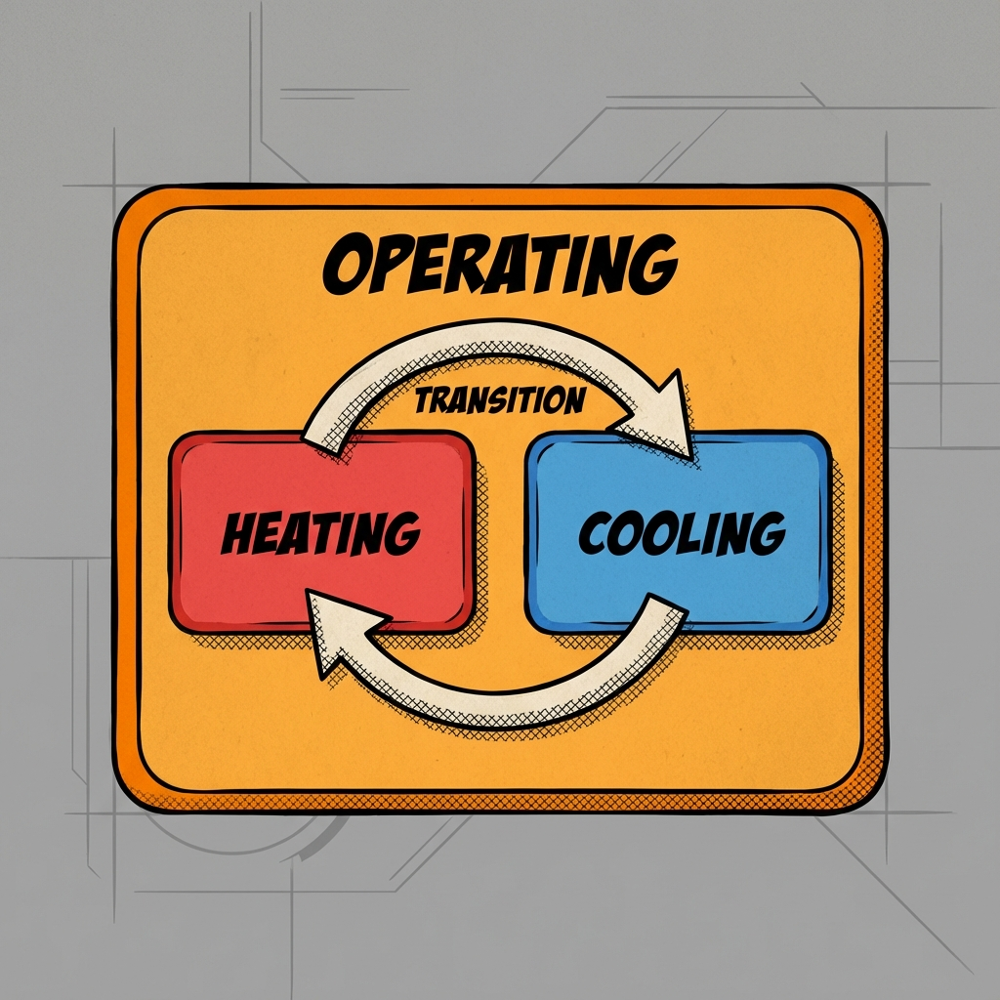

### 2.3.3 Hierarchische Zustandsautomaten

Strukturierung komplexer Logik durch Schachtelung:

1. **Super-Zustände:** Zustände mit Unterzuständen.
2. **Sub-Zustände:** Die inneren Zustände.
3. **Vorteile:** Lesbarkeit, Wieder-verwendbarkeit und Kapselung.
4. **Historien-Zustände:** Zuletzt aktiven Sub-Zustand merken.

---

<div class="columns">
<div class="five">

#### Super- und Sub-Zustände

Ein **Super-Zustand** (oder Eltern-Zustand) fasst eine Gruppe von **Sub-Zuständen** (oder Kind-Zuständen) zusammen.

- **Kapselung:** Die Logik innerhalb des Super-Zustands ist in sich geschlossen.
- **Lesbarkeit:** Komplexe Automaten werden übersichtlicher.
- **Gemeinsame Übergänge:** Ein Übergang, der vom Super-Zustand ausgeht, gilt für alle seine Sub-Zustände. Dies vermeidet redundante Übergangspfeile von jedem einzelnen Sub-Zustand.

</div>
<div>



</div>
</div>

---

<div class="columns">
<div class="four">

#### Historien-Zustand (History Junction)

Ein Historien-Zustand (`H`) innerhalb eines Super-Zustands merkt sich den zuletzt aktiven Sub-Zustand.

Wenn ein Übergang zum Historien-Zustand führt, wird nicht der Standard-Sub-Zustand aktiviert, sondern derjenige, der beim letzten Verlassen des Super-Zustands aktiv war.

Dies ist nützlich für Unterbrechungen (z.B. ein "Pause"-Modus), nach denen das System genau dort weitermachen soll, wo es aufgehört hat.

</div>
<div>



</div>
<div>


</div>
</div>

---

#### Beispiel: Pausenfunktion

Der Historien-Zustand ist ideal, um eine Pausen- und Fortsetzen-Funktion zu implementieren.

- Der Super-Zustand `Player` enthält die Logik für die Wiedergabe (`Playing`) und das Spulen (`Seeking`).
- Wenn das `pause`-Ereignis eintritt, wird in den `Paused`-Zustand gewechselt.
- Beim `resume`-Ereignis kehrt der Automat nicht zum Standardzustand (`Playing`) zurück, sondern zum `(H)`-Symbol.
- Dieses "merkt" sich, ob der Player vor der Pause im `Playing`- oder `Seeking`-Modus war und stellt diesen wieder her.

---

<div class="columns">
<div>

#### Beispiel: Pausenfunktion (Stateflow-Chart)

Und so sieht die grafische Darstellung des Zustandsautomaten aus.

Man beachte den Super-Zustsand `Player`, der mittels der Annotation `(H)` als Historien-Zustand markiert ist.

</div>
<div>


</div>
</div>

---

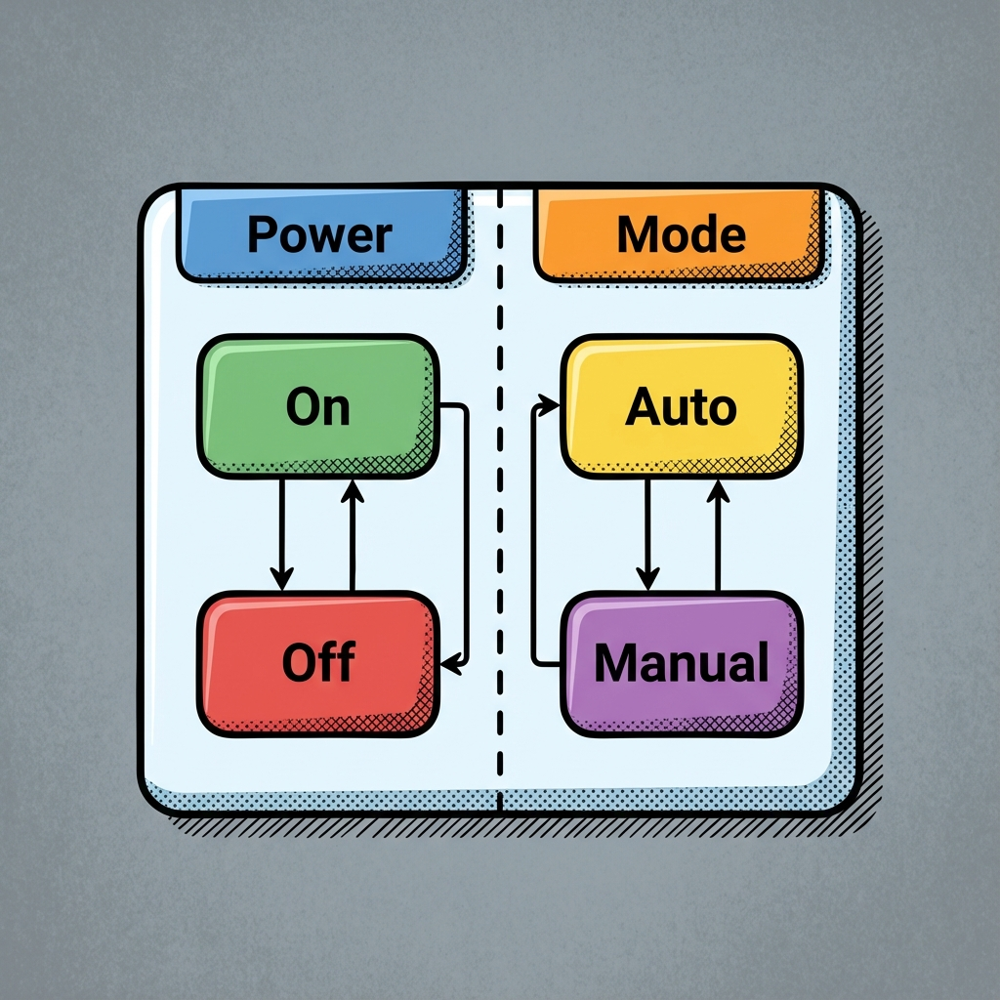

### 2.3.4 Parallele Zustandsautomaten

Modellierung von nebenläufigen, unabhängigen Prozessen:

1. **AND-Zustände:** Gleichzeitig aktive Sub-Zustände.
2. **Orthogonale Regionen:** Die parallelen Bereiche.
3. **Anwendungsbeispiele:** Strom-versorgung und Betriebsmodus.
4. **Synchronisation** zwischen parallelen Zuständen.

---

<div class="columns">
<div class="five">

#### Orthogonale (AND) Zustände

Manchmal müssen verschiedene Aspekte eines Systems gleichzeitig, aber unabhängig voneinander modelliert werden. Hierfür verwendet man **orthogonale Zustände**, auch **AND-Zustände** genannt.

Ein Super-Zustand wird durch eine gestrichelte Linie in mehrere parallele **Regionen** aufgeteilt. Jede Region enthält einen eigenen, unabhängigen Zustandsautomaten.

Wenn der Super-Zustand aktiv ist, ist in **jeder** seiner Regionen genau ein Sub-Zustand aktiv.

</div>
<div class="two">



</div>
</div>

---

<div class="columns">
<div>

#### Beispiel: Maschinen-Betriebsart

Ein gutes Beispiel ist eine Maschine, deren Energieversorgung und Betriebsstatus parallel verwaltet werden.

- **Region `Strom`:** Verwaltet, ob die Maschine am Netz (`Netzbetrieb`) oder per Akku (`Akkubetrieb`) läuft.
- **Region `Status`:** Verwaltet, ob die Maschine im `Leerlauf` ist oder `Aktiv` arbeitet.

Beide Zustände sind parallel aktiv!

</div>
<div>


</div>
</div>

---

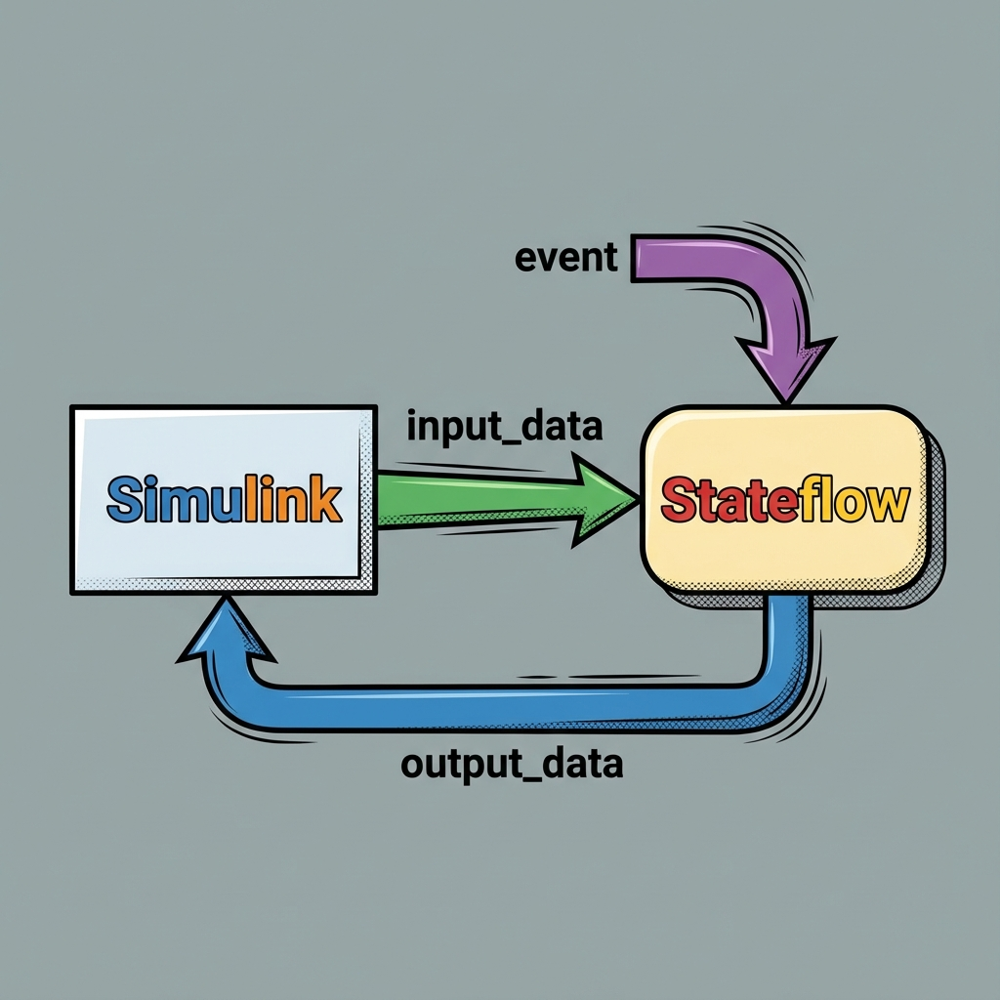

### 2.3.5 Ereignisse und Daten

Die Schnittstelle zwischen der Stateflow-Logik und der Außenwelt (Simulink):

1. **Datenobjekte:** `Input`, `Output`, `Local`, `Parameter` Daten.
2. **Ereignisse:** Einführung von `Input` und `Output Events`.
3. **Funktionsaufrufe:** Aufruf von Simulink Functions.
4. **Symbol-Manager** zur Verwaltung der Schnittstelle.

---

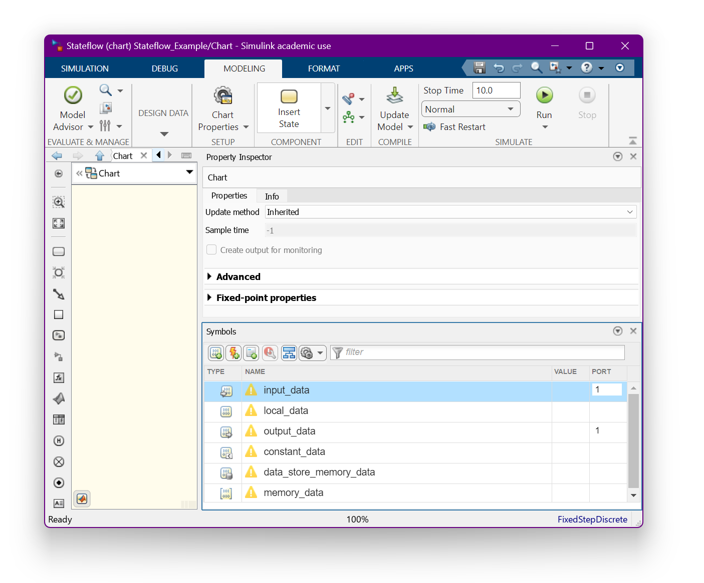

#### Datenobjekte

Stateflow tauscht Informationen mit Simulink über **Datenobjekte** aus. Diese werden in der **Symbol Pane** (früher "Model Explorer") definiert und typisiert.

Jedes Datenobjekt hat einen **Scope** (Gültigkeitsbereich), der festlegt, woher es kommt und wohin es geht.

---

| Scope | Richtung | Beschreibung |
| :--- | :--- | :--- |
| `Input` | Simulink &rarr; Stateflow | Ein Datensignal, das von Simulink gelesen wird. Stateflow kann diesen Wert nicht ändern. |
| `Output` | Stateflow &rarr; Simulink | Ein Datensignal, das von Stateflow geschrieben und an Simulink ausgegeben wird. |
| `Local` | Intern | Eine Variable, die nur innerhalb des Stateflow-Charts sichtbar und gültig ist. |
| `Parameter` | Konfiguration | Ein Wert, der von außerhalb gesetzt wird, um das Verhalten des Charts zu konfigurieren.  |
| `Data Store Memory`| Global | Eine globale Variable, die über das gesamte Simulink-Modell hinweg geteilt werden kann. |

---

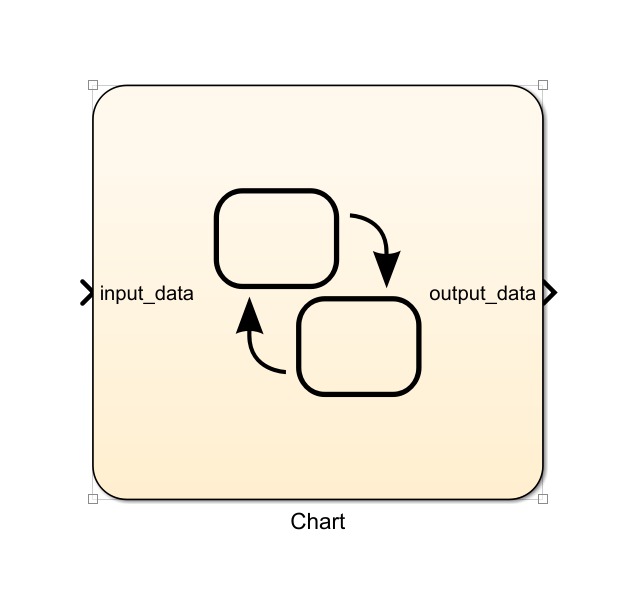

#### Input und Ouput Data Ports

TODO Beschreibung der Ports, die für Datenobjekte angelegt werden

---

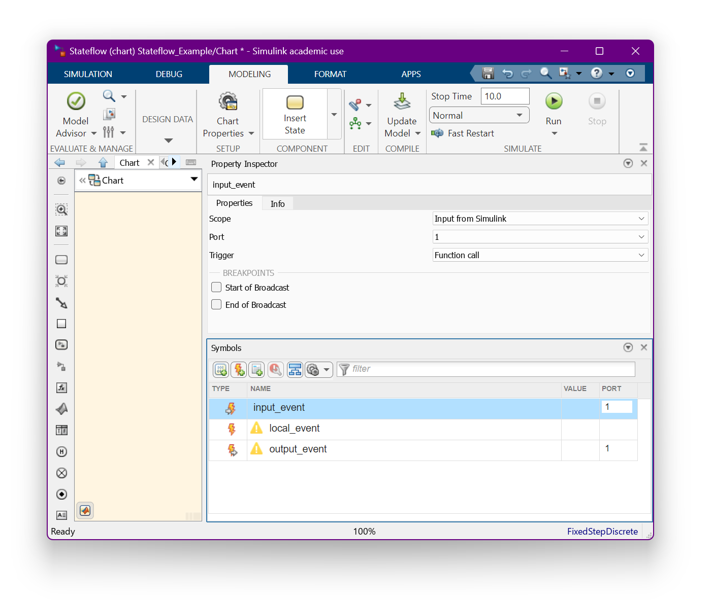

#### Ereignisse und Funktionsaufrufe

Neben dem kontinuierlichen Austausch von Daten kann Stateflow auch auf **Ereignisse** reagieren oder selbst welche auslösen.

Stateflow kann außerdem `Simulink Functions` oder `MATLAB Functions` direkt aufrufen, um komplexe Berechnungen auszulagern, anstatt die Logik im Chart selbst abzubilden.

---

#### Arten von Ereignissen

Die folgenden Arten von Ereginissen werden unterschieden:

- **Input Events:** Können von Simulink gesendet werden, um Übergänge direkt zu triggern (z.B. ein "rising edge" an einem Port).
- **Output Events:** Können von Stateflow Aktionen gesendet werden, um ereignisbasierte Subsysteme in Simulink zu aktivieren (`Function-Call Subsystems`).
- **Local Events:** TODO Beschreibung

---

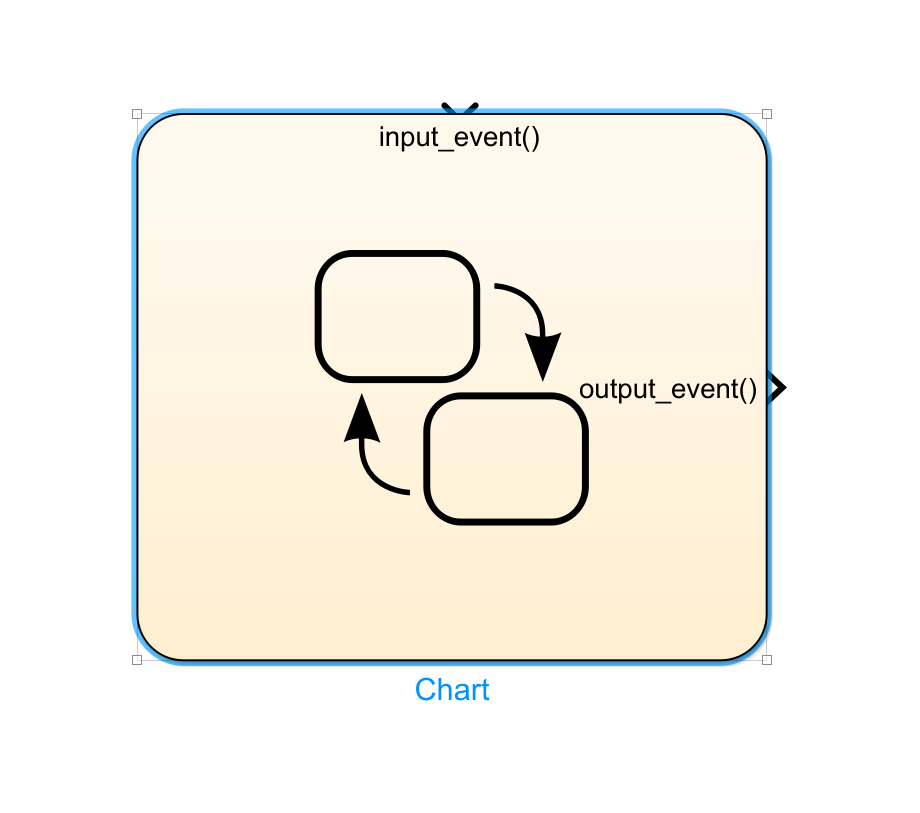

#### Input und Ouput Event Ports

TODO Beschreibung der Ports, die für Ereignisse angelegt werden

---

#### Beispiel: Tasten-Ereignis

`Input Events` sind ideal, um auf diskrete Ereignisse aus Simulink zu reagieren, ohne den Zustand bei jedem Zeitschritt abfragen zu müssen.

- Im Symbol-Manager wird ein `Input Event` namens `E_PRESS` definiert.
- In Simulink wandelt ein `Trigger`-Block oder ein `Hit Crossing`-Block ein Signal (z.B. einen Tastendruck) in dieses Ereignis um.
- Der Übergang im Stateflow Chart (z.B. von `Off` nach `On`) wird mit dem Ereignis als Auslöser versehen.
- Die Logik wird nur dann ausgeführt, wenn das Ereignis `E_PRESS` von Simulink gesendet wird, was die Simulationseffizienz erhöht.

---

#### Beispiel: Tasten-Ereignis (Simulink-Modell)


---

#### Beispiel: Motor aktivieren

`Output Events` sind nützlich, um Aktionen in Simulink basierend auf Stateflow-Logik auszulösen.

- Im Symbol-Manager wird ein `Output Event` namens `E_MOTOR_ON` definiert.
- Im Stateflow Chart wird dieses Ereignis als Übergangsaktion (`/E_MOTOR_ON`) oder Zustandsaktion (z.B. `entry: E_MOTOR_ON`) verwendet, um den Motor zu starten, wenn der Zustand `Operating` erreicht wird.
- In Simulink wird ein `Function-Call Subsystem` durch das `E_MOTOR_ON` Event ausgelöst, das die tatsächliche Motor-Aktivierung simuliert.
- Dies gewährleistet eine klare Schnittstelle zwischen der Steuerungslogik und den Aktuatoren im System.

---

#### Beispiel: Motor aktivieren (Stateflow-Chart)


---

#### Ereignis- und Funktions-Interaktion

Stateflow kann über Ereignisse und direkte Funktionsaufrufe eng mit Simulink interagieren, was eine ereignisgesteuerte Architektur ermöglicht.


---

### 2.3.6. Fallbeispiel: Akku-Schrauber

Im Rahmen dieses Kapitels wenden wir die gelernten Konzepte der Stateflow Logikmodelle auf das durchgängige Fallbeispiel eines Akku-Schraubers an.

Ziel ist es, die interne Steuerungslogik des Akku-Schraubers zu modellieren, z.B. Betriebsmodi, Fehlerzustände oder die Steuerung der LED-Beleuchtung.

---

#### Stateflow-Modell des **Betriebsmodus**

-   Ein Stateflow-Chart kann verschiedene Betriebsmodi wie `Ausgeschaltet`, `Leerlauf`, `Bohren` oder `Schrauben` darstellen.
-   Übergänge zwischen diesen Zuständen werden durch Ereignisse (z.B. `Einschaltknopf_gedrückt`, `Bohrermoment_erreicht`) oder Bedingungen (z.B. `Drehzahl_Null`) gesteuert.
-   `entry`-Aktionen könnten z.B. das Starten des Motors oder das Aktivieren der LED-Beleuchtung umfassen.

---

#### Stateflow-Modell der **LED-Steuerung**

-   Ein separater, paralleler Stateflow-Chart oder ein Sub-Zustand kann die Logik für die LED-Beleuchtung steuern.
-   Zustände könnten `LED_Aus`, `LED_An` (konstant), `LED_Blinken` (bei Fehlern oder Warnungen) sein.
-   Das `Output` Signal des Charts würde direkt an einen Simulink-Block (z.B. `Switch`) gesendet, der die LED ein- oder ausschaltet.

---

#### Stateflow-Modell der **Fehlerbehandlung**

-   Fehlerzustände wie `Akku_Leer`, `Ueberlast` oder `Ueberhitzt` können als separate Zustände modelliert werden.
-   Übergänge in diese Fehlerzustände werden durch entsprechende `Input` Daten (z.B. Akkuspannung, Motortemperatur) oder `Input Events` (z.B. `Ueberlast_Detektiert`) ausgelöst.
-   `entry`-Aktionen in Fehlerzuständen könnten das Abschalten des Motors, das Blinken einer Warn-LED oder das Protokollieren des Fehlers umfassen.

---


### 2.3.7. Übungsaufgabe

Modellieren Sie das Verhalten der Software-Komponenten des 3D-Druckers (z.B. die Betriebslogik der Heizung, die Steuerung der Lüfter) mithilfe von Stateflow Logikmodellen.

*Definieren Sie dabei Zustände, Übergänge, Aktionen und verwenden Sie gegebenenfalls hierarchische oder parallele Zustände zur Strukturierung.*

---

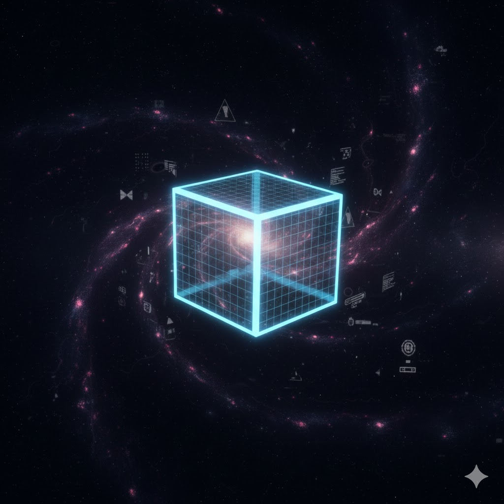

## 2.4 Simulink **3D Animation**

1. **Virtuelle Welten** (Die 3D-Szene im VRML/X3D-Format)
2. **Der VR Sink Block** (Die Brücke zwischen Simulink und 3D-Welt)
3. **Geometrien** (Grundformen wie Würfel, Kugel und Zylinder)
4. **Transformationen** (Objekte bewegen und rotieren)
5. **Kameras und Ansichten** (Die Perspektive wechseln)

---

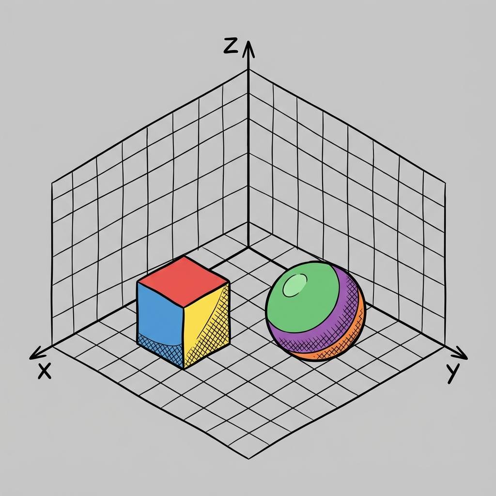

### 2.4.1 Virtuelle Welten

Die Grundlage für jede 3D-Visualisierung:

1. **VRML und X3D:** Standardforma-te zur Szenen-Beschreibung.
2. **Aufbau einer Welt:** Knoten, Felder und Routen.
3. **Erstellen und Bearbeiten:** Ver-wendung von 3D-Editoren.
4. **Einbinden in Simulink 3D Animation**

---

#### VRML und X3D

Simulink 3D Animation verwendet **VRML** (Virtual Reality Modeling Language) und dessen Nachfolger **X3D** als Dateiformate zur Beschreibung der 3D-Szene.

Diese textbasierten Formate definieren eine Szene als Baum von **Knoten (Nodes)**.
- **`Shape`**-Knoten definieren die sichtbare Geometrie (z.B. `Box`, `Sphere`, `Cylinder`).
- **`Appearance`**-Knoten beschreiben das Material und die Farbe.
- **`Transform`**-Knoten positionieren, rotieren und skalieren die Objekte, die sie enthalten.

Felder eines Knotens, die von Simulink aus gesteuert werden sollen, müssen mit `DEF` benannt werden.

---

#### Beispiel einer VRML-Datei

<div class="columns">
<div class="four">

```vrml
#VRML V2.0 utf8
Transform {
  children [
    DEF Roboterarm Transform {
      translation 0 1 0
      children [
        Shape {
          geometry Box { size 0.2 1 0.2 }
          appearance Appearance {
            material Material { diffuseColor 1 0 0 }
          }
        }
      ]
    }
  ]
}
```

</div>
<div>

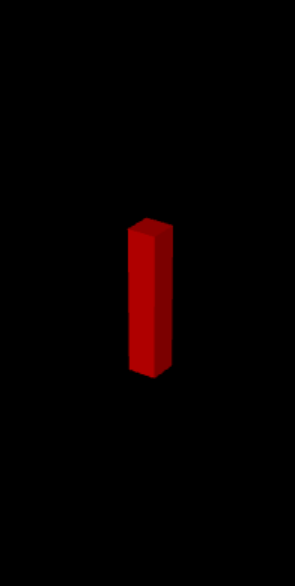

</div>
</div>

---

#### Von VRML zu X3D

**X3D** ist der Nachfolger von VRML und ein modernerer, ISO-genormter Standard für 3D-Web- und Broadcast-Grafiken.

- **XML-basiert:** X3D-Dateien verwenden eine XML-Syntax, was sie leichter parsebar und kompatibel mit vielen Web-Technologien macht.
- **Erweiterte Funktionen:** Bietet zusätzliche Knoten, Shader-Unterstützung (GLSL, etc.), Geo-Referenzierung und mehr.
- **Abwärtskompatibilität:** Simulink 3D Animation unterstützt beide Formate. X3D ist oft die bevorzugte Wahl für neue Projekte aufgrund seiner Flexibilität.
- **Classic-Encoding:** X3D unterstützt auch ein "Classic" Encoding, das der VRML-Syntax sehr ähnlich ist.

---

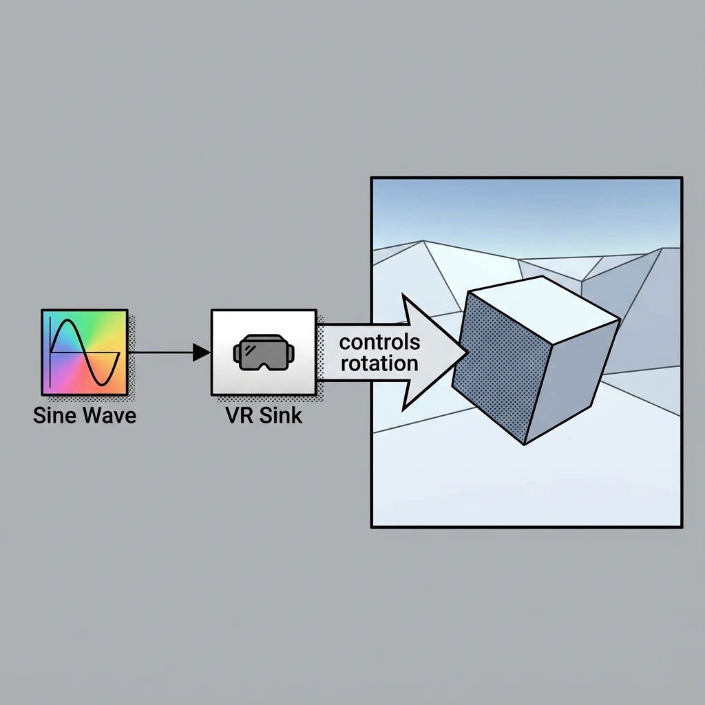

### 2.4.2 Der VR Sink Block

Schnittstelle, um Simulink-Signale in die 3D-Welt zu senden:

1. **Block-Parameter:** Zuordnung der virtuellen Welt.
2. **Signale verbinden:** Verknüpfung Simulink-Signal / 3D-Objekts.
3. **Baumstruktur der Welt:** Naviga-tion zu den Knoten und Feldern.
4. **Abtastzeit** und Auswirkung auf die Flüssigkeit der Animation.

---

#### Einrichtung des VR Sink Blocks

Der `VR Sink` Block ist die Brücke von Simulink zur 3D-Welt.

1.  **Welt laden:** Im Block-Dialog wird der Pfad zur `.wrl` oder `.x3d` Datei angegeben.
2.  **Knoten auswählen:** Nach dem Laden der Welt zeigt der Block eine Baumstruktur aller `DEF`-benannten Knoten an.
3.  **Feld auswählen:** Man wählt den Knoten (z.B. `Roboterarm`) und das zu steuernde Feld (z.B. `rotation` oder `translation`).
4.  **Signal verbinden:** Der Block erstellt einen Eingangs-Port, der mit dem entsprechenden Simulink-Signal verbunden wird. Die Dimension des Signals muss zum Feld passen (z.B. 3-Element-Vektor für `translation`).

---

#### Die VR Sink Benutzeroberfläche

Im Dialog des `VR Sink` Blocks wird die Verknüpfung zwischen Simulink und der 3D-Welt hergestellt. Man navigiert durch die Baumstruktur der `DEF`-benannten Knoten und wählt das Feld (z.B. `rotation`), das man mit einem Simulink-Signal steuern möchte.


---

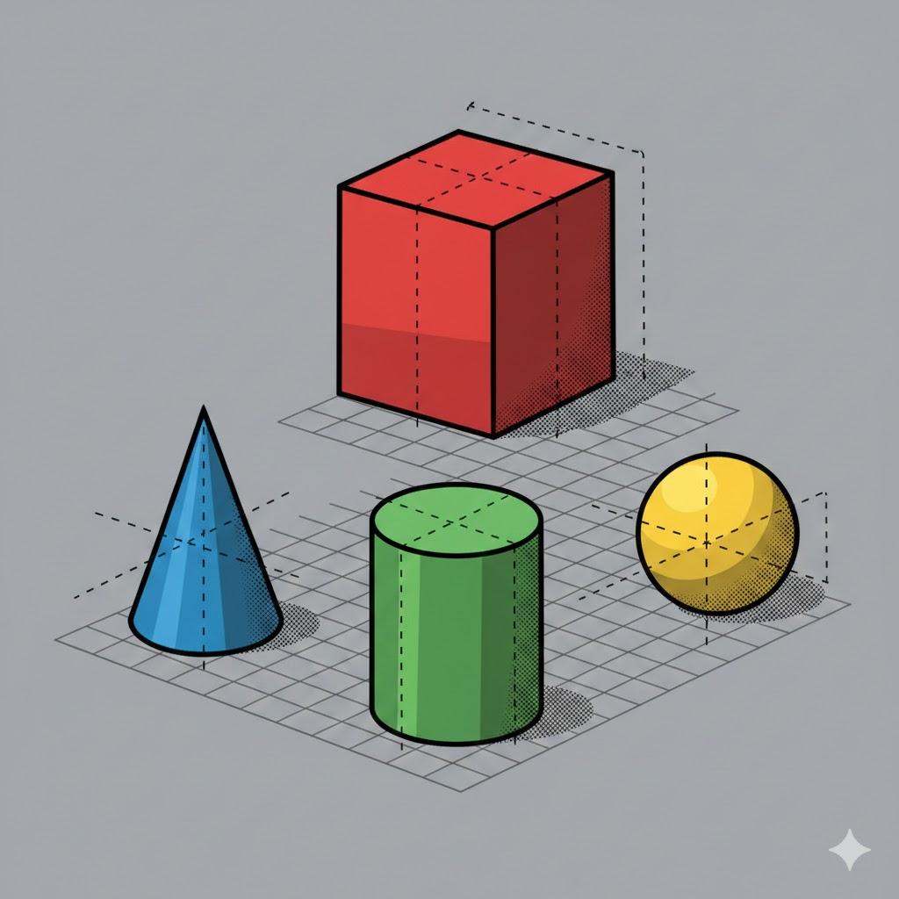

### 2.4.3 Geometrien

VRML (Virtual Reality Modeling Language) und X3D bieten eine Reihe vordefinierter Geometriegrund-formen, die den Aufbau von 3D-Szenen vereinfachen. Diese primitiven Formen sind effizient und flexibel einsetzbar.

1.  **Box** (Würfel, Quader)
2.  **Cone** (Kegel)
3.  **Cylinder** (Zylinder)
4.  **Sphere** (Kugel)

---

#### Box

Der `Box`-Knoten erzeugt einen Quader (standardmäßig einen Würfel). Die Größe des Quaders kann über das `size`-Feld definiert werden.

<div class="columns">
<div class="four">

```vrml
#VRML V2.0 utf8
Shape {
  geometry Box {
    size 2 1 0.5  # Breite, Höhe, Tiefe
  }
  appearance Appearance {
    material Material {
      diffuseColor 0.8 0.2 0.2  # Rot
    }
  }
}
```

</div>
<div class="two">

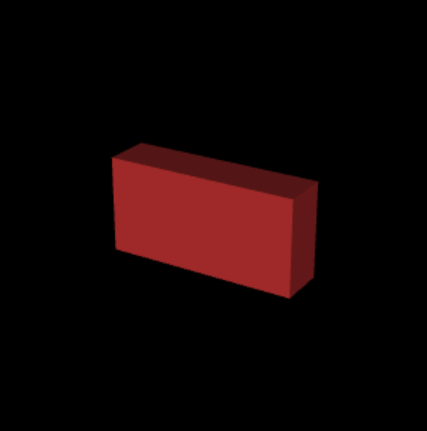

</div>
</div>

---

#### Cone

Der `Cone`-Knoten erzeugt einen Kegel. Seine Form wird durch `bottomRadius` und `height` bestimmt.

<div class="columns">
<div class="four">

```vrml
#VRML V2.0 utf8
Shape {
  geometry Cone {
    bottomRadius 1.0  # Radius an der Basis
    height 2.0        # Höhe des Kegels
  }
  appearance Appearance {
    material Material {
      diffuseColor 0.2 0.8 0.2  # Grün
    }
  }
}
```

</div>
<div class="two">


</div>
</div>

---

#### Cylinder

Der `Cylinder`-Knoten erzeugt einen Zylinder. Seine Abmessungen werden durch `radius` und `height` festgelegt.

<div class="columns">
<div class="four">

```vrml
#VRML V2.0 utf8
Shape {
  geometry Cylinder {
    radius 0.7  # Radius des Zylinders
    height 2.5  # Höhe des Zylinders
  }
  appearance Appearance {
    material Material {
      diffuseColor 0.2 0.2 0.8  # Blau
    }
  }
}
```

</div>
<div class="two">

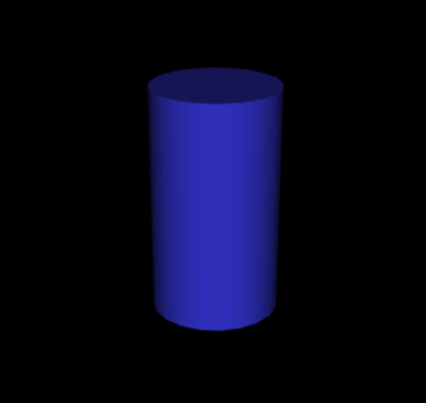

</div>
</div>

---

#### Sphere

Der `Sphere`-Knoten erzeugt eine Kugel. Ihre Größe wird durch das `radius`-Feld bestimmt.

<div class="columns">
<div class="four">

```vrml
#VRML V2.0 utf8
Shape {
  geometry Sphere {
    radius 1.5  # Radius der Kugel
  }
  appearance Appearance {
    material Material {
      diffuseColor 0.8 0.8 0.2  # Gelb
    }
  }
}
```

</div>
<div class="two">


</div>
</div>

---

#### Komplexe Geometrien: IndexedFaceSet

Für komplexe, nicht-primitive Formen bietet VRML den `IndexedFaceSet`-Knoten. Dieser Knoten erlaubt es, benutzerdefinierte 3D-Meshes zu definieren, indem er eine Liste von Vertices (Eckpunkten) und Indizes für deren Verbindung zu Flächen verwendet.

-   **`coord`:** Ein `Coordinate`-Knoten, der die Liste der 3D-Punkte (Vertices) enthält.
-   **`coordIndex`:** Eine Liste von Integern, die angeben, welche Vertices zu einer Fläche gehören. Ein `-1` trennt die einzelnen Flächen.
-   **`creaseAngle`:** Ein Winkel, der die Glättung von Flächenübergängen steuert.

Dies ist die flexibelste Methode, um detaillierte Modelle zu importieren oder zu erstellen.

---

<div class="columns">
<div>

```vrml
#VRML V2.0 utf8
Shape {
  geometry IndexedFaceSet {
    coord Coordinate {
      point [ # Beispiel: Pyramide
        0 1 0,   # Spitze (0)
        -1 0 -1, # Basis links hinten (1)
        1 0 -1,  # Basis rechts hinten (2)
        1 0 1,   # Basis rechts vorne (3)
        -1 0 1   # Basis links vorne (4)
      ]
    }
    coordIndex [
      0, 1, 2, -1, # Dreieck hinten links
      0, 2, 3, -1, # Dreieck hinten rechts
      0, 3, 4, -1, # Dreieck vorne rechts
      0, 4, 1, -1, # Dreieck vorne links
      1, 4, 3, 2, -1 # Basis (Viereck)
    ]
  }
  appearance Appearance {
    material Material {
      diffuseColor 0.7 0.7 0.7 # Grau
    }
  }
}
```

</div>
<div>


</div>
</div>

---

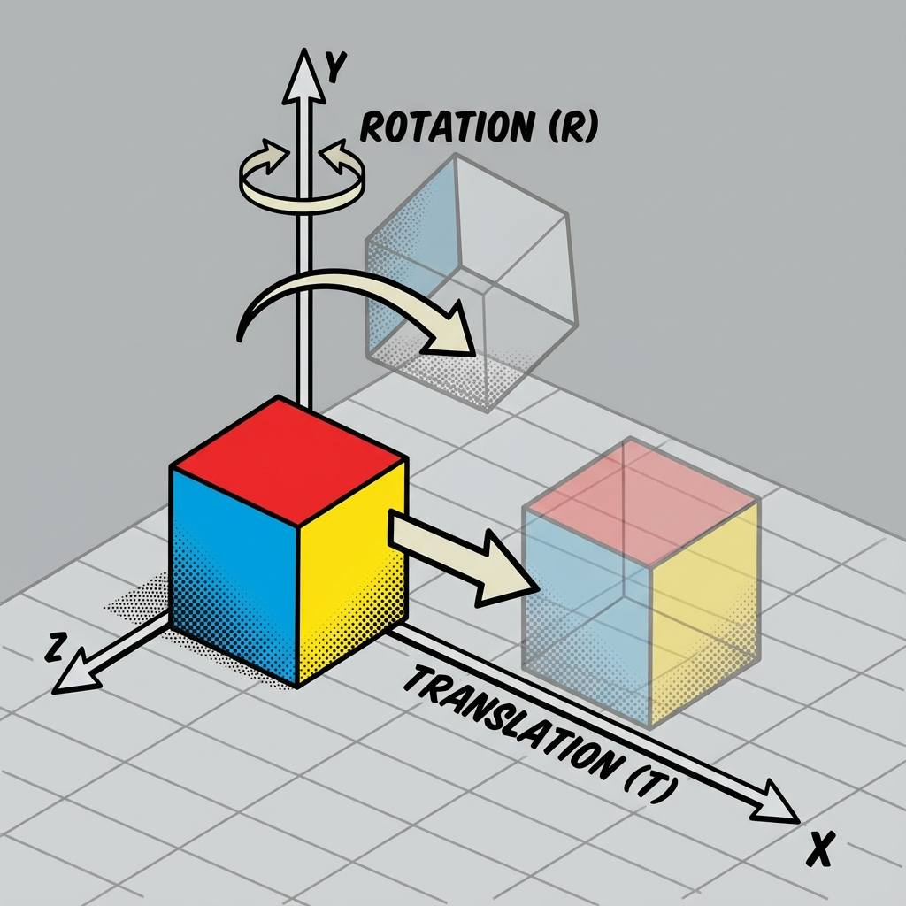

### 2.4.4 Transformationen

1. **Der `Transform`-Knoten:** Kapselt Geometrie und deren Position.
2. **Translation:** Verschiebung entlang der X-, Y- und Z-Achse.
3. **Rotation:** Drehung um eine beliebige Achse.
4. **Skalierung:** Ändern der Größe von Objekten.
5. **Hierarchische Transformationen:** Verknüpfung von Bewegungen.

---

#### Der `Transform`-Knoten

Der `Transform`-Knoten ist der wichtigste Knoten zur Animation von Objekten. Er wendet eine Reihe von Transformationen auf alle seine `children` (Kinder) an. Die wichtigsten Felder sind:

-   `translation [x y z]`: Verschiebt das Objekt um den angegebenen Vektor vom Ursprung seines übergeordneten Knotens.
-   `rotation [x y z angle]`: Rotiert das Objekt um die Achse `[x y z]` um den `angle` (in Radiant).
-   `scale [x y z]`: Skaliert das Objekt entlang der Achsen.
-   `children [...]`: Enthält die Knoten (z.B. andere `Transform`-Knoten oder `Shape`-Knoten), auf die die Transformation angewendet wird.

---

#### Beispiel: **Translation**

Dieses VRML-Beispiel zeigt einen Würfel, der entlang der X-, Y- und Z-Achse verschoben wird.

```vrml
#VRML V2.0 utf8
Transform {
  translation 1 0.5 -2  # Verschiebung um 1 Einheit auf X, 0.5 auf Y, -2 auf Z
  children [
    Shape {
      geometry Box { size 1 1 1 }
      appearance Appearance {
        material Material { diffuseColor 0 0.5 1 } # Blau
      }
    }
  ]
}
```

---

#### Beispiel: **Rotation**

Dieses VRML-Beispiel zeigt einen Würfel, der um die Y-Achse um 45 Grad (0.785 Radiant) rotiert wird.

```vrml
#VRML V2.0 utf8
Transform {
  rotation 0 1 0 0.785  # Rotation um Y-Achse, 45 Grad (0.785 rad)
  children [
    Shape {
      geometry Box { size 1 1 1 }
      appearance Appearance {
        material Material { diffuseColor 1 0.5 0 } # Orange
      }
    }
  ]
}
```

---

#### Beispiel: **Skalierung**

Dieses VRML-Beispiel zeigt einen Würfel, der in X-Richtung verdoppelt und in Y-Richtung halbiert wird.

```vrml
#VRML V2.0 utf8
Transform {
  scale 2 0.5 1  # Skalierung: X verdoppelt, Y halbiert, Z unverändert
  children [
    Shape {
      geometry Box { size 1 1 1 }
      appearance Appearance {
        material Material { diffuseColor 0.8 0.8 0 } # Gelb
      }
    }
  ]
}
```


---

#### Visuelle Effekte der Transformation

Jedes Feld im `Transform`-Knoten hat eine direkte visuelle Auswirkung auf das Objekt und sein lokales Koordinatensystem. Die Reihenfolge der Transformationen ist wichtig: Skalierung, dann Rotation, dann Translation.


---

<div class="columns">
<div class="five">

#### Hierarchische Transformationen

Um komplexe Bewegungen wie bei einem Roboterarm zu realisieren, werden `Transform`-Knoten ineinander geschachtelt.

-   Die **Basis** des Roboters ist ein `Transform`-Knoten relativ zum Welt-Ursprung.
-   Der **Oberarm** ist ein Kind der Basis. Seine Transformation ist relativ zur Basis.
-   Der **Unterarm** ist ein Kind des Oberarms. Seine Transformation ist relativ zum Oberarm.

Wenn sich also die Basis dreht, bewegen sich Ober- und Unterarm automatisch mit. Dies schafft eine kinematische Kette.

</div>
<div>



</div>
</div>

---

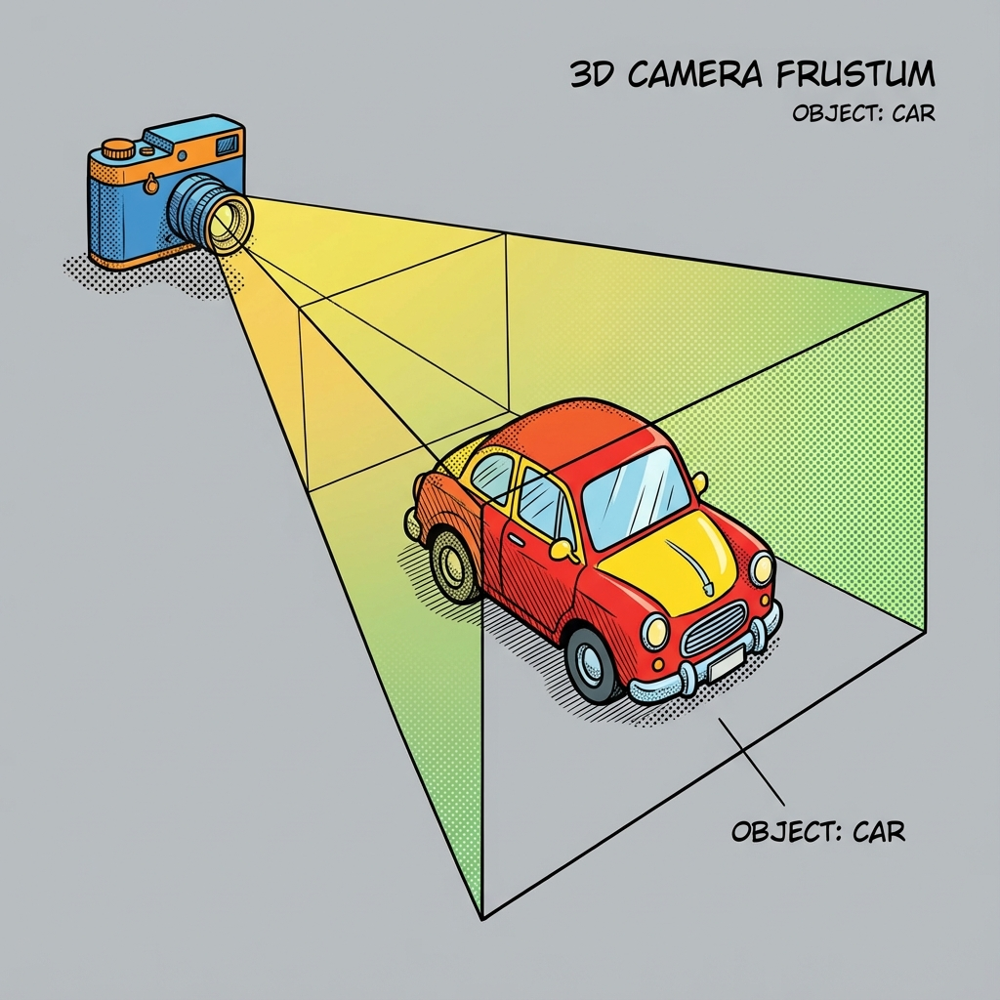

### 2.4.5 Kameras und Ansichten

Definition des Blickwinkels des Betrachters:

1. **Der `Viewpoint`-Knoten:** Defini-tion der Kamera der 3D-Szene.
2. **Position und Orientierung:** Wo befindet sich die Kamera?
3. **Blickfeld (Field of View):** Weit-winkel- oder Teleobjektiv-Effekt.
4. **Navigation:** Umschalten zwi-schen vordefinierten Ansichten.

---

#### Der `Viewpoint`-Knoten

Ein `Viewpoint`-Knoten definiert eine Kamera in der Szene. Man kann mehrere `Viewpoint`-Knoten erstellen, um zwischen verschiedenen Perspektiven zu wechseln.

Wichtige Felder:
-   `position [x y z]`: Der Standpunkt der Kamera im 3D-Raum.
-   `orientation [x y z angle]`: Die Ausrichtung der Kamera (Achse-Winkel-Repräsentation). Definiert, in welche Richtung die Kamera blickt.
-   `fieldOfView angle`: Der Öffnungswinkel der Kamera (in Radiant). Kleine Werte entsprechen einem Teleobjektiv, große Werte einem Weitwinkelobjektiv.
-   `description "Name"`: Der Name, der im Auswahlmenü des 3D-Viewers angezeigt wird.

---

#### Beispiel: **Standard**-Viewpoint

Dieses Beispiel definiert einen einfachen Viewpoint, der als Standardansicht dient.

```vrml
#VRML V2.0 utf8
WorldInfo { title "Einfache Szene mit Viewpoints" }
Viewpoint {
  position 0 1.6 8
  orientation 0 0 1 0
  fieldOfView 0.785
  description "Standardansicht"
}
# Hier würden weitere Szenenobjekte folgen
```

---

#### Beispiel: **Overhead**-Viewpoint

Dieses Beispiel zeigt eine Kamera, die von oben auf die Szene blickt.

```vrml
#VRML V2.0 utf8
WorldInfo { title "Einfache Szene mit Viewpoints" }
Viewpoint {
  position 0 10 0
  orientation 1 0 0 -1.57 # 90 Grad um die X-Achse gedreht
  fieldOfView 0.785
  description "Draufsicht"
}
# Hier würden weitere Szenenobjekte folgen
```

---

#### Beispiel: **Nahaufnahme**

Dieses Beispiel zeigt einen Viewpoint, der nah an einem Objekt positioniert ist, ideal für Detailansichten.

```vrml
#VRML V2.0 utf8
WorldInfo { title "Einfache Szene mit Viewpoints" }
Viewpoint {
  position 2 1 2
  orientation 0 1 0 0.785 # Leicht um die Y-Achse gedreht
  fieldOfView 0.5
  description "Nahaufnahme"
}
# Hier würden weitere Szenenobjekte folgen
```


---

#### Wechseln der Kameraperspektive

Im 3D-Viewer können Benutzer interaktiv zwischen allen in der Welt definierten `Viewpoint`-Knoten wechseln. Die `description` des Knotens wird dabei als Name im Auswahlmenü angezeigt. Dies ermöglicht geführte Sichten auf wichtige Aspekte der Simulation.


---

### 2.4.6. Fallbeispiel: Akku-Schrauber

In diesem Abschnitt wenden wir die gelernten Konzepte der Simulink 3D Animation auf das durchgängige Fallbeispiel eines Akku-Schraubers an.

Ziel ist es, die Bewegungen des Akku-Schraubers, insbesondere die Rotation des Bohrfutters und die LED-Beleuchtung, in einer virtuellen Umgebung zu visualisieren.

---

#### 3D-Modell des Akku-Schraubers

-   Ein detailliertes 3D-Modell des Akku-Schraubers im VRML- oder X3D-Format wird als Basis verwendet. Dieses Modell sollte separate `Transform`-Knoten für bewegliche Teile wie das Bohrfutter, den Abzug und die LED-Lichtquelle enthalten, die mit `DEF` benannt sind.
-   Die `.wrl` oder `.x3d` Datei wird in den `VR Sink` Block geladen.

---

#### Animation der **Bohrfutter-Rotation**

-   Das Ausgangssignal der Motor-Simulation (Winkelgeschwindigkeit) aus dem Simscape-Modell wird über einen `PS-Simulink Converter` in ein Simulink-Signal umgewandelt.
-   Dieses Signal wird dann integriert, um die aktuelle Winkelposition zu erhalten.
-   Der `VR Sink` Block wird konfiguriert, um das `rotation`-Feld des `Transform`-Knotens für das Bohrfutter mit diesem Winkelsignal zu steuern.

---

#### Animation der **LED-Beleuchtung**

-   Das Ausgangssignal der LED-Steuerungslogik (z.B. ein Binärsignal `0` oder `1` für Aus/An) aus dem Stateflow-Chart wird verwendet.
-   Im 3D-Modell des Akku-Schraubers sollte ein `Transform`-Knoten für die LED-Lichtquelle existieren. Dessen `emissiveColor`-Feld (oder ein ähnliches Feld zur Helligkeitssteuerung) kann über den `VR Sink` Block mit dem Stateflow-Ausgangssignal verbunden werden.
-   Alternativ könnte ein `Switch`-Knoten in VRML verwendet werden, um zwischen verschiedenen `Light`-Knoten zu wechseln, die die LED-Zustände repräsentieren.

---

#### Interaktive **Kameraführung**

-   Mehrere `Viewpoint`-Knoten im VRML/X3D-Modell können vordefinierte Kameraperspektiven bieten, z.B. eine Nahaufnahme des Bohrfutters, eine Draufsicht auf den gesamten Schrauber oder eine Benutzeransicht.
-   Diese Viewpoints können während der Simulation im 3D-Viewer umgeschaltet werden, um verschiedene Aspekte der Animation zu beobachten.

---


### 2.4.7. Übungsaufgabe

Visualisieren Sie die Bewegungen des 3D-Druckers, insbesondere die Bewegungen der Achsen und des Extruders, sowie die Statusanzeige (z.B. ein Display, LEDs) mithilfe von Simulink 3D Animation.

*Erstellen Sie dafür ein einfaches 3D-Modell des 3D-Druckers (oder nutzen Sie ein vorhandenes) und verknüpfen Sie die relevanten Simulink-Signale mit den Transformationen und Eigenschaften der 3D-Objekte.*
