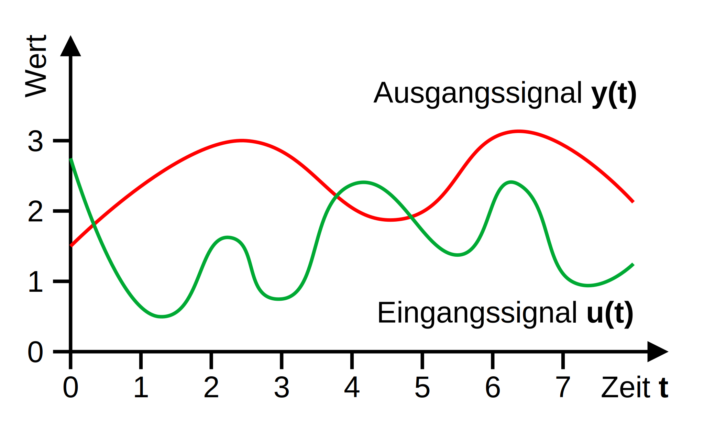
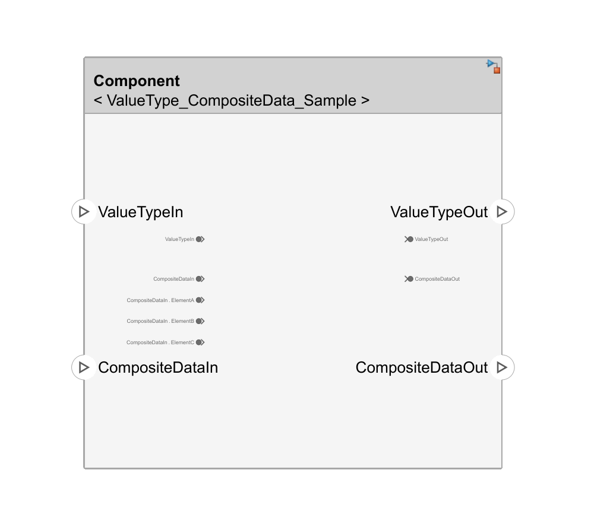
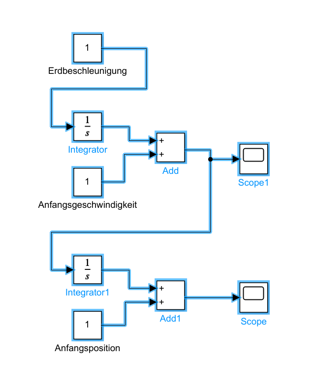

# Kapitel 2: Verhalten und Animationen

Dieses Kapitel umfasst die folgenden vier Abschnitte:

1. **Simulink Signalmodelle**
2. **Simscape Physikmodelle**
3. **Stateflow Logikmodelle**
4. **Simulink 3D Animation**

---

#### Das richtige Werkzeug für jede Aufgabe

Mechatronische Systeme sind oft *hybride* Systeme, die unterschiedliche Arten von Verhalten kombinieren. MATLAB & Simulink bieten spezialisierte Werkzeuge für jede dieser Aufgaben, die oft im selben Modell kombiniert werden.

##### Simulink: Signalfluss

Kausale Modellierung

*(Blöcke berechnen Ausgangsignale aus Eingangssignalen)*

`y(t) = f(t, u)`

##### Simscape: Physik

Akausale Modellierung

*(Blöcke definieren ein Gleichungssystem, das gelöst werden muss)*

`F(t, u, y) = 0`

##### Stateflow: Logik

Zustandsautomaten

*(Diskerete Zustände und Zustandsübergänge zu definierten Ereignissen)*

`On <-[Guard]-> Off`

---

## 2.1 Simulink **Signalmodelle**

In diesem ersten Abschnitt lernen wir die folgenden Dinge:

1. **Signale** (TODO)
2. **Blöcke** (TODO)
3. **Abtastzeiten** (TODO)
4. **Solver** (TODO)

---

### Simulink-Verhalten erstellen

Für jede atomare Komponente im System Composer kann ein  Verhalten in Simulink modelliert werden.

1.  **Rechtsklick** auf die Komponente.
2.  Wählen Sie im Kontextmenü `Create Behavior > Simulink Behavior`.
3.  System Composer erstellt ein neues, verknüpf-tes Simulink-Modell (`.slx`-Datei) und öffnet es.
4.  Die Ports der Komponente werden automatisch als In- und Out-Ports im Simulink-Modell angelegt.

---

### Bestehendes Verhalten verknüpfen

Bestehende Simulink-Modelle können wiederver-wendet werden, indem sie mit einer Komponente verknüpft werden.

1.  **Rechtsklick** auf die Komponente.
2.  Wählen Sie im Kontextmenü `Link to > Model`.
3.  Navigieren Sie zur gewünschten `.slx`-Datei und wählen Sie sie aus.

Dies ist ideal für die Wiederverwendung von Bibliothekskomponenten oder  existierenden Verhaltensmodellen.

---

### Vorschau des Verhaltens

Sobald einer Komponente ein Simulink-Verhalten zugewiesen ist, zeigt System Composer eine Miniatur-Vorschau des Simulink-Modells direkt im Komponentenblock an.

-   **Visuelle Referenz:** Gibt einen schnellen Überblick über die interne Logik.
-   **Navigation:** Ein **Doppelklick** auf die Komponente öffnet das verknüpfte Simulink-Modell zur Bearbeitung des Verhaltens.

---

### Was ist Simulink?

Simulink ist eine grafische Programmierumgebung für die Modellierung, Simulation und Analyse von dynamischen Systemen.

Es basiert auf dem Prinzip des **signalbasierten Designs**, bei dem Blöcke durch Linien verbunden werden, die den Signalfluss repräsentieren. Jede Linie transportiert ein Signal, z.B. einen Messwert oder einen Sollwert, von einem Block zum nächsten.

Simulink-Modelle werden über die Zeit simuliert, um das Verhalten eines Systems zu verstehen.

---

### 2.1.1. Signale

Signale und deren mathematische Eigenschaften:

- Signale als Zeitverlaufs-funktionen
- Stetigkeit und Nicht-Stetigkeit von Signalen
- Differenzierbarkeit von Signalen
- Abschnittsweise Differenzierbarkeit von Signalen
- Eingangs- und Ausgangssignale

---

#### Was ist ein Signal?

Ein **Signal** ist eine Funktion, die eine physikalische Größe über die Zeit beschreibt. Es repräsentiert den zeitlichen Verlauf von Informationen in einem System.

Mathematisch wird ein Signal als Funktion $s(t)$ ausgedrückt, wobei $t$ die Zeit ist. Der Wert des Signals zu einem Zeitpunkt $t$ kann sein:

- **Skalar:** Ein einzelner Wert (z.B. Temperatur).
- **Vektor:** Mehrere Werte (z.B. 3D-Position).
- **Matrix:** Eine Tabelle von Werten (z.B. Bilddaten).

---

#### **Stetigkeit** von Signalen

Eine erste wichtige mathematische Eigenschaften der Signalfunktionen ist deren **Stetigkeit**:

- **Stetige Signale:** Ein Signal ist stetig, wenn sein Verlauf keine Sprünge aufweist. Viele physika-lische Größen wie die Geschwindigkeit und Position eines Körpers werden so modelliert.

- **Nicht-stetige Signale:** Diese Signale weisen Sprungstellen auf, wie z.B. das Signal eines `Step`-Blocks. Sie sind entscheidend für die Model-lierung von Schaltvorgängen und Ereignissen.

---

#### **Differenzierbarkeit** von Signalen

Eine zweite wichtige mathematische Eigenschaft ist deren **Differenzierbarkeit:**

- **Differenzierbare Signale:** Sind "glatt" und stetig, d.h. sie besitzen an jedem Punkt eine eindeutige Ableitung. Dies ist ideal für die Modellierung von Systemen durch Differentialgleichungen.

- **Nicht-differenzierbare Signale:** Haben "Knick"-Stellen oder Sprünge, an denen keine eindeutige Ableitung existiert. Beispiele sind Rechtecksignale oder Signale mit abrupten Änderungen.

---

#### ***Abschnittsweise* Differenzierbarkeit** von Signalen

- Viele technische Signale sind nicht über ihren gesamten Verlauf differenzierbar, aber in einzelnen Abschnitten ("stückweise") schon.

- An den Übergangsstellen zwischen diesen Abschnitten (z.B. bei Sprüngen oder Knicken) ist das Signal nicht differenzierbar.

- Simulink-Solver sind darauf ausgelegt, solche abschnittsweise differenzierbaren Signale zu verarbeiten, indem sie die Integrationsschritte an den Unstetigkeitsstellen anpassen.

---

#### Eingangs- und Ausgangssignale

Simulink-Blöcke verarbeiten Signale. Dabei wird zwischen Ein- und Ausgangssignalen unterschieden:

- **Eingangssignale (Inputs):** Signale, die in einen Block hineinfließen. Sie sind die "Ursache" oder die Information, die der Block zur Druchführung seiner Berechnung benötigt.

- **Ausgangssignale (Outputs):** Signale, die von einem Block erzeugt und ausgegeben werden. Sie sind die "Wirkung" oder das Ergebnis der blockinternen Berechnung.

---

### 2.1.2. Blöcke

Blockarten und -funktionsweisen und die Simulink-Bibliothek:

1. Einfache zustandslose Blöcke
2. Allgemeine zustandslose Blöcke
3. Blöcke mit kontinuierlichen Zuständen
4. Blöcke mit diskreten Zuständen
5. Blöcke mit hybriden Zuständen
6. Die Simulink-Bibliothek

---

### Was ist ein Block?

Ein **Block** ist das grundlegende Element eines Simulink-Modells.

Er repräsentiert eine mathematische Funktion oder ein logisches Konstrukt, das **Eingangssignale** verarbeitet, um **Ausgangssignale** zu erzeugen.

Neben den Signalen umfassen Blöcke noch **Zustände** (eine Art *Gedächtnis*) und **Parameter** zur Konfiguration des Block-verhaltens.

---

#### ***Einfache* zustandslose** Blöcke

Im einfachsten Fall ist das Ausgabesignal $y$ zum Zeitpunkt $t$ ausschließlich abhängig vom Eingabessignal $u$ zum Zeitpunkt $t$.

Allgemein ergibt sich daraus folgender **mathematischer Zusammenhang** zwischen den beiden Signalfunktionen:

$y(t) = f(u(t))$

Das Beispiel auf der rechten Seite zeigt eine konkrete Formulierung für die Funktion $f$ für einen `Gain`-Block.

---

---

#### ***Allgemeine* zustandslose** Blöcke

Im etwas allgemeineren Fall ist das Ausgabesignal $y$ weiterhin ausschließlich abhängig von Eingangssignal $u$.

Jedoch kann der Zusammenhang hier z.B. auch **zeitversetzt** sein, woraus sich folgende Formulierung ergibt:

$y(t) = f(t, u)$

Das Beispiel auf der rechten Seite zeigt wieder eine konkrete Formulierung der Funktion $f$ für einen `Delay`-Block.

---

---

#### Blöcke mit ***kontinuierlichen* Zuständen**

**Zustandsfunktion** beschreibt den Zustand des Blocks über die Zeit kontinuierlich und lückenlos

$x_c(t) = \int\dot{x}_c(t)dt$

**Ableitungsfunktion** beschreibt die Änderung des Zustands über die Zeit ebenfalls kontinierlich und lückenlos

$\dot{x}_c(t) = f_d(t, x_c, u)$

**Ausgabefunktion** beschreibt die Ausgabesignale des Systems unter Berücksichtigung der Eingabesignale und des Zustands

$y(t) = f_o(t, x_c, u)$

---

----

#### Blöcke mit ***diskreten* Zuständen**

**Zustandssequenz** repräsentiert den Zustands des Blocks ausschließlich zu bestimmten *Zeitpunkten*

$x_d = x_{d_0}, x_{d_1}, x_{d_2}, ...$ mit Zeitpunkten $t_0,t_1,t_2,...$

**Aktualisierungsfunktion** beschreibt die Berechnung der jeweiligen *Folgezustände* aus den *Vorgängerzuständen*

$x_{d_{k+1}} = f_u(t_{k+1}, x_c, x_{d_k}, u)$

**Ausgabefunktion** (mit $t_k \leq t < t_{k+1}$) beschreibt die Ausgabe *abschnittsweise* zwischen den Zustanssprüngen

$y(t) = f_o(t, x_{d_k}, u)$

---

---

#### Blöcke mit ***hybriden* Zuständen**

**Zustandsfunktion** und **-sequenz** kombiniert in einem Tupel

$x = (x_c,x_d)$

**Aktualisierungsfunktion** für diskrete Zustandssprünge

$x_{d_{k+1}} = f_u(t_{k+1},x_c,x_{d_k},u)$

**Ableitungfunktion** (mit $t_k \leq t < t_{k+1}$) nun abschnittsweise

$\dot{x}_c(t) = f_d(t,x_c,x_{d_k},u)$

**Ausgabefunktion** (mit $t_k \leq t < t_{k+1}$) auch abschnittsweise

$y(t) = f_o(t,x_c,x_{d_k},u)$

---

---

#### Die Simulink-Bibliothek

Die Simulink-Bibliothek biete eine Vielzahl von vordefinierten Blöcken:

- **Sources + Sinks:** Signale erzeugen und visualisieren
- **Math Operations:** Einfache mathematische Operationen
- **Continuous + Discrete:** Glatte und sprunghafte Funktionen
- **Ports & Subsystems:** Kapselung und Wiederverwendung

---

##### Wichtige Blöcke: **Sources**

Quellen sind der Ausgangspunkt für Signale in einem Simulink-Modell.

*Erzeugt einen konstanten Wert.*

*Erzeugt eine Sprungfunk-tion zu einer bestimmten Zeit.*

*Erzeugt ein sinusförmiges Signal mit einstellbarer Amplitude, Frequenz und Phase.*

---

##### Wichtige Blöcke: **Sinks**

Senken dienen zur Analyse und Anzeige von Signalen während und nach der Simulation.

*Zeigt den numerischen Wert eines Signals am Ende der Simulation an.*

*Zeigt Signale in einem Oszilloskop-ähnlichen Diagramm an.*

*Schreibt Signaldaten in eine MAT-Datei zur späteren Analyse.*

---

##### Wichtige Blöcke: **Math Operations**

Diese Blöcke führen grundlegende mathematische Operationen mit Signalen durch.

*Multipliziert ein Signal mit einem konstanten Faktor (Verstärkung).*

*Addiert oder subtrahiert zwei oder mehr Signale elementweise.*

*Berechnet einen Polynomwert für das Eingangssignal.*

---

##### Wichtige Blöcke: **Continuous**

Diese Blöcke sind das Herzstück für die Modellierung von physikalischen Systemen, die durch Differentialgleichungen beschrieben werden.

*Verzögert das Eingangssignal um eine bestimmte Zeit.*

*Führt eine kontinuierliche Integration des Eingangssignals durch.*

*Führt eine doppelte kontinuierliche Integration des Eingangssignals durch.*

---

##### Wichtige Blöcke: **Discrete**

Diese Blöcke modellieren diskrete Systeme oder diskrete Anteile in hybriden Systemen.

*Speichert den Wert des Eingangssignals vom vorherigen Zeitschritt.*

*Führt eine diskrete Integration des Eingangssignals durch.*

*Berechnet die diskrete Ableitung des Eingangssignals.*

---

##### Wichtige Blöcke: **Ports & Subsystems**

Diese Blöcke sind essenziell für die hierarchische Gliederung und Wiederverwendung von Modellen.

*Definiert einen Eingang für ein Subsystem oder Modell.*

*Definiert einen Ausgang für ein Subsystem oder Modell.*

*Gruppiert Blöcke, um ein hierarchisches Subsystem zu erstellen.*

---

### Port-Zuordnung

Die Ports einer System Composer Komponente werden direkt auf die `Inport`- und `Outport`-Blöcke im Simulink-Modell abgebildet.

-   **Eindeutige Namen:** Der Name eines Ports im Architekturmodell muss mit dem Namen des entsprechenden Port-Blocks im Simulink-Modell übereinstimmen.
-   **Konsistente Schnittstellen:** Die auf den Ports definierten Schnittstellen (Datentyp, Dimension, etc.) müssen mit den Simulink-Signaleigenschaften kompatibel sein.

---

### Komponente vs. Subsystem

Obwohl beide zur Gliederung von Modellen dienen, haben sie unterschiedliche Zwecke.

#### System Composer **Komponente**

-   **Was?** Ein Baustein der Systemarchitektur.
-   **Wo?** Wird in `.slx`-Dateien für Architekturmodelle verwendet.
-   **Zweck:** Definiert die Struktur und die Schnittstellen eines Systems (`Wer?`).
-   **Ports:** Formale Ports, die auf Schnittstellen basieren.

#### Simulink **Subsystem**

-   **Was?** Eine Gruppierung von Blöcken.
-   **Wo?** Wird in `.slx`-Dateien für Verhaltensmodelle verwendet.
-   **Zweck:** Kapselt eine detaillierte Funktion oder Logik innerhalb eines Verhaltensmodells (`Wie?`).
-   **Ports:** Einfache In- und Outports ohne formale Definition.

---

### 2.1.3. Abtastzeiten

In diesem Abschnitt betrachten wir die folgenden Arten von Abtastzeiten für Simulink-Blöcke:

1. **Konstante Abtastzeiten**
2. **Variable Abtastzeiten**
3. **Diskrete Abtastzeiten**
4. **Mehrratige Abtastzeiten**
5. **Kontinuierliche Abtastzeiten**
6. **Vererbte Abtastzeiten**

---

### Was sind Abtastzeiten?

Die **Abtastzeit** (`Sample Time`) eines Blocks legt fest, zu welchen Zeitpunkten er ausge-führt wird, d.h. wann seine Ausgänge und sein interner Zustand aktualisiert werden.

- **Effizienz:** Eine korrekte Konfiguration der Abtastzeiten ist entscheidend für die Geschwindigkeit der Simulation.
- **Genauigkeit**: Die Konfiguration hat außerdem eine Auswirkung auf die Genaugkeit der Simualtionsergebnisse.
- **Definition:** Die Abtastzeit wird typischerweise als zweidimensionaler Vektor `[Periode, Offset]` definiert.
- **Typen**: Konstant, variabel, diskret, mehrratig, kontinuierlich, kontinuierlich mit festem kleinen Zeitschritt, und vererbt

---

#### **Konstante** Abtastzeiten `[inf, 0]`

Blöcke mit konstanter Abtastzeit werden nur **einmal zu Beginn** der Simulation (`t=0`) ausgewertet.

- Ihr Ausgangswert bleibt während der gesamten Simulationsdauer unverändert.
- Dies ist nützlich für Parameter oder Sollwerte, die sich nicht ändern.

**Beispiel:** Ein `Constant`-Block, der den Wert der Erdbeschleunigung (`9.81`) für eine Simulation bereitstellt.

---

#### **Variable** Abtastzeiten `[-2, Tvo]`

Blöcke mit variabler Abtastzeit bestimmen zur Laufzeit selbst, wann ihr nächster Ausführungs-zeitpunkt liegt (`NextTimeHit`).

-  Nützlich für Blöcke, die auf unregelmäßige Ereignisse reagieren müssen.

**Beispiel:** Der `Hit Crossing`-Block überwacht ein Signal und weist den Solver an, genau dann einen Zeitschritt auszuführen, wenn das Signal einen Schwellenwert kreuzt (`ZeroCrossings`), z.B. präzise mechanische Anschläge.

---

#### **Diskrete** Abtastzeiten `[Ts, To]`

Der Block wird in regelmäßigen Intervallen ausgeführt (z.B. digitale Signalverarbeitung).

- **`Ts` (Sample Time):** Der zeitliche Abstand zwischen zwei Ausführungen.
- **`To` (Offset):** Eine anfängliche Zeitverzögerung.
- Die Ausführungszeitpunkte sind also `To, To + Ts, To + 2*Ts, ...`.

**Beispiel:** Ein `Discrete-Time Integrator`-Block mit `[0.1, 0]` wird alle 0,1 Sekunden ausgeführt.

---

#### **Mehrratige** Abtastzeiten

Ein Modell ist mehrratig, wenn es Blöcke mit **unterschiedlichen Abtastzeiten** enthält.

-  Erfordert Synchronisation zwischen den verschiedenen "Zeitdomänen", um Daten-verlust oder Inkonsistenzen zu vermeiden.

**Beispiel:** Ein *schneller* digitaler Regler (`Ts = 0.01s`) interagiert mit einem *langsameren* physikalischen Streckenmodell (`Ts = 0.1s`). Zwischen den beiden Teilen ist ein `Rate Transition`-Block notwendig.

---

#### **Kontinuierliche** Abtastzeiten `[0, 0]`

Blöcke mit dieser Abtastzeit werden in jedem Simulationszeitschritt ausgeführt.

- **Anwendung:** Wird für Blöcke verwendet, die kontinuierliche Zustände haben (z.B. `Integrator`) und deren Verhalten durch Differentialgleichungen beschrieben wird.
- **Festlegung:** Erfordert einen Solver für kontinuierliche Systeme (z.B. `ode45`), der die Schrittweite dynamisch anpasst, um die Genauigkeit zu gewährleisten.
- **Aufteilung:** Solver arbeiten mit *großen* Zeitschritten zur Signalaufzeichnung sowie mit *kleinen* Zeitschritten, um die Genauigkeit zu verbessern.

**Beispiel:** Ein `Integrator`-Block, der die *Geschwindigkeit* eines Fahrzeugs integriert, um dessen *Position* zu berechnen. Da die Bewegung ein kontinuierlicher physikalischer Prozess ist, muss der Block kontinuierlich arbeiten, um eine Positionskurve zu erhalten.

---

#### Kontinuierliche Abtastzeiten **mit festem kleinen Zeitschritt** `[0, 1]`

Diese spezielle Einstellung signalisiert, dass der Block zwar kontinuierlich ist, aber der Solver einen festen, sehr kleinen Zeitschritt verwenden soll, um das Verhalten anzunähern.

- Wird seltener verwendet und ist für spezielle Anwendungsfälle gedacht, bei denen eine Annäherung an ein kontinuierliches Verhalten mit fester Schrittweite erforderlich ist.

**Beispiel:** In einem Modell, das für die *Echtzeit-Hardware-in-the-Loop (HIL)-Simulation* vorgesehen ist, muss der Solver mit einer festen Schrittweite laufen, die der Abtastrate der Hardware entspricht. Ein kontinuierlicher Block in diesem Modell könnte `[0, 1]` verwenden, um anzuzeigen, dass er sich an diese feste Schrittweite anpasst.

---

#### **Vererbte** Abtastzeiten `[-1, 0]`

Dies ist die Standardeinstellung für viele Blöcke. Der Block **erbt** seine Abtastzeit von dem Block, der mit seinem Eingang verbunden ist.

- **Vorteil:** Sorgt für Konsistenz der Abtastzeiten entlang des Signalflusses und reduziert den Konfigurationsaufwand.
- **Konsistenz:** Ausgangssignale werden mit exakt derselben Abtastzeit neu berechnet wie Eingangssignale eines Blocks.

**Beispiel:** Ein `Gain`-Block, der mit dem Ausgang eines `Sine Wave`-Blocks verbunden ist, der mit einer Abtastzeit von 0.01s konfiguriert ist. Der `Gain`-Block erbt automatisch die Abtastzeit von 0.01s und wird somit mit der gleichen Frequenz wie die Sinuswelle aktualisiert.

---

### Abtastzeit **konfigurieren**

Die Abtastzeit eines Blocks kann in dessen **Blockparametern** eingestellt werden.

- **Doppelklick** auf einen Block öffnet den Parameterdialog.
- Unter dem Reiter `Main` (oder `Block Properties`) findet sich oft das Feld `Sample time`.
- Hier kann der gewünschte Wert (z.B. `0.1` für eine diskrete Abtastzeit von 100ms oder `-1` für vererbt) eingetragen werden.

---

### Abtastzeiten **visualisieren**

Simulink kann die verschiedenen Abtastzeiten im Modell farblich hervorheben, um die Analyse zu erleichtern.

- Gehen Sie im Menü auf `Debug > Information Overlays > Sample Time > Colors`.
- Jeder Abtastzeit wird eine eindeutige Farbe zugewiesen.
- Die **Sample Time Legend** (erreichbar über dasselbe Menü) zeigt die Zuordnung von Farben zu Abtastzeiten an.

---

### 2.1.4. Solver

In diesem Abschnitt betrachten wir die folgenden Themen:

- **Simulationsphasen** (die große Klammer um die jeweilige Simulationsrechnung)
- **Solver-Arten** (die Logik zur Bestimmung der Zeitschritte und Berechnung von Werten)
- **Nulldurchgangserkennung** (eine wichtige Methode für eine hohe Genauigkeit)

---

#### Simulationsphasen

Eine Simulink-Simulation durchläuft typischerweise zwei Hauptphasen:

1.  **Initialisierungsphase:** Simulink wertet Blockparameter aus, berechnet Anfangszustände und bestimmt die Abtastzeiten.
2.  **Simulationsschleife (Ausführungsphase):** Der Solver bestimmt die größe der Zeitschritte und berechnet die Ausgänge, Zustände und Ableitungen des Modells. Diese Phase wiederholt sich, bis die Simulationszeit endet oder ein Abbruchkriterium erfüllt ist.

---

#### Solver-Auswahl

Die Grafik auf der rechten Seite zeigt den Entscheidungsbaum für die Auswahl:

- Zunächst ist zu klären, ob mit einem **festen Schritt** (*diskret* oder *Echtzeit-anforderung*) oder mit **variablen Schritten** gerechnet werden soll.
- Danach hängt die Entscheidung noch davon ab, ob das Modell **kontinuierliche Zustände** beinhaltet oder nicht.

---

#### **Automatische** Solver-Auswahl

Simulink bietet auch die Möglichkeit, den Solver automatisch auszuwählen:

- Die Auswahl hängt zudem noch davon ab, ob das Modell eine **gewöhnliche Differentialgleichung** oder eine **differential-algebraische Gleichung** ist.
- Zudem hängt die Auswahl bei ge-wöhnlichen Differentialgleichungen von deren **Steifigkeit** ab.

---

#### Gewöhnliche Differentialgleichungen (ODEs)

Viele physikalische Systeme werden durch **gewöhnliche Differentialgleichungen (ODEs)** beschrieben. Eine ODE ist eine mathematische Gleichung, die die zeitliche Änderung eines Systemzustands beschreibt.

Die allgemeine Form einer ODE erster Ordnung lautet:

$\dot{x} = f(t, x)$

- $x$ ist der **Zustandsvektor** des Systems (z.B. Position und Geschwindigkeit).
- $\dot{x}$ ist die erste Ableitung von $x$ nach der Zeit $t$.
- $f$ ist eine Funktion, die die Dynamik des Systems beschreibt.

Simulink-Solver sind darauf ausgelegt, solche Gleichungssysteme numerisch zu lösen, um den Verlauf von $x(t)$ zu finden.

---

#### Beispiel: Vertikaler Wurf (Mathematik)

Wir betrachten den vertikalen Wurf eines Balls in einem Gravitationsfeld ohne Berücksichtigung des Luftwiderstands. Die Bewegung des Balls kann durch eine gewöhnliche Differentialgleichung beschrieben werden.

Die Beschleunigung in y-Richtung ist:

$\ddot{y} = -g$ (wobei $g$ die Erdbeschleunigung ist)

Um dies in ein System von ODEs erster Ordnung umzuwandeln, definieren wir die Zustandsgrößen als Position ($y$) und Geschwindigkeit ($v$):

$\dot{y} = v$
$\dot{v} = -g$

---

#### Beispiel: Vertikaler Wurf (Simulink)

Im Simulink-Modell würde man:
1.  Drei `Constant`-Blöcke verwenden, um $-g$, $v_0$ und $y_0$ zu definieren.
2.  Zwei `Integrator`-Blöcke verwenden, um $-g$ zu $v$ und $v$ zu $y$ zu integrieren.
3.  Zwei `Scope`-Blöcke verwenden, um $v$ und $y$ zu visualisieren.

---

#### Steifigkeit von ODEs ("Stiff" Systems)

Ein Differentialgleichungssystem wird als **steif** bezeichnet, wenn es Zeitkonstanten enthält, die sich über mehrere Größenordnungen erstrecken.

Das bedeutet, das System hat Komponenten, die sich **sehr schnell** ändern, und andere, die sich **sehr langsam** ändern.

**Problem:** Explizite (nicht-steife) Solver wie `ode45` müssen extrem kleine Zeitschritte verwenden, um die schnellen Änderungen stabil zu erfassen. Dies macht die Simulation ineffizient, besonders wenn die schnelle Dynamik bereits abgeklungen ist.

**Lösung:** Implizite (steife) Solver wie `ode15s` sind für solche Probleme konzipiert. Sie sind pro Schritt rechenintensiver, können aber deutlich größere Zeitschritte stabil bewältigen, was die Gesamtsimulationszeit drastisch reduziert.

---
### Beispiel : RC-Schaltung (Allgemein)

Ein klassisches Beispiel für ein steifes System ist eine elektrische Schaltung, die Komponenten mit sehr unterschiedlichen Zeitkonstanten enthält. Betrachten wir zwei RC-Glieder in Reihe:

- **Schnelles RC-Glied:** Hat eine sehr kleine Zeitkonstante ($\tau_1 = R_1 C_1$). Es reagiert sehr schnell auf Änderungen der Eingangsspannung.
- **Langsames RC-Glied:** Hat eine große Zeitkonstante ($\tau_2 = R_2 C_2$). Es reagiert langsam auf Änderungen.

Wenn $\tau_1 \ll \tau_2$ ist, ist das System steif. Ein expliziter Solver müsste die gesamte Simulation über sehr kleine Zeitschritte verwenden, um die schnelle Dynamik des ersten RC-Glieds korrekt zu erfassen, selbst wenn diese Dynamik längst abgeklungen ist.

---

#### Beispiel: RC-Schaltung (Mathematik)

**Differentialgleichungen:**

$\dot{V}_1 = \frac{1}{R_1 C_1}(V_{in} - V_1)$
$\dot{V}_2 = \frac{1}{R_2 C_2}(V_1 - V_2)$

**Verhalten:**
Bei einer Sprungfunktion als $V_{in}$ steigt $V_1$ sehr schnell an und erreicht fast sofort den Endwert. $V_2$ folgt $V_1$ jedoch viel langsamer.

Ein steifer Solver kann die schnelle Anfangsphase mit kleinen Schritten und die langsame Folgephase mit großen Schritten effizient simulieren.

---

#### Beispiel: RC-Schaltung (Simulink)

1.  **Sources:** Ein `Step`-Block liefert die Eingangsspannung $V_{in}$, `Constant`-Blöcke definieren die  Wiederstände $(R_1, R_2)$ und Kapazitäten $(C_1, C_2)$.
3.  **Math Operations:** `Subtract`-, `Product`- und `Divide`-Blöcke werden verwendet, um die Terme $\frac{1}{R_1 C_1}(V_{in} - V_1)$ und $\frac{1}{R_2 C_2}(V_1 - V_2)$ zu bilden.
2.  **Continuous:** Für jede Spannung ($V_1, V_2$) wird ein `Integrator`-Block verwendet.

---

#### Differential-Algebraische Gleichungen (DAEs)

**Differential-Algebraische Gleichungen (DAEs)** sind Systeme von Gleichungen, die sowohl Differentialgleichungen als auch algebraische Gleichungen enthalten. Im Gegensatz zu gewöhnlichen Differentialgleichungen (ODEs) können DAEs nicht immer in eine explizite Form $\dot{x} = f(t, x)$ umgewandelt werden.

Die allgemeine Form einer DAE ist:
$F(t, x, \dot{x}) = 0$

- $x$ ist der Vektor der abhängigen Variablen.
- $\dot{x}$ ist der Vektor der Ableitungen.
- $F$ ist eine Funktion, die sowohl Differential- als auch algebraische Beziehungen ausdrückt.

---

TODO Beispiel für einfaches DAE

---

TODO Umsetzung des einfachen DAE in Simulink

---

TODO Folie - Fixed-Step Discrete Solver Funktionsprinzip

---

TODO Folie - Variable-Step Discrete Solver Funktionsprinzip

---

TODO Folie - Fixed-Step Continuous Solver Funktionsprinzip

---

TODO Folie - `ode3` Funktionsprinzip

---

TODO Folie - `ode14x` Funktionsprinzip

---

TODO Folie - Variable-Step Continuous Solver Funktionsprinzip

---

TODO Folie - `ode15s` Funktionsprinzip

---

TODO Folie - `ode45` Funktionsprinzip

---

TODO Folie - `ode23t` Funktionsprinzip

---

### 2.1.5. Fallbeispiel: Akku-Schrauber

Wir modellieren das vereinfachte Verhalten des Motors. Annahme: Die Drehzahl des Motors ist direkt proportional zur angelegten Spannung, abzüglich eines Lastmoments.

---

#### TODO Folienüberschrift

TODO kurzer Text

- Ein `Constant`-Block repräsentiert die Spannung vom Akku.
- Ein `Gain`-Block modelliert den Motor (wandelt Spannung in Drehzahl um).
- Ein `Subtract`-Block reduziert die Drehzahl durch ein Lastmoment.
- Ein `Scope` zeigt die resultierende Motordrehzahl an.

---

### 2.1.6. Übungsaufgabe

Modellieren Sie mit Simulink das Verhalten des Extruders eines 3D-Druckers.

Vereinfachte Annahme: Die Menge des extrudierten Filaments pro Sekunde ist direkt proportional zur Geschwindigkeit des Vorschubmotors.

Stellen Sie die Vorschubgeschwindigkeit mit einem `Step`-Block dar und visualisieren Sie die Gesamtlänge des extrudierten Filaments über die Zeit mit einem `Scope`.

---

## 2.2 Simscape **Physikmodelle**

In diesem zweiten Abschnitt lernen wir die folgenden Dinge:

1. **Grundlagen der physikalischen Modellierung** (Akausale Modellierung)
2. **Wichtige Blöcke in Simscape** (Elektrisch, Mechanisch)
3. **Einfache physikalische Modelle erstellen** (Ein einfacher RC-Kreis)

---

### 2.2.1. Was ist Simscape?

Simscape ist eine Erweiterung von Simulink für die Modellierung von **physikalischen Systemen**.

Im Gegensatz zu Simulink (Signalfluss) verwendet Simscape ein **akausales, physikalisches Netzwerk-Konzept**. Man verbindet Komponenten so, wie sie in der Realität verbunden wären (z.B. elektrische Bauteile). Die Gleichungen werden vom Solver automatisch aufgestellt.

Verbindungen repräsentieren den Austausch von Energie. Jede Domäne (z.B. elektrisch, mechanisch) hat ihre eigenen Verbindungsarten.

---

#### Domänen und Referenzen

Simscape-Modelle benötigen für jede physikalische Domäne einen `Solver Configuration`-Block und einen Referenzblock.

- **Solver Configuration:** Konfiguriert den spezialisierten Solver für die physikalischen Gleichungen.
- **Referenzblock:** Definiert den Bezugspunkt für die physikalischen Größen (z.B. elektrische Masse `GND` oder ein mechanisches Gehäuse).

---

#### Wichtige Blöcke: Elektrisch

Die `Foundation Library` enthält grundlegende Blöcke für verschiedene Domänen.

**DC Voltage Source**
Eine ideale Gleichspannungsquelle.

**Resistor**
Ein ohmscher Widerstand.

**Capacitor**
Ein Kondensator.

**Electrical Reference**
Der Massepunkt (0V) für elektrische Schaltkreise.

**Sensor/Actuator**
Blöcke wie `Current Sensor` oder `Voltage Sensor` messen physikalische Größen und geben sie als Simulink-Signal aus.

---

#### Einfaches Beispiel: RC-Kreis

Wir modellieren einen einfachen RC-Tiefpass. Eine Spannungsquelle lädt einen Kondensator über einen Widerstand.

- Die Blöcke werden wie in einem Schaltplan verbunden.
- Ein `Voltage Sensor` misst die Spannung am Kondensator.
- Das Ergebnis wird mit einem `Scope` angezeigt. Die Spannung am Kondensator folgt einer e-Funktion.

---

### 2.2.2. Fallbeispiel: Akku-Schrauber

Wir modellieren den Gleichstrommotor des Akku-Schraubers als physikalisches System.

- **Elektrischer Teil:** Eine `DC Voltage Source` (der Akku) wird an einen `Resistor` (der Wicklungswiderstand) angeschlossen.
- **Mechanischer Teil:** Der `DC Motor`-Block wandelt die elektrische Energie in eine mechanische Rotation um. Ein `Inertia`-Block repräsentiert die Trägheit des Rotors.
- Ein `Rotational Motion Sensor` misst die Drehzahl und gibt sie als Simulink-Signal aus.

---

### 2.2.3. Übungsaufgabe

Modellieren Sie mit Simscape das Heizbett des 3D-Druckers.

- Verwenden Sie die thermische Domäne von Simscape.
- Modellieren Sie das Heizbett als `Thermal Mass`.
- Fügen Sie eine `Controlled Heat Flow Rate Source` hinzu, um die Heizleistung zu steuern.
- Messen Sie die Temperatur mit einem `Temperature Sensor` und zeigen Sie den Verlauf in einem `Scope` an.
- Fügen Sie einen `Convective Heat Transfer`-Block hinzu, um den Wärmeverlust an die Umgebung zu modellieren.

---

## 2.3 Stateflow **Logikmodelle**

In diesem dritten Abschnitt lernen wir die folgenden Dinge:

1. **Grundlagen der logischen Modellierung** (Zustandsautomaten)
2. **Wichtige Elemente in Stateflow** (Zustände, Transitionen, Aktionen)
3. **Einfache Logikmodelle erstellen** (Ein einfacher Lichtschalter)

---

### 2.3.1. Was ist Stateflow?

Stateflow ist eine Umgebung zur Modellierung von **ereignisgesteuerter Logik** basierend auf **Zustandsautomaten** und **Flussdiagrammen**.

Es eignet sich hervorragend, um komplexe Entscheidungslogik, Betriebsmodi oder Ablaufsteuerungen zu modellieren, die in reiner Signalverarbeitung mit Simulink nur schwer darstellbar wären.

Ein Stateflow-Diagramm (Chart) wird als Block in ein Simulink-Modell eingefügt und interagiert mit diesem über Ein- und Ausgangssignale.

---

#### Elemente eines Stateflow-Charts

- **Zustände (States):** Repräsentieren einen bestimmten Modus des Systems. Ein System kann sich immer nur in einem Zustand befinden.
- **Transitionen (Transitions):** Pfeile, die den Übergang von einem Zustand in einen anderen definieren.
- **Bedingungen (Conditions):** Logische Ausdrücke an Transitionen, die wahr sein müssen, damit der Übergang stattfindet (z.B. `input > 5`).
- **Aktionen (Actions):** Befehle, die beim Eintreten, Verlassen oder während eines Zustands ausgeführt werden (`entry`, `exit`, `during`).

---

#### Einfaches Beispiel: Lichtschalter

Wir modellieren einen einfachen Schalter mit zwei Zuständen: `On` und `Off`.

- Ein Eingangssignal `switch_pos` steuert den Zustand.
- **Transition `Off` -> `On`:** Wird ausgelöst, wenn `switch_pos == 1`.
- **Transition `On` -> `Off`:** Wird ausgelöst, wenn `switch_pos == 0`.
- In jedem Zustand wird ein Ausgang `light_status` auf `1` (On) oder `0` (Off) gesetzt.

---

### 2.3.2. Fallbeispiel: Akku-Schrauber

Wir modellieren die Steuerungslogik des Akku-Schraubers.

- **Zustände:** `Off`, `Forward`, `Reverse`.
- **Eingänge:** `trigger_pressed` (boolean), `direction_switch` (enum).
- **Logik:**
    - Von `Off` nach `Forward`, wenn `trigger_pressed` wahr ist und `direction_switch` auf "vorwärts" steht.
    - Von `Off` nach `Reverse`, wenn `trigger_pressed` wahr ist und `direction_switch` auf "rückwärts" steht.
    - Von `Forward` oder `Reverse` zurück nach `Off`, wenn `trigger_pressed` losgelassen wird.
- **Ausgänge:** Ein Signal `motor_voltage`, das im Zustand `Off` 0 ist und sonst der Akkuspannung entspricht.

---

### 2.3.3. Übungsaufgabe

Modellieren Sie mit Stateflow die Betriebslogik des 3D-Druckers.

Erstellen Sie einen Zustandsautomaten mit den folgenden Zuständen:
- `Idle` (Leerlauf)
- `Heating` (Aufheizen von Druckbett und Düse)
- `Printing` (Druckvorgang)
- `Finished` (Druck beendet)

Definieren Sie die Eingänge (z.B. `start_print_button`, `target_temp_reached`) und die Transitionen zwischen den Zuständen.

---

## 2.4 Simulink 3D Animation

In diesem vierten Abschnitt lernen wir die folgenden Dinge:

1. **Grundlagen der 3D-Visualisierung** (VRML/X3D-Welten)
2. **Verbindung von Modell und Animation** (Der VR Sink Block)
3. **Einfache Animationen erstellen** (Bewegung eines Würfels)

---

### 2.4.1. Was ist Simulink 3D Animation?

Simulink 3D Animation ermöglicht die Visualisierung von Simulink- und Simscape-Simulationen in einer **virtuellen 3D-Umgebung**.

Es verbindet das dynamische Modell mit einer 3D-Welt, die im **VRML**- oder **X3D**-Format beschrieben ist. Dadurch kann man die Bewegungen und das Verhalten von mechanischen Systemen, Fahrzeugen oder Robotern realistisch darstellen.

Die Verbindung wird durch spezielle Simulink-Blöcke hergestellt, die Simulationsdaten an die Objekte in der 3D-Welt senden.

---

#### Der VR Sink Block

Der `VR Sink`-Block ist die Brücke zwischen Simulink und der virtuellen Welt.

- Er nimmt Simulink-Signale als Eingang.
- Diese Signale werden verwendet, um Eigenschaften (Felder) von Objekten (Nodes) in der 3D-Welt zu manipulieren.
- Typische Eigenschaften sind `translation` (Position), `rotation` (Drehung) oder `color`.

Man wählt im Block das Zielobjekt und die zu steuernde Eigenschaft aus.

---

#### Einfaches Beispiel: Würfel bewegen

Wir animieren einen einfachen Würfel in einer vordefinierten 3D-Welt.

- Ein `Sine Wave`-Block in Simulink erzeugt ein sinusförmiges Signal.
- Dieses Signal wird auf den Eingang des `VR Sink`-Blocks gegeben.
- Der `VR Sink` ist so konfiguriert, dass er die `translation` (Position) des Würfels auf der X-Achse steuert.
- Ergebnis: Der Würfel bewegt sich in der 3D-Ansicht harmonisch hin und her.

---

### 2.4.2. Fallbeispiel: Akku-Schrauber

Wir visualisieren die Rotation des Bohrfutters (Chuck) unseres Akku-Schrauber-Modells.

- Das Simscape-Modell des Motors berechnet die Winkelgeschwindigkeit.
- Ein `Integrator`-Block berechnet daraus den Rotationswinkel über die Zeit.
- Dieses Winkelsignal wird an einen `VR Sink`-Block übergeben.
- Der `VR Sink` steuert das `rotation`-Feld des Bohrfutter-Objekts in der 3D-Welt des Akku-Schraubers.
- Ergebnis: Das Bohrfutter dreht sich in der 3D-Ansicht entsprechend der simulierten Motordrehzahl.

---

### 2.4.3. Übungsaufgabe

Animieren Sie die Bewegung des Druckkopfes Ihres 3D-Drucker-Modells.

- Erstellen Sie ein einfaches Simulink-Modell, das die X- und Y-Position des Druckkopfes über die Zeit generiert (z.B. mit `Ramp`-Blöcken).
- Verwenden Sie einen `VR Sink`-Block, um die `translation`-Eigenschaft des Druckkopf-Objekts in einer bereitgestellten 3D-Welt zu steuern.
- Stellen Sie sicher, dass sich der Druckkopf auf der XY-Ebene bewegt.
