<!-- Eine abstrakte Darstellung von Verifikation und Störungen. Ein komplexes, leuchtendes Netzwerk aus verbundenen Knoten symbolisiert Systemtests, wobei einige Knoten rot aufblitzen, um Fehler anzuzeigen. Das Ganze schwebt vor einer dunklen Galaxie, die die Weite und Komplexität des zu analysierenden Systems darstellt. -->


# Kapitel 3: Verifikationen und Störungen

In diesem Kapitel lernen wir das Folgende:

1. Verifikation von Modellen mit Simulink Test
2. Analyse von Störfällen mit Simulink Fault Analyzer

---

<!-- Eine abstrakte Illustration der Verifikation. Eine Reihe von grünen Häkchen und perfekt ineinandergreifenden Puzzleteilen schweben vor einem wirbelnden kosmischen Nebel. Dies visualisiert den Prozess der erfolgreichen Überprüfung und Modellvalidierung. -->


## 3.1: Verifikation mit Simulink Test

Dieser Abschnitt umfasst die folgenden Inhalte:

1. Grundlagen der Verifikation
2. Test-Manager in Simulink Test
3. Testsequenzen und -bewertungen
4. Test-Harness
5. Fallbeispiel: Akku-Schrauber
6. Übungsaufgabe: 3D-Drucker

---

<!-- Eine abstrakte Darstellung der Grundlagen der Verifikation. Eine grundlegende geometrische Form, wie ein leuchtender Würfel, wird von Linien und Pfeilen umgeben, die auf seine Oberflächen zeigen. Dies symbolisiert die Kernprinzipien der Verifikation vor einem ruhigen, dunklen Sternenhimmel. -->


### 3.1.1: Grundlagen der Verifikation

Dieser Unterabschnitt umfasst die folgenden Inhalte:

1.  Definition und Zweck der Verifikation
2.  Verifikation vs. Validierung
3.  Testgetriebene Entwicklung (TDD)
4.  Verifikationsstufen im V-Modell (MIL, SIL, PIL, HIL)

---

### Verifikation & Validierung

**Verifikation** ist der Prozess, der sicherstellt, dass ein System oder eine Komponente seine spezifizierten Anforderungen erfüllt.
- Konformität mit der Spezifikation
- Interne Sicht auf die Korrektheit
- Frage: "Bauen wir das System richtig?"

**Validierung** ist der Prozess, der sicherstellt, dass das System die Bedürfnisse der Stakeholder und den beabsichtigten Verwendungszweck erfüllt.
- Erfüllung des Nutzerbedarfs
- Externe Sicht auf die Nützlichkeit
- Frage: "Bauen wir das richtige System?"

---

<div class="columns">
<div>

**Verifikation**


</div>
<div>

**Validierung**


</div>
</div>

---

#### Testgetriebene Entwicklung (TDD)

Bei der testgetriebenen Entwicklung (Test-Driven Development, TDD) wird der Entwicklungszyklus durch das Schreiben von Tests gesteuert.

Dieser Ansatz zwingt zur Auseinandersetzung mit den Anforderungen, bevor Code oder Modelle erstellt werden, und führt zu modularen und testbaren Architekturen.

**Red-Green-Refactor-Zyklus:**



---

#### **Red-Green-Refactor**-Zyklus

<div class="columns top">
<div class="three">

##### 1. Red

Schreibe einen automatisierten Test, der eine neue Anforderung oder Funktion validiert.

Dieser Test muss zunächst fehlschlagen, da die Funktionalität noch nicht implementiert ist.

</div>
<div class="three">

##### 2. Green

Implementiere exakt die Funktionalität, die notwendig ist, damit der zuvor geschriebene Test erfolgreich durchläuft.

Ziel ist es nicht, perfekten Code zu schreiben, sondern nur den Test zu bestehen.

</div>
<div class="three">

##### 3. Refactor

Räume den Code oder das Modell auf (Refactoring), um die interne Struktur zu verbessern, ohne das extern beobachtbare Verhalten zu ändern.

Alle Tests müssen weiterhin erfolgreich sein.

</div>
</div>

---

<div class="columns">
<div>

#### Verifikationsstufen im V-Modell

Das V-Modell stellt den Zusammenhang zwischen Entwicklungs- und **Testphasen** dar. Jede Spezifikationsebene auf der linken Seite wird durch eine entsprechen-de **Testebene** auf der rechten Seite verifiziert:
- Komponententest (MIL/SIL/PIL)
- Integrationstest
- Systemtest (HIL)
- Abnahmetest

</div>
<div>


</div>
</div>

---

#### **Testebenen** im V-Modell

- **Komponententest (Unit Testing):** Überprüfung der korrekten Implementierung der Komponente gemäß Spezifikation. Finden von Fehlern auf der untersten Ebene.
- **Integrationstest:** Aufdeckung von Fehlern, die bei der Interaktion zwischen Komponenten auftreten (z.B. falsche Datenübergabe, Timing-Probleme).
- **Systemtest:** Überprüfung, ob das System die in den Systemanforderungen definierten funktionalen und nicht-funktionalen Anforderungen (z.B. Performance, Zuverlässigkeit, Sicherheit) erfüllt.
- **Abnahmetest (Acceptance Testing):** Bestätigung, dass das System die Erwartungen und vertraglichen Anforderungen erfüllt und für den Einsatz bereit ist.

---

#### **Testverfahren** im V-Modell (1 / 2)

Das folgende Diagramm veranschaulicht die verschiedenen Verifikationsstufen innerhalb des V-Modells, angefangen von der frühen Modellprüfung bis hin zum Testen mit realer Hardware. Es zeigt den Übergang von rein simulationsbasierten Tests (MIL) zu Hardware-nahen Tests (HIL).



---

#### **Testverfahren** im V-Modell (2 / 2)


- **Model-in-the-Loop (MIL):** Testen des Modells in einer reinen Simulationsumgebung zur frühzeitigen Überprüfung von Algorithmen und Logik.
- **Software-in-the-Loop (SIL):** Testen des aus dem Modell automatisch generierten Quellcodes auf dem Entwicklungsrechner. Stellt die Korrektheit der Codegenerierung sicher.
- **Processor-in-the-Loop (PIL):** Testen des kompilierten Codes auf der Zielhardware (Prozessor). Verifiziert, dass der Code auf der Zielarchitektur korrekt ausgeführt wird.
- **Hardware-in-the-Loop (HIL):** Testen der finalen Steuerungshardware mit dem darauf laufenden Code gegen eine Echtzeitsimulation der physikalischen Systemumgebung (Strecke).

---

<!-- Eine abstrakte Darstellung des Test-Managers. Eine zentrale, leuchtende Kugel orchestriert kleinere, umkreisende Lichtpunkte. Dies symbolisiert, wie der Test-Manager verschiedene Testfälle und -suiten innerhalb eines dichten Sternhaufens in einer Galaxie organisiert. -->


### 3.1.2: Test-Manager in Simulink Test

Dieser Unterabschnitt umfasst die folgenden Inhalte:

1.  Übersicht und UI des Test-Managers
2.  Hierarchie: Test-Datei, Test-Suite, Test-Case
3.  Konfiguration eines Test-Cases (SUT, Inputs, Assessments)
4.  Optionen und Callbacks

---

#### Das Test-Manager User-Interface

Der Test-Manager ist die zentrale IDE für alle verifikationsbezogenen Aktivitäten in Simulink.

Er bietet Werkzeuge zum Erstellen, Verwalten, Ausführen und Analysieren von Tests.


---

<div class="columns">
<div class="five">

#### Test-Hierarchie: Strukturierung von Tests

Simulink Test organisiert Tests in einer dreistufigen Hierarchie, um Skalierbarkeit und Wiederverwendbarkeit über Projekte hinweg zu gewährleisten.

-   **Test-Datei (`.mldatx`):** Der Top-Level-Container. Er speichert allgemeine Einstellungen sowie die Test-Suites und Test-Cases.
-   **Test-Suite:** Gruppiert zusammengehörige Test-Cases. Suiten können verschachtelt werden, um eine Struktur abzubilden.
-   **Test-Case:** Die kleinste ausführbare Testeinheit. Definiert ein einzelnes zu testendes Szenario mit Eingaben / Ausgaben.

</div>
<div>



</div>
</div>

---

<div class="columns">
<div class="five">

#### Test-Datei (`.mldatx`)

Auf der obersten Ebene werden globale Konfigurationen gemacht:

-   **Tags:** Schlüsselwörter zur Filterung und Gruppierung von Tests (z.B. `functional`, `regression`).
-   **Description/Requirements:** Dokumentation des Testziels und Verknüpfung zu Anforderungsdokumenten.
-   **Callbacks:** MATLAB-Skripte, die vor oder nach dem Ausführen aller Tests in der Datei laufen (z.B. für Setup/Teardown).
-   **Coverage Settings:** Konfiguration der Metriken für die Modellabdeckung (z.B. Condition, Decision, MCDC).
-   **Test File Options:** Verwaltung von externen Testdaten.

</div>
<div>



</div>
</div>

---

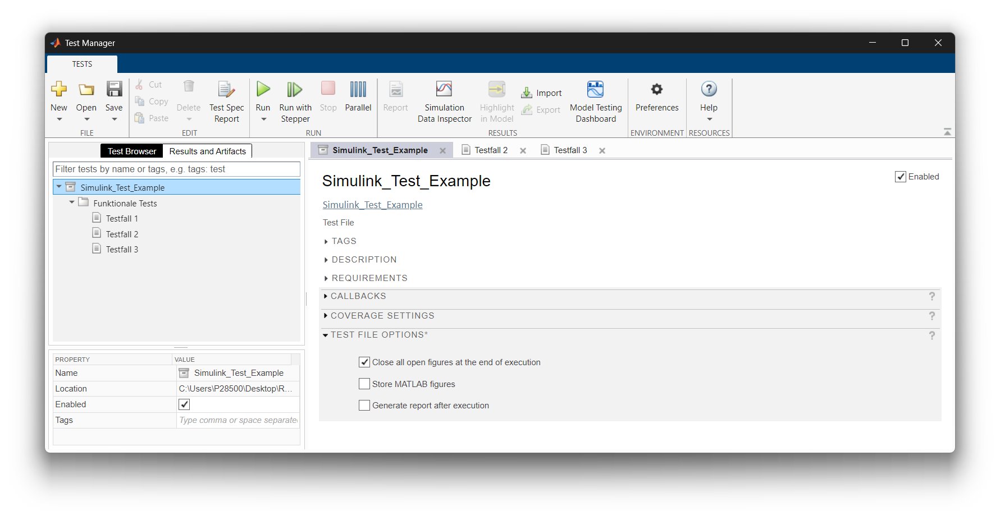

---

#### Strategien zur Aufteilung von Test-Dateien

<div class="columns top">
<div>

##### 1. Komponente

Jede Hauptkomponente oder jedes Subsystem im Modell erhält eine eigene Test-Datei.

**Vorteile:**
- Sehr modular.
- Klar definierte Verantwortlichkeiten.
- Gut für große Teams.

</div>
<div>

##### 2. Test-Ebene

Tests werden nach ihrer Ebene im V-Modell gruppiert.

**Vorteile:**
- Passt gut zu formalen Prozessen.
- Trennt Unit- von Integrations- oder Systemtests.

</div>
<div>

##### 3. Anforderungssatz

Tests werden basierend auf High-Level-Features oder Anforderungs-dokumenten gruppiert.

**Vorteile:**
- Sehr gute Nachverfolgbarkeit.
- Erleichtert die Verifikation.

</div>
</div>

---

#### Testabdeckung (Coverage)

Die **Testabdeckung** (Coverage) ist eine Metrik, die misst, inwieweit die Struktur eines Modells oder Codes durch eine Test-Suite ausgeführt wurde.

-   Sie beantwortet die quantitative Frage: "Habe ich *genug* getestet?"
-   100% Anforderungsabdeckung ist nicht 100% Codeabdeckung. Versteckte Logikpfade oder Randbedingungen könnten ungetestet bleiben.
-   Simulink Test ermöglicht die Sammlung verschiedener Abdeckungsmetriken, um die Gründlichkeit von Tests zu bewerten und die Testqualität objektiv zu messen.

---

#### Coverage Settings im Test Manager

Im Test Manager können die gewünschten Abdeckungsmetriken auf Test-Datei- oder Test-Suite-Ebene aktiviert werden.

-   Nach Ausführung der Tests wird ein **detaillierter Bericht** generiert, der die erreichten Abdeckungsprozentsätze anzeigt.
-   Nicht abgedeckte Teile des Modells werden im Bericht und direkt im Modell **farblich hervorgehoben** (z.B. rot), was die Erstellung zusätzlicher Testfälle zur Erhöhung der Abdeckung erleichtert.

---

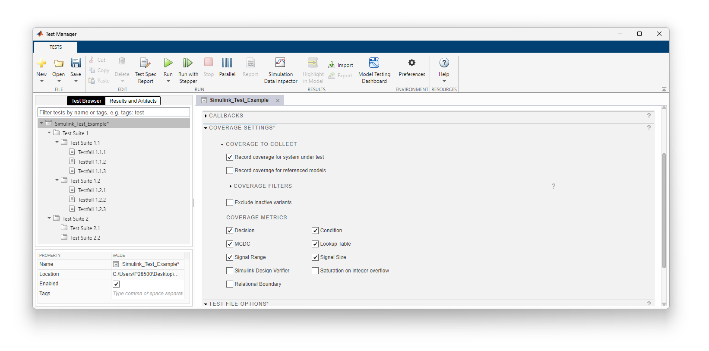

---

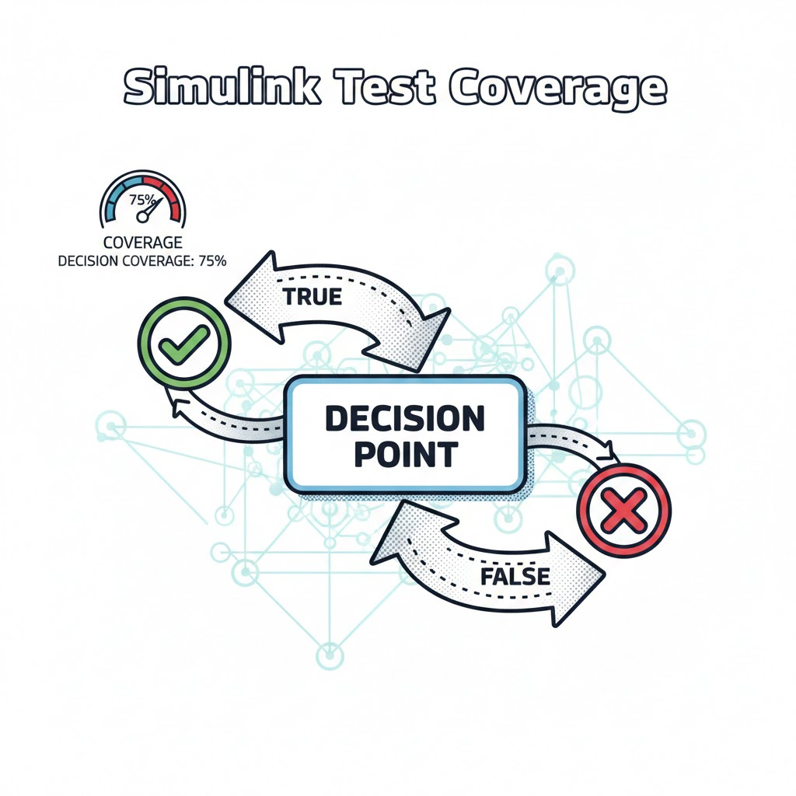

#### Abdeckungsmetriken

##### **Decision Coverage**

Misst, ob jeder mögliche **Ausgang** eines logischen Blocks (z.B. `if/else`, `switch`, logische Operatoren) mindestens einmal durchlaufen wurde.

**Beispiel:** `if (x > 0)` muss sowohl für `true` als auch für `false` getestet werden.

---

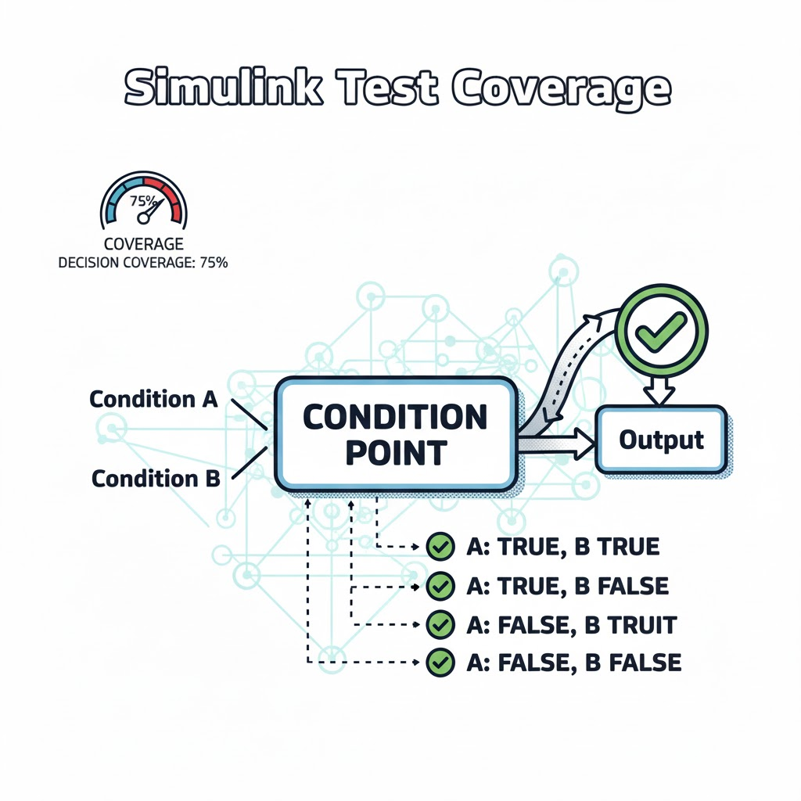

#### Abdeckungsmetriken

##### **Condition Coverage**

Misst, ob jede **atomare Bedingung** in einer komplexen logischen Expression mindestens einmal zu `true` und `false` ausgewertet wurde.

**Beispiel:** Für `A && B` muss `A` einmal `true` und einmal `false` sein, und `B` muss einmal `true` und einmal `false` sein.

---

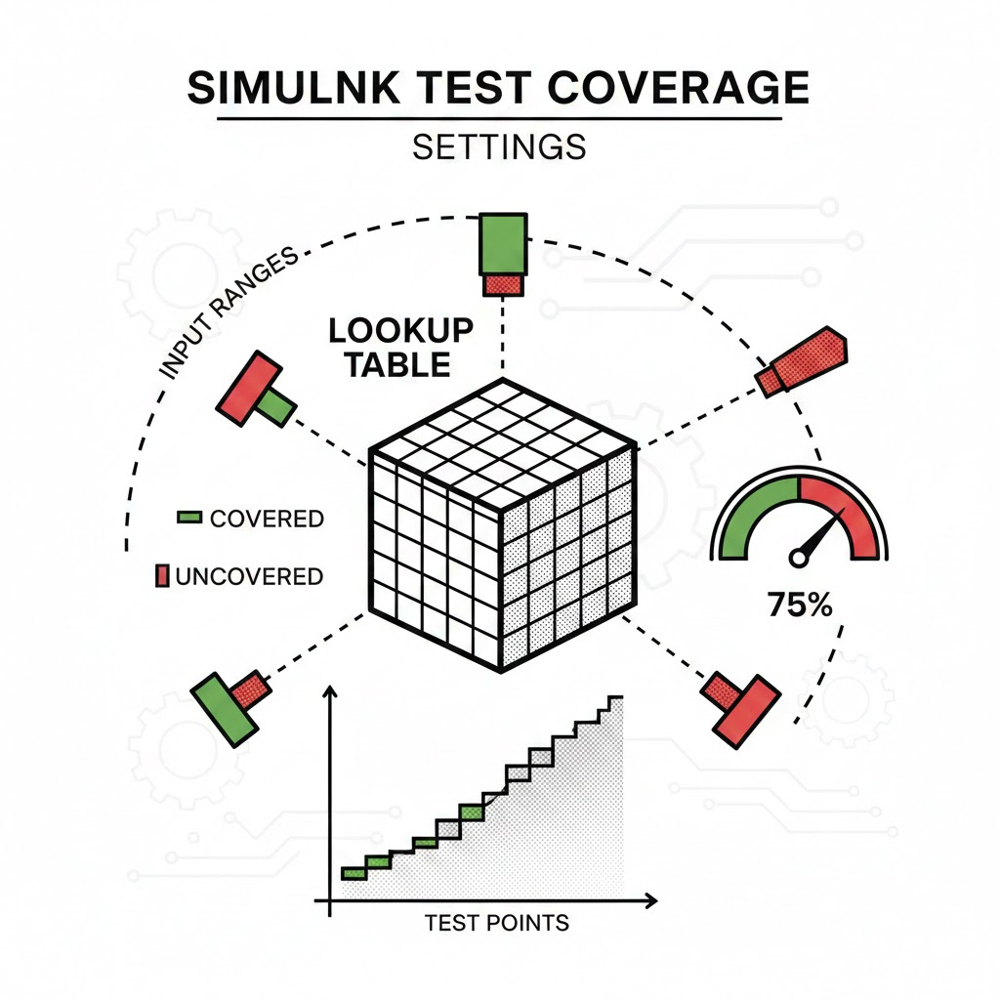

#### Abdeckungsmetriken

##### **Lookup Table Coverage**

Misst, wie viele der Interpolations-intervalle oder Stützpunkte in einer `n-D Lookup Table` verwendet wurden.

Stellt sicher, dass alle Bereiche der Tabelle getestet werden und keine Extrapolation in nicht definierte Bereiche erfolgt.

---

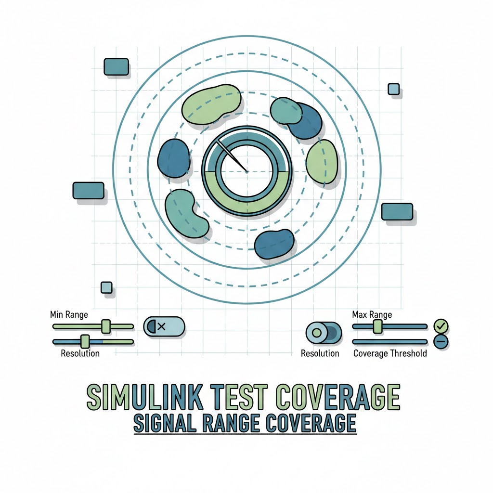

#### Abdeckungsmetriken

##### **Signal Range Coverage**

Zeichnet die Minimal- und Maximalwerte auf, die ein Signal während der Simulation erreicht.

Hilft bei der Identifizierung von ungetesteten Betriebsbereichen oder unerwarteten Signalüber-schreitungen.

---

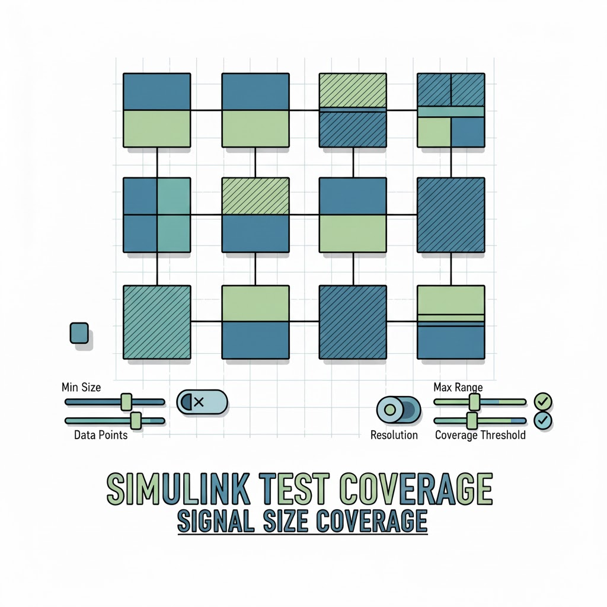

#### Strukturelle Abdeckungsmetriken

##### **Signal Size Coverage**

Überprüft, ob die Größe (Dimensionen) von Signalen mit variabler Größe alle vorgesehenen Werte während des Tests annimmt.

Wichtig für die Verifikation von Algorithmen, die mit dynamischen Datenstrukturen oder Matrizen arbeiten.

---

<div class="columns">
<div class="five">

#### Test-Suite

Auf Suite-Ebene können viele Einstellungen der Test-Datei überschrieben oder verfeinert werden:

-   **Tags / Requirements:** Eigene Tags und Anforderungs-Links nur für diese Suite.
-   **Callbacks:** Skripte, die vor/nach jedem Test-Case *in dieser Suite* ausgeführt werden.
-   **Coverage Settings:** Spezifische Abdeckungseinstellungen für eine Gruppe von Tests.

</div>
<div>



</div>
</div>

---

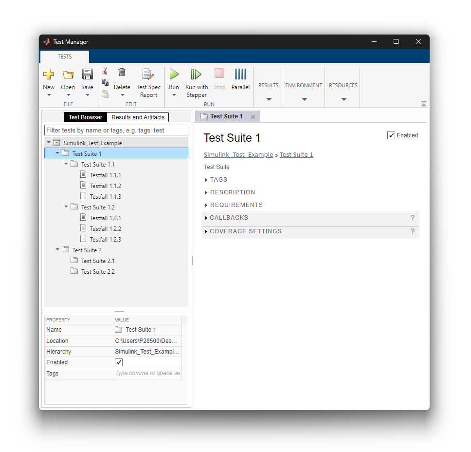

---

#### Typische Suite-Strukturen

Die folgende Suite-Struktur mit zugeordneten Testfällen würde sich z.B. für ein Antriebssystem eignen:

-   **Funktionale Tests:** Überprüfen das korrekte Verhalten gemäß der Spezifikation (z.B. `Test_Anlaufverhalten` und `Test_Lastwechsel`).
-   **Robustheitstests:** Testen das Verhalten bei ungültigen Eingaben oder an den Grenzen des Betriebsbereichs (z.B. `Test_Ueberspannung` oder `Test_Negative_Sollvorgabe`).
-   **Regressionstests:** Stellen sicher, dass frühere Funktionalität nicht durch Änderungen beeinträchtigt wurde.
-   **Sicherheitstests:** Überprüfen die Reaktion auf simulierte Störfälle (z.B. `Test_Motor_Blockiert`).

---

<div class="columns">
<div class="five">

#### Test-Case

Ein Test-Case besteht aus mehreren Abschnitten, die das "Was, Wie, Womit und Was-sollte-sein" eines Tests beschreiben:
-   **Tags / Description / Requirements:** Was wird getestet und warum? Verlinkung zur Anforderung.
-   **System Under Test:** Welches Modell oder welche Komponente wird getestet?
-   **Inputs:** Womit wird das SUT stimuliert? (Eingangssignale)
-   **Assessments:** Was ist das erwartete Ergebnis? (Bewertungskriterien)

</div>
<div>



</div>
</div>

---

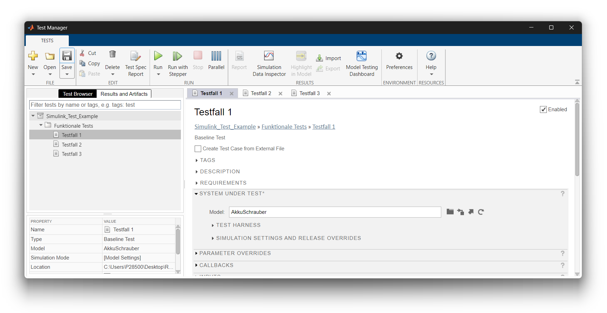

---

#### Typische Test-Cases

<div class="columns top">
<div>

##### Anforderungstest

Der häufigste Fall: Ein Test-Case wird erstellt, um eine einzelne Anforder-ung zu verifizieren.

**Beispiel:** "Verifiziere REQ-MOTOR-05: Das maximale Überschwingen der Drehzahl darf 10% nicht überschreiten."

</div>
<div>

##### Grenzwertetest

Dieser Test prüft das Verhalten des Systems an den Rändern seines spezifizierten Betriebsbereichs.

**Beispiel:** "Was passiert bei maximaler Eingangsspan-nung und maximaler Last?"

</div>
<div>

##### Robustheitstest

Hier wird das System gezielt mit ungültigen oder unerwarteten Eingaben konfrontiert, um seine Robustheit zu prüfen.

**Beispiel:** "Wie reagiert das System auf eine Sollwert-Vorgabe von -100 U/min?"

</div>
</div>

---

#### Test-Case - **System Under Test (SUT)**

In diesem Abschnitt wird festgelegt, welche Komponente getestet wird und in welchem Kontext.

-   **Model:** Der Pfad zum Simulink-Modell (`.slx`).
-   **Test Harness:** Wenn ein Subsystem das SUT ist, wird hier das zu verwendende Test-Harness ausgewählt.
-   **Simulation Mode:** Legt fest, wie das Modell ausgeführt wird (z.B. `Normal`, `Accelerator`, `Software-in-the-Loop (SIL)`).
-   **Parameter Overrides:** Erlaubt das Überschreiben von Workspace-Variablen oder Block-Parametern für diesen spezifischen Test-Case.

---

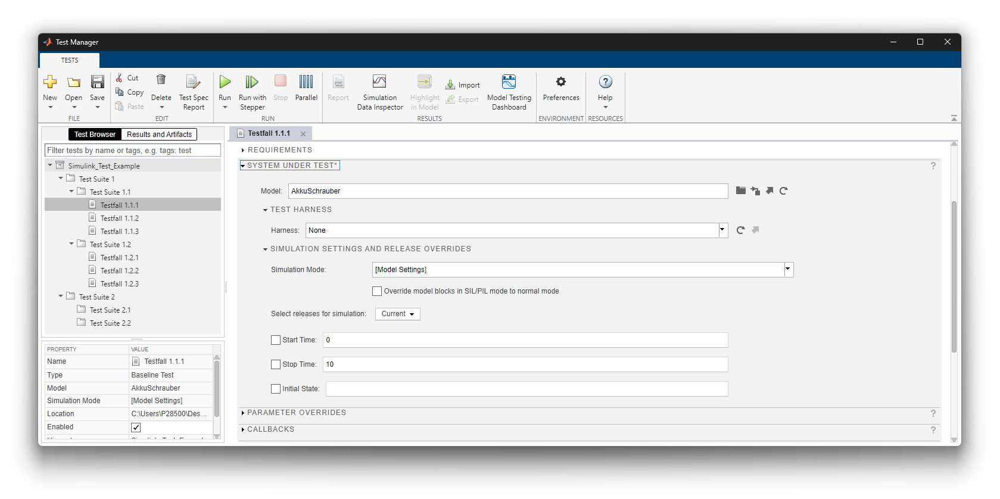

---

<div class="columns">
<div class="three">

#### Wahl des richtigen Simulationsmodus (1 / 2)

##### Normal / Accelerator

-   **Normal:** Das Modell wird interpretiert. Gut für Debugging.
-   **Accelerator:** Das Modell wird vor der Ausführung zu C-Code kompiliert. Deutlich schneller, ideal für rechenintensive Simulationen und große Testkampagnen.
-   Beide Modi werden für die grundlegende Verifikation der Algorithmen und Logik im Modell verwendet (**Model-in-the-Loop, MIL**).

</div>
<div>



</div>
</div>

---

<div class="columns">
<div class="three">

#### Wahl des richtigen Simulationsmodus (2 / 2)

##### Software- / Processor-in-the-Loop (SIL/PIL)

-   **SIL:** Der aus dem SUT generierte Code wird auf dem Host-PC kompiliert und gegen das Test-Harness ausgeführt. Verifiziert die Korrektheit der Codegenerierung.
-   **PIL:** Der generierte Code wird auf dem Zielprozessor (z.B. einem embedded Mikrocontroller) ausgeführt. Verifiziert die Korrektheit auf der Zielhardware.
-   Diese Modi sind essenziell, um die Konformität zwischen Modell und finaler Implementierung sicherzustellen.

</div>
<div>



</div>
</div>

---

#### Test-Case - **Inputs**

Dieser Abschnitt definiert die Stimuli, also die Eingangssignale, mit denen das SUT während des Tests angeregt wird. Es gibt verschiedene Quellen für diese Signale:

-   **Signal Editor Block:** Der Standard. Ermöglicht die grafische Definition von Signalverläufen (konstant, Rampe, Sinus, etc.) für mehrere Signale.
-   **MAT-Datei:** Importiert Signal-Daten aus einer `.mat`-Datei. Ideal, um aufgezeichnete reale Messdaten oder komplexe, vorgenerierte Signale zu verwenden.
-   **Test Sequence Block:** Die Eingänge können auch direkt aus einem `Test Sequence` Block kommen. Das ist nützlich, wenn die Stimuli von komplexen Zuständen im Testablauf abhängen.
-   **From Workspace:** Lädt die Eingangsdaten aus MATLAB Workspace-Variablen.

---

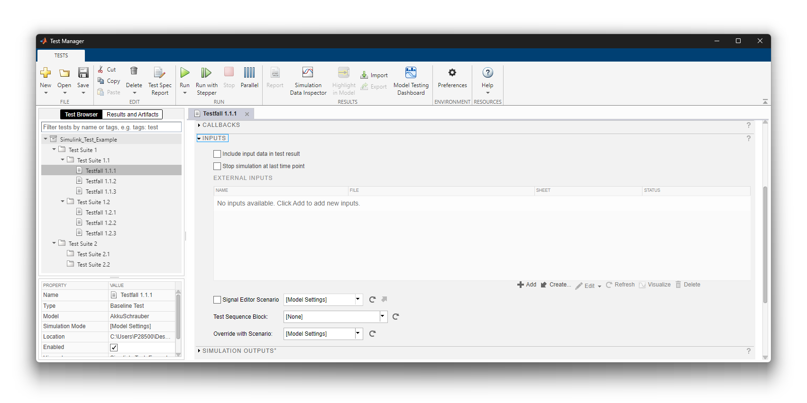

---

#### Der Signal Editor Block

Der `Signal Editor` Block ist ein vielseitiges Werkzeug, um komplexe Eingangssignale interaktiv zu entwerfen. Er ist ideal für die Erstellung von Stimuli für Tests.

-   **Interaktive Bearbeitung:** Signale können grafisch per Drag-and-Drop, über Tabellen oder MATLAB-Ausdrücke definiert werden.
-   **Vielfältige Signalformen:** Unterstützt verschiedene Signalformen wie Rampen, Sprünge, Sinuswellen, Pulswellen und benutzerdefinierte Kurven.
-   **Mehrere Szenarien:** Es können mehrere Szenarien in einem einzigen Block gespeichert und zwischen ihnen gewechselt werden, was die Verwaltung von Testfällen vereinfacht.
-   **Integration:** Die Signale können direkt an die Eingänge des zu testenden Systems (SUT) im Test Harness oder Hauptmodell angeschlossen werden.

---


---

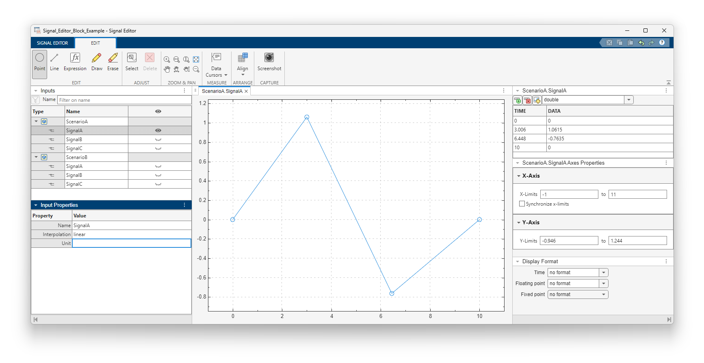

---

#### Der Test Sequence Block

Der `Test Sequence` Block ermöglicht die Erstellung von sequenziellen oder zustandsbasierten Testabläufen. Er ist ideal für die Modellierung von komplexen Test-Szenarien und Bewertungen.

-   **Zustandsbasierte Logik:** Basierend auf Stateflow, erlaubt er die Definition von Schritten, Übergängen und Aktionen.
-   **Stimuli-Generierung:** Kann zeitlich koordinierte Eingabesignale generieren.
-   **In-line Assessments:** Ermöglicht die direkte Bewertung von Modellausgängen innerhalb der Sequenz (siehe dazu auch Abschnitt 3.1.3 "Testsequenzen und -bewertungen").
-   **Flexibilität:** Bietet eine flexible Möglichkeit, Testlogik zu kapseln und zu visualisieren.

---

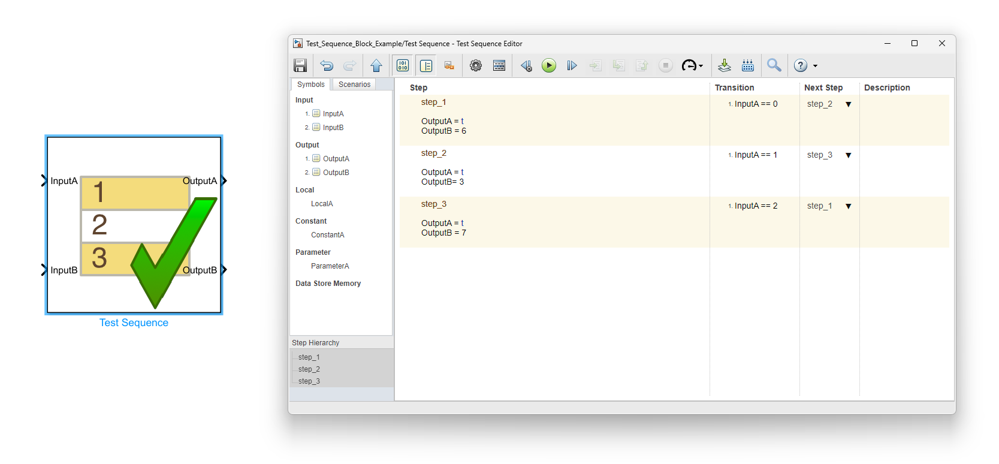

---

#### Strategien für Test-Eingangssignale

Die Wahl der richtigen Eingangssignale ist entscheidend für die Aussagekraft eines Tests. Hier sind drei mögliche Strategien:

<div class="columns top">
<div>

##### Synthetische Signale

Für die meisten funk-tionalen Tests werden einfache, synthetische Signale (Sprung, Rampe, Sinus) verwendet, um Reaktionen des Systems zu provozieren.

</div>
<div>

##### Aufgezeichnete Daten

Um das Verhalten unter realen Bedingungen zu prüfen, werden oft Daten aus Messfahrten oder Feldversuchen verwendet.

</div>
<div>

##### Zufällige Daten

Für Robustheitstests oder zur statistischen Absicherung werden oft zufällige oder pseudo-zufällige Eingangssignale verwendet (z.B. mit dem `Random Number` Block).

</div>
</div>

---

#### Test-Case - **Simulation Outputs**

In diesem Abschnitt wird festgelegt, welche Signale aus dem Modell während der Simulation aufgezeichnet (geloggt) werden sollen.

Die hier ausgewählten Signale stehen später für die Bewertung (Assessments) zur Verfügung. Es ist wichtig, alle Signale zu loggen, die zur Überprüfung der Anforderungen notwendig sind.

-   **Ausgangssignale:** Die Ports am Ausgang des SUT werden standardmäßig geloggt.
-   **Interne Signale:** Es können aber auch beliebige interne Signale innerhalb des SUT markiert und für die Aufzeichnung ausgewählt werden. Dies ist extrem nützlich für das Debugging und die Analyse von internen Zuständen des Reglers oder der Strecke.

---

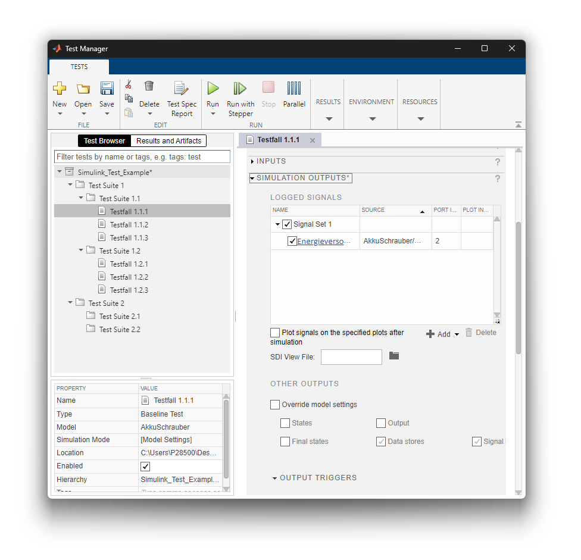

---

#### Typische zu loggende Signale

Was sollte man loggen? So viel wie nötig, so wenig wie möglich.

<div class="columns top">
<div>

##### Ausgänge

Alle Ausgangssignale des SUT sind fast immer relevant.
- `ist_drehzahl`
- `ist_temperatur`
- `status_led`

</div>
<div>

##### Interne Zustände

Signale, die für die Verifikation von Anforderungen oder das Debugging gebraucht werden.
- `regler_interner_zustand`
- `motor_strom`
- `fehler_flag`

</div>
<div>

##### Berechnete Werte

Abgeleitete Größen, die im Test ausgewertet werden sollen.
- `regel_abweichung` (soll - ist)
- `leistung` (spannung * strom)

</div>
</div>

---

#### Test-Case - **Assessments**

Für die Überprüfung der Testergebnisse stehen verschiedene Assessment-Methoden zur Auswahl:



---

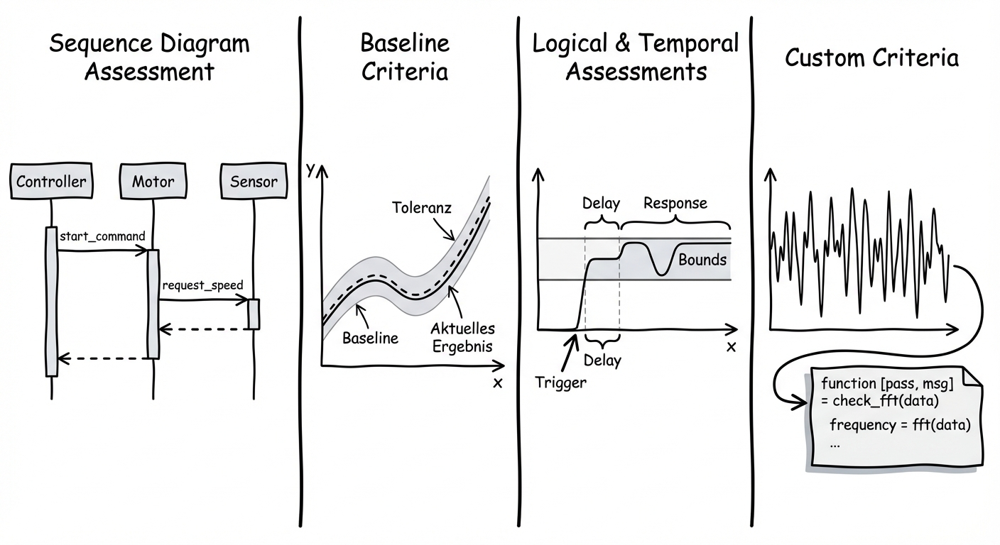

---

#### Test-Case - **Sequence Diagram Assessment**

System Composer Sequenzdiagramme (Sequence Diagrams) können direkt in Simulink Test für die Bewertung von Test-Cases verwendet werden.

-   **Visuelle Spezifikation:** Statt textueller `verify`-Anweisungen kann der erwartete Nachrichtenfluss zwischen den LifeLines (Komponenten oder Ports) grafisch modelliert werden.
-   **Formale Bewertung:** Simulink Test führt die Simulation aus und vergleicht den tatsächlichen Nachrichtenfluss mit dem im Sequenzdiagramm spezifizierten.
-   **Traceability:** Die Sequenzdiagramme können direkt mit Anforderungen verknüpft werden, um die Verifikation von Kommunikationsanforderungen zu erleichtern.
-   **Zustandsbasierte Kommunikation:** Ideal zur Verifikation von zeitlichen Abfolgen und Interaktionen in verteilten oder ereignisgesteuerten Systemen.

---

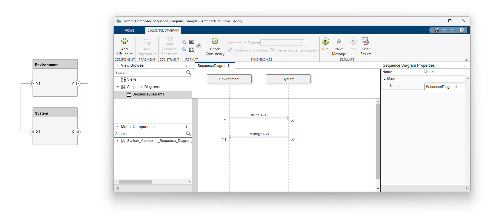

---

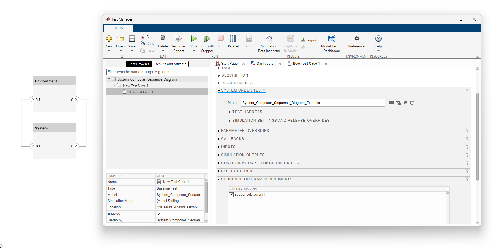

---

#### Sequenzdiagramme in System Composer

Sequenzdiagramme sind Interaktionsdiagramme, die die Reihenfolge von Nachrichten zwischen Komponenten in einem System darstellen.

-   **LifeLines (Lebenslinien):** Repräsentieren einzelne Komponenten, Ports oder Instanzen, die am Kommunikationsablauf beteiligt sind. Sie verlaufen vertikal.
-   **Messages (Nachrichten):** Horizontale Pfeile, die den Austausch von Informationen oder Ereignissen zwischen LifeLines darstellen.
    - Signal-basierte Nachrichten (`rising`, `falling`, `crossing`)
    - Message-basierte Nachrichten
-   **Zeitliche Abfolge:** Die Nachrichten werden von oben nach unten in chronologischer Reihenfolge dargestellt.

---

#### Signal-basierte und Message-basierte Nachrichten

<div class="columns top">
<div>

##### Signal-basierte Nachrichten

-   **Analogie:** Kontinuierliche oder getaktete Signale, wie sie in Simulink-Modellen üblich sind.
-   **Verwendung:** Für den Austausch von Werten, die sich über die Zeit ändern (z.B. Temperatur, Druck, Sollwerte).
-   **Verifikation:** Die Bewertung konzentriert sich auf die Werte der Signale zu bestimmten Zeitpunkten oder über Zeitintervalle.

</div>
<div>

##### Message-basierte Nachrichten

-   **Analogie:** Diskrete Ereignisse oder Datenpakete, wie sie in ereignis-gesteuerten Systemen vorkommen.
-   **Verwendung:** Für den Versand von Befehlen, Statusinformationen oder Datenstrukturen.
-   **Verifikation:** Die Bewertung konzentriert sich auf das Senden, Empfangen und den Inhalt der Nachrichten.

</div>
</div>

---

#### Message Label Syntax: `trigger[guard]{constraint}`

-   **`trigger` (Optional):** Definiert das Ereignis, das die Nachricht auslöst (z.B. ein Signalübergang). Wenn weggelassen, wird angenommen, dass die Nachricht gesendet wird, sobald der vorherige Schritt abgeschlossen ist.
    -   Beispiel: `rising(signal - 1)`
-   **`[guard]` (Optional):** Eine notwendige boolesche Bedingung, die erfüllt sein muss, damit die Nachricht gesendet wird.
    -   Beispiel: `[temperature < 100]`
-   **`{constraint}` (Optional):** Eine zusätzliche boolsche Bedingung, die zum Fehlschlagen während der Verifikation führen kann.
    -   Beispiel: `{mode == AUTO}`

---

<div class="columns">
<div>


#### Typischer Anwendungsfall

**Anforderung:** "Wenn der Controller den `start_command` an den Motor sendet, muss der Motor innerhalb von 100 Millisekunden mit `motor_running` antworten."

</div>
<div>

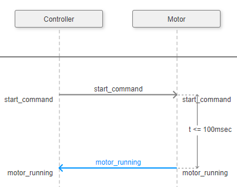

</div>
</div>

---

#### Test-Case - **Baseline Criteria**

Ein Baseline-Test vergleicht das Verhalten des SUT mit einem zuvor aufgezeichneten "guten" Ergebnis.

-   **Ablauf:**
    1.  Man führt die Simulation einmal aus und überprüft manuell, ob die aufgezeichneten Signale (z.B. die `ist_drehzahl`) den Erwartungen entsprechen.
    2.  Dieses Ergebnis wird als "Baseline" gespeichert.
    3.  Für alle nachfolgenden Testläufe vergleicht Simulink Test das aktuelle Ergebnis automatisch mit der Baseline.
-   **Toleranzen:** Es können absolute, relative oder zeitliche Toleranzen definiert werden, innerhalb derer das Signal von der Baseline abweichen darf.

---

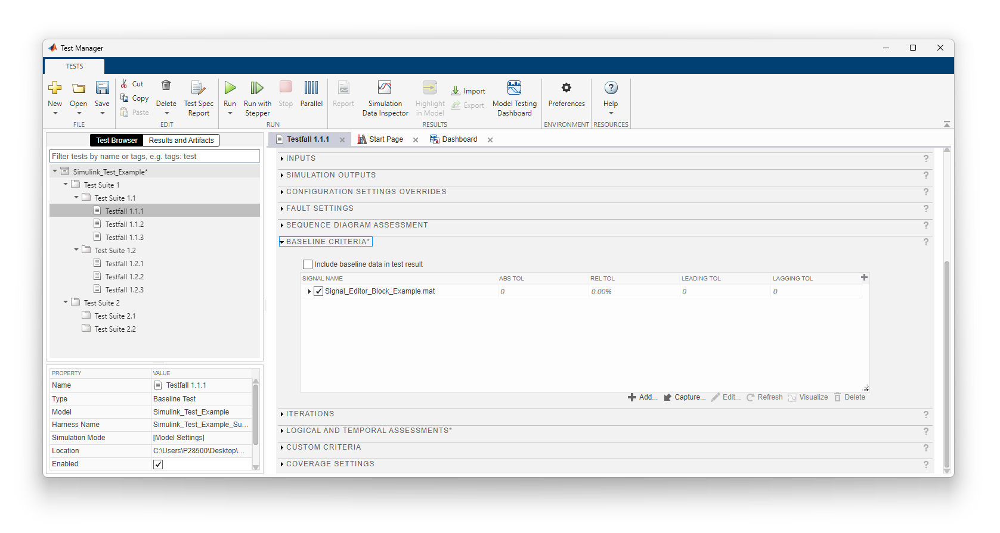

---

#### Struktur einer Baseline-Datei

Eine Baseline-Datei (`.mldatx` oder ein Teil davon, wenn sie im Test-Manager erstellt wurde) speichert die aufgezeichneten Signaldaten im Wesentlichen in einem tabellarischen Format. Vereinfacht könnte man es sich wie folgt vorstellen:

| Zeitpunkt (s) | Signal_A (Wert) | Signal_B (Wert) | ... |
| :------------ | :-------------- | :-------------- | :-- |
| 0.0           | 0.0             | 10.0            | ... |
| 0.1           | 0.1             | 10.2            | ... |
| 0.2           | 0.3             | 10.5            | ... |
| ...           | ...             | ...             | ... |
| 10.0          | 5.0             | 12.0            | ... |

---

#### Wann verwendet man Baseline-Tests?

Baseline-Tests sind besonders nützlich in zwei Hauptszenarien:

<div class="columns top">
<div>

##### 1. Regressionstests

Wenn eine Komponente geändert oder überarbeitet wird, will man sicherstellen, dass das bestehende, korrekte Verhalten nicht unbeabsichtigt verändert wurde ("Regression").

</div>
<div>

##### 2. Komplexe, nicht-lineare Systeme

Manchmal ist das erwartete Verhalten eines Systems zu komplex, um es mit einfachen `verify` Anweisungen zu beschreiben (z.B. das Schwingungsverhalten einer mechanischen Struktur).

</div>
</div>

---

#### Test-Case - **Logical and Temporal Assessments**

Simulink Test bietet leistungsstarke Mechanismen zur *formalen Bewertung* von Zeitverläufen und logischen Bedingungen über die Dauer einer Simulation hinweg.

-   **Logical Assessments (z.B. Bounds Check):** Prüfen, ob ein Signal innerhalb definierter Grenzen bleibt oder bestimmte logische Zustände einhält (z.B. `signal > 0`). Dies kann mit vordefinierten Mustern (`bounds-check-pattern`) erfolgen.
-   **Temporal Assessments (z.B. Trigger-Response):** Überwachen das zeitliche Verhalten des Systems, insbesondere die Reaktion auf Ereignisse (z.B. `trigger` -> `delay` -> `response`).
-   **Custom Logical Assessments:** Ermöglichen die Definition eigener logischer Ausdrücke, um komplexere Bedingungen zu prüfen.

---

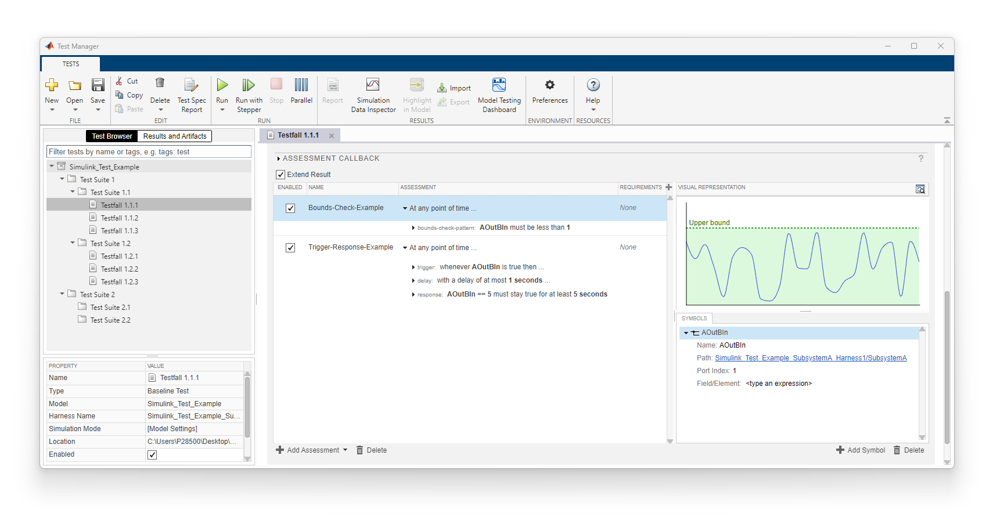

---

#### Logisches Assessment: **Bounds-Check Pattern**

Das **Bounds-Check Pattern** ist ein logisches Assessment, das überprüft, ob ein Signal während der gesamten Simulation innerhalb oder außerhalb definierter Grenzen bleibt. Es ist fundamental für die Verifikation von Grenzwertanforderungen.

- `Always less than` - Das Signal muss immer unterhalb einer oberen Schranke bleiben.
- `Always greater than` - Das Signal muss immer oberhalb einer unteren Schranke bleiben.
- `Always within bounds` - Das Signal muss immer zwischen einer unteren und oberen Schranke bleiben.
- `Always outside bounds` - Das Signal muss immer außerhalb eines Bereichs (unterhalb der unteren oder oberhalb der oberen Schranke) bleiben.

---

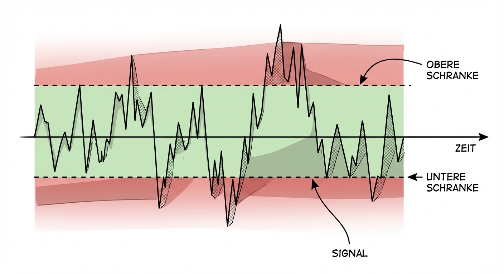

---

#### Temporales Assessment: **Trigger-Pattern**

Das **Trigger-Pattern** definiert das auslösende Ereignis für eine temporale Bewertung. Es legt fest, *wann* die Beobachtung einer Systemreaktion beginnen soll.

- `Whenever is true` - Löst kontinuierlich aus, solange die Bedingung wahr ist.
- `Becomes true` - Löst bei der steigenden Flanke der Bedingung aus (wenn sie von `false` zu `true` wechselt).
- `Stays true for at least` - Löst aus, wenn die Bedingung für eine Mindestdauer wahr bleibt.
- `Stays true for at most` - Löst aus, wenn die Bedingung für höchstens eine Maximaldauer wahr bleibt.
- `Stays true for between` - Löst aus, wenn die Bedingung für eine Dauer innerhalb eines Zeitfensters wahr bleibt.

---

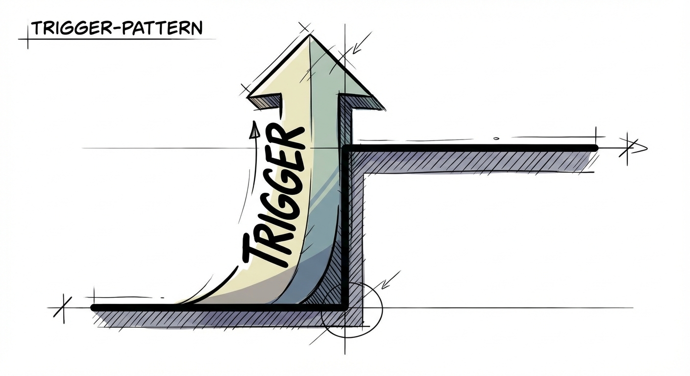

---

#### Temporales Assessment: **Delay-Pattern**

Das **Delay-Pattern** spezifiziert die zulässige Zeitverzögerung zwischen dem Trigger-Ereignis und dem Beginn der erwarteten Systemreaktion.

- `With no delay` - Die Reaktion muss unmittelbar nach dem Trigger-Ereignis eintreten.
- `With a delay of at most` - Die Reaktion muss innerhalb einer maximalen Verzögerung nach dem Trigger eintreten.
- `With a delay of between` - Die Reaktion muss innerhalb eines definierten Zeitfensters nach dem Trigger eintreten.

---

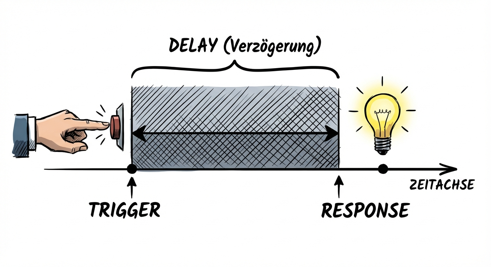

</div>
</div>

---

#### Temporales Assessment: **Response-Pattern**

Das **Response-Pattern** definiert das erwartete Verhalten des Systems, das nach dem Trigger und der spezifizierten Verzögerung eintreten muss.

- `Must be true` - Die Bedingung muss zum Zeitpunkt der Reaktion wahr sein.
- `Must stay true for at least` - Die Bedingung muss ab dem Zeitpunkt der Reaktion für eine Mindestdauer wahr bleiben.
- `Must stay true for at most` - Die Bedingung muss ab dem Zeitpunkt der Reaktion für höchstens eine Maximaldauer wahr bleiben.
- `Must stay true for between` - Die Bedingung muss ab dem Zeitpunkt der Reaktion für eine Dauer innerhalb eines Zeitfensters wahr bleiben.
- `Must stay true until` - Die Bedingung muss ab dem Zeitpunkt der Reaktion wahr bleiben, bis ein anderes Ereignis eintritt.

---

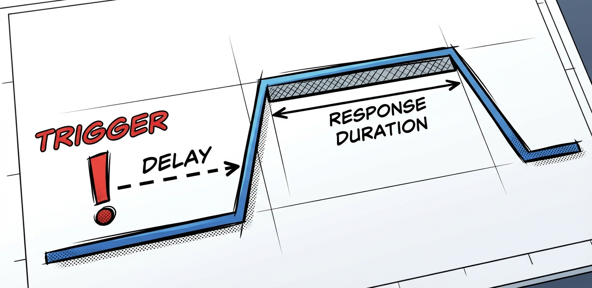

</div>
</div>

---

#### Typische Anwendungsfälle für Logical and Temporal Assessments

<div class="columns top">
<div>

##### Grenzwertüberwachung

**Anforderung:** "Die Motortemperatur darf 120°C nie überschreiten."

**Pattern:** `Bounds Check` (`Always less than`)

</div>
<div>

##### Reaktionszeit

**Anforderung:** "Nach Betätigung des Not-Aus muss der Motor innerhalb von 50ms stoppen."

**Pattern:** `Trigger-Response`

</div>
<div>

##### Einschwingverhalten

**Anforderung:** "Nach einem Sollwertsprung muss die Drehzahl für mind. 2s im Toleranzband von +/-5% bleiben."

**Pattern:** `Trigger-Response`

</div>
</div>

---

#### Test-Case - **Custom Criteria**

"Custom Criteria" bietet die höchste Flexibilität bei der Testbewertung. Hier können Sie eine eigene MATLAB-Funktion schreiben, um komplexe, domänenspezifische oder algorithmische Überprüfungen durchzuführen, die mit Standard-Assessments nicht möglich sind.

Die Funktion erhält als Eingabeparameter ein `test`-Objekt. Dieses Objekt ist eine Instanz der Klasse `matlab.unittest.TestCase` und wird von Simulink Test um zusätzliche Eigenschaften (z.B. für den Zugriff auf Simulationsergebnisse) und Methoden erweitert.

Innerhalb der Funktion nutzen Sie Verifikationsmethoden (z.B. `test.verifyEqual(...)`), um die Testergebnisse zu überprüfen und den Test als `Passed` oder `Failed` zu markieren.

---

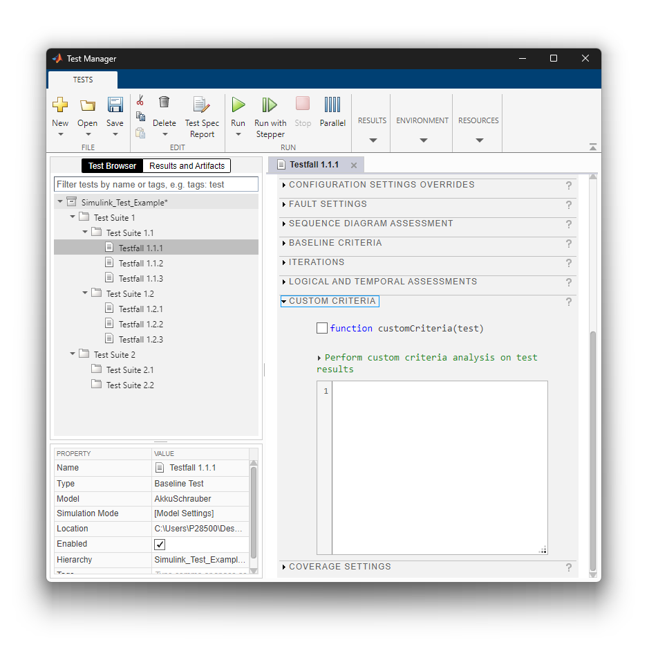

---

#### Beispiel einer für Custom Criteria Funktionen

Eine Custom Criteria Funktion ist eine einfache MATLAB-Funktion, die die Simulationsergebnisse erhält und basierend darauf einen Pass/Fail-Status berechnet.

```matlab
function customCriteria(test)

    % Aufgezeichnetes Signal auslesen
    signal = test.sltest_simout.get('logsout').get('mySignal');

    % Letzten Signalwert extrahieren
    lastValue = signal.Values.Data(end);

    % Signalwert prüfen
    test.verifyEqual(lastValue, 50, 'Fehldermeldung');

end
```

---

#### Programmierschnittstelle für Custom Criteria Funktionen (1 / 3)

Der Parameter `test` der Funktion ist eine Instanz der Klasse `sltest.TestCase`:



---

#### Programmierschnittstelle für Custom Criteria Funktionen (2 / 3)

Die wichtigsten Simulink-spezifischen Eigenschaften des Objektes sind:

- **`test.sltest_simout`**: Das Herzstück für die Ergebnis-Analyse. Dieses Objekt enthält die vollständigen Simulationsergebnisse, einschließlich:
  - **`get('logsout')`**: Zugriff auf alle geloggten Signale.
  - **`get('tout')`**: Der Zeitvektor der Simulation.
- **`test.sltest_testCase`**: Bietet Zugriff auf die Metadaten des aktuellen Test-Cases, wie Name, Tags oder verknüpfte Anforderungen. Nützlich für kontextabhängige Logik oder detaillierte Fehlermeldungen.
- **`test.sltest_iteration_info`**: Bei iterativen Tests enthält dieses Objekt Informationen über die aktuelle Iteration, z.B. die verwendeten Parameter-Overrides.

---

#### Programmierschnittstelle für Custom Criteria Funktionen (3 / 3)

Die Prüfung von Eigenschaften und Generierung von Fehlermeldungen erfolgt über eine Reihe von spezifischen Verifikationsmethoden:

- `test.verifyTrue(cond, 'diag')` - Verifiziert, dass die Bedingung `cond` wahr (`true`) ist. `diag` ist eine optionale Fehlermeldung.
- `test.verifyEqual(A, B, 'diag')` - Verifiziert, dass `A` und `B` gleich sind (mit Toleranzoptionen für numerische Vergleiche).
- `test.verifyGreaterThan(A, B)` - Verifiziert, dass `A` größer als `B` ist. (Analog: `verifyLessThan`)
- `test.verifyFail('diag')` - Markiert den Test explizit als fehlgeschlagen. Nützlich in `try-catch` Blöcken.

---

#### Typische Anwendung für Custom Criteria

<div class="columns">
<div>

##### Frequenzanalyse

**Anforderung:** "Die Resonanzfrequenz im Ausgangssignal darf nicht unter 50 Hz liegen."

**Umsetzung:**
Eine MATLAB-Funktion, die das Ausgangssignal mittels `fft()` (Fast Fourier Transform) analysiert, die dominante Frequenz findet und prüft, ob diese über dem Grenzwert liegt.

</div>
<div>

##### Statistische Auswertung

**Anforderung:** "Die Standardabweichung der Regelabweichung im stationären Zustand muss kleiner als 0.1 sein."

**Umsetzung:**
Eine MATLAB-Funktion, die den letzten Teil des Signals für die Regelabweichung extrahiert, mittels `std()` die Standardabweichung berechnet und mit dem Grenzwert vergleicht.

</div>
</div>

---

<!-- Eine abstrakte Darstellung von Testsequenzen. Eine leuchtende Zeitachse aus pulsierenden Lichtern bewegt sich von links nach rechts, wobei Kontrollpunkte aufleuchten, wenn die Sequenz sie passiert. Dies repräsentiert den Ablauf von Testsequenzen und Bewertungen vor dem Hintergrund des tiefen Weltraums. -->


### 3.1.3: Testsequenzen und -bewertungen

Dieser Unterabschnitt umfasst die folgenden Inhalte:

1.  Der Test Sequence Block
2.  Strukturierung mit `when`-Dekomposition
3.  Logische und temporale `verify` Operatoren
4.  Definition von Test-Szenarien

---

#### Der Test Sequence Block

Der `Test Sequence` Block ist ein Werkzeug, um zustandsbasierte Testabläufe und Bewertungen zu modellieren. Er nutzt eine an Stateflow angelehnte Syntax / Semantik:

##### Hauptmerkmale:

-   **Schrittbasierte Ausführung:** Der Block durchläuft eine definierte Sequenz von Schritten (`Step`).
-   **Aktionen & Übergänge:** In jedem Schritt können Aktionen definiert und Bedingungen für den Übergang zum nächsten Schritt festgelegt werden.
-   **Stimuli-Generierung:** Kann Ausgangssignale erzeugen, um das SUT anzuregen.
-   **Bewertung:** Kann Eingangssignale vom SUT empfangen und mit `verify` Operatoren bewerten.

---


---

#### Daten im Test Sequence Block

Der Test Sequence Block verwaltet verschiedene Arten von Daten, um mit dem SUT zu interagieren und interne Logik abzubilden.

- **Inputs:** Schreibgeschützte Signale, die vom SUT empfangen werden. Sie dienen zur Überwachung des Systemverhaltens.
- **Outputs:** Signale, die vom Block an das SUT gesendet werden. Sie dienen zur Generierung von Stimuli.
- **Locals:** Lokale Variablen, die nur innerhalb des Blocks für Berechnungen oder zur Speicherung von Zwischenzuständen sichtbar sind.
- **Constants:** Im Block definierte, unveränderliche Werte (z.B. `MAX_TEMP = 120`).
- **Parameters:** Von außen einstellbare Werte, die vor der Simulation konfiguriert werden können (z.B. über den Test-Manager oder aus dem MATLAB Workspace).

---


#### Beispiele für die Verwendung unterschiedlicher Arten von Daten

-   **Inputs:** Ein Beispiel wäre ein Sensorwert wie `current_temperature`, der vom Modell kommt und im Test Sequence Block gelesen wird, um eine Entscheidung zu treffen oder eine Bewertung durchzuführen.
-   **Outputs:** Beispielsweise könnte `setpoint_speed` ein Ausgang sein, der vom Test Sequence Block auf einen bestimmten Wert gesetzt wird, um das SUT zu steuern.
-   **Locals:** Ein Beispiel wäre eine Variable `counter`, die hochgezählt wird, um die Dauer eines Zustands zu messen, oder `temp_sum` zur Akkumulation von Werten.
-   **Constants:** Ein Beispiel wäre `MAX_VOLTAGE = 24` oder `CALIBRATION_FACTOR = 1.5`, die als feste Referenzpunkte dienen.
-   **Parameters:** Man könnte beispielsweise `TOLERANCE_PERCENT` als Parameter definieren, um flexible Vergleichsgrenzwerte zu realisieren.

---

#### Konzepte: Step, Action, Transition

Eine Testsequenz ist wie ein Zustandsautomat aufgebaut, der aus drei Kernelementen besteht:

- **Step (Schritt):** Ein Zustand in der Testsequenz. Der Block bleibt in einem Schritt, bis eine Übergangsbedingung erfüllt ist.
- **Action (Aktion):** Lesen und ggf. Schreiben von Eingaben, Ausgaben, lokalen Variablen, Konstanten und Parametern.
- **Transition (Übergang):** Eine logische oder zeitliche Bedingung, die den Wechsel von einem aktiven Schritt zum nächsten steuert.

---


#### Beispiel: Schritte, Aktionen und Transitionen

Die folgenden Beispiele zeigen die Nutzung von Schritten, Aktionen und Transitionen in einem vereinfachten Szenario:

| Schritt | Aktion | Bedingung | Nächster Schritt |
|-|-|-|-|
| `Initialize` | `output = 0;` | `after(1, sec)` | `RampUp` |
| `RampUp` | `output = output + 0.1;` | `output >= 10` | `HoldValue` |
| `HoldValue` | `output = 10;` | `after(5, sec)` | `RampDown` |
| `RampDown` | `output = output - 0.2;` | `output <= 0` | `Initialize` |

---

#### Hierarchische Schritte (Sub-steps)

Schritte können hierarchisch verschachtelt werden, um komplexe Zustandslogiken übersichtlich zu organisieren.

- **Übergeordneter Schritt (Super-step):** Enthält einen oder mehrere Unterschritte. Er ist aktiv, solange einer seiner Unterschritte aktiv ist.
- **Unterschritt (Sub-step):** Definiert eine verfeinerte Logik innerhalb eines übergeordneten Zustands. Der Übergang zwischen Unterschritten erfolgt nur, wenn der übergeordnete Schritt aktiv ist.
- **Vorteile:** Modularität, Lesbarkeit und Wiederverwendbarkeit von Zustandslogiken.

---


#### Beispiel: Hierarchische Schritte (Sub-steps)

| Schritt | Unterschritt | Aktion | Bedingung | Nächster Schritt |
|-|-|-|-|-|
| `MotorStart` | `Check` | `status = 'checking';` | `input_ready == true` | `Idle`|
| | `Idle` | `status = 'idle';` | `command == 'stop'`| `MotorStop` |
| `MotorStop` | `CoolDown` | `cool_fan_on = true;` | `temp_engine < 50` | `PowerOff` |
| | `PowerOff` | `main_power = false;` | `et > 2` | `Complete` |

---

#### `when`-Dekomposition (Parallelisierung)

Die `when`-Dekomposition ermöglicht die parallele Modellierung von unabhängigen Abläufen, die nur unter bestimmten Bedingungen ausgeführt werden. Sie funktioniert ähnlich einer `switch`-Anweisung in klassischen Programmiersprachen:

-   **Bedingte Ausführung:** Mehrere `when`-Blöcke können parallel definiert werden.
-   **Priorität:** In jedem Zeitschritt wird der erste `when`-Block ausgeführt, dessen Bedingung von `true` ausgewertet wird.
-   **Wiederholung:** In jedem Zeitschritt wird die Bedingung aller `when`-Blöcke neu bewertet und der entsprechende Block ausgeführt.
-   **Anwendung:** Ideal zur Implementierung von Überwachungsaufgaben oder unabhängigen Steuerungslogiken.

---

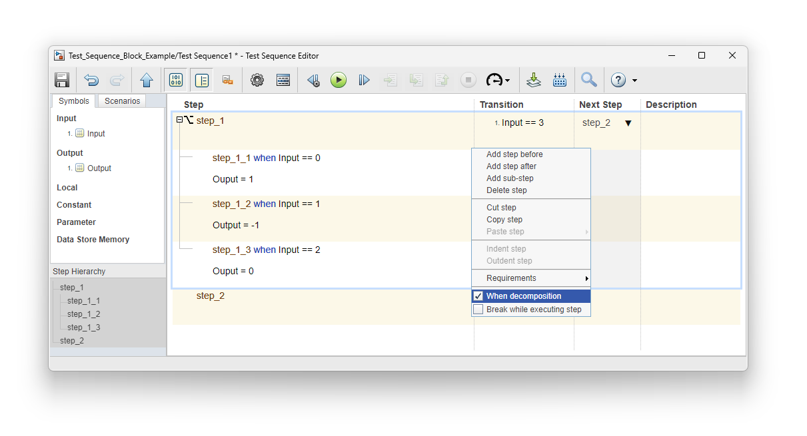

---

#### Assessment-Anweisungen: `verify` und `assert`

<div class="columns top">
<div>

##### `verify(expression)`

- **Verhalten:** Prüft, ob die `expression` wahr ist.
- **Bei Fehlschlag:** Der Testfall wird als `Failed` markiert, aber die Simulation und die Testsequenz laufen weiter.
- **Anwendung:** Ermöglicht die Erkennung mehrerer Fehler in einem einzigen Testlauf.

</div>
<div>

##### `assert(expression)`

- **Verhalten:** Prüft, ob die `expression` wahr ist.
- **Bei Fehlschlag:** Die Simulation wird sofort mit einem Fehler abgebrochen.
- **Anwendung:** Für kritische Bedingungen, deren Verletzung die weitere Simulation sinnlos macht (z.B. instabiles Modell).

</div>
</div>

---

#### **Relationale** Operatoren

Relationale Operatoren werden verwendet, um Werte zu vergleichen.

- `<` : Kleiner als
- `>` : Größer als
- `<=` : Kleiner oder gleich
- `>=` : Größer oder gleich
- `==` : Gleich
- `~=` : Ungleich

**Achtung bei Fließkommazahlen:** Aufgrund von Präzisionsproblemen sollte anstelle von `==` oft ein Vergleich mit einer Toleranz bevorzugt werden: `verify(abs(signal_a - signal_b) < 0.001)`

---

#### **Logische** Operatoren

Zur Verknüpfung von Bedingungen können die Standard-Operatoren der booleschen Algebra verwendet werden.

- `~` : **NOT** (Logische Negation)
  - `verify(~signal_a)`
- `&&` : **AND** (Logisches UND)
  - `verify(signal_a > 5 && signal_b < 3)`
- `||` : **OR** (Logisches ODER)
  - `verify(status == ERROR || status == TIMEOUT)`

Die Auswertung erfolgt mit Kurzschluss-Logik (Short-Circuiting).

---

#### **Temporale** Operatoren

Temporale Operatoren sind das Kernstück für die Überprüfung von Zeitverhalten.

- ***Zahlenwertige* temporale Operatoren**
    - `t`: Die absolute Simulationszeit (global).
    - `et`: Die vergangene Zeit seit der Aktivierung des aktuellen Schritts (`elapsed time`).
- ***Wahrheitswertige* temporale Operatoren**
    - `after(delay, unit)`: Wird wahr, nachdem `delay` Einheiten vergangen sind.
    - `before(delay, unit)`: Ist wahr, bevor `delay` Einheiten vergangen sind.
    - `duration(expr)`: Gibt die Zeit in Sekunden zurück, die `expr` ununterbrochen wahr war.

---

#### **Edge-Detection** Operatoren

Diese Operatoren erkennen Signaländerungen (Flanken). Sie sind sehr nützlich für ereignisgesteuerte Übergänge.

- `hasChanged(signal)`: Wird für einen Zeitschritt wahr, wenn sich der Wert von `signal` geändert hat.
- `hasChangedFrom(signal, value)`: Wird wahr, wenn sich `signal` von `value` zu einem anderen Wert geändert hat.
- `hasChangedTo(signal, value)`: Wird wahr, wenn sich `signal` von einem anderen Wert zu `value` geändert hat.

---

#### Funktionen zur Signalgenerierung

Der Test Sequence Block kann auch als Signalgenerator dienen, um Stimuli direkt zu erzeugen.

- `ramp(x)`: Erzeugt eine Rampe.
- `sawtooth(x)`: Erzeugt ein Sägezahnsignal.
- `square(x)`: Erzeugt ein Rechtecksignal.
- `triangle(x)`: Erzeugt ein Dreiecksignal.
- `sin(x)`: Erzeugt ein Sinussignal.
- `cos(x)`: Erzeugt ein Kosinussignal.

**Anwendung:**
`output_signal = ramp(et/3) + sin(et);`

---

<div class="columns">
<div>

#### Funktion `ramp(x)`

**Funktionsvorschrift**

$ramp(x) = x$

**Anwendungsbeispiel**

`square(et/3)`

</div>
<div>


</div>
</div>

---

<div class="columns">
<div>

#### Funktion `sawtooth(x)`

**Funktionsvorschrift**

$sawtooth(x) = 2(x−⌊x⌋−\frac{1}{2})$

**Anwendungsbeispiel**

`square(et/3)`

</div>
<div>


</div>
</div>

---

<div class="columns">
<div>

#### Funktion `square(x)`

**Funktionsvorschrift**

$square(x) = 2(2⌊x⌋−⌊2x⌋)+1$

**Anwendungsbeispiel**

`square(et/5)`

</div>
<div>


</div>
</div>

---

<div class="columns">
<div>

#### Funktion `triangle(x)`

**Funktionsvorschrift**

$triangle(x) = 2|2(x−⌊\frac{1}{2}+x⌋)|−1$

**Anwendungsbeispiel**

`triangle(et/5)`

</div>
<div>


</div>
</div>

---

<!-- Eine abstrakte Darstellung eines Test-Harness. Eine schützende, transparente Sphäre umschließt eine komplexe, leuchtende Struktur (das zu testende System) und isoliert sie von der umgebenden kosmischen Umgebung. Dies illustriert das Konzept einer kontrollierten Testumgebung. -->


### 3.1.4: Test-Harness

Dieser Unterabschnitt umfasst die folgenden Inhalte:

1.  Zweck und Vorteile eines Test-Harness
2.  Erstellung und Konfiguration
3.  Management von Test-Harnesses
4.  Synchronisation mit dem Hauptmodell

---

#### Zweck und Vorteile eines Test-Harness

Ein Test-Harness ist ein separates, eigenständiges Simulink-Modell, das eine Komponente (das SUT) für Testzwecke kapselt.

-   **Isolation:** Das SUT wird von der Komplexität des Gesamtmodells entkoppelt. Dies vereinfacht das Testen und die Analyse erheblich.
-   **Kontrollierte Umgebung:** Das Harness stellt alle notwendigen Eingaben und Konfigurationen bereit, um das SUT in einer kontrollierten Umgebung zu betreiben.
-   **Wiederverwendbarkeit:** Ein Harness kann für viele verschiedene Test-Cases verwendet werden.
-   **Reduzierte Komplexität:** Da nur das SUT und die Testumgebung geladen und kompiliert werden, sind Simulationen oft schneller.
-   **Saubere Trennung:** Hält das produktive Modell frei von Test-Logik und -Artefakten.

---


---

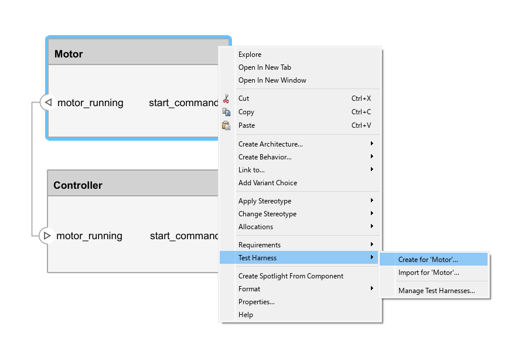

#### Erstellung eines Test-Harness

Simulink bietet einen automatisierten Prozess zur Erstellung von Test-Harnesses.

**Rechtsklick auf das Subsystem:** Wählen Sie im Kontextmenü `Test Harness` -> `Create for [subsystem_name]`.

---

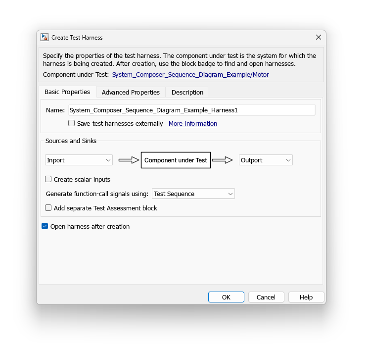

#### Konfiguration eines Test-Harness

-   **Name:** Geben Sie dem Harness einen aussagekräftigen Namen.
-   **Sources & Sinks:** Legen Sie fest, wie die Ein- und Ausgänge des SUT im Harness dargestellt werden sollen.
-   **Synchronisation:** Konfigurieren Sie, ob Änderungen am SUT automatisch in das Harness übernommen werden sollen.

---

#### Test-Harness: Quellen (Sources) und Senken (Sinks)

<div class="columns top">
<div>

##### `Signal Editor`

**Anwendung:** Standard für funktionale Tests mit vordefinierten Abläufen.

**Funktion:** Definiert grafisch Signalverläufe (Sprünge, Rampen, etc.) in einem oder mehreren Szenarien.

</div>
<div>

##### `Test Sequence` (Quelle)

**Anwendung:** Für reaktive Tests, bei denen Stimuli und Auswertung eng gekoppelt sind.

**Funktion:** Ein einziger `Test Sequence` Block kann Stimuli erzeugen und die Reaktionen des SUT überwachen.

</div>
<div>

##### `Test Sequence` (Senke)

**Anwendung:** Formale Verifikation von Systemreaktionen auf einfache Stimuli.

**Funktion:** Die Ausgänge des SUT werden mit einem `Test Sequence` Block verbunden, der ausschließlich zur Überprüfung dient.

</div>
</div>

---

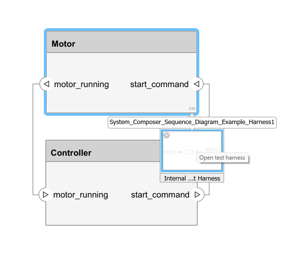

#### Management von Test-Harnesses

Ein einzelnes Subsystem kann mehrere Test-Harnesses besitzen, z.B. für verschiedene Testkategorien wie funktionales Testen, Äquivalenztests oder Robustheitstests.

Die Harnesses können zusammen mit dem Hauptmodell gespeichert werden, werden in diesem Fall aber als separate Artefakte verwaltet.

---

#### Synchronisation mit dem Hauptmodell

Eine kritische Funktion ist die Synchronisation zwischen der Komponente im Hauptmodell und der Kopie im Test-Harness.

-   **Push:** Änderungen am SUT im Test-Harness können in das Hauptmodell zurückgespielt werden. Dies ist nützlich, wenn während des Testens ein Fehler im SUT gefunden und behoben wird.
-   **Pull (Rebuild):** Änderungen am SUT im Hauptmodell werden in das Test-Harness übernommen. Dies ist der Standardfall, um sicherzustellen, dass immer die aktuelle Version der Komponente getestet wird.

Simulink warnt den Benutzer, wenn die Komponente im Harness nicht mehr mit der im Hauptmodell synchron ist. Eine konsistente Strategie für die Synchronisation ist entscheidend für die Verlässlichkeit der Testergebnisse.

---

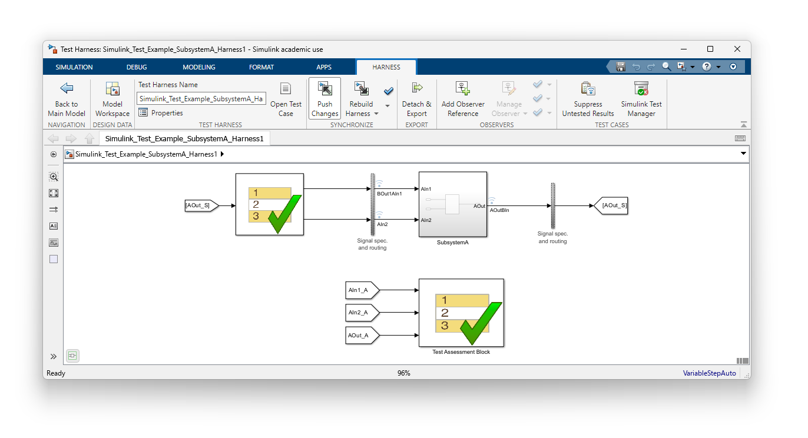

---

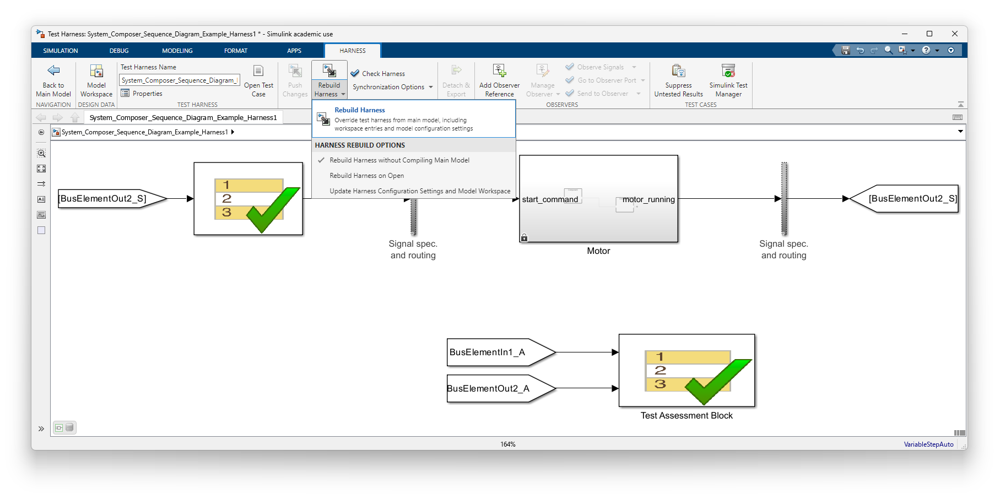

---

#### Verknüpfung von Test-Harness mit Test-Cases

Innerhalb eines Test-Cases wird unter dem Abschnitt **"System Under Test" (SUT)** das zu verwendende Test-Harness ausgewählt.

-   **Test Harness:** Hier kann aus den verfügbaren Harnesses, die für das SUT erstellt wurden, das passende ausgewählt werden. Dies ermöglicht es, verschiedene Test-Szenarien (z.B. funktionale Tests, Robustheitstests) mit jeweils spezifisch konfigurierten Harnesses durchgeführt werden.
-   **Vorteil:** Durch die Zuordnung des Harnesses zum Test-Case wird sichergestellt, dass jeder Test mit der korrekten Testumgebung ausgeführt wird.

---

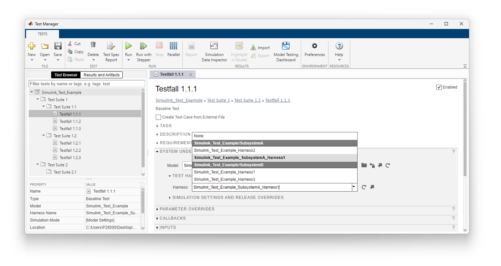

---

<!-- Eine abstrakte Darstellung des Fallbeispiels Akku-Schrauber. Glühende blaue und weiße Konstellationen formen die Silhouette eines Akku-Schraubers, dessen interne Mechanik als separate, hellere Sternenkarte hervorgehoben wird. Das Ganze ist vor einer dunklen Galaxie dargestellt. -->


### 3.1.5: Fallbeispiel: Akku-Schrauber

Anwendung der Konzepte auf das Fallbeispiel des Akku-Schraubers.

1.  Eine Beispielanforderung für den Akku-Schrauber
2.  Erstellung eines Test-Harness für das Motor-Subsystem
3.  Design der Stimuli mit einem Test Sequence Block
4.  Implementierung der Bewertung mit einem Test Sequence Block

---

### Beispiel-Anforderung: Motordrehzahlregelung

**Anforderung (REQ-DRILL-01):**
"Nach einem Sollwertsprung von 0 auf 100 U/min muss die Motordrehzahl innerhalb von 0.5 Sekunden 90% des Sollwerts erreichen und anschließend für mindestens 3 Sekunden innerhalb eines Toleranzbands von +/- 5% des Sollwerts bleiben."

**Testziele:**
-   Überprüfung des Anfahrverhaltens (Rise Time).
-   Überprüfung der Regelgenauigkeit im stationären Zustand (Steady-State Error).

**Benötigte Signale:**
-   **Input:** `soll_drehzahl` (vom Test Sequence Block generiert).
-   **Output:** `ist_drehzahl` (vom Akku-Schrauber-Modell geloggt).

---

#### Test-Harness für das Motor-Subsystem

Um das Motor-Subsystem des Akku-Schraubers isoliert und effizient testen zu können, erstellen wir ein **Test-Harness**.

-   **Rechtsklick auf das "Motor"-Subsystem:** Wählen Sie im Kontextmenü `Test Harness` -> `Create for 'Motor'`.
-   **Konfiguration:**
    -   `Sources`: `Signal Editor` oder `Test Sequence`.
    -   `Sinks`: `Scope` oder `Test Sequence`.
    -   Stellen Sie sicher, dass das `Motor`-Subsystem als "System Under Test" (SUT) im Test-Case des Test-Managers ausgewählt ist und das erstellte Test-Harness zugewiesen wird.

---

#### Stimuli mit Test Sequence Block erzeugen (1 / 2)

Wir verwenden einen `Test Sequence` Block, um das Sollwertsignal (`soll_drehzahl`) gemäß der Anforderung REQ-DRILL-01 zu generieren.

-   **Schritt 1: Initialisierung**
    -   Setze `soll_drehzahl` auf 0.
    -   Warte eine kurze Zeit, um den Startzustand zu etablieren (z.B. `after(0.1, sec)`).
-   **Schritt 2: Sollwertsprung**
    -   Setze `soll_drehzahl` auf 100 (U/min).
    -   Dieser Wert wird für den Rest der Simulation beibehalten.

---

#### Stimuli mit Test Sequence Block erzeugen (2 / 2)

Und so könnte die auf der vorigen Folie beschriebene Logik des `Test Sequence` Blocks in der praktischem Umsetzung aussehen:

| Schritt           | Aktion                   | Bedingung         | Nächster Schritt |
| :---------------- | :----------------------- | :---------------- | :--------------- |
| `Initialize`      | `soll_drehzahl = 0;`     | `after(0.1, sec)` | `ApplySetpoint`  |
| `ApplySetpoint`   | `soll_drehzahl = 100;`   | *keine* | *keiner* |


---

#### Bewertung mit Test Sequence Block implementieren

Ein weiterer `Test Sequence` Block oder ein `when`-Dekompositionszweig kann die Bewertung der `ist_drehzahl` übernehmen.

-   **Phase 1: Anfahrverhalten überprüfen (Rise Time)**
    -   Überwache, wann `ist_drehzahl` 95% des Sollwerts (95 U/min) erreicht.
    -   Verifiziere, dass die hierfür benötigte Zeit maximal 0.5 Sekunden nach dem Sollwertsprung betragen hat.
-   **Phase 2: Stationäres Verhalten überprüfen (Toleranzband)**
    -   Überprüfe kontinuierlich, ob `ist_drehzahl` im Toleranzband (+/- 5% von 100 U/min, also 95-105 U/min) liegt.
    -   Verifiziere, dass dies für mindestens 3 Sekunden nach dem Erreichen des Sollwerts der Fall ist.

---

| Schritt                 | Aktion                                                                                                                                                                          | Bedingung                                                              | Nächster Schritt             |
| :---------------------- | :------------------------------------------------------------------------------------------------------------------------------------------------------------------------------ | :--------------------------------------------------------------------- | :--------------------------- |
| `Wait` | | `soll_drehzahl == 100` | `CheckRise` |
| `CheckRise` | `verify(et < 0.5sec)` | `ist_drehzahl >= 0.95` | `CheckTolerance` |
| `CheckTolerance` | `verify(ist_drehzahl / soll_drehzall >= 0.95 && ist_drehzahl / soll_drehzall <= 1.05)` | `after(3, sec)` | `Done` |
| `Done` | *keine* | *keine* | *keiner* 

---

<!-- Eine abstrakte Darstellung der Übungsaufgabe 3D-Drucker. Ein stilisierter, leuchtender Drahtgitter-Extruderkopf eines 3D-Druckers zieht eine leuchtende Bahn in der Leere des Weltraums, vor dem Hintergrund einer fernen Galaxie. -->


### 3.1.6: Übungsaufgabe

Anwendung auf 3D-Drucker:

1.  Anlegen der Test-Harnesses für wichtige Komponenten (z.B. Extruder).
2.  Erstellung einer Test-Datei mit Test-Suiten und Test-Cases.
3.  Implementierung von Stimuli und Assessments für definierte Anforderungen.
4.  Durchführung der Testfälle und Analyse der Testergebnisse.

---

<!-- Eine abstrakte Darstellung der Störungsanalyse. Eine zerbrochene, leuchtende geometrische Form mit Rissen aus roter Energie, die sich durch sie ziehen, symbolisiert einen Systemfehler. Die Szene ist vor einem turbulenten, stürmischen Nebel angesiedelt. -->


## 3.2: Störungsanalyse mit Simulink Fault Analyzer

Dieser Abschnitt umfasst die folgenden Inhalte:

1. Grundlagen der Störungsanalyse
2. Fault Analyzer App
3. Störungsmodellierung und -injektion
4. Störungssimulation
5. Fallbeispiel: Akku-Schrauber
6. Übungsaufgabe: 3D-Drucker

---

<!-- Eine abstrakte Darstellung der Grundlagen der Störungsanalyse. Zwei gegensätzliche abstrakte Formen schweben vor einem Doppelsternsystem: Eine stabile, stetig blau leuchtende Form (Fail-Safe) und eine andere, die Anzeichen von Beschädigung zeigt, aber ihre Kernstruktur mit einem widerstandsfähigen goldenen Licht beibehält (Fail-Operational). -->


### 3.2.1: Grundlagen der Störungsanalyse

Dieser Unterabschnitt umfasst die folgenden Inhalte:

1.  Terminologie: Störung, Fehler, Ausfall
2.  Arten von Störungen
3.  Sicherheitskonzepte (Fail-Safe, Fail-Operational, Fail-Tolerant)

---

#### Terminologie

Wir unterscheiden zunächst drei wichtige Begriffe:



---

<!-- Eine abstrakte Illustration des Konzepts 'Störung'. In einem ansonsten intakten, durchsichtigen Gehäuse eines stilisierten Getriebes ist ein einzelnes Zahnrad mit einem feinen, rot glühenden Riss zu sehen. Das umgebende System funktioniert scheinbar noch normal. Der Stil ist technisch-zeichnerisch mit comic-artiger Schattierung auf weißem Hintergrund. -->


#### Terminologie: **Störung (*Fault*)**

-   Die vermutete oder tatsächliche **Ursache** eines Problems.
-   Eine anormale physikalische Bedingung oder ein Defekt (z.B. ein durchgebrannter Widerstand, ein Software-Bug, ein Sensor-Kurzschluss).
-   Eine Störung ist statisch und muss nicht zwangsläufig zu einem Problem führen.

---

<!-- Eine abstrakte Illustration des Konzepts 'Fehler'. Ein stilisierter, digitaler Messwert-Graph, der eigentlich eine stabile horizontale Linie zeigen sollte, weist eine plötzliche, unerwartete Zacke nach unten auf. Diese Abweichung vom Soll-Zustand ist rot hervorgehoben. Der Stil ist technisch-zeichnerisch mit comic-artiger Schattierung auf weißem Hintergrund. -->

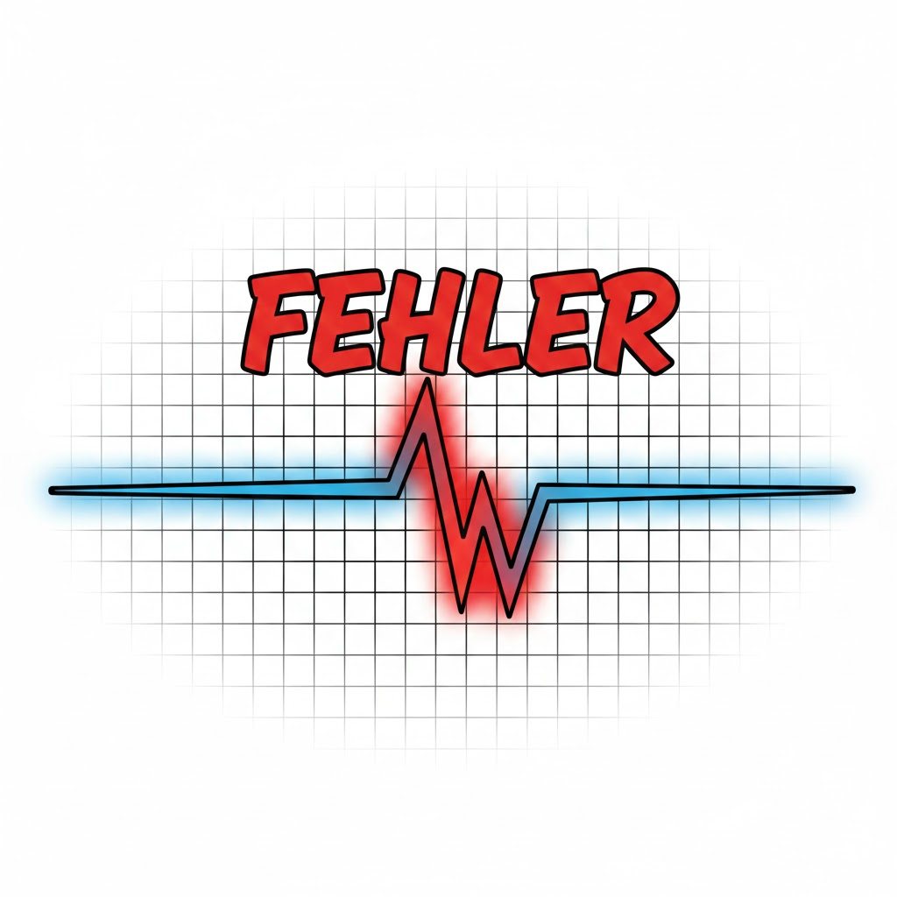

#### Terminologie: **Fehler (*Error*)**

-   Ein **Zustand** im System, der von der korrekten oder erwarteten Systemoperation abweicht.
-   Ein Fehler ist die Manifestation einer Störung. (z.B. ein falscher Wert wird von einem Sensor gelesen, eine Variable im Speicher wird korrumpiert).

---

<!-- Eine abstrakte Illustration des Konzepts 'Ausfall'. Eine stilisierte, ehemals funktionierende Maschine, dargestellt durch ineinandergreifende Zahnräder und Hebel, ist zum Stillstand gekommen. Roter Rauch steigt von einer blockierten Stelle auf, und ein großes, rotes Warnsymbol mit einem Ausrufezeichen schwebt über der gesamten Apparatur. Der Stil ist technisch-zeichnerisch mit comic-artiger Schattierung auf weißem Hintergrund. -->

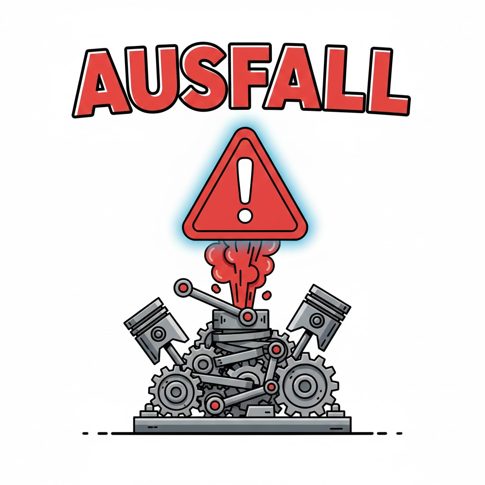

#### Terminologie: **Ausfall (*Failure*)**

-   Das extern beobachtbare **Ereignis**, bei dem ein System seine spezifizierte Funktion nicht mehr erbringt.
-   Ein Ausfall tritt auf, wenn ein Fehler an die Systemgrenze propagiert.

---

<!-- Eine schematische Darstellung einer kausalen Kette: Ein roter Pfeil geht von einer Blase mit der Aufschrift 'Störung' (Fault) zu einer Blase mit 'Fehler' (Error), von der wiederum ein roter Pfeil zu einer Blase mit 'Ausfall' (Failure) führt. Dies illustriert die Progression von einer Ursache zu einem Problemzustand und schließlich zu einem Systemversagen. -->

#### Kausalkette

Eine **Störung** kann einen **Fehler** verursachen, der wiederum zu einem **Ausfall** führen kann.

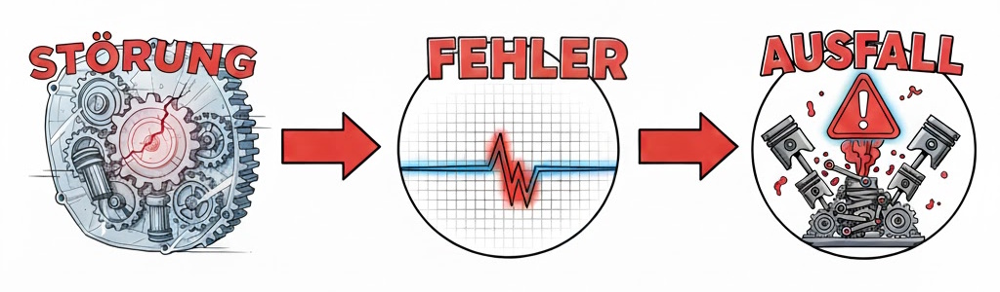

---

#### Klassifizierung von Störungen

Störungen können nach verschiedenen Kriterien klassifiziert werden.



---

<!-- Eine Illustration, die drei Arten von Störungen nach ihrer Dauer darstellt. Drei Zeitachsen zeigen jeweils einen Signalverlauf. Die erste ('Permanent') zeigt ein Signal, das nach einem Defekt (symbolisiert durch ein durchgebrochenes Kabel-Icon) auf Null fällt und dort bleibt. Die zweite ('Temporär') zeigt ein Signal mit einem kurzen, einmaligen Ausreißer (symbolisiert durch ein Blitz-Icon). Die dritte ('Intermittierend') zeigt ein Signal, das sporadisch ausfällt (symbolisiert durch ein Wackelkontakt-Icon). Der Stil ist eine technische Zeichnung mit comic-artiger Schattierung auf weißem Hintergrund. -->

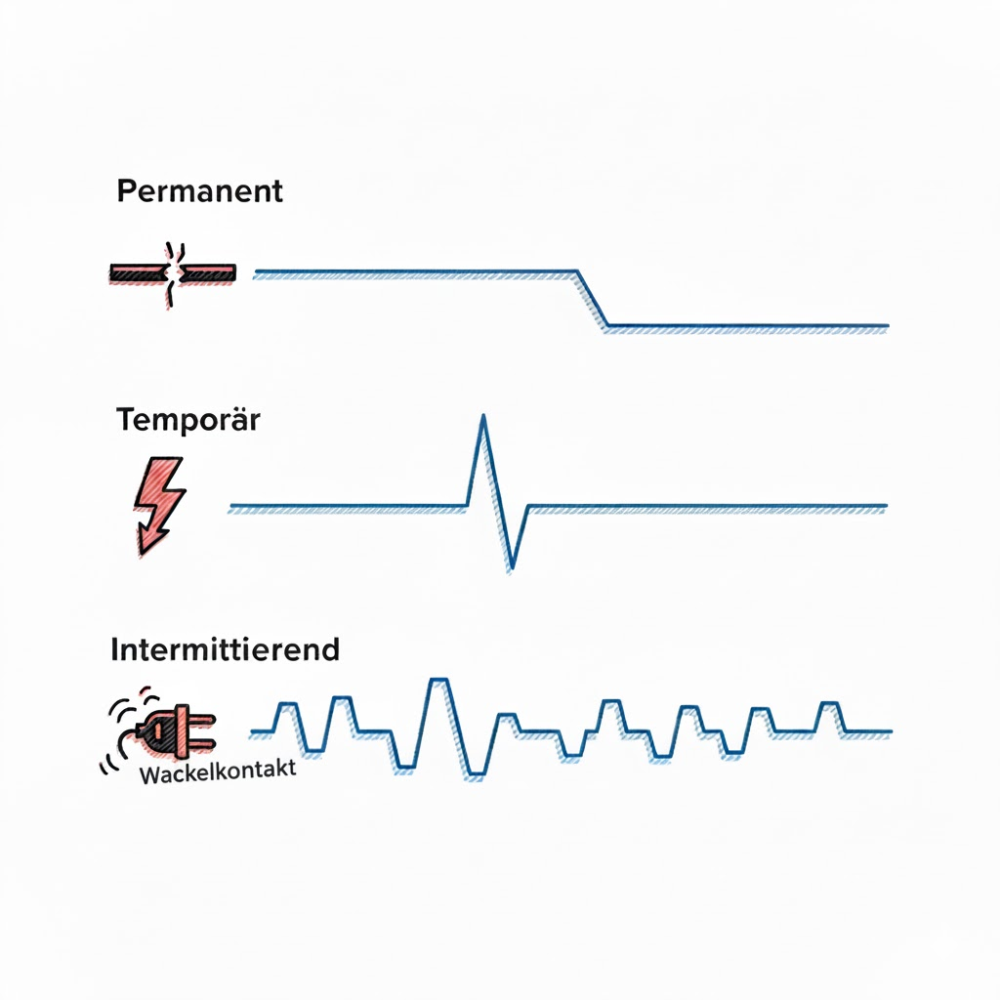

#### Klassifizierung von Störungen **nach Dauer**

-   **Permanent:** Die Störung bleibt bestehen (z.B. Kabelbruch).
-   **Transien/Temporär:** Die Störung tritt nur für eine kurze Zeit auf (z.B. durch elektromagnetische Interferenz).
-   **Intermittierend:** Die Störung tritt sporadisch auf und verschwindet wieder (z.B. Wackelkontakt).

---

<!-- Eine Illustration, die drei Arten von Störungen nach ihrer Natur darstellt, aufgeteilt in drei Panels. Links ('Hardware') ist ein Mikrochip mit einem leuchtenden roten Riss abgebildet. In der Mitte ('Software') ist ein Code-Snippet zu sehen, bei dem ein logischer Fehler rot hervorgehoben ist. Rechts ('Systematisch') wird ein fehlerhaftes technisches Diagramm oder eine Spezifikation gezeigt, bei der eine falsche Verbindung rot markiert ist. Der Stil ist eine technische Zeichnung mit comic-artiger Schattierung auf weißem Hintergrund. -->

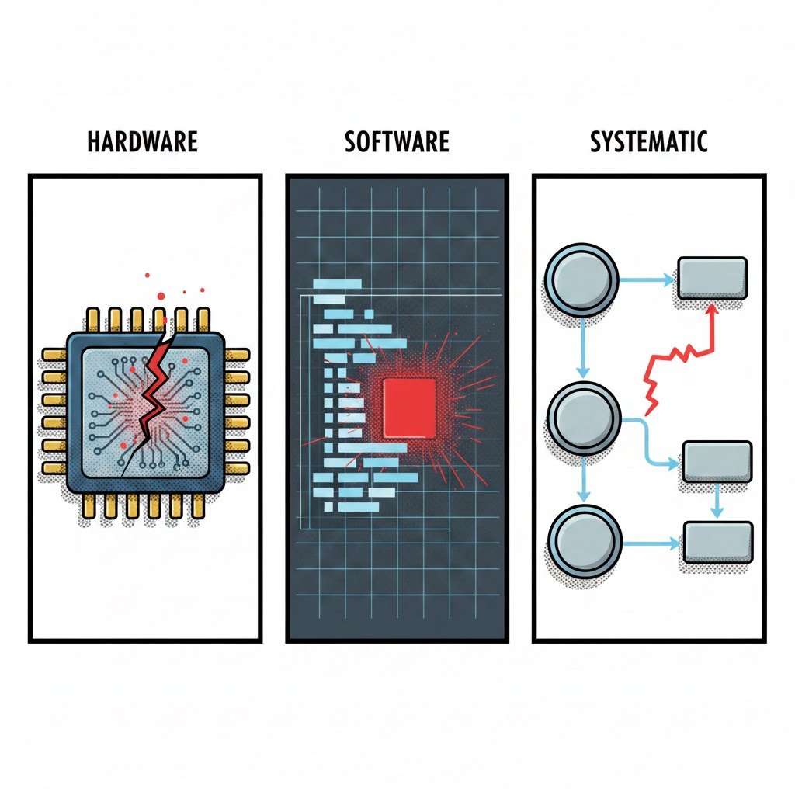

#### Klassifizierung von Störungen **nach Natur**

-   **Hardware-Störungen:** Physikalische Defekte (Alterung, Fertigungsfehler).
-   **Software-Störungen:** Fehler im Code (logische Fehler, Speicherlecks).
-   **Systematische Störungen:** Fehler im Entwicklungsprozess (Anforderungsfehler, Designfehler).

---

<!-- Eine 2x2-Matrix, die vier verschiedene Störungsverhalten illustriert. Oben links ('Stuck-at') ist ein Signal zu sehen, das auf einem Wert hängen bleibt. Oben rechts ('Offset') wird ein Signal gezeigt, das konstant über dem Sollwert liegt. Unten links ('Gain-Fehler') ist ein Signal mit überhöhter Amplitude dargestellt. Unten rechts ('Verzögerung') wird ein Signal gezeigt, das zeitlich versetzt zum Sollwert verläuft. Die Abweichungen sind jeweils rot markiert. Der Stil ist eine technische Zeichnung mit comic-artiger Schattierung auf weißem Hintergrund. -->

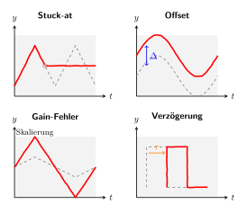

#### Klassifizierung von Störungen **nach Verhalten (Beispiele)**

-   **Stuck-at-Zero/One:** Signal ist permanent auf 0 oder 1 fixiert.
-   **Offset:** Dem korrekten Wert wird ein konstanter Fehler addiert.
-   **Gain-Fehler:** Das Signal wird mit einem falschen Faktor skaliert.
-   **Verzögerung:** Das Signal wird verspätet geliefert.

---

#### Sicherheitskonzepte

Sicherheitskonzepte beschreiben, wie ein System auf das Auftreten von Störungen reagieren soll, um Schaden abzuwenden.


---

<!-- Eine stilisierte, mechanische Presse. Im Fehlerfall (symbolisiert durch ein Blitz-Icon an der Steuerung) fällt ein massiver, physischer Riegel von oben in die Maschine und blockiert die Bewegung, sodass die Presse in einer offenen, sicheren Position verharrt. Der Stil ist eine technische Zeichnung mit comic-artiger Schattierung auf weißem Hintergrund. -->

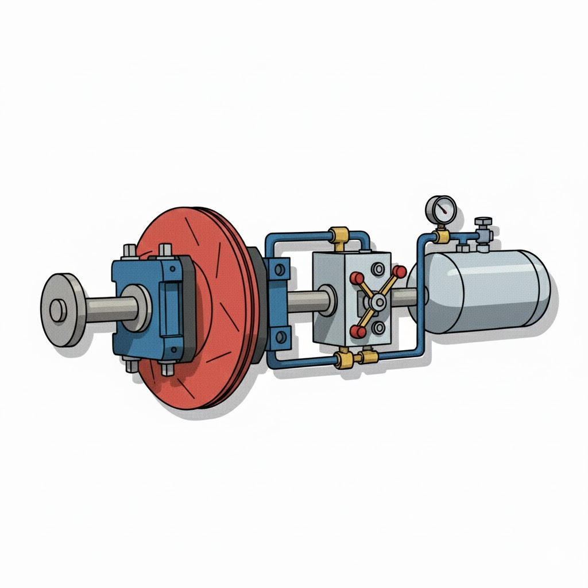

#### Sicherheitskonzepte: **Fail-Safe**

-   Das System geht im Fehlerfall in einen vordefinierten, sicheren Zustand über. Dieser Zustand ist typischerweise ein Zustand ohne Energie oder Bewegung.
-   **Beispiel:** Eine Ampelanlage schaltet bei einer Störung auf gelbes Blinklicht oder komplett ab. Ein Zugbremssystem wird bei Druckverlust automatisch aktiviert.

---

<!-- Eine schematische Darstellung von Redundanz. Zwei identische, parallele Pumpen versorgen ein System. Eine der Pumpen ist rot durchgestrichen und hat ein "Ausfall"-Symbol (ein Blitz). Trotzdem läuft die zweite Pumpe normal weiter (grün leuchtend), und der Flüssigkeitsfluss im System bleibt aufrechterhalten. Der Stil ist eine technische Zeichnung mit comic-artiger Schattierung auf weißem Hintergrund. -->


#### Sicherheitskonzepte: **Fail-Operational**

-   Das System kann seine Funktion auch nach dem Eintreten einer (oder mehrerer) Störungen aufrechterhalten, möglicherweise mit reduzierter Leistung.
-   **Beispiel:** Autonomes Fahrzeug, das beim Ausfall des LIDAR-Sensors die Geschwindigkeit reduziert und mit einfachen Kameras weiterfährt.

---

<!-- Eine schematische Darstellung eines Netzwerks aus verbundenen Knoten. Ein Knoten in der Mitte ist rot markiert und als "ausgefallen" gekennzeichnet. Ein Datenpfad, dargestellt durch eine leuchtende Linie, wird gezeigt, wie er den defekten Knoten intelligent umgeht und einen alternativen Weg zum Ziel findet, um die Funktion des Netzwerks sicherzustellen. Der Stil ist eine technische Zeichnung mit comic-artiger Schattierung auf weißem Hintergrund. -->


#### Sicherheitskonzepte: **Fail-Tolerant**

-   Ein allgemeinerer Begriff, der die Fähigkeit eines Systems beschreibt, trotz Störungen weiterhin korrekt zu funktionieren. `Fail-Operational` ist eine spezifische Form der Fehlertoleranz.
-   **Beispiel:** Ein Flugzeug mit vier Turbinen kann den Ausfall einer Turbine vollständig kompensieren.

---

<!-- Eine abstrakte Darstellung der Fault Analyzer App. Ein digitales Dashboard mit leuchtenden Diagrammen und Graphen schwebt im Weltraum und zeigt Fehlerdaten und Analyseergebnisse vor dem Hintergrund einer Spiralgalaxie. -->


### 3.2.2: Fault Analyzer App

Dieser Unterabschnitt umfasst die folgenden Inhalte:

1.  Workflow der Störungsanalyse
2.  Die Fault Analyzer UI
3.  Verwaltung von Störungen und Störungssätzen

---

#### Workflow der Störungsanalyse

1.  **Störungen definieren:** Identifizieren und definieren Sie potenzielle Störungen im System (z.B. Sensor fällt aus, Aktor klemmt).
2.  **Störungen modellieren:** Fügen Sie diese Störungen an den entsprechenden Stellen im Simulink-Modell hinzu.
3.  **Störungen aktivieren:** Legen Sie Bedingungen fest, wann eine Störung während der Simulation injiziert werden soll (z.B. zu einem bestimmten Zeitpunkt).
4.  **Simulationen ausführen:** Führen Sie Simulationen für jedes Fehlerszenario sowie eine nominale Simulation (ohne Fehler) als Referenz durch.
5.  **Ergebnisse analysieren:** Vergleichen Sie das Verhalten des Systems mit und ohne Störung, um die Auswirkungen zu verstehen.
6.  **Dokumentieren:** Erstellen Sie Berichte, z.B. für eine FMEA.

---


---

#### Verwaltung von Störungen und Störungssätzen

Der Fault Analyzer bietet drei wichtige Kernkonzepte für die Abbildung von Störungen in Simulink-Modellen:



---

<!-- Eine stilisierte Darstellung eines einzelnen Fehlers. Ein Zahnrad in einem Getriebe hat einen sichtbaren, rot glühenden Riss in einem seiner Zähne, was einen mechanischen Defekt symbolisiert. Das restliche System ist noch intakt. Der Stil ist eine technische Zeichnung mit comic-artiger Schattierung auf weißem Hintergrund. -->


#### Störung (*Fault*)

-   Wird im Fault Analyzer erstellt und einem Modellelement (Block oder Signal) zugeordnet.
-   Jede Störung hat einen Namen, eine Beschreibung und ein definiertes Verhalten (z.B. "force to value 0").

---

<!-- Eine Illustration des Konzepts 'Bedingung'. Ein stilisiertes Thermometer zeigt, wie die Quecksilbersäule eine kritische rote Linie überschreitet. Genau an diesem Punkt schlägt ein rot leuchtender Blitz ein, der symbolisiert, dass die Bedingung (Temperatur > 100°C) erfüllt ist und eine Störung auslöst. Der Stil ist eine technische Zeichnung mit comic-artiger Schattierung auf weißem Hintergrund. -->

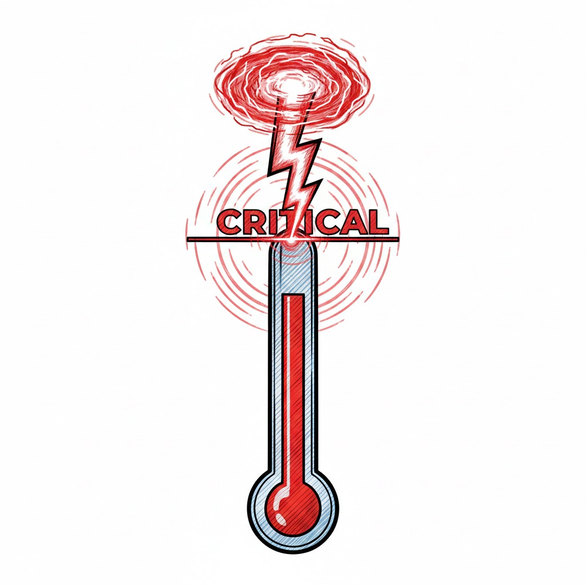

#### Bedingung (*Conditional*)

-   Eine logische Bedingung, die definiert, wann eine Störung aktiv wird.
-   Kann zeitbasiert (`time > 10`) oder zustandsbasiert (`temperature > 90`) sein.
-   Eine Störung, die keiner Bedingung zugeordnet ist, kann manuell aktiviert werden.

---

<!-- Eine visuelle Darstellung eines 'Störungssatzes'. Ein offener, stilisierter Werkzeugkasten oder Ordner mit der Aufschrift 'Sensor-Ausfälle' enthält mehrere Icons, die einzelne Störungen repräsentieren: ein durchgebranntes Thermometer-Symbol, ein gebrochenes Tachometer-Symbol und ein Kurzschluss-Symbol. Dies symbolisiert die Gruppierung von mehreren Einzelstörungen zu einem Testszenario. Der Stil ist eine technische Zeichnung mit comic-artiger Schattierung auf weißem Hintergrund. -->

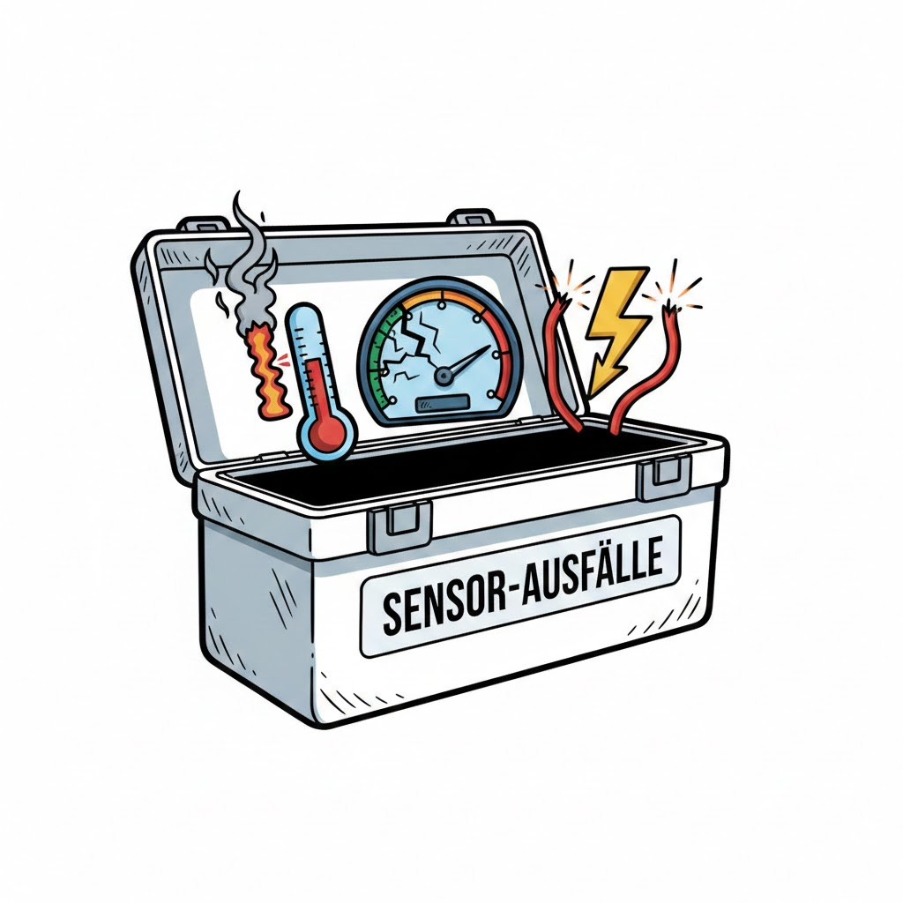

#### Störungssatz (*Fault Set*)

-   Eine benannte Sammlung von einer oder mehreren Störungen, die für eine Simulationskampagne gleichzeitig aktiviert werden.
-   **Beispiel:** Ein Satz "Sensor-Fehler" könnte die Störungen "Kurzschluss Temperatursensor" und "Ausfall Drehzahlsensor" enthalten. Die Kampagne würde dann eine Simulation pro Störung in diesem Satz durchführen.

---

<!-- Eine abstrakte Darstellung der Störungsmodellierung und -injektion. Ein Strom roter, störungsartiger Partikel wird in ein stabiles, blaues Energienetz injiziert, was zu lokalen Unterbrechungen führt. Die Szene spielt sich vor einem dunklen Nebel ab. -->

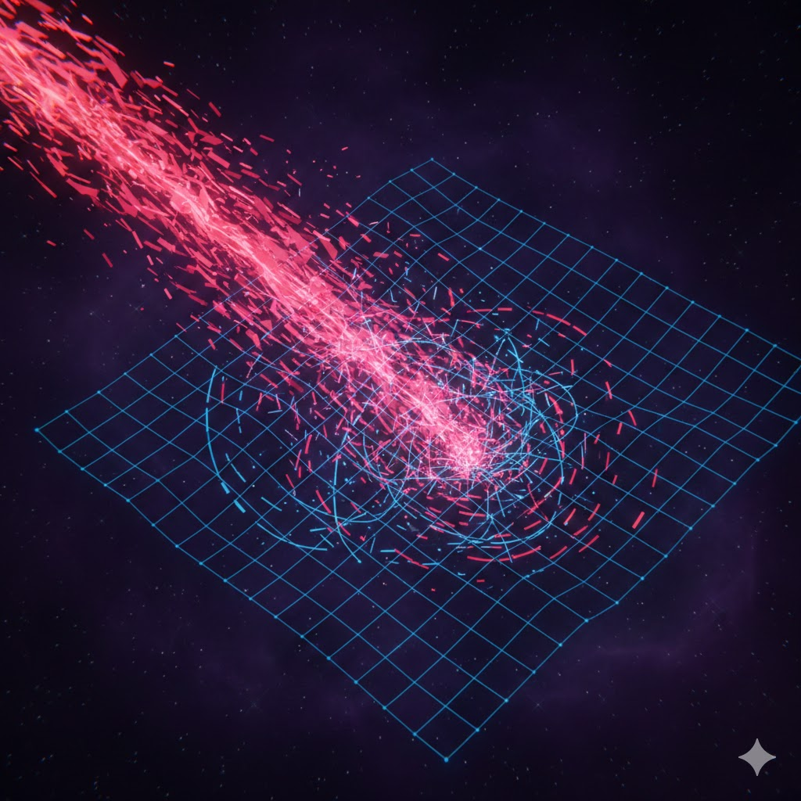

### 3.2.3: Störungsmodellierung und -injektion

Dieser Unterabschnitt umfasst die folgenden Inhalte:

1.  Hinzufügen von Störungen zu Modellelementen
2.  Verwendung des `Fault Inport/Outport` Blocks
3.  Bedingte und zeitgesteuerte Störungsinjektion

---

<div class="columns">
<div>

#### Hinzufügen einer Störung

Der erste Schritt ist, eine Störung zu einem bestimmten Element im Modell hinzuzufügen.

1.  Wählen Sie eine **Signalleitung** aus, die von einer Störung betroffen sein soll.
2.  Klicken Sie in der Symbolleiste der **Fault Analyzer** App auf **`Add Fault`**.

</div>
<div>

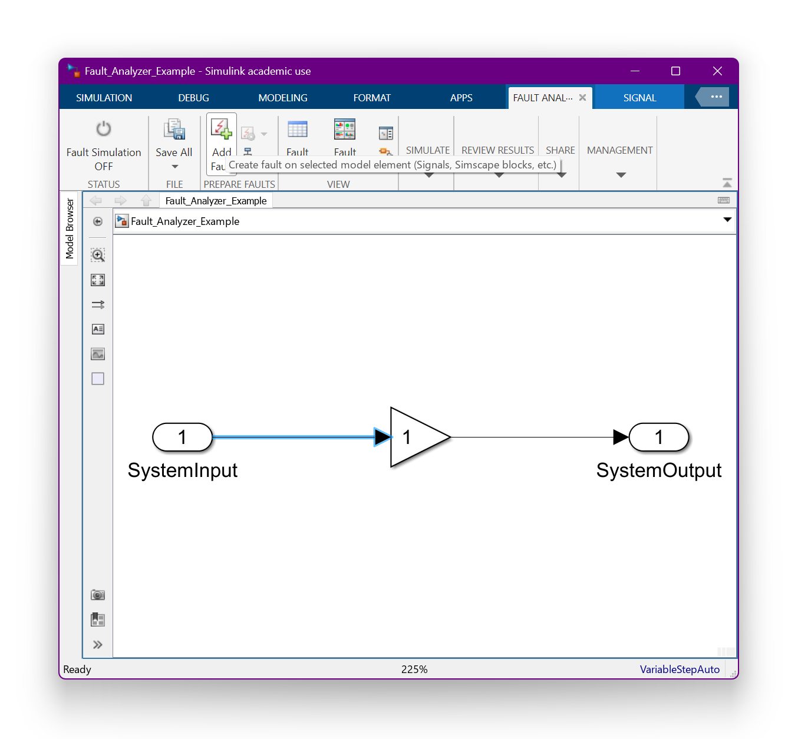

</div>
</div>

---

<div class="columns">
<div>

#### Konfiguration der Störung

1.  **Name:** Ein eindeutiger Name für die Störung (z.B. `Sensor_Stuck_At_Zero`).
2.  **Description:** Detaillierte Beschrei-bung für die Nachvollziehbarkeit.
3.  **Behavior:** Legt fest, was die Störung tut (z.B. den Signalwert auf 0 zwingen).
4.  **Trigger:** Definiert, wann die Störung während der Simulation aktiviert wird (z.B. Zeitpunkt).

</div>
<div>

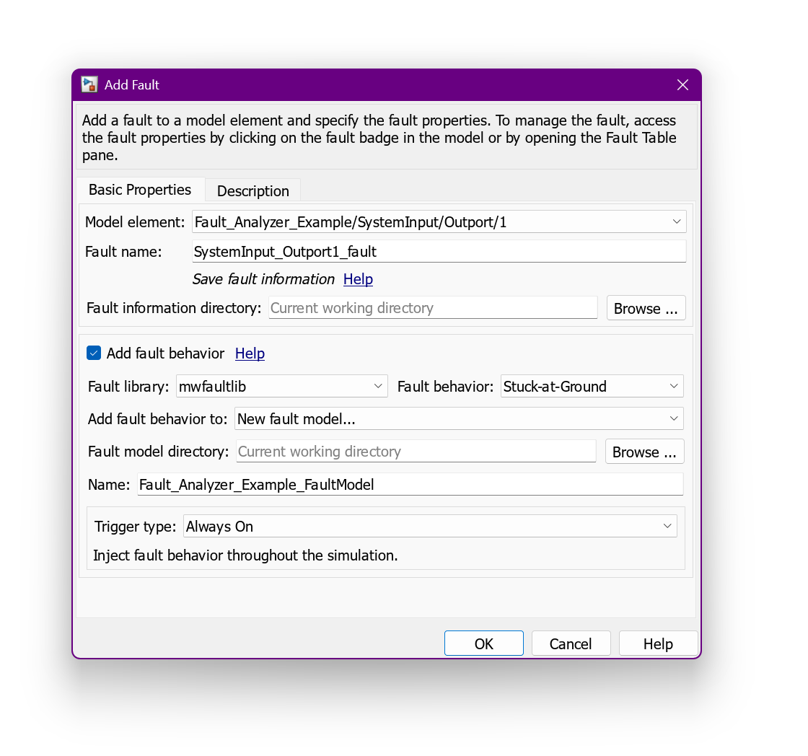

</div>
</div>

---

#### Name und Beschreibung der Störung

Eine saubere Benennung und Dokumentation von Störungen ist entscheidend für die spätere Analyse und die Rückverfolgbarkeit zu Sicherheitsdokumenten wie einer FMEA.

-   **Name:** Verwenden Sie eine konsistente Nomenklatur, die das betroffene Element und die Art der Störung widerspiegelt.
    -   **Gut:** `TempSensor_Output_Stuck_At_120`
    -   **Schlecht:** `Fault1`
-   **Description:** Beschreiben Sie hier das Störungs-Szenario, die Annahmen und ggf. die ID der zugehörigen Anforderung aus der FMEA (z.B. `FMEA-ID: 12.3.4`).

---

#### Vordefinierte Störungsverhalten

Simulink Fault Analyzer bietet eine Bibliothek (`mwfaultlib`) von vordefinierten, häufig auftretenden Störungsverhalten, die direkt auf Signale angewendet werden können.

- **Force to value:** Zwingt das Signal auf einen konstanten Wert. (*Sensor-Ausfall (`0`), Kurzschluss (`VCC`)*)
- **Add to value:** Addiert einen konstanten Offset zum Signal. (*Sensor-Drift*)
- **Gain:** Multipliziert das Signal mit einem Faktor. (*Falsche Kalibrierung*)
- **Add noise:** Fügt dem Signal ein Rauschen hinzu. (*Elektromagnetische Interferenz*).
- **Stuck-at-Ground:** Spezialfall von `Force to value 0`. (*Kurzschluss nach Masse*)
- **Unit Delay:** Verzögert das Signal um einen Simulationsschritt. (*Latenz im Kommunikationsbus*)

---

<div class="columns">
<div>

#### Eigenes Störungsverhalten

-   Ein Subsystem mit speziellen **`Fault Inport`** und **`Fault Outport`** Blöcken.
-   **`Fault Inport`:** Empfängt das nominale (störungsfreie) Signal.
-   **`Fault Outport`:** Sendet das modifizierte (fehlerhafte) Signal zurück.
-   Dazwischen kann beliebige Simulink-Logik implementiert werden.

</div>
<div>


</div>
</div>

---

#### Störungs-Trigger

Der Trigger legt fest, wann eine Störung während der Simulation aktiviert wird.

<div class="columns top">
<div>

##### `Always On`
Die Störung ist von Beginn der Simulation an aktiv. Nützlich für permanente Hardware-Defekte.

##### `Timed`
Die Störung wird zu einem bestimmten Zeitpunkt oder innerhalb eines Zeitintervalls aktiviert. `time >= 2.5`

</div>
<div>

##### `Conditional`
Die Störung wird durch eine Bedingung ausgelöst, die von anderen Signalen oder Zuständen abhängt. `temperature > 100`

##### `Manual`
Die Störung wird nur dann aktiviert, wenn sie manuell in einem `Fault Set` für die Simulation ausgewählt wird.

</div>
</div>

---

#### Wiederverwendbare Trigger: **Conditionals**

Ein **Conditional** ist ein benannter, wiederverwendbarer logischer Ausdruck, der als Trigger für eine oder mehrere Störungen dienen kann.

-   **Zentralisierung:** Anstatt komplexe Trigger-Logik in jeder einzelnen Störung zu duplizieren, wird sie einmal als `Conditional` definiert.
-   **Lesbarkeit:** Statt `signal_A > 5 && (signal_B == 0 || signal_C < 2.3)` kann der verständliche Name des Conditionals (z.B. `High_Load_Condition`) als Trigger verwendet werden.
-   **Management:** Conditionals werden zentral im Fault Analyzer verwaltet.

---

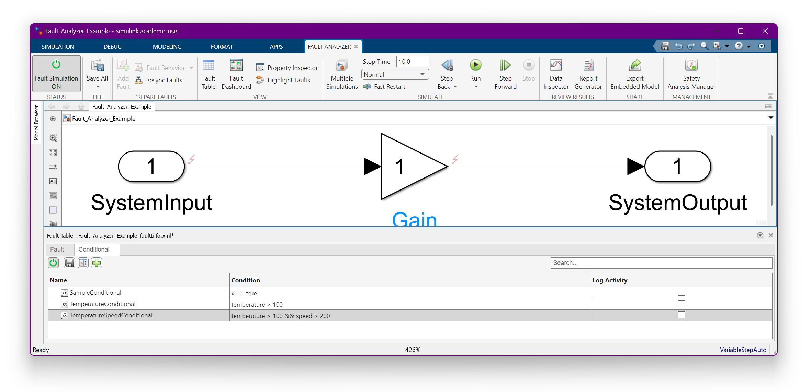

---

<div class="columns">
<div>

#### Konfiguration eines Conditionals

1.  **Name:** Ein eindeutiger Name (z.B. `Critical_Temp`).
2.  **Expression:** Der logische Ausdruck, der `true` ergeben muss, um den Trigger auszulösen.
3.  **Symbols:** Die im Ausdruck verwendeten Variablennamen (Symbole). Es werden die beiden Typen *Expression* und *ModelElement* untersützt.

</div>
<div>


</div>
</div>

---

<!-- Eine abstrakte Illustration, die das Konzept einer "Expression" im Kontext von Conditionals darstellt. Eine Formel, z.B. E=mc², schwebt als leuchtendes Hologramm, umgeben von Datenströmen und stilisierten Berechnungen. Der Stil ist eine technische Zeichnung mit comic-artiger Schattierung auf weißem Hintergrund. -->


#### Symbole in Conditionals: `Expression`

-   **Definition:** Das Symbol wird durch einen eigenen MATLAB-Ausdruck definiert.
-   **Anwendung:** Zur Erstellung von abgeleiteten oder abstrakten Bedingungen, die nicht direkt als Signal im Modell existieren. Ideal für die Wiederverwendung komplexer Berechnungen.
-   **Beispiel:**
    -   Symbol: `effective_load`
    -   Ausdruck: `sqrt(load_x^2 + load_y^2)`

---

<!-- Eine abstrakte Illustration, die das Konzept eines "ModelElement" im Kontext von Conditionals darstellt. Ein stilisierter, leuchtender Baustein, der ein Komponenten-Modell repräsentiert, ist mit einer Beschriftung "Motor_Regler" versehen. Datenpfeile verbinden ihn mit anderen, unscharfen Modellelementen im Hintergrund. Der Stil ist eine technische Zeichnung mit comic-artiger Schattierung auf weißem Hintergrund. -->

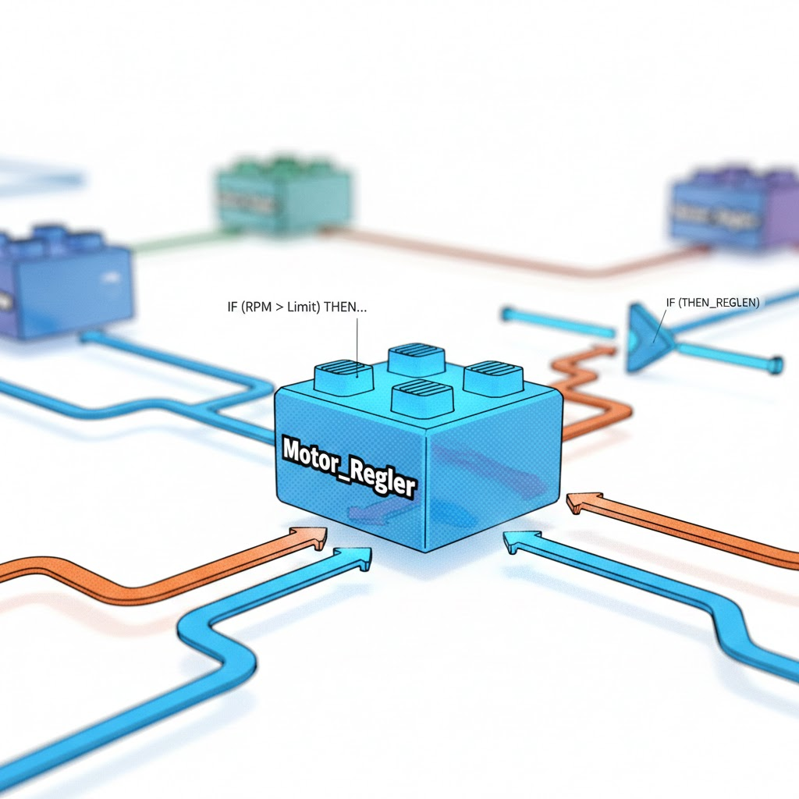

#### Symbole in Conditionals: `ModelElement`

-   **Definition:** Das Symbol wird direkt mit einem Element im Simulink-Modell verknüpft (z.B. einem Signal oder einem Blockparameter).
-   **Anwendung:** Der Standardfall, um eine Bedingung direkt an den Zustand des Systems zu koppeln.
-   **Beispiel:**
    -   Symbol: `temp`
    -   Modelelement: `AkkuSchrauber/Sensors/Temperature_Output`

---

<!-- Eine abstrakte Illustration, die Störungssimulationen darstellt. Ein Netzwerk aus verbundenen Simulationsläufen, einige davon in Rot (fehlerhaft), wird über einer Galaxie dargestellt, die die verschiedenen Szenarien symbolisiert. -->


### 3.2.4: Störungssimulation

Dieser Unterabschnitt umfasst die folgenden Inhalte:

1.  Durchführung von Simulationen
2.  Manuelle Aktivierung von Störungen
3.  Simulationskampagnen mit Störungssätzen
4.  Analyse der Ergebnisse

---

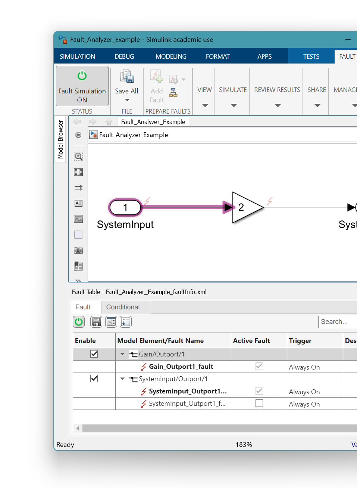

#### Manuelle Aktivierung via **Fault Table**

Für schnelle, explorative Tests können einzelne Störungen manuell für eine nominale Simulation aktiviert werden.

1.  **Fault Table öffnen:** Wechseln Sie zum Tab `Faults`.
2.  **Störung aktivieren:** Setzen Sie in der Spalte `Enabled` ein Häkchen bei der Störung, die Sie injizieren möchten.
3.  **Simulation starten:** Klicken Sie auf `Run`.

In dieser Simulation ist nur die manuell ausgewählte Störung aktiv, unabhängig von ihrem Trigger.

---

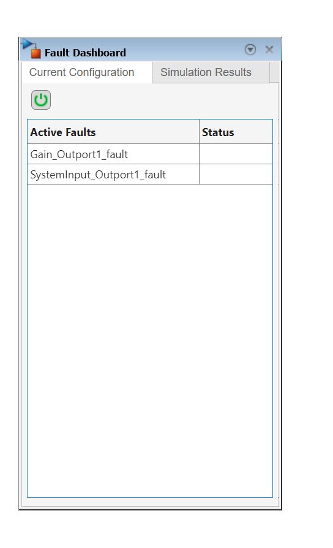

#### Das **Fault Dashboard** (1 / 2)

Während einer Simulation bietet das **Fault Dashboard** einen Live-Überblick über den Zustand der Störungsinjektion.

- **Current Configuration:** Zeigt an, welche Störungen im aktuellen Simulationslauf aktiv sind.
- **Simulation Results:** Zeigt, wieviele und welche Störungen im aktuellen Simualtionslauf tatsächlich ausgelöst wurden.

Dies ist extrem nützlich, um zu überprüfen, ob Störungen wie erwartet (z.B. durch einen `Conditional` Trigger) zur richtigen Zeit aktiv werden.

---

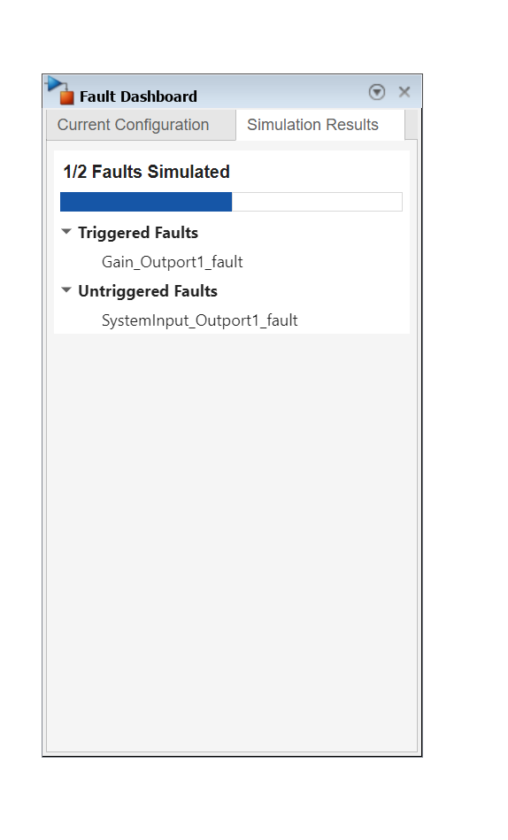

#### Das **Fault Dashboard** (2 / 2)

Der Screenshot auf der rechten Seite zeigt den *Simualtion Results* Tab:

- **Faults Simulated** zeigt, wieviele Störungen für den aktuellen Simulationslauf insgesamt aktiviert wurden und wieviele davon tatsächlich ausgelöst wurden.
- **Triggered Faults** zeigt, welche der aktiven Störungen tatsächlich ausgelöst wurden.
- **Untriggered Faults** zeigt, welche der aktiven Störungen nicht ausgelöst wurden (z.B. weil die Bedingung nicht eingetreten ist).

---

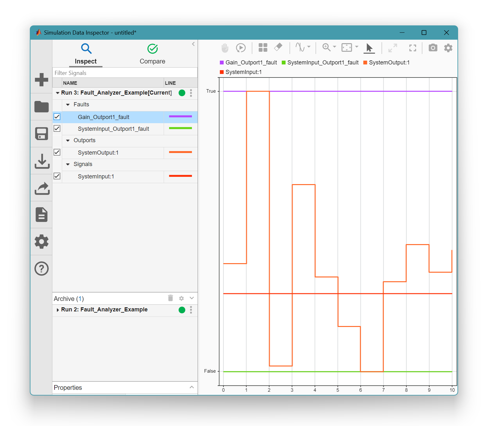

#### Der **Data Inspector**

Der *Data Inspector* kann verwendet werden, um das Systemverhalten während der Simulationsläufe genauer zu analysieren:

- **Einteilung** in verschiedene `Runs` mit potenziell unterschiedlichen Einstellungen
- **Zeitreihendarstellung** für die aktiven `Faults`, die `Outports` des Modells, sowie weitere geloggte (interne) `Signale`.

---


---

#### Integration mit Simulink Test

Die im Fault Analyzer definierten Störungen können direkt in **Simulink Test** verwendet werden, um die Reaktion des Systems auf von Fehlerszenarien zu überprüfen.

-   **Systematische Aktivierung:** Anstatt Störungen manuell im Fault Analyzer zu aktivieren, werden sie gezielt innerhalb eines Test-Cases injiziert.
-   **Kombination mit Assessments:** Das Systemverhalten unter Störungsbedingungen kann mit denselben `Assessments` bewertet werden wie das nominale Verhalten.
-   **Automatisierung:** Ermöglicht die automatische Ausführung von Testkampagnen, die sowohl das nominale Verhalten als auch Fehlerszenarien abdecken.
-   **Rückverfolgbarkeit:** Die Testergebnisse für Störungs-Tests können direkt mit Sicherheitsanforderungen verknüpft werden.

---

<div class="columns">
<div>

#### Faults im Test Case aktivieren

Im Test-Manager kann für jeden Test-Case die Störungssimulation aktiviert werden.

1.  Wählen Sie den gewünschten **Test-Case** aus.
2.  Navigieren Sie zum Abschnitt **`Fault Settings`**.
3.  Legen Sie ein ein **`Fault Set`** an.
4.  Fügen Sie dem Störungssatz die gewünschten **`Faults`** hinzu.

</div>
<div>

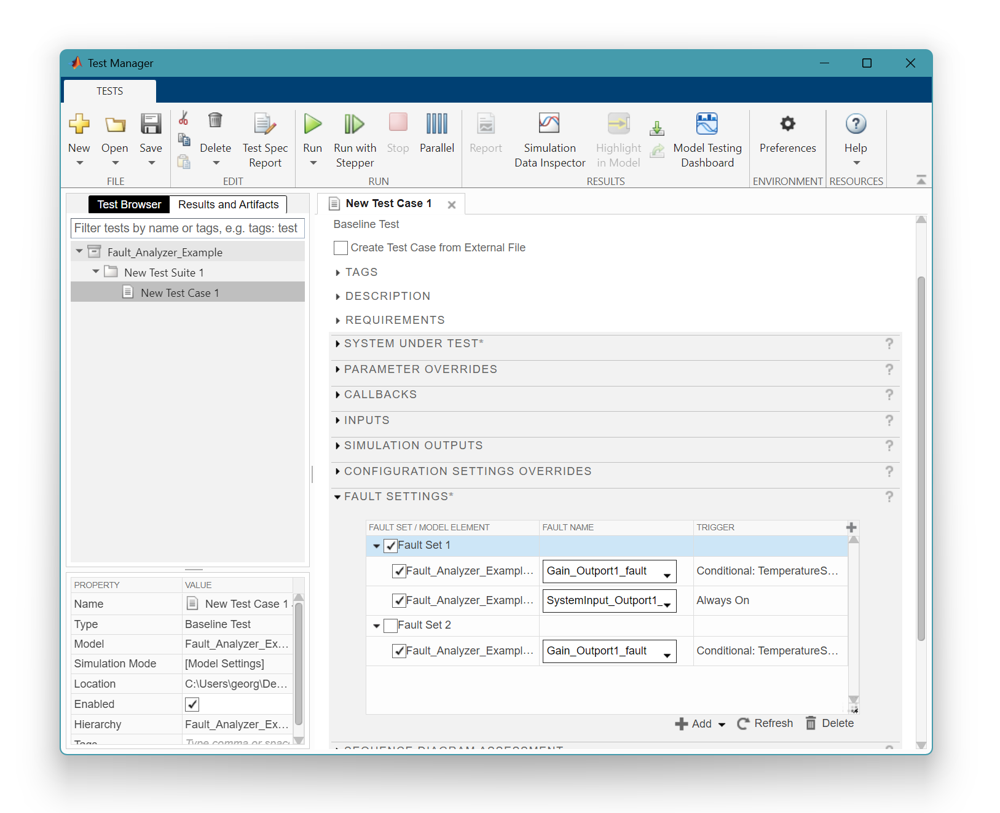

</div>
</div>

---

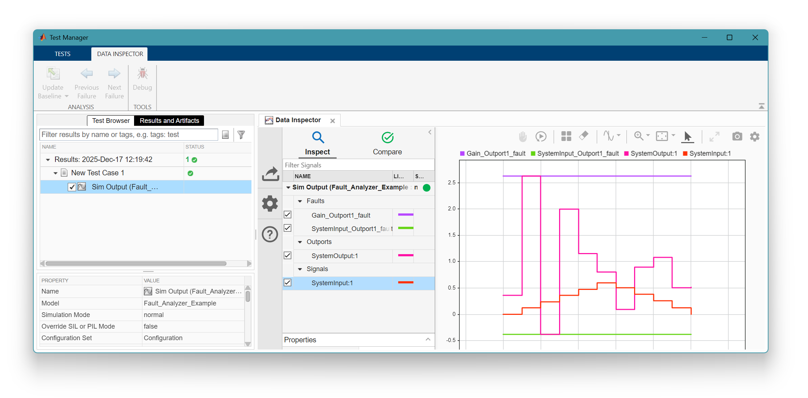

---

<!-- Eine abstrakte Darstellung des Fallbeispiels Akku-Schrauber im Kontext von Störungen. Die Silhouette eines Akku-Schraubers, geformt aus blauen und weißen Konstellationen, zeigt rote, fehlerhafte Funken an kritischen Stellen wie dem Akku, dem Motor und einem Sensor. Das Ganze ist vor einer dunklen Galaxie dargestellt. -->


### 3.2.5: Fallbeispiel: Akku-Schrauber

Anwendung der Konzepte auf das Fallbeispiel des Akku-Schraubers.

1.  Störung 1: Temperatursensor "Stuck-at"
2.  Störung 2: Drehzahlsensor "Stuck-at-Zero"
3.  Störung 3: Schalter mit Wackelkontakt (Intermittierend)
4.  Störung 4: Batterie-Tiefentladung (Bedingt)

---

#### Störung 1: Temperatursensor liefert konstanten Wert

-   **Szenario:** Der Temperatursensor im Akku oder Motor ist defekt und liefert permanent einen festen, ungültigen Wert.
-   **Modellierung:** Eine `Fault`-Definition wird auf das Ausgangssignal des Temperatursensors gelegt.
-   **Verhalten:** Das vordefinierte Verhalten `Force to value` wird verwendet.
-   **Beispiele:**
    -   `Temp_Stuck_At_25`: Wert wird auf `25` (°C) fixiert. **Gefahr:** Eine Überhitzung des Systems wird nicht erkannt, was zu permanentem Schaden führen kann.
    -   `Temp_Stuck_At_130`: Wert wird auf `130` (°C) fixiert. **Folge:** Das System aktiviert den Selbstschutz und schaltet ab, obwohl keine Gefahr besteht.

---

#### Störung 2: Drehzahlsensor fällt aus

-   **Szenario:** Der Hall-Sensor zur Messung der Motordrehzahl ist ausgefallen und liefert permanent den Wert `0`.
-   **Modellierung:** Eine `Fault`-Definition wird auf das Signal `ist_drehzahl` gelegt.
-   **Verhalten:** `Force to value` mit dem Wert `0`.
-   **Trigger:** `Timed`, z.B. `time > 2`, um den Ausfall während des Betriebs zu simulieren.
-   **Gefahr:** Der Regler "denkt", der Motor dreht sich nicht, obwohl er mit Strom versorgt wird. Er wird versuchen, die Regelabweichung zu kompensieren, indem er die Leistung massiv erhöht. Dies kann zu einer Überlastung des Motors, des Getriebes oder der Elektronik führen (Runaway-Zustand).

---

#### Störung 3: Schalter mit Wackelkontakt

-   **Szenario:** Der Hauptschalter hat einen Wackelkontakt und erzeugt ein intermittierendes Signal, obwohl der Benutzer den Schalter konstant drückt.
-   **Modellierung:** Hier ist ein **benutzerdefiniertes Störungsverhalten** (`Custom Behavior`) notwendig, da das Verhalten nicht standardmäßig verfügbar ist.
-   **Implementierung des Custom Faults:**
    -   Ein Subsystem mit `Fault Inport` und `Fault Outport` wird erstellt.
    -   Das `Fault Inport` empfängt das ideale Schaltersignal (z.B. konstant `1`).
    -   Die Logik dazwischen (z.B. ein `Pulse Generator`, dessen Aktivierung zufallsgesteuert ist) modifiziert das Signal.
    -   Das `Fault Outport` gibt das fehlerhafte Signal aus.
-   **Folge:** Der Motor stottert, was zu hohen Stromspitzen / mechanischem Stress führt.

---

#### Störung 4: Batterie-Tiefentladung unter Last

-   **Szenario:** Eine schwache oder fast leere Batterie bricht unter Last zusammen, und ihre Spannung fällt rapide ab. Dies ist keine permanente Störung, sondern ein zustandsabhängiges Verhalten.
-   **Modellierung:** Eine `Fault`-Definition wird auf das Signal für die Batteriespannung `V_batt` gelegt.
-   **Verhalten:** `Add to value` mit einem starken negativen Offset (z.B. `-5V`), um den Spannungseinbruch zu simulieren.
-   **Trigger:** Dies ist ein perfekter Anwendungsfall für ein **`Conditional`**. Die Störung soll nur unter bestimmten Bedingungen aktiv werden.
    -   **Conditional Name:** `Low_SoC_High_Load_Condition`
    -   **Expression:** `SoC < 0.1 && Motor_Current > 15`

---

<!-- Eine abstrakte Darstellung der Übungsaufgabe 3D-Drucker. Ein Drahtgittermodell eines 3D-Drucker-Extruders, bei dem ein leuchtendes rotes 'X' oder ein Blockadesymbol an der Düse erscheint. Das Ganze ist vor dem Hintergrund einer fernen, schwach leuchtenden Galaxie dargestellt. -->


### 3.2.6: Übungsaufgabe: 3D-Drucker

Anwendung der Störungsanalyse auf den 3D-Drucker:

1. Relevante Störungen identifizieren
2. Störungen modellieren (inklusive Auslösern)
3. Testfälle mit zugeordneten Störungssätzen anlegen
4. Tests durchführen und Ergebnise analyiseren